# Web Application Development

## Develop application

The following sections explain how to use Visual Studio Tools for Tizen to create, build, run, and debug a Web application.

### Create a Tizen Web project

1. Open Visual Studio. Select **File > New > Project**.

   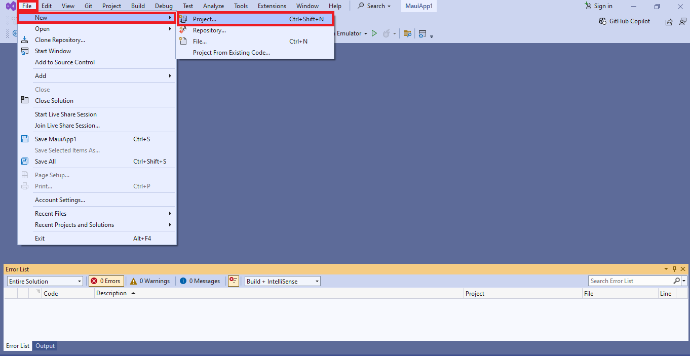

2. In **Create a new project**, select **JavaScript** and **Tizen**, choose **Tizen Web Project**, and select **Next**.

   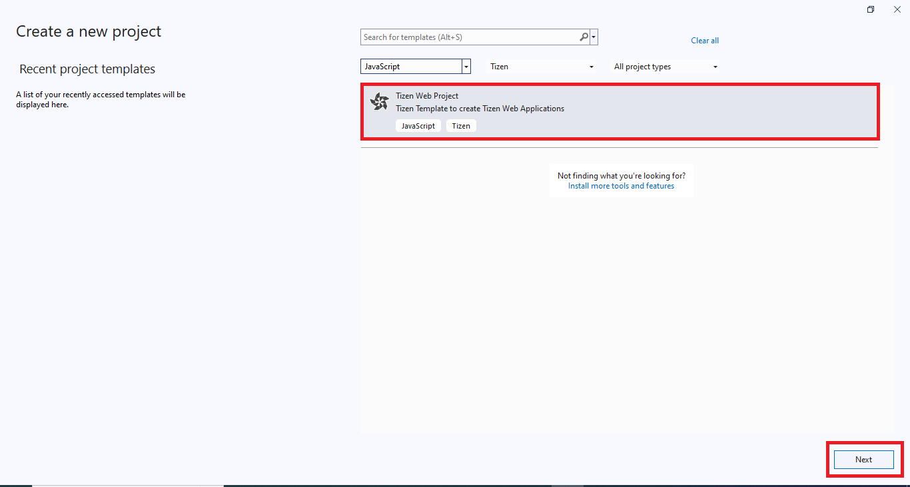

3. Enter the project name, location, and solution name, then select **Create**.

   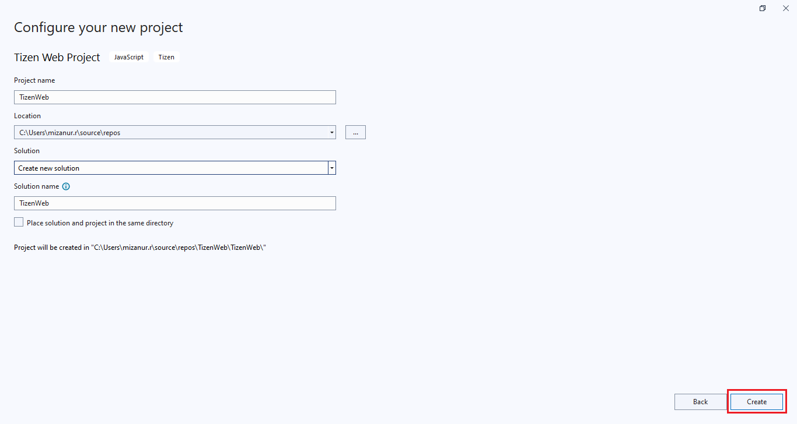

4. In the **Tizen Project Wizard**, select the required profile, platform version, and template, then select **OK**.

   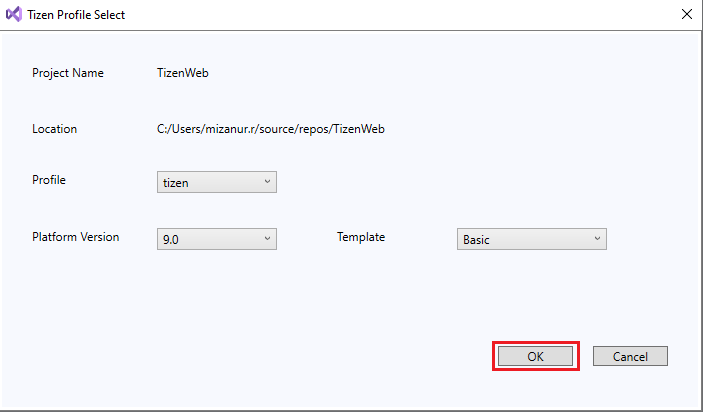

5. Verify that the new project appears in Solution Explorer.

   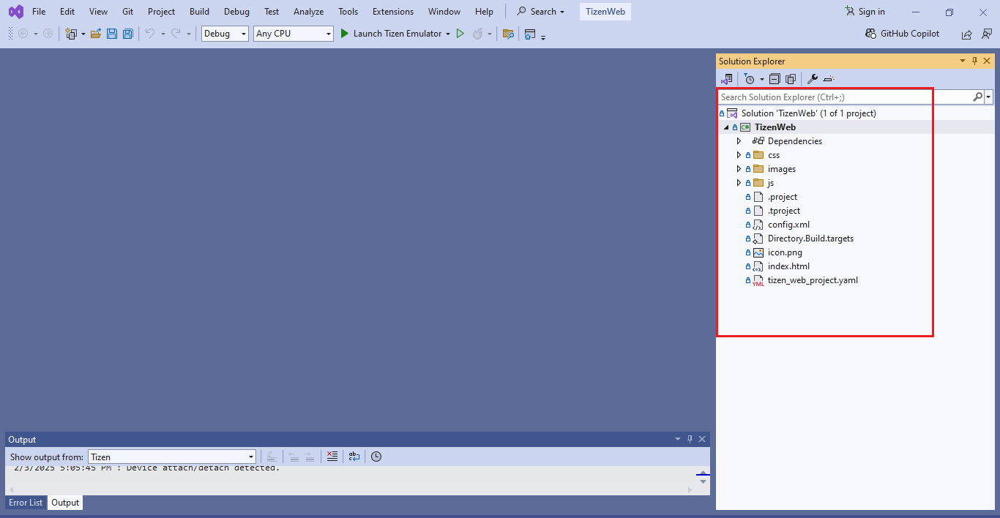

6. Wait for the required development packages to finish installing before continuing.

   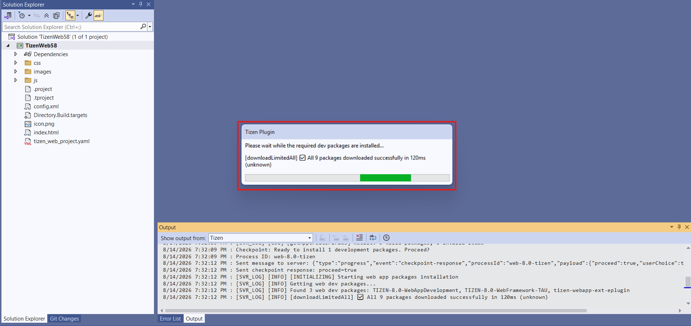

### Build your project

Build the project in either of the following ways:

1. Select **Build > Build Solution**.

   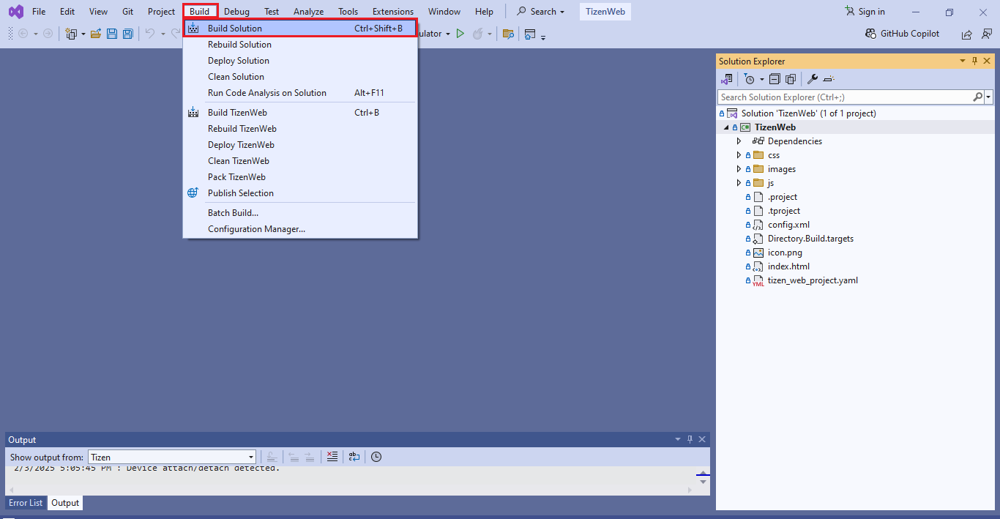

2. Or, in Solution Explorer, right-click the solution and select **Build**.

   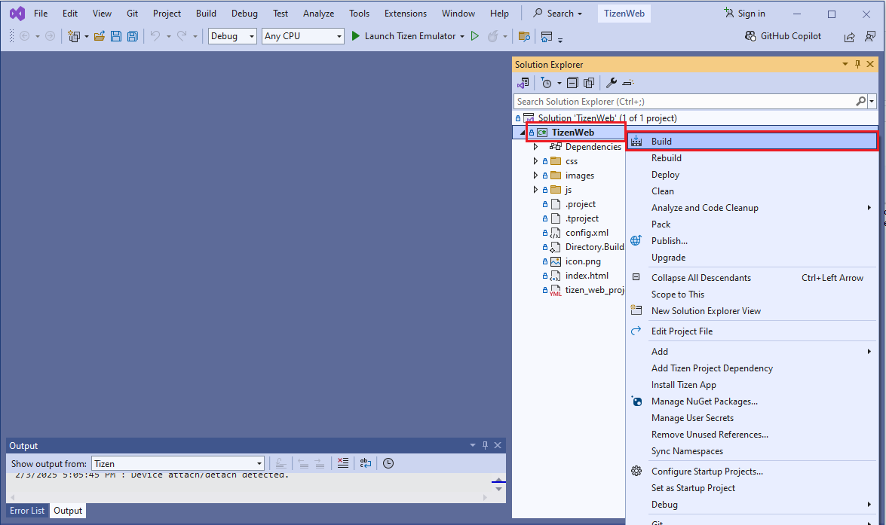

### Deploy and run your application

1. Open Emulator Manager from the **Launch Tizen Emulator** button on the Visual Studio toolbar. Alternatively, select **Tools > Tizen > Tizen Emulator Manager**.

   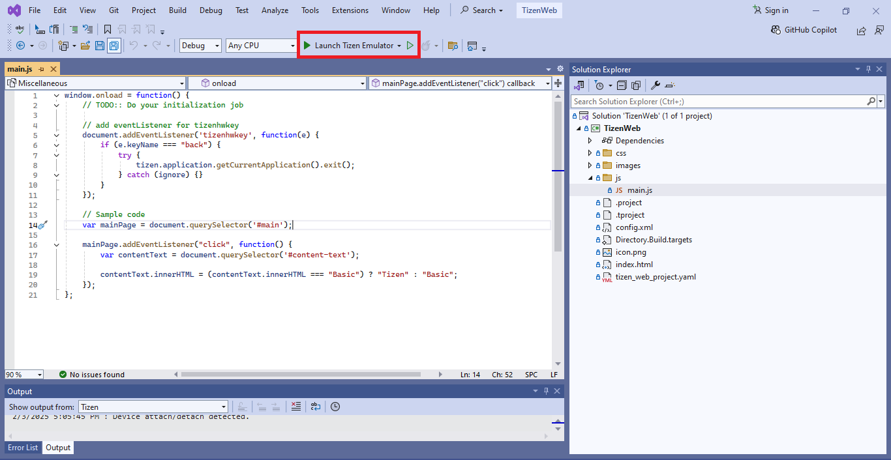

   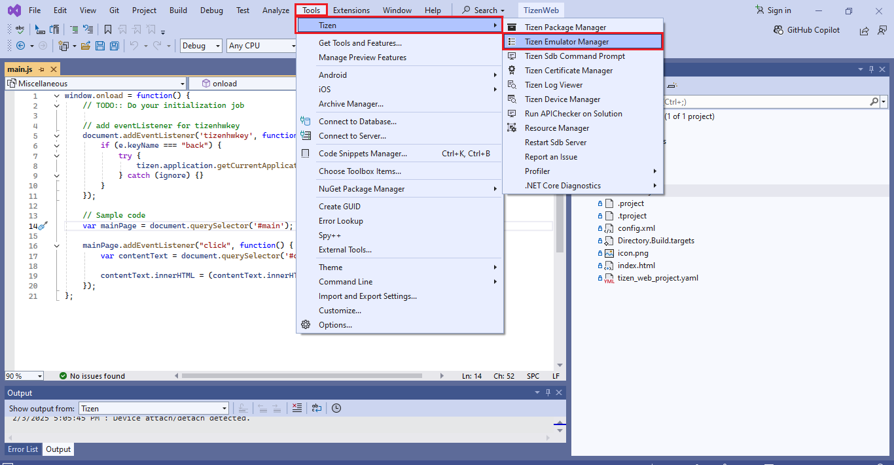

2. Select an emulator whose platform version matches or is later than the application platform version, then select **Launch**.

   

3. Wait for the emulator to boot, then select it as the run target in Visual Studio. Select the green **Start** button to debug, or select **Debug > Start Without Debugging** to run without debugging.

   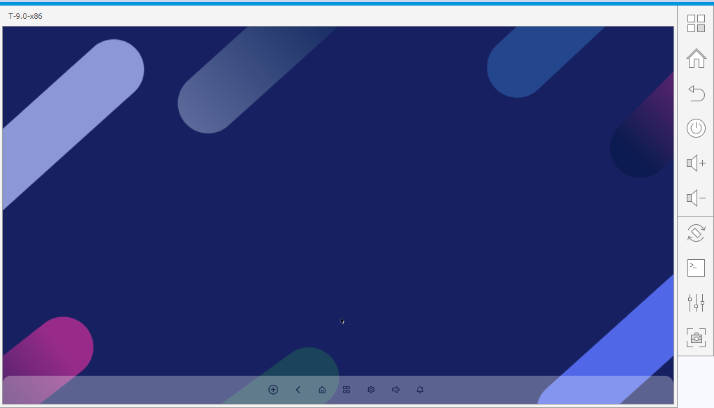

   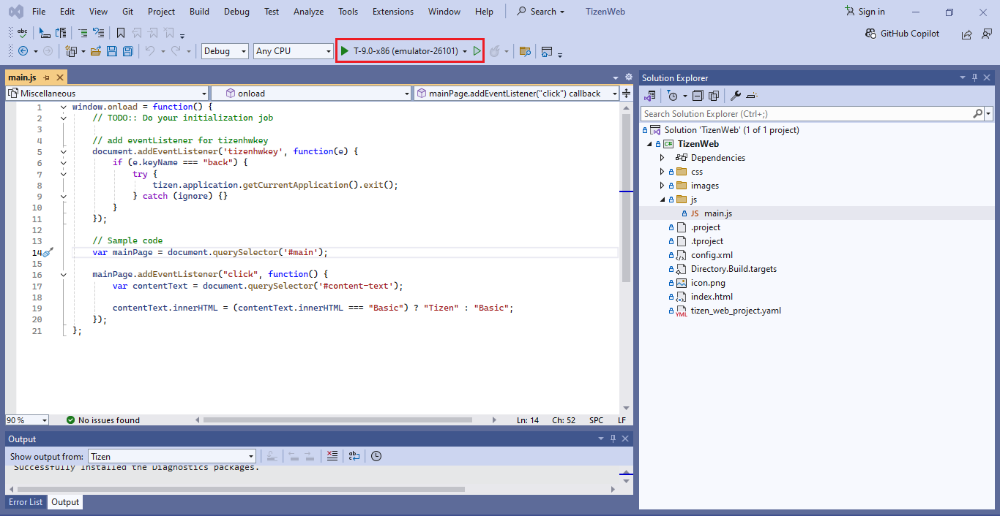

4. Verify that the application is running in the normal Tizen emulator.

   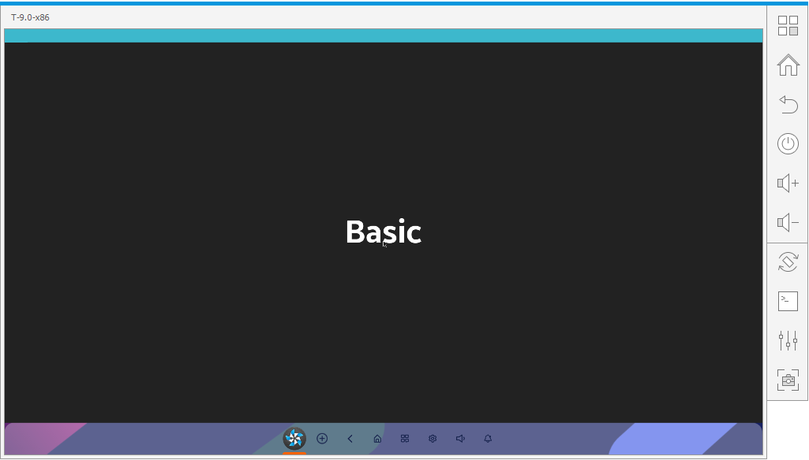

### Debug your application in Chrome

1. Start debugging by selecting **Debug > Start Debugging**, selecting the **Debug** button, or pressing **F5**.

   > [!NOTE]
   > If Chrome is not installed in its default location, set the Chrome path before starting the debugging session.

2. Open a `.js` source file in Chrome and set a breakpoint.

   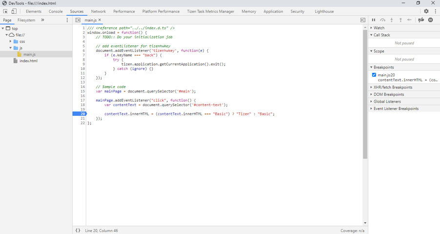
