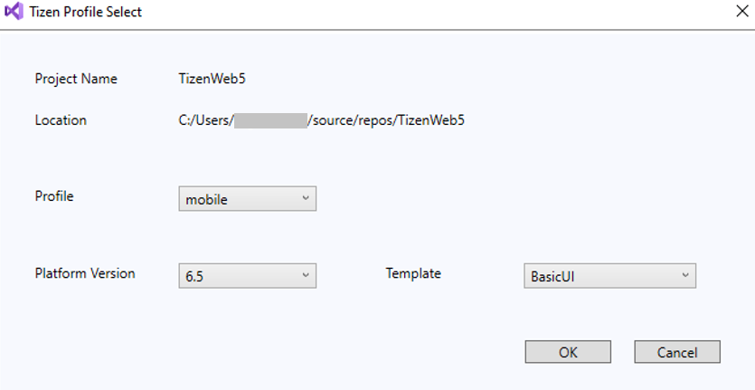

# Web application development

## Develop application

The following sections explain how to use Visual Studio for Tizen to develop your applications.

### Create Tizen Web project

To create a Tizen web project:

1. In the Visual Studio menu, select **File &gt; New &gt; Project**.

2. For creating web application, select **JavaScript** and **Tizen** options in the dropdown list. Then, select **Tizen Web project** and click **Next**.

   

3. In the configure window, type the name for your project and click **Create**.

   

4. In the **Tizen Profile Select** window, select the required profile, platform version, and template for your project, then click **OK**.

   

5. The visual studio window with newly created project appears on the screen.

   

### Build your project

1. To build your project, select **Build Solution** in the **Solution Explorer** window.

   

2. To deploy and run your application, select **Debug &gt; Start without Debugging**.

   > [!NOTE]
   > Ensure the emulator is running in your system.

   

   

### Debug your application in chrome

1. Start the debugging session by selecting **Debug &gt; Start Debugging** in the menu bar, or pressing **F5**, or by clicking the **Debug** button in the menu bar.

   > [!NOTE]
   > If the chrome path is not available in the default location, you need to enter the chrome path before debugging process begins.

2. Open .js file in the chrome and add a break point in your source code.

   

### Debug your application in web simulator

1. Open .js file in chrome and select **Run as Tizen Web Simulator Application** in the **Solution Explorer** window.

   

   
