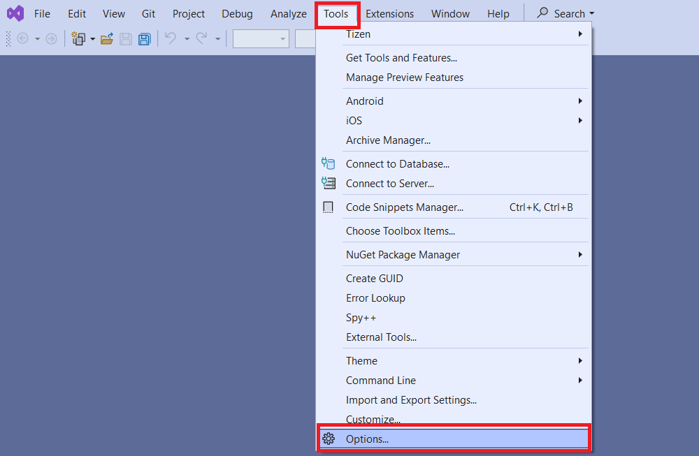
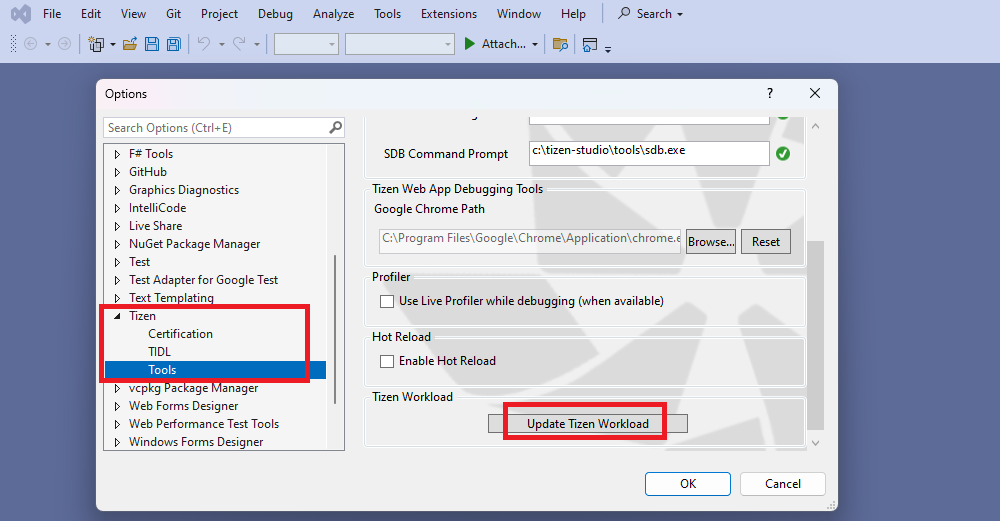
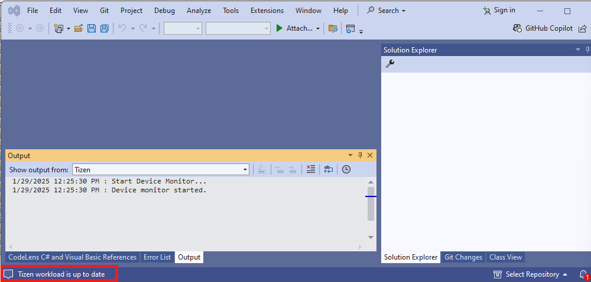
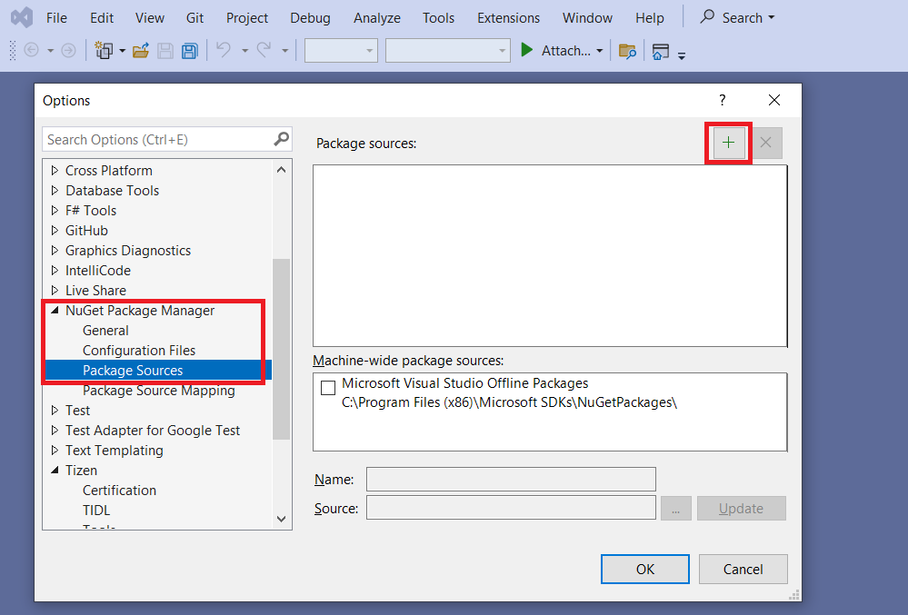
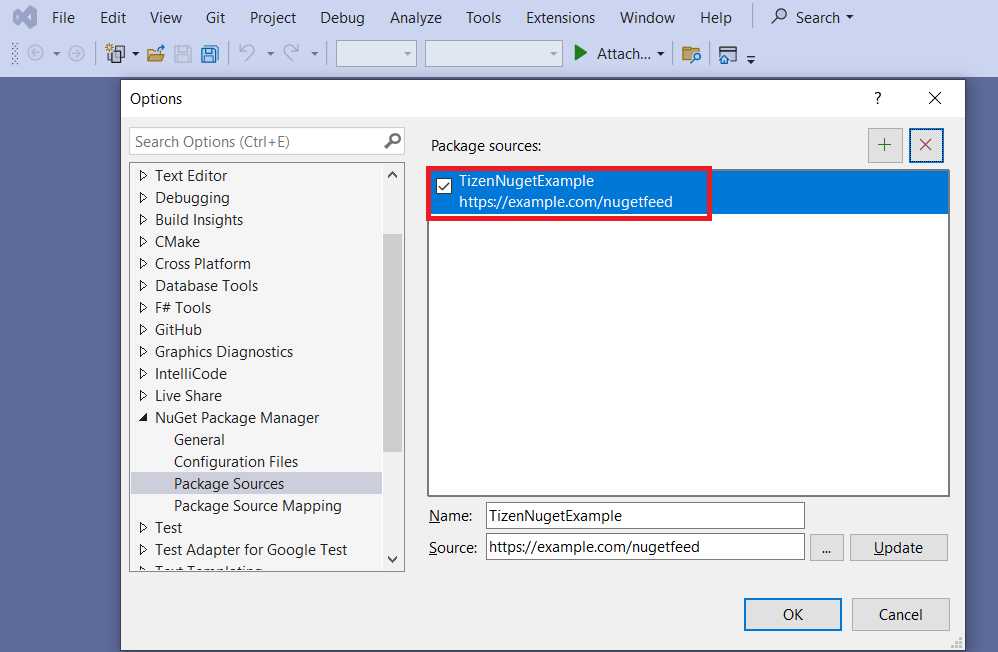

# Configuring .NET Workload & Add NuGet Source

This guide will help you configure .NET workload for Tizen .NET development using Visual Studio and add a NuGet source to your project. By following these steps, you'll be able to set up your environment and access the necessary packages for building Tizen applications.

## Prerequisites

Before you begin, ensure you have the following:
- Visual Studio installed on your machine. You can download it from [here](https://visualstudio.microsoft.com/downloads/).
- Visual Studio workloads installed. You can find the detail steps [here](../install.md#prerequisites).

## Configuring .NET Workload

By default, the *Visual Studio Tools for Tizen* extension installs the Tizen .NET workload when you install the extension and launch Visual Studio. If you need to update it, you can manually do so by following the steps below:

1. Select **Tools > Options** .

    

2. Scroll down to **Tizen** and expand it. Select **Tools**. Click on **Update Tizen Workload**.

    

3. "Workload is updated successfully" or "Tizen Workload is up to date" message is shown in the bottom left corner.

    

## Add Tizen NuGet Source

To add a Tizen NuGet source, follow these steps:

1. Select **Tools > Options** .

    

2. Scroll down to **Nuget Package Manager** and expand it. Select **Package Sources**. Click on the **"+"** button.

    
3. Enter name of the source.
    e.g. - `TizenNugetExample`

4. Enter package source path or URL and click 'OK'.
    e.g. - `https://example.com/nugetfeed`

5. NuGet source is added successfully. You can see and edit the new nuget source entry through navgating to the 'Packages Sources' again.

    