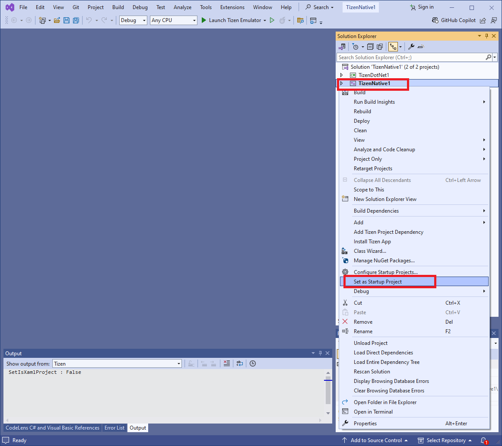
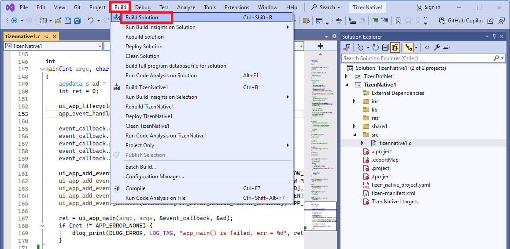
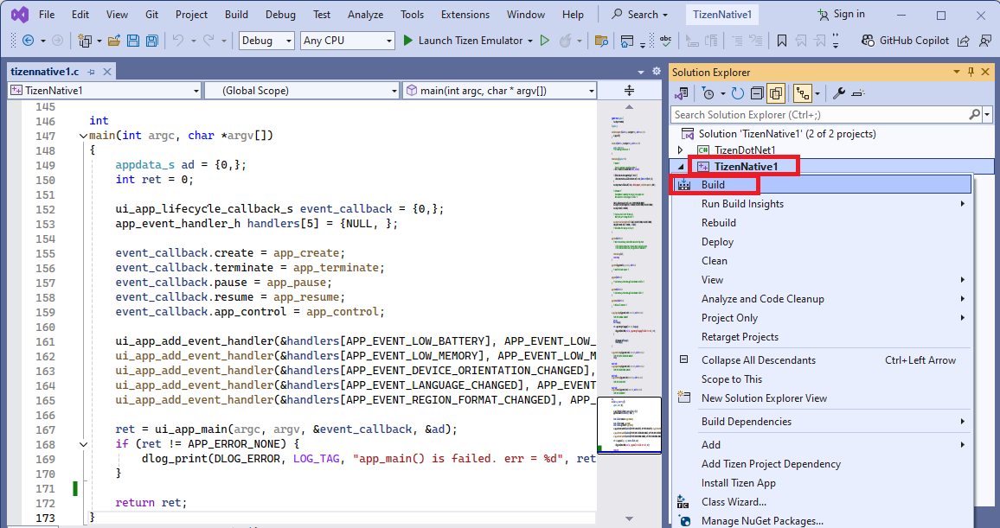
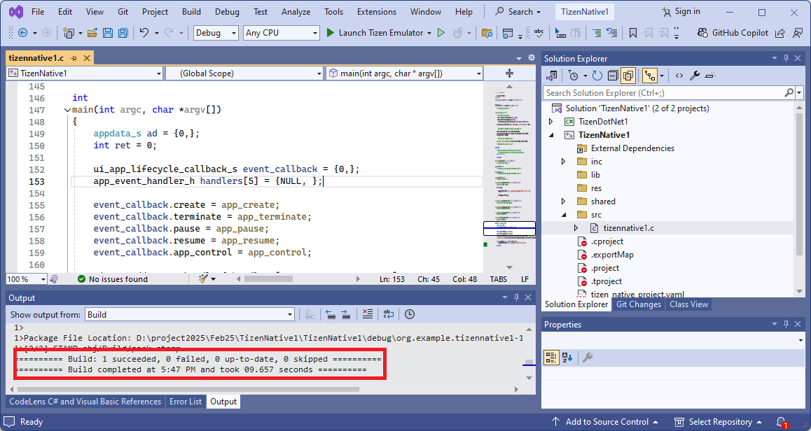
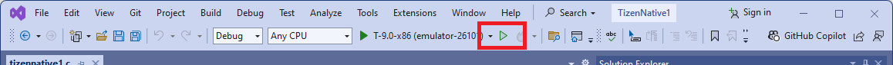
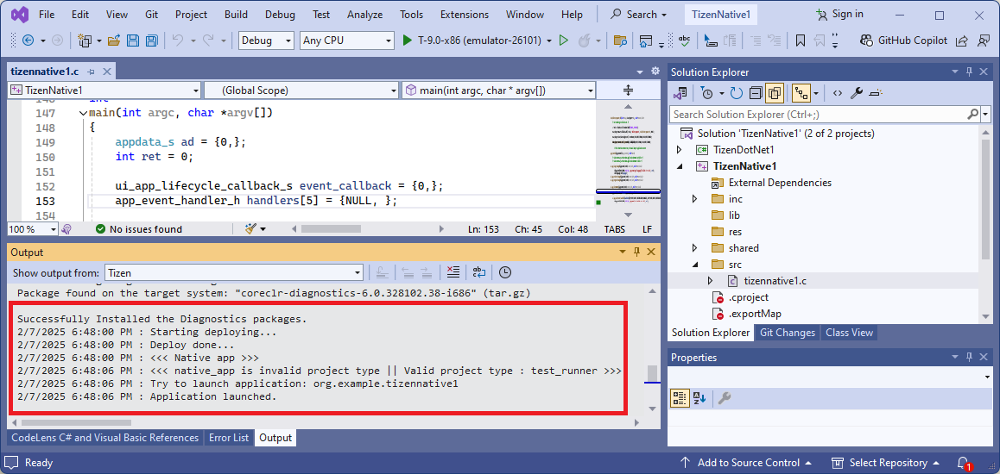
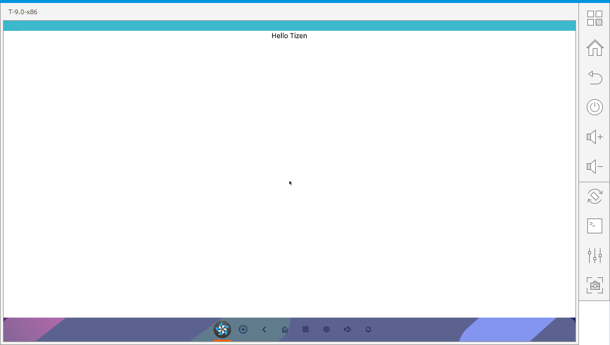

# Edit Code(Build & Install & Normal Run)

The following sections explain how to use Visual Studio Extension for Tizen to build, deploy and run your applications.

## Set Your Project as Startup Project
To set your project as the working folder, nvaigate to the **Solution Explorer**, right click on the project you want to build, deploy and run on emulator and select **Set as Startup Project**.

## Build your project

There are two ways to build your Tizen Native, DotNet and Web Application:

### 1. Using Visual Studio Menu

In the Visual Studio, navigate to **Build > Build Solution**.

### 2. Using Solution Explorer

In the **Solution Explorer** view, right-click on the solution name and select **Build**.

After successful built you can find the message in the log **Output** tab.

## Deploy and Run Your Application in Emulator

1. Launch the Emulator Manager by clicking on the **Launch Tizen Emulator** button. 

    

2. Create and launch an emulator instance in the Emulator Manager. The Emulator instance should align with the tizen application version. *(eg. for an application of Tizen version 9.0 create an emulator instance of version 9.0).*

3. Now you can install and run the application on emulator using the play button (or pressing `ctrl + f5`).

    

4. The application gets installed and the log is shown.

    

    The application also gets launched in the emulator.

    

