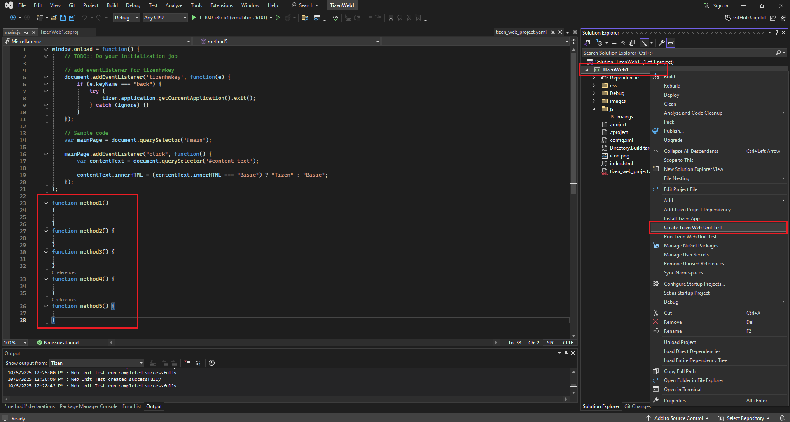
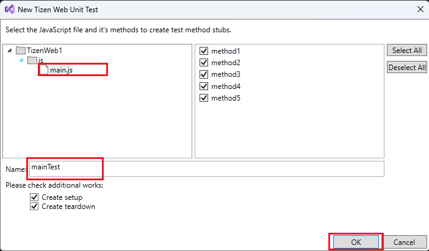
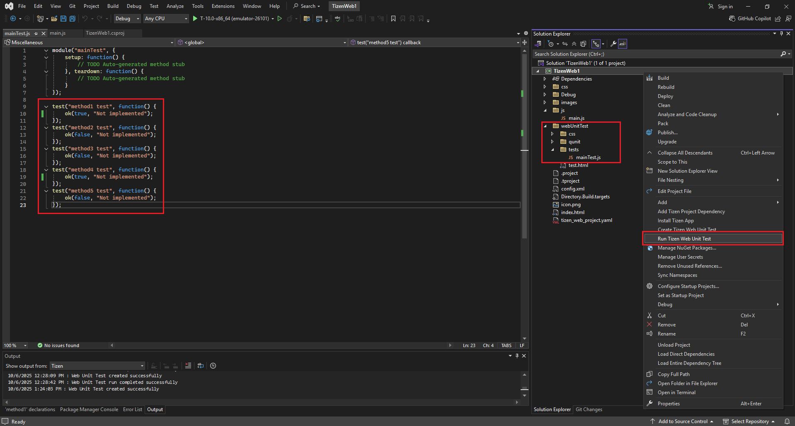
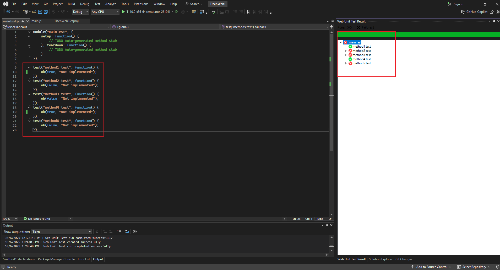

# Tizen Web Application Unit Test

> **[NOTE]**
> 
> Before running the **Web Unit Test**, make sure:
> - You have an **Emulator** or a connected **target device** running.  
> - If you don’t have a web application project to test, you can create one using the **Project Wizard** with a template or sample project.  
>   For more details, see [Web Application Development](../Tizen/web.md).

---

##  Configuring a Web App for Web Test

###  Step 1: Create a Tizen Web Unit Test
1. In **Visual Studio**, right-click on your **Web project name**.  
2. Select **Create Tizen Web Unit Test**.  
3. Choose the **.js** file where your test cases are written.  
4. Select the test cases you want to include.  
5. *(Optional)* Choose **Create Setup** or **Create Teardown** if needed.  
6. Enter a name for the test file and click **OK**.

---

### Step 2: Modify the Generated Test File
- A folder named **`webunittest`** will be created in your project.  
- Inside this folder, a file named **`tests/mainTests.js`** (or your chosen test file name) will be automatically generated.  
- Modify this file to define or customize your test cases as needed.

---

### Step 3: Run the Tizen Web Unit Test
1. Right-click again on your **Web project name**.  
2. Select **Run Tizen Web Unit Test**.  
3. The test will execute on your selected emulator or connected device.  
4. Once complete, the test results will be displayed in the output window in a tree format. It shows the passed tests with a green icon and failed tests with a red icon. Upon double click after opening the dropdown of the failed testcase, the cursor will navigate to the line of the failed testcase.
   

---
