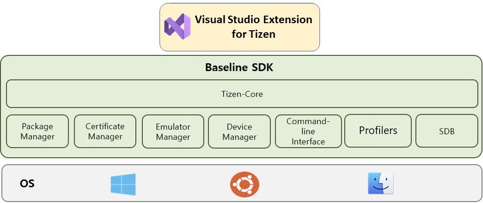

# Overview Visual Studio Extension for Tizen

Visual Studio Extension for Tizen supports Tizen native, web and .NET App development.

Visual Studio Extension share Baseline SDK, which is a common tool required for Tizen application development.

Baseline SDK includes the following standalone tools.

* Tizen-Core : Consistent Tizen SDK interface to use baseline tools and CLI from IDE and external tools.
* Package Manager : A comprehensive package management tool for installing, updating, and removing Tizen platform and sdk components
* Certificate Manager : Tizen certificate management tools to store developer's certificates for signing Tizen application.
* Emulator Manager : Tool to create and manage emulator instances.
* Device Manager : Standalone tool that manages device and allows you to access your internal file systems and logs.
* Command-line Interface : CLI provides functionalities for entire Tizen application development process by using the terminal.
* Profilers : Core and memory profiling tools allows developers to analyze the performance of Tizen .NET application. Developers can record, manage, and view profiling sessions.
* SDB (Smart Device Bridge) : Command line tool that communicates with a connected target device (It can be an emulator instance or a real Tizen devce like TV)

**Figure : Overview Visual Studio Extension and Baseline SDK Components**

  

Visual Studio Extension for Tizen provides various development tools for native (C, C++), web(HTML, JS, CSS), and .NET(C#) application and also supports hybrid application packaging.

Developers can use **Visual Studio Extension for Tizen** for developing all types of application supported by Tizen platform from project creation to onboarding debug and tests on actual devices.

| Development Tools              | Native                                      | Web                                         | .NET                                                                                          |
| ------------------------------ | ------------------------------------------- | ------------------------------------------- | --------------------------------------------------------------------------------------------- |
| Project Creation               | Project wizard & Templates                  | Project wizard & Templates                  | Project wizard & Templates                                                                    |
| Build Tools                    | GCC, Ninja                                  | -                                           | dotnet sdk                                                                                    |
| Code Edit Tool                 | Content Assist                              | Content Assist                              | Content Assist                                                                                |
| Debugger                       | GDB                                         | Web Inspector                               | Netcoredbg                                                                                    |
| Unit Test & Code Coverage Tool | gtest & gcov                                | -                                           | -                                                                                             |
| Address & Leak Sanitizer       | ASAN/LSAN                                   | -                                           | -                                                                                             |
| Project Configuration          | Manifest editor                             | -                                           | Manifest editor                                                                               |
| Profiler                       | -                                           | Web Inspector                               | Core Profiler Memory Profiler .NET Diagnostics (dotnet dump, Trace, GC dump) |