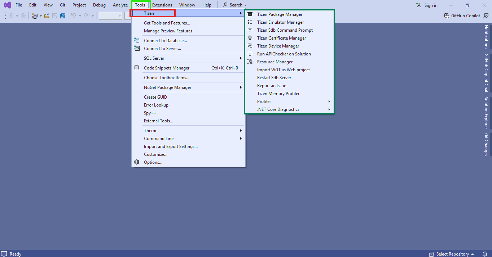
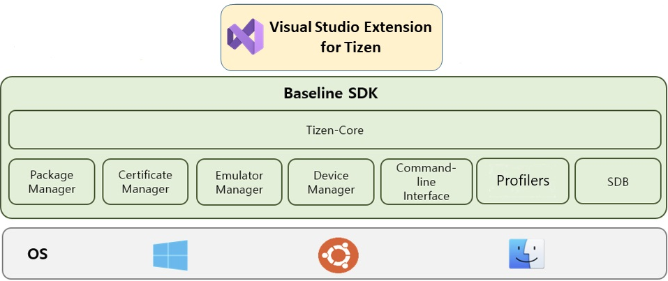

# Overview Visual Studio Extension for Tizen

Visual Studio Extension for Tizen supports Tizen native, web and .NET App development.

On first launch, the extension installs its server and core apps in the selected SDK resource path. Its integrated tools are available from **Tools > Tizen**.

Key tools include Package Manager, Certificate Manager, Emulator Manager, Device Manager, SDB Command Prompt, API & Privilege Checker, Memory Profiler, Profiler, Resource Manager, .NET Core Diagnostics, and WGT project import.

**Figure : Overview Visual Studio Extension and Baseline SDK Components**

  

Visual Studio Extension for Tizen provides various development tools for native (C, C++), web(HTML, JS, CSS), and .NET(C#) application and also supports hybrid application packaging.

Developers can use **Visual Studio Extension for Tizen** for developing all types of application supported by Tizen platform from project creation to onboarding debug and tests on actual devices.

| Development Tools              | Native                                      | Web                                         | .NET                                                                                          |
| ------------------------------ | ------------------------------------------- | ------------------------------------------- | --------------------------------------------------------------------------------------------- |
| Project Creation               | Project wizard & Templates                  | Project wizard & Templates                  | Project wizard & Templates                                                                    |
| Build Tools                    | GCC, Ninja                                  | -                                           | dotnet sdk                                                                                    |
| Code Edit Tool                 | Content Assist                              | Content Assist                              | Content Assist                                                                                |
| Debugger                       | GDB                                         | Web Inspector                               | Netcoredbg                                                                                    |
| Unit Test & Code Coverage Tool | gtest & gcov                                | -                                           | -                                                                                             |
| Address & Leak Sanitizer       | ASAN/LSAN                                   | -                                           | -                                                                                             |
| Project Configuration          | Manifest editor                             | -                                           | Manifest editor                                                                               |
| Profiler                       | -                                           | Web Inspector                               | Core Profiler Memory Profiler .NET Diagnostics (dotnet dump, Trace, GC dump) |