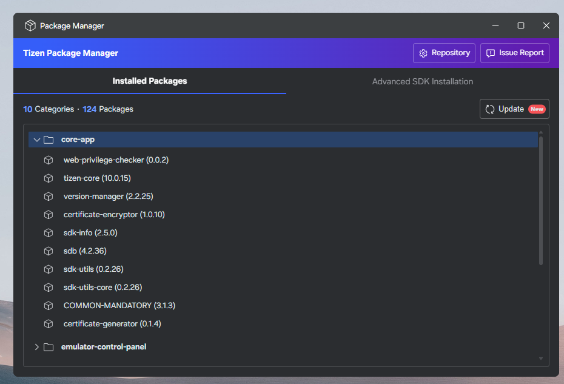
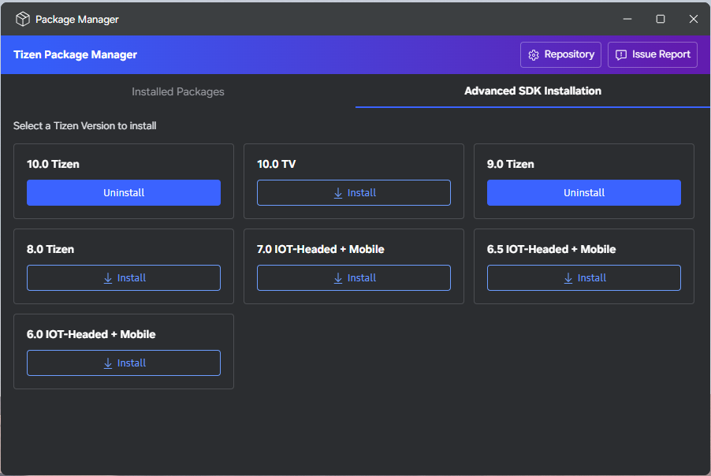
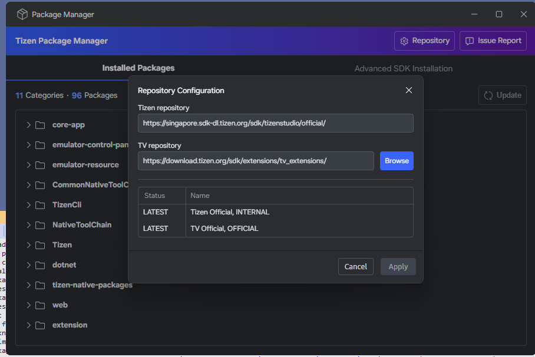
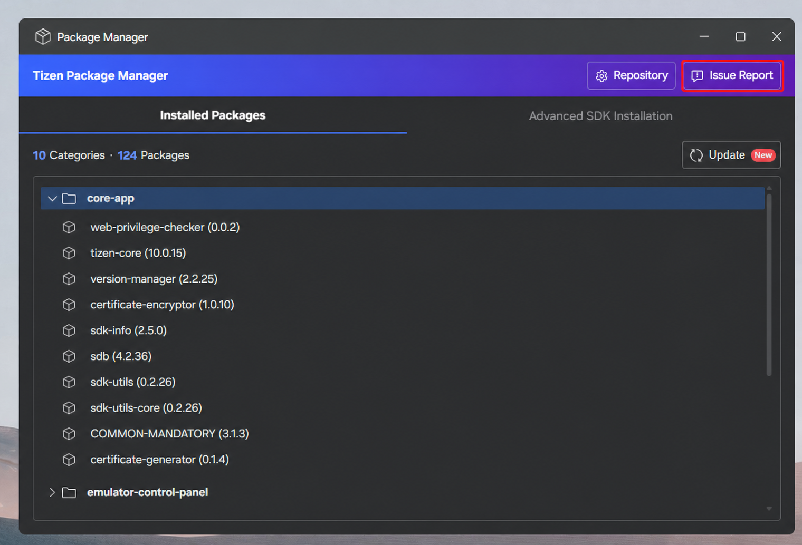
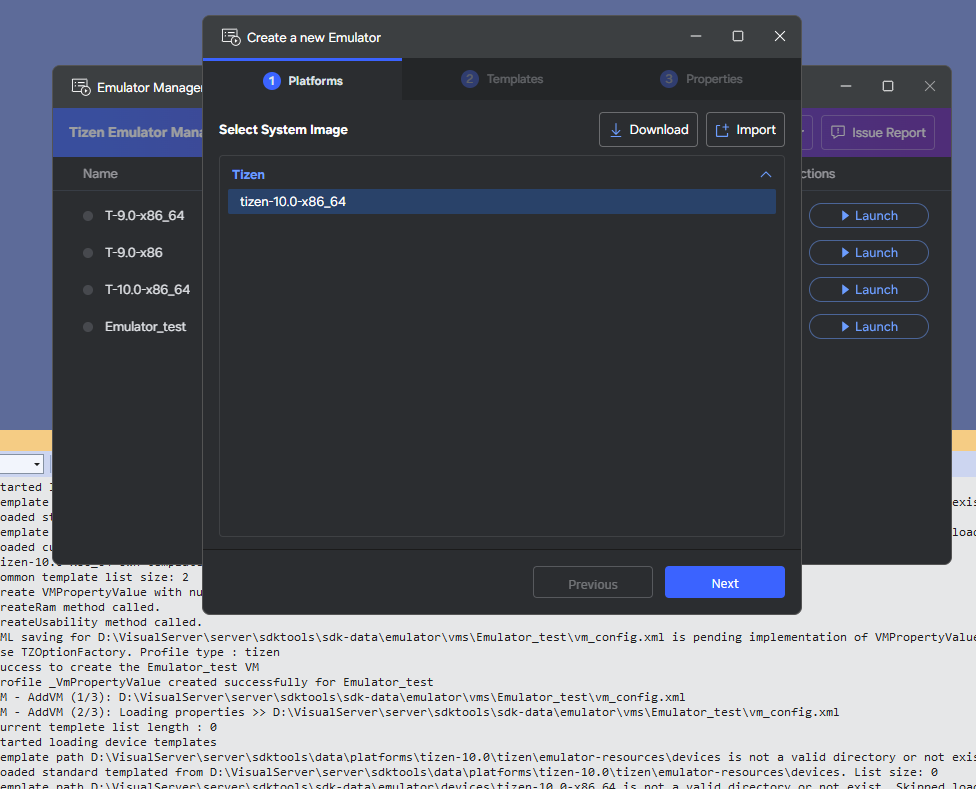
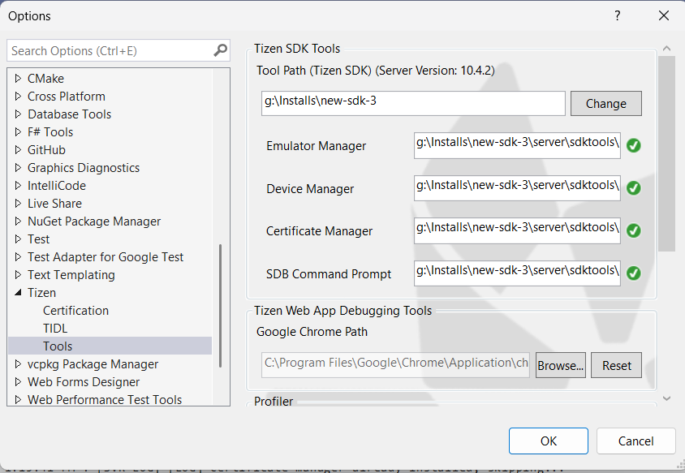
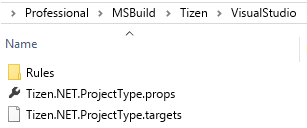

# Set up Tizen SDK packages

The Visual Studio Extension for Tizen installs the core applications during its first-run setup. Use the **Tizen Package Manager** to install, update, and remove the platform packages, SDK components, extensions, and emulator images required by your projects.

Open it from **Tools > Tizen > Tizen Package Manager**.

## Install or Update Packages

The **Installed Packages** tab lists installed packages by category and shows their versions. Expand a category to review its packages. When updates are available, select **Update** in the summary bar to install them.

## Install a Platform Version

Use **Advanced SDK Installation** to add or remove an entire Tizen platform version:

1. Open **Tools > Tizen > Tizen Package Manager**.
2. Select **Advanced SDK Installation**.

   

3. Select **Install** next to the platform version that you need.
4. To remove an installed version, select **Uninstall**.

The video below shows how to install a Tizen SDK platform version:

<video controls height="400">
  <source src="../media/sdk-installation.mp4" type="video/mp4">
</video>

The available versions include Tizen 10.0, 9.0, 8.0, 7.0, 6.5, 6.0, and TV extensions. Install the platform version and profile required by the application and target device.

## Configure Package Repositories

1. Select the **Repository** (gear) button in Package Manager.

   

2. Configure the Tizen repository for official SDK packages and the TV repository for TV extension packages or local ZIP files.
3. Select **Apply** after changing a repository URL.

## Report Issue for Package Manager

Select **Issue Report** in the upper-right corner of Package Manager to open the GitHub issues page and report an issue.

## Install emulator images

Install a platform image before creating an emulator:

1. Open **Tools > Tizen > Tizen Emulator Manager**.
2. Select **Create a new Emulator**.

   

3. In **Select a Platform Image**, select **Download** if the required image is not listed.

   

4. Download the image, then continue creating the emulator.

For a custom system image, select **Import** in the **Select a Platform Image** dialog and provide its platform name, base platform, image format, and `.qcow2` or raw image file.

## Troubleshoot setup

- Verify the extension in **Extensions > Manage Extensions** by searching for **Tizen**.

- Confirm the first-run setup has completed and that the SDK resource path is writable. By default, it is `C:\Users\<username>\.tizen-extension-platform`.

- If package downloads are blocked by a corporate firewall, allow access to the configured package repository over ports 80 and 443.
- To make sure the Tizen SDK tools are installed correctly, check the tool path in **Tools > Options > Tizen > Tools**.

  

- To verify that the Tizen project properties were copied correctly, make sure that `Tizen.NET.ProjectType.props` and `Tizen.NET.ProjectType.targets` are located in the `MSBuild\Tizen\VisualStudio` directory of your Visual Studio installation.

  