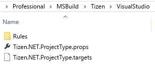

# Install SDK Common Tools(Tizen Baseline SDK)

You need the following components on top of Visual Studio to make Visual Studio Tools for Tizen work:

- Extension(VSIX)

  Visual Studio extension for Tizen packaging.

- SDK Common Tools(Tizen Baseline SDK)

  The SDK is shared with Tizen Studio, and it supports tools (such as Certificate Manager, Device Manager, Emulator, SDB, and on-demand rpm) for developing Tizen .NET applications.

To use Tizen SDK tools, you must install Visual Studio Tools for Tizen extension and Baseline SDK.

> [!NOTE] 
> If Tizen Studio is already installed on your computer, simply [set Tizen Baseline SDK path](#set-tizen-baseline-sdk) to the existing SDK instead of reinstalling it.

After installing Visual Studio Tools for Tizen extension, you must set up Tizen Baseline SDK in the following ways:

1. In the Visual Studio IDE menu, go to **Tools &gt; Tizen &gt; Tizen Package Manager**.
2. Select **Install new Tizen SDK**.

   

3. Read the license document and click **I Agree**.

   

4. Enter the root directory path where you want to install and click **Next**.

   

5. Tizen SDK installer is downloaded and the baseline SDK is installed automatically.

   

   

6. Finally, Tizen Package Manager installs Tizen SDK tools.

   

## Set Tizen Baseline SDK path 

> [!NOTE]
> If you downloaded Visual Studio Tools for Tizen extension from the Visual Studio Marketplace and installed it on your computer, skip this step.

You can use Tizen Package Manager to set up Tizen Baseline SDK path or each tool path directly:

- To set up Tizen Baseline SDK path, refer to the following steps:
  1. In the Visual Studio IDE menu, go to **Tools &gt; Tizen &gt; Tizen Package Manager**.
  2. Select **Use installed Tizen SDK**.

     

  3. Enter the root directory of your existing Tizen Studio installation.
     
     

  > [!NOTE] 
  > If the installer gives a warning about your Tizen Studio version being too low, update Tizen Studio by using Tizen Package Manager after setting the tool path.

- To set up each tool path directly, follow the steps below: 
  1. In the Visual Studio IDE menu, go to **Tools &gt; Options &gt; Tizen &gt; Tools**.
  2. Enter the root directory of your existing Tizen Studio installation in the **Tool Path** field.
     

     The other tools paths are automatically set up.

The video below shows how to set the Baseline SDK path from Local PC on Visual Studio in windows:

<video controls height="400">
  <source src="../media/vs-baselineskdpath.mp4" type=video/mp4>
</video>

## Install Emulator images

If you do not have a real device, you can run applications in Tizen Emulator.

To download emulator images, you can use Tizen Package Manager or Tizen Emulator Manager:

- To use Tizen Package Manager, follow the steps below:
  1. In the Visual Studio IDE menu, go to **Tools &gt; Tizen &gt; Tizen Package Manager**.
  2. Select the profiles and versions you want to install and click **Install**.

     

- To use Tizen Emulator Manager, follow the steps below:

  > [!NOTE] 
  > Tizen Emulator Manager shows the emulator images installation window only when no images are installed on your computer.

  1. In the Visual Studio IDE menu, go to **Tools &gt; Tizen &gt; Tizen Emulator Manager**.
  2. Select the profiles and versions you want to install and click **OK**.

     

# Troubleshoot

If you encounter problems with the installation, refer to the following steps:

- To check whether VSIX is installed correctly, check Visual Studio Tools for Tizen properties by selecting **Tools &gt; Extensions and Updates** and searching for "Tizen".

  

- To make sure Baseline Tizen SDK is installed correctly, check the tool path by selecting **Tools &gt; Options &gt; Tizen &gt; Tools**.

  

- To check whether Tizen Project properties have been copied correctly, make sure that the `Tizen.NET.ProjectType.props` and `Tizen.NET.ProjectType.targets` files are located in the `C:\Program Files (x86)\Microsoft Visual Studio\2017\Professional\MSBuild\Tizen\VisualStudio` folder.

  

