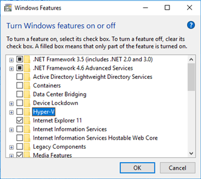
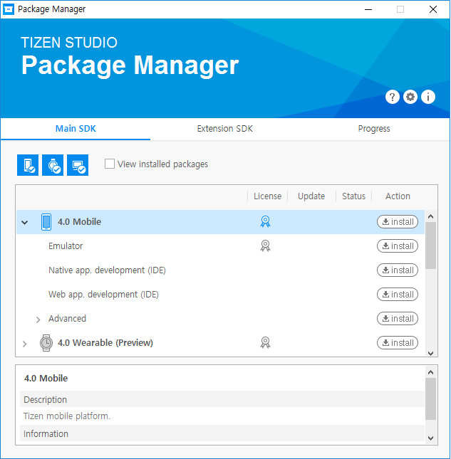

# Installing Visual Studio Tools for Tizen

You need the following components on top of Visual Studio to make Visual Studio Tools for Tizen work:

- VSIX

  Visual Studio extension for Tizen packaging

- Tizen Baseline SDK

  The SDK is shared with the Tizen Studio, and it supports tools (such as Certificate Manager, Device Manager, Emulator, SDB, and on-demand rpm) for developing Tizen .NET applications.

## Prerequisites

To work with Visual Studio Tools for Tizen, your computer must have:

- At least 1.5 GB of available disk space
- Visual Studio 2017

  Visual Studio Tools for Tizen works with all Visual Studio variations, including Community. Installing or re-installing Visual Studio with .NET desktop development and .NET Core cross-platform development toolsets is recommended.

  

- Java Development Kit (JDK) 8

  JDK 8 is needed to use the Tizen Baseline SDK. OpenJDK is not supported.

  Download the JDK 8 from the official [Oracle Web site](http://www.oracle.com/technetwork/java/javase/downloads/index.html). Select the appropriate platform for your hardware architecture and Windows&reg; version. Run the downloaded executable file and follow the displayed instructions.
  - JDK 9 will be supported soon.

### Emulator Requirements

The Tizen emulator for Visual Studio has the same requirements as the emulator in the Tizen Studio. To check the detailed hardware and software requirements for the Tizen emulator, see [Emulator Requirements](../tizen-studio/setup/prerequisites.md#emulator).

- Intel&reg; Hardware Acceleration Execution Manager (Intel&reg; HAXM) speeds up the Tizen emulation on Intel-VT-enabled systems. The Intel&reg; HAXM installation is started automatically as part of the Visual Studio Tools for Tizen installation. For more information, see [Hardware Accelerated Execution Manager](../tizen-studio/setup/hardware-accelerated-execution-manager.md).

- Make sure **Hyper-V** is disabled (in Windows&reg; 10 or higher):
  1. In the **Start** menu, select **Programs and Features**.

   

  2. Select **Turn Windows features on or off**.
  3. Disable **Hyper-V** and click **OK**.

   

  4. Reboot the computer.

## Visual Studio Tools for Tizen Installation

To use the Tizen SDK tools, you must install the Visual Studio Tools for Tizen extension and the baseline SDK.

> **Note**  
> If the Tizen Studio is already installed in your computer, simply [set the Tizen baseline SDK path](#set-tizen-baseline-sdk) to the existing SDK instead of reinstalling it.

### Installing the Extension

The Visual Studio Tools for Tizen extension is registered in the Visual Studio Marketplace. You can install extensions from the Visual Studio Marketplace in the Visual Studio IDE.

1. In the Visual Studio IDE menu, go to **Tools &gt; Extensions and Updates**.
2. In the Visual Studio Marketplace, search for **Tizen**.

   

3. Click **Download** and close the Visual Studio IDE.

   The installation starts.

Alternatively, you can download the Visual Studio Tools for Tizen extension from the [Visual Studio Marketplace Web site](https://marketplace.visualstudio.com/items?itemName=tizen.VisualStudioToolsforTizen).

### Installing the Tizen Baseline SDK

After installing the Visual Studio Tools for Tizen extension, you must set up the Tizen baseline SDK:

1. In the Visual Studio IDE menu, go to **Tools &gt; Tizen &gt; Tizen Package Manager**.
2. Select **Install new Tizen SDK**.

   

3. Read the license document and click **I Agree**.

   

4. Enter the root directory path where you want to install and click **Next**.

   

   The Tizen SDK installer is downloaded and the baseline SDK is installed automatically.

   

   

   Finally, the Tizen Package Manager installs the Tizen SDK tools.

   

### Setting the Tizen Baseline SDK Path 

> **Note**  
> If you downloaded the Visual Studio Tools for Tizen extension from the Visual Studio Marketplace and installed it on your computer, skip this step.

You can use the Tizen Package Manager to set up the Tizen baseline SDK path or each tool path directly:

- To set up the Tizen baseline SDK path:
  1. In the Visual Studio IDE menu, go to **Tools &gt; Tizen &gt; Tizen Package Manager**.
  2. Select **Use installed Tizen SDK**.

     

  3. Enter the root directory of your existing Tizen Studio installation.

     

  > **Note**  
  > If the installer gives a warning about your Tizen Studio version being too low, update the Tizen Studio by using the Tizen Package Manager after setting the tool path.

- To set up each tool path directly:
  1. In the Visual Studio IDE menu, go to **Tools &gt; Options &gt; Tizen &gt; Tools**.
  2. Enter the root directory of your existing Tizen Studio installation in the **Tool Path** field.

     

     The other tools paths are automatically set up.

### Installing Emulator Images

If you do not have a real device, you can run applications in the Tizen emulator.

To download emulator images, you can use the Tizen Package Manager or the Tizen Emulator Manager:

- To use the Tizen Package Manager:
  1. In the Visual Studio IDE menu, go to **Tools &gt; Tizen &gt; Tizen Package Manager**.
  2. Select the profiles and versions you want to install and click **Install**.

     

- To use the Tizen Emulator Manager:

  > **Note**  
  > The Tizen Emulator Manager shows the emulator images installation window only when no images are installed on your computer.

  1. In the Visual Studio IDE menu, go to **Tools &gt; Tizen &gt; Tizen Emulator Manager**.
  2. Select the profiles and versions you want to install and click **OK**.

     

## Troubleshooting

If you encounter problems with the installation:

- To check whether VSIX is installed correctly, check the Visual Studio Tools for Tizen properties by selecting **Tools &gt; Extensions and Updates** and searching for "Tizen".

  

- To make sure the baseline Tizen SDK is installed correctly, check the tool path by selecting **Tools &gt; Options &gt; Tizen &gt; Tools**.

  

- To check whether Tizen Project properties have been copied correctly, make sure that the `Tizen.NET.ProjectType.props` and `Tizen.NET.ProjectType.targets` files are located in the `C:\Program Files (x86)\Microsoft Visual Studio\2017\Professional\MSBuild\Tizen\VisualStudio` folder.

  

