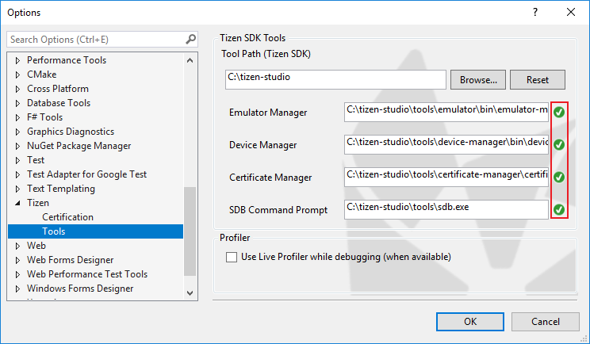

# Introduction

Visual Studio Tools for Tizen provides Tizen-specific tools to improve your productivity.

## Prerequisites

To work with Visual Studio Tools for Tizen, your must have:

- Visual Studio 2017

	

> **Note**
>
> Visual Studio Tools for Tizen works with all Visual Studio variations, including Community. Installing or re-installing Visual Studio with .NET desktop development and .NET Core cross-platform development toolsets is recommended.

# Visual Studio Tools for Tizen 

To use the Tizen SDK tools in Visual Studio, you must install:

1.	[Visual Studio Tools for Tizen Extension](#installing-visual-studio-tools-for-tizen-extension )
2.	[Tizen Baseline SDK](#installing-tizen-baseline-sdk)

## Install Visual Studio Tools for Tizen Extension 

The Visual Studio Tools for Tizen extension is registered in the Visual Studio Marketplace. You can install the extensions from the Visual Studio Marketplace in the Visual Studio IDE.

1.	In the Visual Studio IDE menu, go to **Tools > Extensions and Updates**.
2.	In the Visual Studio Marketplace, search for **Tizen**. The **Visual Studio Tools for Tizen** option appears. 
3.	Click **Download** and close the Visual Studio IDE. \
The installation begins.

Alternatively, you can download the Visual Studio Tools for Tizen extension from [Visual Studio Marketplace](https://marketplace.visualstudio.com/items?itemName=tizen.VisualStudioToolsforTizen).

## Install Tizen Baseline SDK

After installing the Visual Studio Tools for Tizen extension, you must set up the Tizen baseline SDK. You can either install a new Tizen baseline SDK or configure an existing Tizen baseline SDK:

- [Install a new Tizen baseline SDK](#install-new-tizen-baseline-sdk)
- [Configure an existing Tizen baseline SDK](#configure-existing-tizen-baseline-sdk)

### Install new Tizen Baseline SDK

1.	In the Visual Studio IDE menu, go to **Tools > Tizen > Tizen Package Manager**.
2.	Select **Install new Tizen SDK**.
3.	Read the license document and click **I Agree**.
4.	Enter the root directory path where you want to install the Tizen baseline SDK and click **Next**. \
    The baseline SDK is installed automatically and the Tizen Package Manager is launched.
5.  In the Tizen Package Manager, go to **Main SDK**.
6.  Install the **Tizen SDK tools**.

### Configure Existing Tizen Baseline SDK

You can use the Tizen Package Manager to configure the existing Tizen baseline SDK path and each tool path directly:

To set up the Tizen baseline SDK path:

1.	In the Visual Studio IDE menu, go to **Tools > Tizen > Tizen Package Manager**.
2.	Select **Use installed Tizen SDK**.
3.	Enter the root directory of your existing Tizen Studio installation and click **OK**. \
    The Tizen baseline SDK is installed automatically.

To set up each tool path directly:

1.	In the Visual Studio IDE menu, go to **Tools > Options > Tizen > Tools**.
2.  Enter the root directory of your existing Tizen Studio installation in the **Tool Path (Tizen SDK)** field.
    The other tools paths are configured automatically.
	

  
## Troubleshoot

If you encounter any issue with the installation, verify whether:

- VSIX is installed correctly. To verify that, go to **Tools &gt; Extensions and Updates** and search for **Tizen**.

  

- Tizen baseline SDK is installed correctly. To verify that, go to **Tools &gt; Options &gt; Tizen &gt; Tools**.

  

- Tizen Project properties have been copied correctly. Ensure that the `Tizen.NET.ProjectType.props` and `Tizen.NET.ProjectType.targets` files are located in the `C:\Program Files (x86)\Microsoft Visual Studio\2017\Professional\MSBuild\Tizen\VisualStudio` folder.

  

## Uninstall Visual Studio Tools for Tizen

To uninstall the Visual Studio Tools for Tizen:

1.	In the Visual Studio IDE menu, go to **Tools > Extensions and Updates**.
2.  In the **Extensions and Updates** window, go to **Installed > Visual Studio Tools for Tizen** and click **Uninstall**.
3.  Read the warning and click **close**. Close the IDE. The VSIX Installer appears.
4.  Click **Modify**. \
    The modifications are completed and the tools are unistalled.

