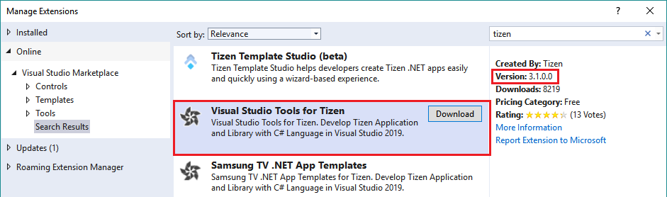

# Install the extension

You need the following components on top of Visual Studio to make Visual Studio Tools for Tizen work:

- Extension(VSIX)

  Visual Studio extension for Tizen packaging.

- SDK Common Tools(Tizen Baseline SDK)

  The SDK is shared with Tizen Studio, and it supports tools (such as Certificate Manager, Device Manager, Emulator, SDB, and on-demand rpm) for developing Tizen .NET applications.

To use Tizen SDK tools, you must install Visual Studio Tools for Tizen extension and Baseline SDK.

> [!NOTE] 
> If Tizen Studio is already installed on your computer, simply [set Tizen Baseline SDK path](#set-tizen-baseline-sdk) to the existing SDK instead of reinstalling it.

Visual Studio Tools for Tizen extension is registered in the Visual Studio Marketplace. You can install extensions from the Visual Studio Marketplace in the Visual Studio IDE:

1. In the Visual Studio IDE menu, go to **Tools &gt; Extensions and Updates**.
2. In the Visual Studio Marketplace, search for **Tizen**.

   

3. Click **Download** and close the Visual Studio IDE.

   The installation starts.

The video below shows how Visual Studio Tools for Tizen is installed in windows:

<video controls height="400">
  <source src="../media/vstools-installation.mp4" type=video/mp4>
</video>

