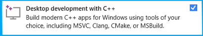

# Prerequisites

To work with Visual Studio Tools for Tizen, your computer must have the following:

- At least 1.5 GB of available disk space.
- Visual Studio 2017 to use Tizen 4.0 and 5.0.
- Visual Studio 2019 to use Tizen 4.0 and 6.5.
- Visual Studio 2022 to use Tizen 4.0 and higher.
- The latest Tizen Tools updates support Tizen Native and Web app creation and are provided with Tizen Studio version 4.5 and above. Make sure the same is installed or [updated](../tizen-studio/setup/update-sdk.md) through Tizen package manager.
- Make sure to set the Tool Path (Tizen SDK) in **Tools > Options > Tizen > Tools** with installed Tizen Studio path. Also, ensure to set the Google Chrome Path for Tizen Web App Debugging support.
  
  Visual Studio Tools for Tizen works with all Visual Studio variations, including Community. Installing or re-installing Visual Studio with .NET desktop development, .NET Core cross-platform development, and desktop development with C++ toolsets is recommended.

  
  

- Java Development Kit (JDK)

  You must install Oracle Java Development Kit (JDK) 8 or OpenJDK 12 to use 
Tizen Baseline SDK. Make sure you download and install the exact version.

  - [Oracle Java Development Kit(JDK) 8](https://www.oracle.com/technetwork/java/javase/downloads/jdk8-downloads-2133151.html).

  - OpenJDK 12 and OpenJFX: [OpenJDK 12 and OpenJFX Installation Guide](../tizen-studio/setup/openjdk.md#install-openjdk-for-windows).

## Emulator requirements

Tizen Emulator for Visual Studio has the same requirements as the emulator in Tizen Studio. To check the detailed hardware and software requirements for Tizen Emulator, see [Emulator Requirements](../tizen-studio/setup/prerequisites.md#emulator).

## Option 1

- Intel&reg; Hardware Acceleration Execution Manager (Intel&reg; HAXM) speeds up the Tizen emulation on Intel-VT-enabled systems. The Intel&reg; HAXM installation is started automatically as part of Visual Studio Tools for Tizen installation. For more information, see [Hardware Accelerated Execution Manager](../tizen-studio/setup/hardware-accelerated-execution-manager.md).

> [!NOTE]
> This option will not be applicable to and will not work on AMD processors.

- Make sure **Hyper-V** is disabled (in Windows 10 or higher):
  1. Input **Control Panel** on the **Search** box in Windows 10.

  2. Click **Control Panel > Programs and Features > Turn Windows features on or off**.

  3. Disable **Hyper-V** and click **OK**.

     Additional note: make sure **Virtual Machine Platform** should be disabled as well to use HAXM.

     

  4. Reboot the computer.

## Option 2

- Microsoft's Hyper-V and the Windows Hypervisor Platform (WHPX). Hyper-V is a virtualization feature of Windows that makes it possible to run virtualized computer systems on a physical host computer.

- Make sure **Hyper-V** is enabled (PowerShell in Windows 10 or higher):
  1. Check the configuration

     > Get-WindowsOptionalFeature -FeatureName Microsoft-Hyper-V-All -Online

     FeatureName      : Microsoft-Hyper-V-All\
     DisplayName      : Hyper-V\
     Description      : Provides services and management tools for creating and running virtual machines and their resources.\
                      RestartRequired  : Possible\
                      State            : Disabled\
                      CustomProperties :

  2. Enable Hyper-V & HypervisorPlatform

     > Enable-WindowsOptionalFeature -Online -FeatureName Microsoft-Hyper-V -All\
     > Enable-WindowsOptionalFeature -Online -FeatureName HypervisorPlatform -All

     

  3. Reboot the computer.

