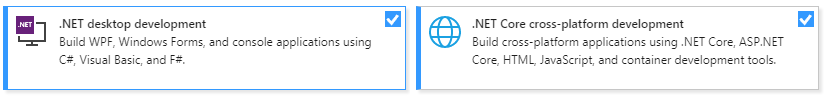
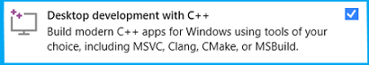
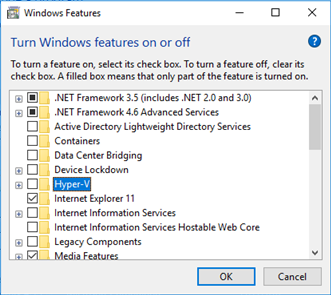
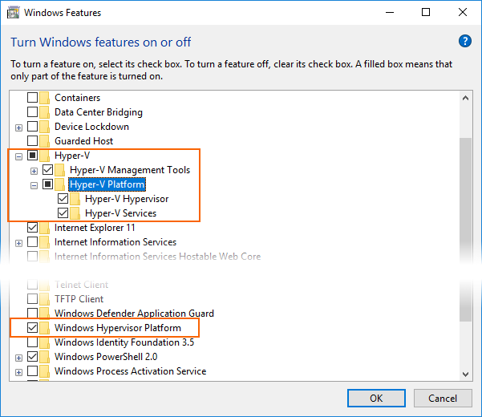

# Prerequisites

To work with Visual Studio Tools for Tizen, your computer must have the following:

- At least 1.5 GB of available disk space.
- Visual Studio 2017 to use Tizen 4.0 and 5.0.
- Visual Studio 2019 to use Tizen 4.0 and 6.5.
- Visual Studio 2022 to use Tizen 4.0 and higher.
- Visual Studio 2026 to use Tizen 4.0 and higher.
- On first launch, select an SDK resource path and wait for the extension to install its server and core apps. The default path is `C:\Users\<username>\.tizen-extension-platform`. Install required platform packages through **Tools > Tizen > Tizen Package Manager**.
- For Tizen Web App debugging, set the Google Chrome path in **Tools > Options > Tizen > Tools**.
  
  Visual Studio Tools for Tizen works with all Visual Studio variations, including Community. Installing or re-installing Visual Studio with .NET desktop development, .NET Core cross-platform development(if available), and desktop development with C++ toolsets is recommended.

  
  

- Java Development Kit (JDK)

  You must install Oracle Java Development Kit (JDK) 8 or OpenJDK 12 to use 
Tizen Baseline SDK. Make sure you download and install the exact version.

  - [Oracle Java Development Kit(JDK) 8](https://www.oracle.com/technetwork/java/javase/downloads/jdk8-downloads-2133151.html).

  - OpenJDK 12 and OpenJFX: [OpenJDK 12 and OpenJFX Installation Guide](../tizen-studio/setup/openjdk.md#install-openjdk-for-windows).

## Emulator requirements

The following table lists the CPU, screen resolution, graphic card, driver, and webcam requirements for using the Tizen Emulator.

**Table: Emulator requirements**

<table>
<thead>
<tr>
<th>Component</th>
<th>OS (Microsoft Windows&reg;, macOS, and Ubuntu)</th>
</tr>
</thead>
<tbody>
<tr>
<td>CPU</td>
<td>Recommended: Support for Intel&reg; VTx (Virtualization Technology)</td>
</tr>
<tr>
<td>Screen resolution</td>
<td>Recommended: 1280 x 1024</td>
</tr>
<tr>
<td>Graphic card</td>
<td>
Recommended: The following requirements have passed tests with the emulator.

<strong>Supported graphic cards</strong>: NVIDIA&reg; GeForce&reg; 8300 GS, GeForce&reg; 8500 GT, GeForce&reg; GT 220, GeForce&reg; GT 430, GeForce&reg; GT 530, GeForce&reg; GT 330M, GeForce&reg; GTX 550Ti, NVIDIA&reg; Quadro&reg; NVS 290

 <strong>Note</strong> 
If the host machine is using the NVIDIA&reg; Optimus&reg; technology, the emulator works with the on-board graphics card. To prevent this, either disable the Optimus&reg; technology, or set the emulator to run with the external NVIDIA graphics card.

</td>
</tr>
<tr>
<td>Driver</td>
<td>
You must upgrade to the latest vendor-provided version of the graphic card driver for OpenGL&reg; ES acceleration.

In <strong>Microsoft Windows&reg;</strong>, check and install the necessary drivers in the <strong>Control Panel &gt; System and Security &gt; Windows Update</strong>.

In <strong>Ubuntu</strong>, for more information on driver upgrades, see the <a href="https://help.ubuntu.com/community/BinaryDriverHowto/" target="_blank">Ubuntu Web site</a>. Check and install the necessary drivers in the <strong>System Settings &gt; Software &amp; Updates &gt; Additional Drivers</strong>. 
The Intel driver version must be 8.0.1 or higher.

</td>
</tr>
<tr>
<td>Webcam</td>
<td>
To use the emulator with your computer's webcam, the webcam must support the USB Video Class (UVC) driver.

The following image format requirements apply to each OS:
<ul>
<li><strong>Microsoft Windows&reg;</strong>: YUYV or MJPEG</li>
<li><strong>macOS</strong>: RGB24 or YUY2</li>
<li><strong>Ubuntu</strong>: UYYY, YYU420, YUY420, or YUYY</li>
</ul>

</td>
</tr>
</tbody>
</table>

Use one of the two options from below to enable emulator usage:

## Option 1

- Intel&reg; Hardware Acceleration Execution Manager (Intel&reg; HAXM) speeds up the Tizen emulation on Intel-VT-enabled systems. The Intel&reg; HAXM installation is started automatically as part of Visual Studio Tools for Tizen installation. For more information, see [Hardware Accelerated Execution Manager](../tizen-studio/setup/hardware-accelerated-execution-manager.md).

> [!NOTE]
> This option will not be applicable to and will not work on AMD processors.

- Make sure **Hyper-V** is disabled (in Windows 10 or higher):
  1. Input **Control Panel** on the **Search** box in Windows 10.

  2. Click **Control Panel > Programs and Features > Turn Windows features on or off**.

  3. Disable **Hyper-V** and click **OK**.

     Additional note: make sure **Virtual Machine Platform** should be disabled as well to use HAXM.

     

  4. Reboot the computer.

## Option 2

- Microsoft's Hyper-V and the Windows Hypervisor Platform (WHPX). Hyper-V is a virtualization feature of Windows that makes it possible to run virtualized computer systems on a physical host computer.

- Make sure **Hyper-V** is enabled (PowerShell in Windows 10 or higher):
  1. Check the configuration

     > Get-WindowsOptionalFeature -FeatureName Microsoft-Hyper-V-All -Online

     FeatureName      : Microsoft-Hyper-V-All\
     DisplayName      : Hyper-V\
     Description      : Provides services and management tools for creating and running virtual machines and their resources.\
                      RestartRequired  : Possible\
                      State            : Disabled\
                      CustomProperties :

  2. Enable Hyper-V & HypervisorPlatform

     > Enable-WindowsOptionalFeature -Online -FeatureName Microsoft-Hyper-V -All\
     > Enable-WindowsOptionalFeature -Online -FeatureName HypervisorPlatform -All

     

  3. Reboot the computer.

