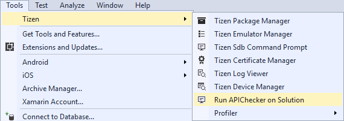
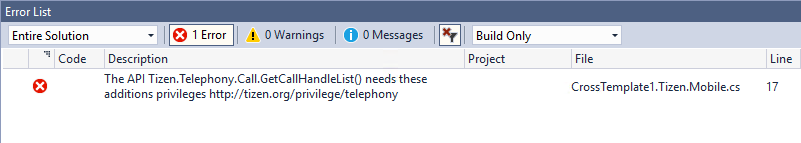
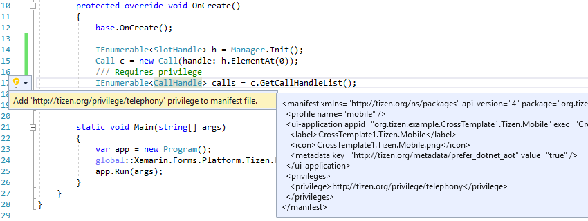

# API and Privilege Checker

You can detect potential issues with privileges and APIs in your Tizen .NET application by using the API Checker tool.

The API Checker currently detects the following issues in Tizen .NET applications:

-   **Undefined privileges**

    Flags an error if the application uses a method which requires a privilege, but that privilege has not been defined in the application manifest file.

    For example, the `GetCallHandleList()` method of the [Tizen.Telephony.Call](https://developer.tizen.org/dev-guide/csapi/api/Tizen.Telephony.Call.html) class requires the `http://tizen.org/privilege/telephony` privilege. If an application uses this method without the privilege being defined in the manifest file, the method fails when you try to run the application.

    The API Checker enables you to detect undefined privileges at compile time and fix them using the Quick Actions functionality in Visual Studio.

-   **Unused privileges**

    Flags a warning if the application contains privileges that are not used by any APIs in the application.

## Running the API Checker

To run the API Checker on your application:

1.  In the **Solution Explorer** view, select the project you want to analyze.
2.  In the Visual Studio menu, go to **Tools &gt; Tizen &gt; Run APIChecker on Solution**.

    

    The project is automatically built and the API Checker is run during the build process.

    When checking is finished, the detected issues are listed in the **Error List** view. The view contains a detailed description of the issue, and the file and line in which the issue occurs. Undefined privileges are reported as errors, while unused privileges are reported as warnings.

    

## Quick-fixing API Checker Findings

You can quick-fix the undefined privileges found by the API Checker:

1.  Click the applicable missing privilege error in the **Error List** view.

    The Quick Actions functionality in Visual Studio displays a light bulb button on the left margin, next to the code line with the error.

2.  To automatically add the missing privilege to your manifest file, click the light bulb, and select the applicable item in the drop-down menu.

    You can see the newly-added privilege in the `tizen-manifest.xml` file, and the missing privilege errors related to this privilege are automatically removed from the **Error List** view.

    
