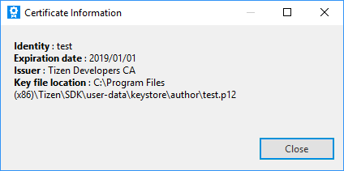

# Certificate Manager

Before installing your application on a device or submitting it to the Tizen Store, it must be signed with a certificate profile. The signature verifies the source of the application and makes sure it has not been tampered with since its publication. A certificate profile is a combination of the certificates used for signing.

## Selecting the Certificates

To select the certificates used to package your application:

1.  In the Visual Studio menu, go to **Tools &gt; Options &gt; Tizen &gt; Certification**.
2.  Define the certificates in one of the following ways:
    -   **Using the default certificates**

        If you do not need to upload your application to the Tizen Store, you can use a default certificate and deploy your application in the Tizen Emulator for testing purposes.

        To use the default certificates, uncheck the **Sign the .TPK file using the following option.** checkbox.

        

    -   **Using an existing certificate profile**

        If you have used Tizen Studio before and have already generated a certificate profile using the Tizen Certificate Manager, you can import the profile by selecting **Use profile of Tizen Certificate Manager** from the drop-down list.

        If you want to create a new certificate profile, see [Creating a Certificate Profile](#creating).

        

    -   **Using your own certificates**

        If you already have author and distributor certificates from another application store, you can import them by selecting **Direct registration** from the drop-down list and entering the required information.

        

3.  Click **OK**.

## Creating a Certificate Profile

A certificate profile consists of an author certificate and 1 or 2 distributor certificates:

-   An author certificate includes information about the author of the application. It is used to create an author signature, which ensures the integrity of the application from the author since the publication of the application.
-   A distributor certificate includes information about the distributor of the application, such as a store. It is used to create a distributor signature, which ensures the integrity of the application from the distributor since the distribution of the application.

To distribute your application, you must create a certificate profile and sign the application with it. You can create a new certificate profile with the Certificate Manager:

1.  In the Visual Studio menu, select **Tools &gt; Tizen &gt; Tizen Certificate Manager**.
2.  In the Certificate Manager window, click **+** to create a new profile.

    

    The certificate profile creation wizard opens.

3.  Enter a name for the profile and click **Next**.

    

4.  Add the author and distributor certificates:
    1.  Select whether to create a new author certificate or use a previously created author certificate, and click **Next**.

        

        Define the existing author certificate or enter the required information for a new certificate, and click **Next**.

        

    2.  You can use the default Tizen distributor certificate or another distributor certificate if you have one. In general, the default Tizen distributor certificate is used and you do not need to modify the distributor certificates. You can also select the privilege level of the distributor certificate (needed if the same certificate is used for signing [native](../../native/tutorials/details/sec-privileges.md) and [Web](../../web/tutorials/sec-privileges.md) applications).

        

5.  Click **Finish**.

## Managing Certificate Profiles

You can view, edit, and remove the certificate profiles you have created in the Certificate Manager.

**Figure: Managing certificate profiles**

To manage a certificate profile:

-   To see the details of an individual certificate within the selected certificate profile, click the info button ().

    **Figure: Certificate information**

    

-   To change the author or distributor certificate of the selected certificate profile, click the pencil button ().

    **Figure: Changing the certificate**

    

-   To remove the selected certificate profile, click the trash button ().
-   To set the selected certificate profile as active, click the check button ().

    The active profile is used when you package your application. The active profile is also automatically set in **Tools &gt; Options &gt; Tizen &gt; Certification**.

    **Figure: Removing the certificate profile or setting it active**

    
