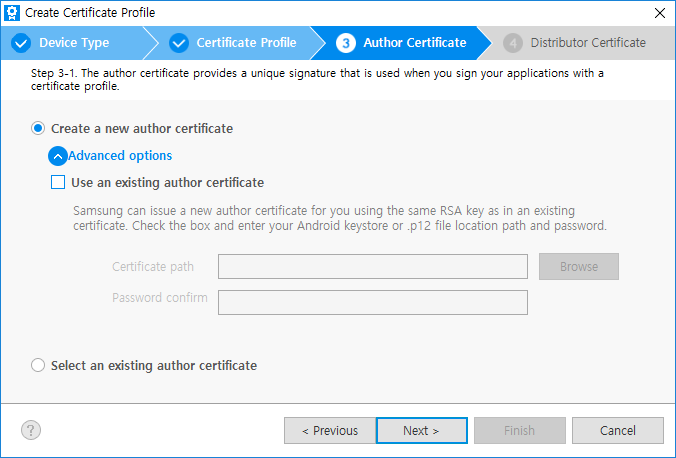
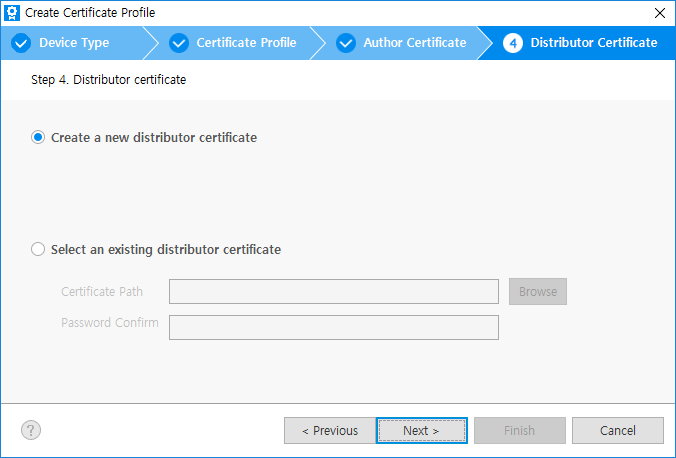

# Certificate Manager

Before installing your application on a device or submitting it to the Tizen Store, it must be signed with a certificate profile. The signature verifies the source of the application and ensures that it has not been tampered since its publication. A certificate profile is a combination of certificates used for signing. You can select these certificates or create new certificate profiles.

## Select Certificates

You can select certificates that are used to package your application:

1. In the Visual Studio menu, select **Tools &gt; Options &gt; Tizen &gt; Certification**.
2. Define the certificates in one of the following ways:

    - **Using the default certificates**

       If you do not need to upload your application to the Tizen Store, you can use a default certificate and deploy your application in the Tizen Emulator for testing purposes.

       To use the default certificates, clear the **Sign the .TPK file using the following option.** checkbox.

       

    -  **Using an existing certificate profile**

       If you have used Tizen Studio before and have already generated a certificate profile using the Tizen Certificate Manager, you can import the profile by selecting **Use profile of Tizen Certificate Manager** from the drop-down list.

       

    -  **Using your own certificates**

       If you already have the author and the distributor certificates from some other application store, you can import them by selecting **Direct registration** from the drop-down list and entering the required information.

       

3.  Click **OK**.

## Create Certificate Profile

If you already have a certificate profile, you can import it or you can create a certificate profile.

### Import certificate profile

1. In the Visual Studio menu, select **Tools &gt; Tizen &gt; Tizen Certificate Manager**.
2. To import the profiles.xml file, click **Browse** . 

    

3. To create a new profile, click **Cancel**. The **Tizen Certificate Manager** window appears.

    >**Note**
    >
    >It is recommended to keep your certificates and password safe in the local repo to prevent it from being compromised.

### Create certificate profile

A certificate profile consists of an author certificate and one or two distributor certificates:

- **Author Certificate** includes information about the author of the application. It is used to create an author signature, which ensures the integrity of the application from the author since the publication of the application.
- **Distributor Certificate** includes information about the distributor of the application, such as a store. It is used to create a distributor signature, which ensures the integrity of the application from the distributor since the distribution of the application.

To distribute your application, you must create a certificate profile and sign the application with it. To create a certificate profile:

1. Perform step 1 to step 3 under [import certificate profile](#import-certificate-profile).
2. In the **Tizen Certificate Manager** window, click **App Signing**.

   
   
   >**Note**
   >
   >To create a certificate profile for **IoT Cloud Service**, see [Generating Cloud Certificates](../../../iot/get-started/things-cloud-setup.md#generating-cloud-certificates).

3. Click **Add** **+** to create a new profile.

    

    The **Certificate Manager** window appears.
	
	
	
	>**Note**
	>
	> The **Samsung** option appears if you have installed the Samsung Certificate Extension. For more information, see [how to install the Samsung Certificate Extension](#install-samsung-certificate-extension).
	 
	You can select either [**Tizen**](#create-tizen-certificate-profile) or [**Samsung**](#create-samsung-certificate-profile) the type of the certificate:
	
	Select **Samsung** as the certificate profile to generate certificates to develop and install an application to the Samsung devices. To upload the application to the store, you must select the certificate profile as **Samsung**.
    However, if you want to use the Tizen Emulator and do not want to upload the application to the store, select **Tizen** to create certificate locally.
	

## Create Tizen Certificate Profile
	
1. [Import](#import-certificate-profile) and [create](#create-certificate-profile) a certificate profile.
2. Click **Tizen**.  
3. In the **Create Certificate Profile** window that appears, enter a name for the profile and click **Next**.

    

4. Add the author certificate:
   - Select whether to create a new author certificate or use a previously created author certificate, and click **Next**.

        

   - Define the existing author certificate or enter the required information for a new certificate, and click **Next**.

        

5. You can **use the default Tizen distributor certificate** or another distributor certificate if you have one. In general, the default Tizen distributor certificate is used and you do not need to modify the distributor certificates. You can also select the privilege level of the distributor certificate (needed if you want to use partner or platform level APIs instead of the default public APIs).

    

6.  Click **Finish**.

## Create Samsung Certificate Profile

1. [Import](#import-certificate-profile) and [create](#create-certificate-profile) a certificate profile.
2. Click **Samsung**.  
   >**Note**
   >
   >Ensure that you sign in with your Samsung Developer account, and enter the device ID (DUID) for each of your target devices.

3. In the **Create Certificate Profile** window that appears, select the device type and click **Next**.

    

4. Select **Create a new certificate profile** to create a new profile. If there is an existing profile, then select **Select an existing certificate profile**. For more information on **Select an existing certificate profile**, see [how to manage certificate profiles](#manage-certificate-profiles).

    

5. Select **Create a new author certificate** to create a new certificate. An author certificate includes information about the author of the application. It is used to create an author signature, which ensures the integrity of the application from the author since the publication of the application.

    If there is an existing author certificate, you can select **Select an existing author certificate**. For more information see, [how to manage certificate profiles](#manage-certificate-profiles).

    

    With **Advanced options** menu, you can check **Use an existing author certificate** option to select either the Android keystore, or you can also choose already existing Samsung author certificate. Click **Next**.

    

    The same signing key helps in maintaining secure peer authentication between the Tizen Gear App and the Android mobile app.

    For more information, see [Accessory SDK](https://developer.samsung.com/galaxy/accessory). In case of selecting a Samsung author certificate, you can just renew the certificate with the same information. This renewed certificate will be the same as your original RSA key, therefore,  upgrading your application is guaranteed.

6. Information of the author certificate

    Enter the author name and password. It is recommended to set a strong password. If you want to use the same password for the distributor certificate in the next step, select the check box as shown in the following figure:

    

    **Additional Fields** contains more Certificate Signing Request (CSR) information to add, but are not mandatory.
    Click **Next**. 

7. In the Samsung Account sign-in window that appears, click **Sign in** or **Create new account**. 
    >**Note**
    >
    >To get a certificate, you must have a Samsung Account. If you do not have an account, it is recommended to create a new account.

    

    The backup creates an author certificate. After you sign in to Samsung Account, you can get the author certificate.

    

    The author certificate must be secure. Therefore, it is recommend to create a backup. 

8. To specify the backup location, click **Browse**.
   >**Note**
   >
   >If you loose the author certificate, you cannot upgrade your application signed with the same certificate.

9. Click **Next**.

10. Select **Create a new distributor certificate** to create a new certificate. If there is an existing author certificate, you can select **Select an existing distributor certificate**. For more information on how to manage an existing author certificate see, [how to manage certificate profiles](#manage-certificate-profiles).

    Click **Next**.

    

11. Enter the required information for the distributor certificate.

    Select the **Privilege** level for the distributor certificate. The application must have a distributor certificate with appropriate privilege level to ensure that the implemented APIs work in the device.

    

    >**Note**
    >
    >**Privileges**
    >
    >To protect the device system and user private data, the Tizen security architecture is based on privileges and application signing of the Linux basic security model. Linux  basic security model includes process isolation and mandatory access control. The users must have options to grant privileges for security-sensitive operations:
    >
    > - **Public** - No limitation. The privileges can be used by all Tizen application developers.
    > - **Partner** - No limitation to request and get the distributor certificate with this level. But when the application is uploaded to the store, store re-signs the application with official partner level distributor certificate, only for the registered partner developer at Samsung.

    - If you have selected an option to apply same password to the author certificate and to the distributor certificate [while entering author certificate information](#information_of_the_author_certificate), the password is already saved. If you want to change the password, type the new password for the distributor certificate.

    - After the device is connected to the Host PC, the DUID is automatically added to the list. If you want to add more devices, connect your device to your Host PC via USB or WiFi. The previous DUIDs in the list are not deleted even if you disconnect the device. To delete the DUIDs, click the trash icon. For more information, see [How to connect the device to PC via WiFi](../../dotnet/tutorials/testing-your-app-on-gear.md).

    - When you need to register devices that are more than 10, upload a txt file using **Import a DUID list file** menu. One DUID on a line and max 50 DUIDs are be available.

        > **Note**
        >
        > The DUID of recent mobile and wearable devices start with  2.0#, but old devices are 1.0#. If a distributor certificate contains a 1.0# DUID, all devices with that certificate require one more step. For more information, see [Permit Device To Install Applications](../../dotnet/tutorials/certificates/permit-device-to-install-apps.md) guide.
        > If you do not have any actual device but want to develop apps and upload to the store, launch the emulator virtual machine and use its DUID.

12. Click **Next**, to get the distributor certificate.

    

13. Click **Finish**. The **Tizen Certificate Manager** window appears. You can find the created profile and its information.

    

## Manage Certificate Profiles

You can view, edit, and remove the certificate profiles you have created in the Certificate Manager.

To manage a certificate profile:

-   To see the details of an individual certificate within the selected certificate profile, click .

    

-   To change the author or distributor certificate of the selected certificate profile, click .

    

-   To remove the selected certificate profile, click .
-   To set the selected certificate profile as active, click .

    The active profile is used when you package your application. The active profile is also automatically set in **Tools &gt; Options &gt; Tizen &gt; Certification**.

    

## Install Samsung Certificate Extension
	
To install the Samsung Certificate Extension:

1. In the Visual Studio menu, select **Tools &gt; Tizen &gt; Tizen Package Manager**.  
2. Configure the repository server (during development stage only):
    1. In the **Package Manager** window, open the **Configuration** window by clicking the gear icon.  
    
    2. In the **Configuration** window, click **Extension SDK** panel.  
    
    3. To open the **Add Repository** dialog box, click **Add** **+** above the repository information table.
    4. Enter a name for the repository, and in the **Repository** field, enter the following address: 
       >`http://10.113.138.168/packages/sec_cert_extension`
    5. Click **OK**.  
    The repository information is added to the table in the **Configuration** window.  
        
    6. Click **OK**.
3. To install the extension, in **Package Manager**, select **Extension SDK** and click **install** next to **Samsung Certificate Extension**.  
   
   
   The **Samsung Certificate Extension** is installed.
