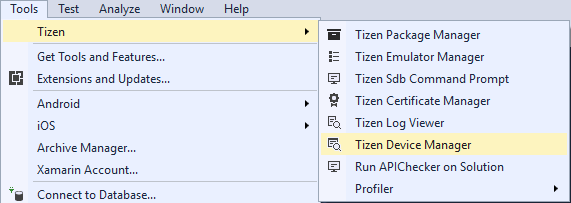
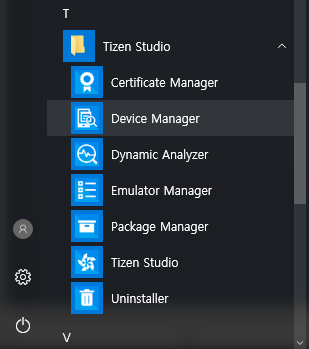
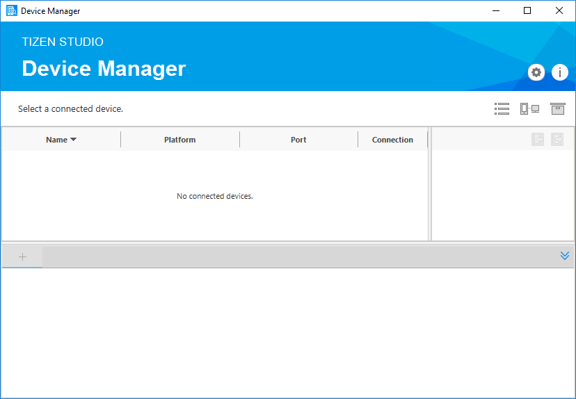
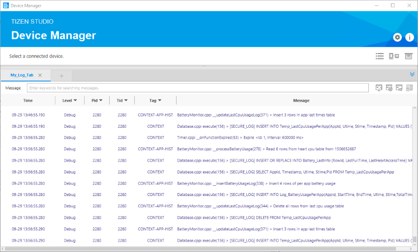
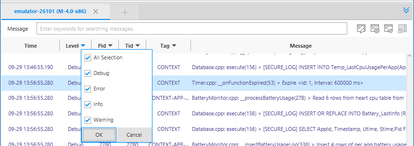
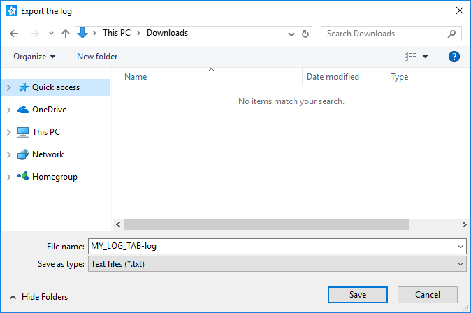

# Device Manager

Tizen Device Manager is a standalone tool that provides information about connected Tizen devices or emulators for application debugging purposes.

With this tool, you can manage the connected devices or emulators and push or pull files from the host computer to devices. In addition, the Device Manager **Log View** allows you to check logs from connected devices.


## Launching the Device Manager

You can launch the Tizen Device Manager in the following ways:

-   In the Visual Studio menu, select **Tools &gt; Tizen &gt; Tizen Device Manager**.

    

-   In the Windows&reg; **Start** menu, select **Device Manager**.

    

Both methods open the Device Manager main screen, where you can see the **Connection Explorer** view at the top and the **Log View** at the bottom.

**Figure: Device Manager**




## Connection Explorer View

The **Connection Explorer** view shows the devices and emulators connected to the system. A list of connected devices is available in tree view after connecting a device or launching a Tizen emulator. The **Connection Explorer** view provides the following actions for the connected devices:

-   Show a list of connected devices and connect devices for running and debugging the application.
-   Provide file operations (such as push and pull) on connected devices.
-   Send or receive files between the **Solution Explorer** and **Connection Explorer** views by dragging and dropping.
    -   The view shows the folder and file list of the connected device, and file information (date/size).
    -   You can create, delete, and rename files.
    -   You can upload and download files.
-   Explore the file system on the connected devices.
-   Launch the Emulator Manager to handle multiple emulator instances.

**Figure: Connection Explorer view**


<a name="logview"></a>
## Log View

The **Log View** helps you debug your application by capturing all the events logged by the platform and your application. The **Log View** shows the logs through the Tizen logging system.

To create log messages, reference the Tizen library in your project and call the functions of the [Tizen.Log](https://developer.tizen.org/dev-guide/csapi/api/Tizen.Log.html) class:

```csharp
using System;
using Tizen;

namespace XamarinApplication1.Tizen
{
    class Program : global::Xamarin.Forms.Platform.Tizen.FormsApplication
    {
        protected override void OnCreate()
        {
            /// Using Tizen.Log directly
            global::Tizen.Log.Debug("TEST", "Test Debug Message!");
            global::Tizen.Log.Error("TEST", "Test Error Message!");
            global::Tizen.Log.Fatal("TEST", "Test Fatal Message!");
            global::Tizen.Log.Info("TEST", "Test Info Message!");
            global::Tizen.Log.Verbose("TEST", "Test Verbose Message!");
            global::Tizen.Log.Warn("TEST", "Test Warn Message!");

            base.OnCreate();
            LoadApplication(new App());
        }

        static void Main(string[] args)
        {
            var app = new Program();
            global::Xamarin.Forms.Platform.Tizen.Forms.Init(app);
            app.Run(args);
        }
    }
}
```

The **Log View** displays a log table consisting of the following fields:

-   **Time**: log time
-   **Level**: priority level indicates the urgency of the log message
-   **Pid**: process ID
-   **Tid**: thread ID
-   **Tag**: identification of the log message source
-   **Message**: log message

### Adding and Removing Log Tabs

To add a log tab:

1.  Add a new tab by clicking **+** next to the existing tabs.
2.  Type the tab name in the **Tab Name** field, select a device in the **Device** list, and click **OK**.

    

**Figure: Added log tab**



To remove a log tab:

1.  Click the log tab to be removed.
2.  Click **X** next to the tab name.

### Understanding and Filtering Logs

In the log table, you have the following options and functions:

-   Log level filtering option

    In the **Log View**, you can filter the log messages. Click the arrow in the **Level** field, select the messages types you want to see, and click **OK**.

    

-   Keyword filtering option

    You can filter the log messages by clicking the arrow in the **Pid** and **Tag** fields, selecting the wanted values, and clicking **OK**. To filter based on the **Message** field content, enter keywords at the search box at the top of the **Log View**. The keywords must be separated by a space or a comma.

    

-   Scroll lock

    The log table shows the latest logs by default. While the application is running, the log table scrolls as new logs are added to the table. To stop the table from scrolling while you are checking a specific log, click the **Scroll Lock** button ().

-   Clearing the table

    You can remove all log messages from the log tab by clicking the **Clear the Log** button ().

-   Exporting logs to a file

    You can export the current log messages in the log tab and save them as a log file by clicking the **Export the Log** button ().

    **Figure: Exporting a log file**

    

