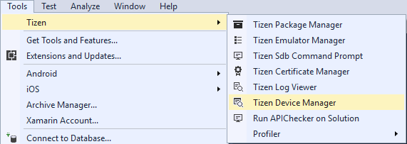
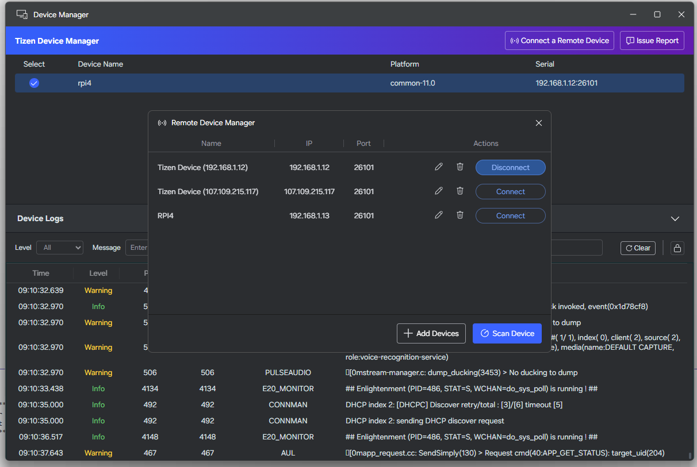
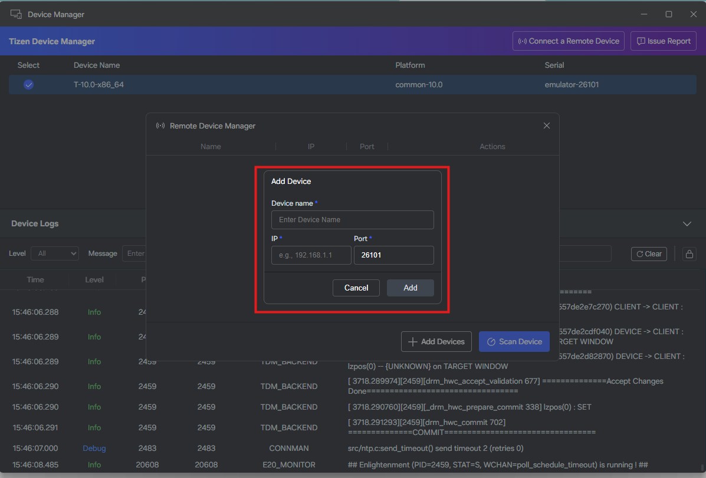
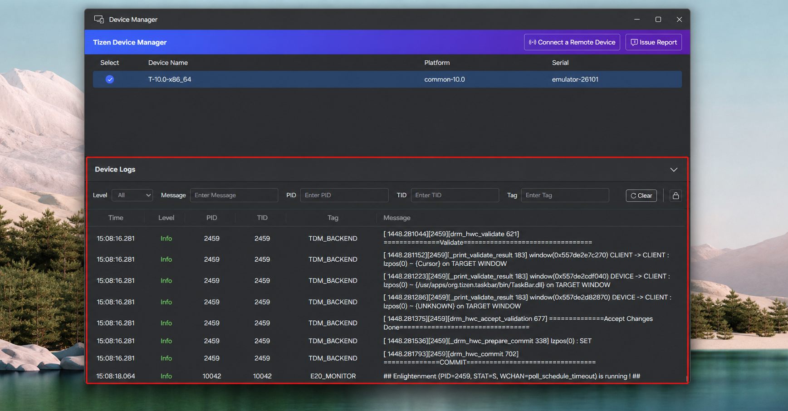

# Device Manager

Tizen Device Manager provides a unified view of connected devices and emulators, remote-device connections, and real-time platform and application logs.

## Launching the Device Manager

You can launch the Tizen Device Manager from the Visual Studio menu:

- Select **Tools > Tizen > Tizen Device Manager**.

  

The upper **Connection Explorer** shows devices and emulators; the lower **Log View** shows their logs.

## Connection Explorer

Each connected target shows a selection control, device name, platform version, and serial number. Select a target to make it active for operations and deployment.

## Connect a Remote Device

1. In Device Manager, select **Connect a Remote Device** to open **Remote Device Manager**.

   

2. Select **Add Devices**.
3. Enter a device name, IP address, and port. The default SDB port is `26101`.

   

4. Select **Add**, then select **Connect**.

   The video below shows how to connect a remote device:

   <video controls height="400">
     <source src="../media/remote_devices_feature.mp4" type="video/mp4">
   </video>

Use **Scan Device** to discover devices available on the local network. The Remote Device Manager also lets you connect, disconnect, edit, and delete saved devices.

## Log View

The Log View displays the time, level, PID, TID, tag, and message for each log event. It supports:

- filtering by log level;
- keyword searches across messages, PIDs, TIDs, and tags;
- scroll lock to pause automatic scrolling;
- clearing the current buffer.

To emit logs from a .NET application, use the methods in the [Tizen.Log](https://developer.tizen.org/dev-guide/csapi/api/Tizen.Log.html) class.

The following image highlights the Device Logs panel and its filtering controls.

The video below shows the Device Manager workflow:

<video controls height="400">
  <source src="../media/device_manager.mp4" type="video/mp4">
</video>

## Issue Report

Select **Issue Report** in the upper-right corner of Device Manager to open the GitHub issues page and report an issue.

