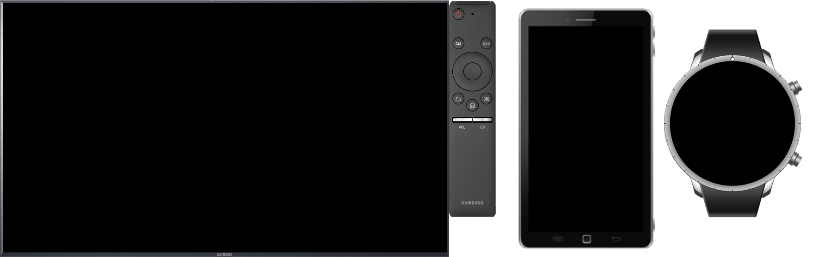
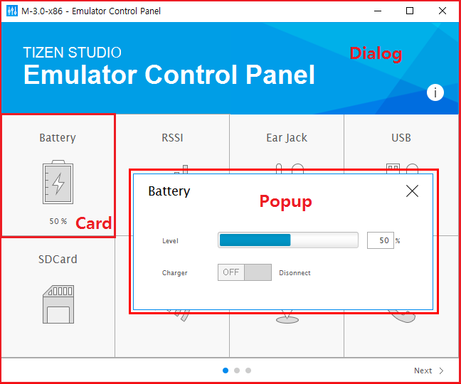
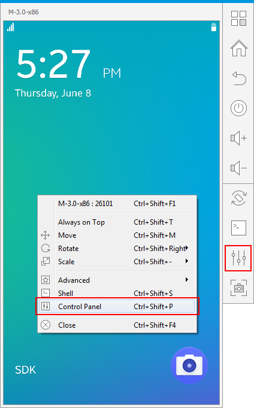
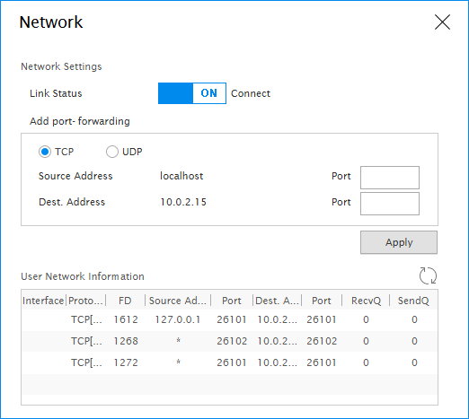
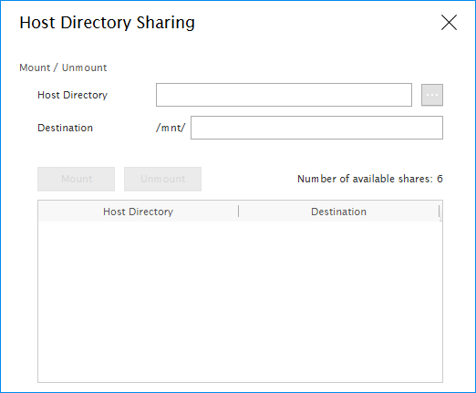

# Emulator Control Panel

Before deploying your application, it is important that you test it in an environment similar to a real device.

You can run the application in the emulator, and test a variety of user scenarios, such as network access, audio input and out, and text messages. With a mouse and keyboard, you can control the application in the emulator just like on an actual device.

While the application is running, you can use the Emulator Control Panel to simulate events for a variety of system options that the actual device provides. For example, by manipulating the virtual battery, you can simulate the application in different charge environments.

The emulator controls consist of internal and external parts:

-   The **HOME**, **Volume control** and **Back** buttons, for example, are external parts controlling the device from the outside.

    In the emulator, the external parts are called the **emulator control keys and menu**.

-   Battery level and screen brightness, for example, are internal parts controlling the device from the inside. In the emulator, the internal parts are called the **Emulator Control Panel**.


## Using the Control Keys and Context Menu

The control keys are visible on the emulator when you start it. To access the context menu, right-click the emulator.

**Figure: TV, mobile, and wearable emulators**

****

> **Note**  
> You can create a custom resolution emulator by using the [Emulator Manager CLI](../../tizen-studio/common-tools/emulator-manager.md#control), and launch it with the TV and mobile skin. It is not guaranteed that all applications are correctly shown in the custom resolution.


### Control Keys

The following hardware keys are available on the emulator:

-   **Menu**

    When tapped, a list of options available for the current screen opens. On the TV platform, the options include removing an application.

-   **Home**

    When long-pressed, the Task switcher application opens as on a real device.

-   **Back**

    When tapped, the emulator returns to the previous screen.

-   **Power**

    You can power off the display by tapping the **Power** key in most situations. Sometimes, the display does not power off when you tap the **Power** key. This is to guarantee the operation of a current application, such as the Stopwatch in the Clock application. If you tap the **Power** or **Home** key again, the display is powered on.

-   **Volume Up** and **Volume Down** (mobile only)

    When tapped, the volume changes accordingly.

-   **Arrow keys** (TV only)

    When tapped, the cursor or selection moves in the desired direction.

-   **OK** (TV only)

    When tapped, the item is selected.

### Context Menu

You can access the context menu by right-clicking the emulator. In the menu, you can select:

-   Emulator name (the top row in the menu)

    The **Detailed Info** window is displayed, showing the **Shortcut Info** and **VM Info** tabs. The **Shortcut Info** tab lists the [emulator keyboard shortcuts](../../tizen-studio/common-tools/keyboard-shortcuts.md#emulator) and the **VM Info** tab defines the virtual machine details.

    **Table: VM Info**

    |Feature                     |Description|
    |----------------------------|---------------------------------------------------|
    |**VM Name**                 |VM name|
    |**Skin Name**               |Skin name|
    |**CPU Arch**                |CPU architecture|
    |**RAM Size**                |RAM size (in MB)|
    |**Display**                 |Target display resolution (in DPI; Dots Per Inch)|
    |**Network Connection**      |NAT (Network Address Translation) or Bridged|
    |**CPU Virtualization**      |Whether hardware virtualization is supported|
    |**GPU Virtualization**      |Whether GPU virtualization is supported|
    |**Platform Image Version**  |Version of the used platform image|
    |**Platform Image File**     |Location of the used platform image|
    |**Directory Sharing**       |Whether host directory sharing is used|
    |**File Shared Path**        |Path to the shared host directory|
    |**Kernel Log File**         |Kernel log file path|
    |**Emulator Log File**       |Emulator (Qemu) log file path|
    |**Emulator Version**        |Tizen Emulator version|

-   **Always On Top**

    Select this option to keep the emulator window on top of other windows.

-   **Rotate** (mobile only)

    Select either **Portrait**, **Landscape**, **Reverse Portrait**, or **Reverse Landscape** as the orientation of the emulator.

-   **Scale** (mobile only)

    Scale the size of the emulator between 1x, 1/2x (default), 3/4x, and 1/4x.

-   **Advanced &gt; Controller**

    Show or hide the controller window.

    > **Note**  
    > The **Controller** menu is not supported in the profile-specific skin.

-   **Advanced &gt; Screenshot**

    Capture a screenshot of the emulator.

-   **Advanced &gt; About**

    Display the emulator version and build time.

-   **Advanced &gt; Force Reboot**

    Force the emulator to reboot. Since force rebooting the emulator can cause problems, use the reboot option from the SDB shell to reboot the emulator. Use **Force Reboot** only when absolutely necessary.

-   **Advanced &gt; Force Close**

    Force the emulator to exit. Since force stopping the emulator can cause problems, use the **Close** option to exit the emulator. Use **Force Close** only when absolutely necessary.

-   **Shell**

    Open a Smart Development Bridge (SDB) shell command window.

-   **Control Panel**

    Control or monitor the state of the emulator dynamically.

-   **Close**

    Exit the emulator.


## Using the Control Panel

With the Emulator Control Panel, you can simulate system events and perform related tasks.

The control panel consists of 3 layers:

-   **Dialog** is the main Emulator Control Panel window, which shows a list of testable device cards.
-   **Card** represents a peripheral device or system option, and shows the respective device or option status. By clicking a card, you can simulate an event directly or open a **Popup** to do it.
-   **Popup** displays testable events for a peripheral device.

**Figure: Emulator Control Panel layers**

****

To open the control panel:

1.  Launch the emulator.
2.  Click the **Control Panel** button, or right-click the emulator and select **Control Panel**.

    

The following table lists the control panel features and their availability on different profiles. The instructions for using the features are described below the table.

**Table: Control panel features**
<table>
	<tbody>
		<tr>
			<th colspan="2">Feature</th>
			<th>Mobile</th>
			<th>TV</th>
			<th>Wearable</th>
			<th>Description</th>
		</tr>
		<tr>
			<td colspan="2">Network</td>
			<td>Yes</td>
			<td>Yes</td>
			<td>Yes</td>
			<td>You can control the user network and forward a remote or local port to an inside port of the emulator.</td>
		</tr>
		<tr>
			<td colspan="2">Host Directory Sharing</td>
			<td>Yes</td>
			<td>Yes</td>
			<td>Yes</td>
			<td>You can transfer files through the host directory sharing feature without using the SDB utility.</td>
		</tr>
		<tr>
			<td colspan="2">Battery</td>
			<td>Yes</td>
			<td>No</td>
			<td>Yes</td>
			<td>You can set the battery level and charger status.</td>
		</tr>
		<tr>
			<td colspan="2">RSSI</td>
			<td>Yes</td>
			<td>No</td>
			<td>No</td>
			<td>You can set the remote signal strength.</td>
		</tr>
		<tr>
			<td rowspan="7">Sensor</td>
			<td>3-Axis</td>
			<td>Yes</td>
			<td>No</td>
			<td>Yes</td>
			<td>You can simulate user acceleration, magnetic, and gyroscope values.</td>
		</tr>
		<tr>
			<td>Light</td>
			<td>Yes</td>
			<td>No</td>
			<td>Yes</td>
			<td>You can simulate a lux value for the light sensor.</td>
		</tr>
		<tr>
			<td>Proximity</td>
			<td>Yes</td>
			<td>No</td>
			<td>Yes</td>
			<td>You can simulate the presence of nearby objects.</td>
		</tr>
		<tr>
			<td>Pressure</td>
			<td>Yes</td>
			<td>No</td>
			<td>Yes</td>
			<td>You can simulate an hPa value for the pressure sensor.</td>
		</tr>
		<tr>
			<td>Ultraviolet</td>
			<td>Yes</td>
			<td>No</td>
			<td>Yes</td>
			<td>You can simulate an ultraviolet index value.</td>
		</tr>
		<tr>
			<td>Heart Rate Monitor</td>
			<td>Yes</td>
			<td>No</td>
			<td>Yes</td>
			<td>You can simulate the user heart rate and peak-to-peak time.</td>
		</tr>
		<tr>
			<td>Pedometer</td>
			<td>Yes</td>
			<td>No</td>
			<td>Yes</td>
			<td>You can simulate user movement with the device.</td>
		</tr>
		<tr>
			<td colspan="2">Earjack</td>
			<td>Yes</td>
			<td>No</td>
			<td>No</td>
			<td>You can add or remove a headset.</td>
		</tr>
		<tr>
			<td colspan="2">USB</td>
			<td>Yes</td>
			<td>No</td>
			<td>Yes</td>
			<td>You can add or remove a USB device.</td>
		</tr>
		<tr>
			<td colspan="2">SD Card</td>
			<td>Yes</td>
			<td>No</td>
			<td>No</td>
			<td>You can simulate a 4G, 8G, 16G, or 32G SD card.</td>
		</tr>
		<tr>
			<td colspan="2">NFC</td>
			<td>Yes</td>
			<td>No</td>
			<td>Yes</td>
			<td>You can simulate near-field communication (NFC) events.</td>
		</tr>
		<tr>
			<td colspan="2">Location</td>
			<td>Yes</td>
			<td>No</td>
			<td>Yes</td>
			<td>You can simulate latitude and longitude values using a map, manually, or from a log file.</td>
		</tr>
		<tr>
			<td colspan="2">Telephony</td>
			<td>Yes</td>
			<td>No</td>
			<td>Yes</td>
			<td>You can make and receive a call. You can also send and receive SMS messages.</td>
		</tr>
		<tr>
			<td colspan="2">Memory</td>
			<td>Yes</td>
			<td>No</td>
			<td>Yes</td>
			<td>You can set the memory status.</td>
		</tr>
	</tbody>
</table>


### Controlling the Network Setting

In the **Network** card, you can control the user network.

To lose the network connection, set the **Link Status** switch off. To forward a remote or local port to an inside port of the emulator, enter values in the text boxes, and click **Apply**.

**Figure: Network popup**



### Mounting a Host Directory

In the **HDS** card, you can configure host directory sharing (HDS) to share resources and transfer files without using the SDB utility. The specified host directory is mounted to `/mnt/host`.

**Figure: Host Directory Sharing popup**



### Providing Device Data

The control panel can be used to simulate various device data:

-   In the **Battery** card, you can set the battery level using the **Level** slider. You can also connect or disconnect a charger using the **Charger** switch.
-   In the **Ear Jack** card, you can add or remove an earjack (headset) device. You can add a 3-wire or 4-wire device.
-   In the **USB** card, you can connect or disconnect a USB device.
-   In the **RSSI** card, you can set the RSSI (remote signal strength indicator) information level.
-   In the **SDCard** card, you can attach or detach an SD card to or from the emulator at runtime. You can attach a **4G**, **8G**, **16G**, or **32G** SD card.

    > **Note**  
    > The same SD card cannot be attached to multiple emulators at the same time.

Device information set using the control panel is reflected on the indicator bar of the emulator screen.

### Providing Location Data

In the **Location** card, you can provide simulated responses to location data requests:

-   Injecting map markers

    In the **Map Image** section, right-click the desired map locations and click **Inject Markers** to send the location data to the emulator.

-   Manually entering location coordinates

    In the **Manual** section, enter the coordinates and click **Inject Location** to send the location data to the emulator. The range of the latitude, longitude, altitude, and horizontal accuracy is from -90 to 90, -180 to 180, -300 to 100000, and 0 to 100000, respectively.

-   Loading a GPS log file

    In the **Log** section, select a pre-logged GPS data file (in NMEA183 format) and click **Inject Log** to send the location data to the emulator.

### Providing NFC Data

In the **NFC** card, you can test near-field communication (NFC) features.

> **Note**  
> The control panel only sends NFC-related events to the emulator. There is no actual information exchange between the control panel and emulator. Therefore, for information exchange features, such as writing information to an NFC tag, the emulator simply displays a success message.

-   Creating NFC data exchange format (NDEF) messages

    An NDEF message contains 1 or more NDEF records. In the **NDEF Message** section:

    1.  Select the record type name format.
    2.  Enter the record type name, ID, and payload.
    3.  Click **Add**.

    You can add multiple NDEF records in the NDEF message.

    Click **Edit** or **Remove** to modify or delete a selected record.

-   Attaching and detaching NFC tags

    In the **NDEF Tag** section:

    1.  Select the tag type.
    2.  Click the switch to attach or detach the tag.

        If the NDEF record list is not empty, an NDEF message is created using this list and the attach message is sent to the emulator with the NDEF message.

-   Creating a peer-to-peer (P2P) data connection

    In the **PEER TO PEER** section:

    -   To inform the emulator that a new device has been discovered, click **P2P Discovered**.
    -   To send the emulator an NDEF message, click **P2P Send**.
    -   To inform the emulator that a connected device has been detached, click **P2P Detached**.

### Providing Sensor Data

In the control panel, you can model user actions, such as shaking, throwing, and tilting the device, for the emulator instance. In addition, you can simulate a single sensor event on the instance, or send sequences of 3-axis sensor events to the instance.

-   In the **Sensor** card, you can control the 3-axis sensors. The popup consists of 4 tabs, where you can adjust the acceleration, magnetic, and gyro sensors of the emulator instance. In the **GUI** tab, you can intuitively adjust various sensor data by using 3D graphics.

    -   GUI

        In the **GUI** tab, you can select an active sensor and move the 3D model of the emulator instance with the 3 axis sliders or the direction buttons (**Portrait**, **Landscape**, **Reverse Portrait**, and **Reverse Landscape**). The instance monitor displays the acceleration, magnetic, and gyro values.

        To better control the movement, select the **With axis** check box to see the axes in the emulator image. You can also fix the Y or Z axis by selecting the **X/Z** or **X/Y** radio button, respectively. To change the emulator accelerator value in the direction of the movement, select the **Move** radio button.

    -   Acceleration

        In the **Acceleration** tab, you can control the acceleration of the instance along the coordinate axes. When the emulated device is stationary and vertical in portrait orientation, the acceleration value of the Y axis is 1 g (gravitational acceleration). You can control the acceleration 3-axis values from -2 g to 2 g, using the sliders.

    -   Magnetic

        In the **Magnetic** tab, you can control the magnetic field values of the instance along the coordinate axes. When the emulated device is stationary and vertical in portrait orientation, the Y axis is at true north and the magnetic field strength values are 1, 0, and -10 &micro;T (microtesla). You can control the magnetic field 3-axis values from -2000 &micro;T to 2000 &micro;T, using the sliders.

    -   Gyro

        In the **Gyro** tab, you can control the gyro (rotation angle per second) of the instance along the coordinate axes. You can control the gyro 3-axis values from -573 degrees/s to 573 degrees/s, using the sliders.

    You can simulate a single event on the individual sensor, or use sensor data files to simulate sequences of events on the sensor. A sensor data file consists of predefined events. It is written in ASCII. By loading a data file in the **Acceleration**, **Magnetic**, or **Gyro** tab, you can play a sequence of predefined events. You can also add multiple data files to be played in sequence. The format of each line in the event file is:

    ```
    timestamp, x, y, z
    ```

    When you add the event files and click **Start**, the predefined events are simulated at their specified relative timestamp. The timestamp unit is 0.01 seconds. Some events can be discarded, if they exceed certain limits of performance, resource, or logic.

-   In the **Light** card, you can simulate ambient light conditions using the **Lux** slider. The range of this value is from 0 Lux to 65635 Lux.

    If automatic screen brightness is activated in the device settings, the display changes based on the simulated light value.

-   In the **Proximity** card, you can set the proximity sensor state to **Far** or **Near**.
-   In the **Pressure** card, you can control the pressure sensor using the **hPa** slider. The range of this value is from 260 hPa to 1260 hPa (Hectopascals).
-   In the **Ultraviolet** card, you can control the ultraviolet sensor using the **Index** slider. The unit is UV index and the range of this value is from 0 to 15.0.
-   In the **Heart Rate** card, you can control the HRM (Heart Rate Monitor) sensor. You can use the **bpm** slider to set the heart rate value between 0 and 220 bpm, and the **ms** slider to set the peak-to-peak time between 0 and 5000 ms (milliseconds).
-   In the **Pedometer** card, you can simulate user movement with the device by selecting a movement pace:
    -   **Stop**
    -   **Walk Slowly**
    -   **Walk**
    -   **Run Slowly**
    -   **Run**

### Providing Telephony Features

In the **Telephony** card, you can generate incoming calls and messages:

-   Generating incoming calls

    Incoming calls are generated in the **Call** tab.

    > **Note**  
    > A Mobile Termination (MT) call is made from the Emulator Control Panel to the emulator. A Mobile Origination (MO) call is made from the emulator to the Emulator Control Panel using the emulator's phone application.

    To make an MT call:

    1.  In the **MT Call** section, enter the phone number you want to imitate the call from.
    2.  Click **Connect**.
    3.  To hide the phone number on the emulator, select the **Hidden** option.

        The caller ID on the emulator is set to "Unknown".

    To make an MO call:

    1.  Call a phone number using the emulator's phone application.

        In the **MO Call** section, you can see the call ID, number, and call type.

    2.  To disconnect the call, click **Disconnect**.

-   Generating messages

    SMS messages are generated in the **Messaging** tab. After sending a message, your application waits for the asynchronous send status message. You can generate this status report for SMS messages using the same **Messaging** tab.

    To generate an SMS message:

    1.  Enter the sender phone number you want to imitate.
    2.  Enter the message body text and click **Send Msg**.

    To generate status reports, select the sending status value for the SMS message and click **Set**. The available values are:

    -   **SMS OK(Success)**
    -   **SMS Not Available**

    You can also generate MMS message status reports. To generate MMS status reports, select the sending status value for the MMS message and click **Set**. The available values are:

    -   **MMS OK(Success)**
    -   **MMS Failure**

### Providing Memory Data

In the **Memory** card, you can select a specific memory status using the radio buttons:

-   **Hard Warning (40 MB and under)**
-   **Soft Warning (60 MB and under)**
-   **Normal (Sufficient)**
