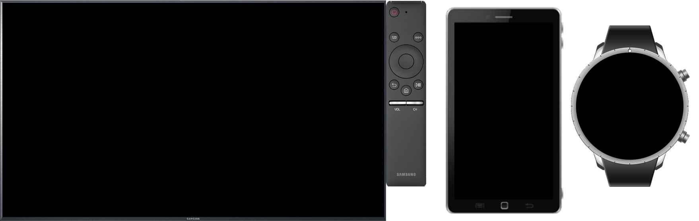
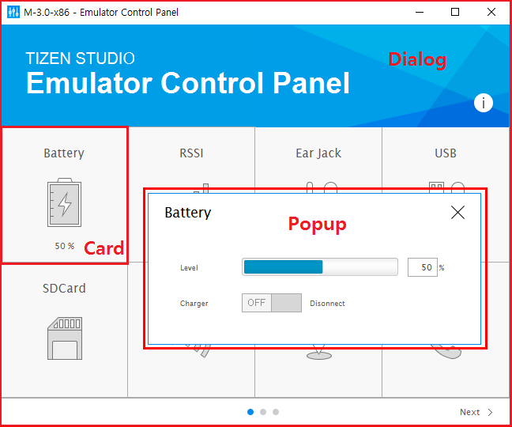
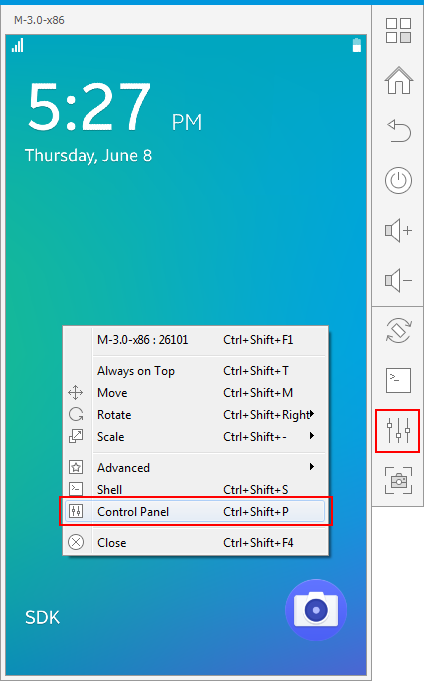
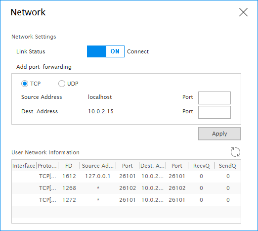
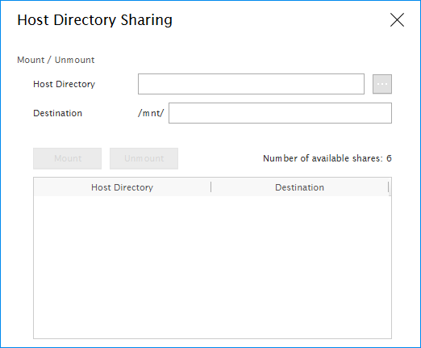

# Emulator Control Panel

Before deploying your application, it is important that you test it in an environment similar to a real device.

You can run the application in the emulator, and test a variety of user scenarios, such as network access, audio input and out, and text messages. With a mouse and keyboard, you can control the application in the emulator just like on an actual device.

While the application is running, you can use the Emulator Control Panel to simulate events for a variety of system options that the actual device provides. For example, by manipulating the virtual battery, you can simulate the application in different charge environments.

The emulator controls consist of internal and external parts:

-   The **HOME**, **Volume control** and **Back** buttons, for example, are external parts controlling the device from the outside.

    In the emulator, the external parts are called the **emulator control keys and menu**.

-   Battery level and screen brightness, for example, are internal parts controlling the device from the inside. In the emulator, the internal parts are called the **Emulator Control Panel**.

## Using the Control Keys and Context Menu

The control keys are visible on the emulator when you start it. To access the context menu, right-click the emulator.

**Figure: Tizen emulator**

****

> **Note**  
> You can create a custom resolution emulator by using the [Emulator Manager CLI](../../tizen-studio/common-tools/emulator-manager.md#control), and launch it with the TV skin. It is not guaranteed that all applications are correctly shown in the custom resolution.

### Control Keys

The following hardware keys are available on the emulator:

-   **Menu**

    When tapped, a list of options available for the current screen opens. On the TV platform, the options include removing an application.

-   **Home**

    When long-pressed, the Task switcher application opens as on a real device.

-   **Back**

    When tapped, the emulator returns to the previous screen.

-   **Power**

    You can power off the display by tapping the **Power** key in most situations. Sometimes, the display does not power off when you tap the **Power** key. This is to guarantee the operation of a current application, such as the Stopwatch in the Clock application. If you tap the **Power** or **Home** key again, the display is powered on.

-   **Arrow keys** (TV only)

    When tapped, the cursor or selection moves in the desired direction.

-   **OK** (TV only)

    When tapped, the item is selected.

### Context Menu

You can access the context menu by right-clicking the emulator. In the menu, you can select:

-   Emulator name (the top row in the menu)

    The **Detailed Info** window is displayed, showing the **Shortcut Info** and **VM Info** tabs. The **Shortcut Info** tab lists the [emulator keyboard shortcuts](../../tizen-studio/common-tools/keyboard-shortcuts.md#emulator) and the **VM Info** tab defines the virtual machine details.

    **Table: VM Info**

    |Feature                     |Description|
    |----------------------------|---------------------------------------------------|
    |**VM Name**                 |VM name|
    |**Skin Name**               |Skin name|
    |**CPU Arch**                |CPU architecture|
    |**RAM Size**                |RAM size (in MB)|
    |**Display**                 |Target display resolution (in DPI; Dots Per Inch)|
    |**Network Connection**      |NAT (Network Address Translation) or Bridged|
    |**CPU Virtualization**      |Whether hardware virtualization is supported|
    |**GPU Virtualization**      |Whether GPU virtualization is supported|
    |**Platform Image Version**  |Version of the used platform image|
    |**Platform Image File**     |Location of the used platform image|
    |**Directory Sharing**       |Whether host directory sharing is used|
    |**File Shared Path**        |Path to the shared host directory|
    |**Kernel Log File**         |Kernel log file path|
    |**Emulator Log File**       |Emulator (Qemu) log file path|
    |**Emulator Version**        |Tizen Emulator version|

-   **Always On Top**

    Select this option to keep the emulator window on top of other windows.

-   **Advanced &gt; Controller**

    Show or hide the controller window.

    > **Note**  
    > The **Controller** menu is not supported in the profile-specific skin.

-   **Advanced &gt; Screenshot**

    Capture a screenshot of the emulator.

-   **Advanced &gt; About**

    Display the emulator version and build time.

-   **Advanced &gt; Force Reboot**

    Force the emulator to reboot. Since force rebooting the emulator can cause problems, use the reboot option from the SDB shell to reboot the emulator. Use **Force Reboot** only when absolutely necessary.

-   **Advanced &gt; Force Close**

    Force the emulator to exit. Since force stopping the emulator can cause problems, use the **Close** option to exit the emulator. Use **Force Close** only when absolutely necessary.

-   **Shell**

    Open a Smart Development Bridge (SDB) shell command window.

-   **Control Panel**

    Control or monitor the state of the emulator dynamically.

-   **Close**

    Exit the emulator.

## Using the Control Panel

With the Emulator Control Panel, you can simulate system events and perform related tasks.

The control panel consists of 3 layers:

-   **Dialog** is the main Emulator Control Panel window, which shows a list of testable device cards.
-   **Card** represents a peripheral device or system option, and shows the respective device or option status. By clicking a card, you can simulate an event directly or open a **Popup** to do it.
-   **Popup** displays testable events for a peripheral device.

**Figure: Emulator Control Panel layers**

****

To open the control panel:

1.  Launch the emulator.
2.  Click the **Control Panel** button, or right-click the emulator and select **Control Panel**.

    

The following table lists the control panel features. The instructions for using the features are described below the table.

**Table: Control panel features**
<table>
	<tbody>
		<tr>
			<th>Feature</th>
			<th>Description</th>
		</tr>
		<tr>
			<td>Network</td>
			<td>You can control the user network and forward a remote or local port to an inside port of the emulator.</td>
		</tr>
		<tr>
			<td>Host Directory Sharing</td>
			<td>You can transfer files through the host directory sharing feature without using the SDB utility.</td>
		</tr>
	</tbody>
</table>

### Controlling the Network Setting

In the **Network** card, you can control the user network.

To lose the network connection, set the **Link Status** switch off. To forward a remote or local port to an inside port of the emulator, enter values in the text boxes, and click **Apply**.

**Figure: Network popup**

### Mounting a Host Directory

In the **HDS** card, you can configure host directory sharing (HDS) to share resources and transfer files without using the SDB utility. The specified host directory is mounted to `/mnt/host`.

**Figure: Host Directory Sharing popup**

