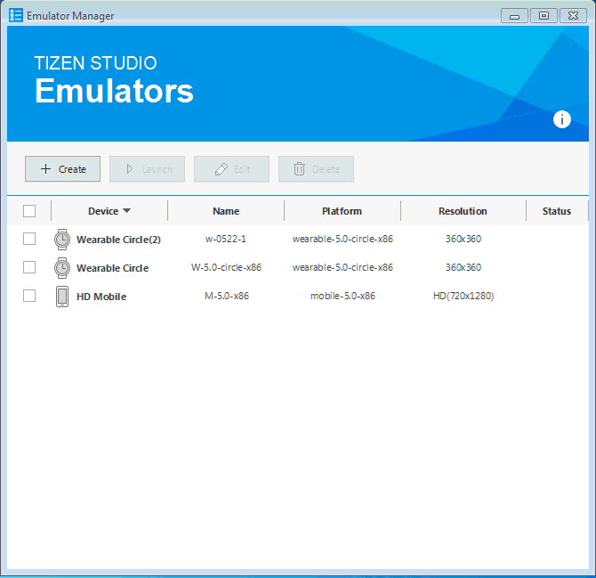
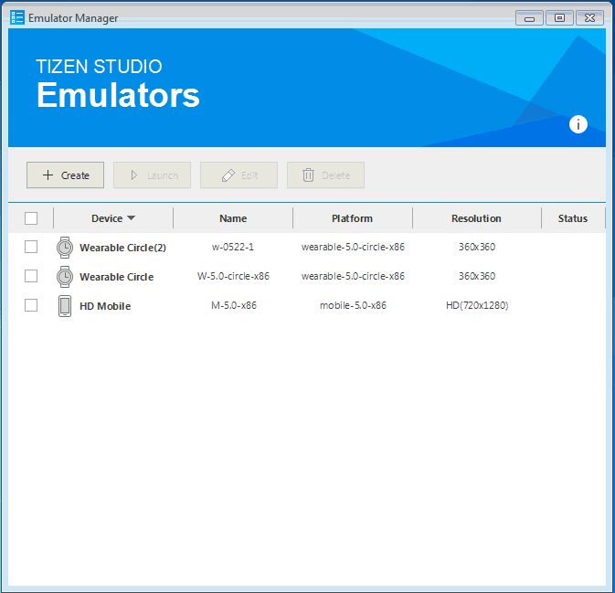
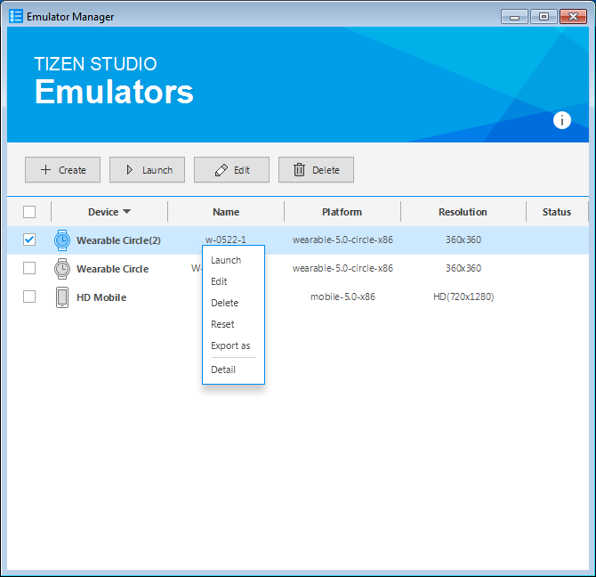

# Emulator Manager

After you have built your application, you need to test the application to ensure quality. To test and debug your application, you can configure a virtual environment before deploying your application. You can use emulators to run and test your application in a virtual environment. Tizen provides an emulator, Tizen Emulator Manager (Emulator Manager). It helps you to test your application in an environment similar to a real device.

Emulator Manager allows you to generate emulator instances from a predefined platform and template. Additionally, it helps you to define and configure settings such as skin, resolution, and hardware devices of your virtual device. 

Emulator Manager helps you to:

- Define a new emulator instance or hardware profile
- Edit an existing emulator instance or hardware profile
- Delete an emulator instance or hardware profile
- Start or stop an emulator instance

This section explains how to use Emulator Manager to run and test your application in a virtual environment:

1. [Launch Emulator Manager](#launch-emulator-manager)
2. [Create emulator instance](#create-emulator-instance)
3. [Manage emulator instance](#manage-emulator-instance)

## Launch Emulator Manager

### Prerequisites

Ensure that you have installed Emulator Manager in Visual Studio. If you have not installed Emulator Manager, see [Visual Studio Tools for Tizen](https://developer.tizen.org/development/visual-studio-tools-tizen/installing-visual-studio-tools-tizen).

>**Note**
>
>Emulator Manager for Visual Studio has the same requirement as Emulator Manager in Tizen Studio. For more information on hardware and software requirements, see [Emulator Requirements](../../tizen-studio/setup/prerequisites.md#emulator).

After installing Emulator Manager from Visual Studio, you can launch it in one of the following ways: 

- In the Visual Studio menu, select **Tools &gt; Tizen &gt; Tizen Emulator Manager**.

     

- In the Visual Studio toolbar, click **Launch Tizen Emulator**.

    

## Create Emulator Instance

While creating an emulator instance, you must have a [platform](#create-platforms) and a [template](#create-templates) with device definitions.
Emulator Manager helps you to select the recommended platform and template to emulate your application. If you need some other device environment, you can create a new one or you can edit an existing emulator instance. You can also create new platforms and templates according to your requirement. 

To create an emulator instance, follow these steps:

1.  In Emulator Manager, click **Create**. 
2.  In the **Emulator Configuration** window that appears, select a system image, and click **Next**.
3.	Select a device definition and click **Next**. 
4.	Define the emulator properties and click **Finish**.

The emulator instance appears in Emulator Manager.

If you want to view the created emulator instance details, right-click the instance and click **Detail**.

> **Note**  
> To run the application faster, switch on CPU VT and GPU. If CPU VT is disabled, see [Increasing the Application Execution Speed](../../tizen-studio/common-tools/emulator.md#speed). If GPU is disabled, install the latest vendor-provided graphic driver.
>
> The mobile emulator supports HD (720x1280) and WVGA (480x800) resolutions.

## Create Platform

To create an emulator, you must first select a platform. You can create, modify, and delete platforms. You can also view the generated platforms. 
Customized platforms can be useful for platform developers. Most application developers may not need a customized platform.

To create a platform, follow these steps:

1. In Emulator Manager, click **Create**.
2. In the **Emulator Configuration** window that appears, click **Add +**.
3. In the **Platform Configuration** dialog box that appears, select a base platform and a platform image file.

    You can create a platform using a **qcow2** or a **raw** format image. 
	  - **qcow2**: A platform image format that is released with Tizen Studio. You can also create a qcow2 image by [exporting an emulator](#export).
      - **raw**: A platform image in the development stage is in raw format. If you launch an emulator with a raw image, you can see the current state of the image. This can be useful for platform developers.

4. To save your configuration, click **OK**. 

   The new platform is added to the list.

You can manage the created platforms:

- To edit a platform, click **Edit** , apply the required changes, and click **OK**. 
    >**Note**
    >
    > You cannot edit the predefined platforms. You can only edit the customized platforms.
- To delete a platform, click **Delete** . 
    >**Note**
    >
    >You cannot delete the predefined platforms. You can only delete the customized platforms. 

## Create Template

Emulator Manager provides several types of device templates. A device template defines the device features such as screen resolution, size, skin, and sensors in the device specification. 

Based on your requirements, you can create templates in one of the following ways:

1. In Emulator Manager, click **Create**.
2. Select a platform and click **Next**.
3. To create a new template:
   - To create a new template from the beginning, follow these steps:
     1. Click **Add +**.
     2. In the **Template configuration** dialog box that appears, define the features for the template.
     3. Click **OK**.

        The new template is added to the list with a settings icon.

   - To create a new template based on an existing one, follow these steps:
     1. Select the template you want to clone.
     2. Click **clone template** .
     3. In the **Template configuration** dialog box that appears, define the features for the template.
     4. Click **OK**.

        The new template is added to the list with a settings icon.

You can manage the created templates:

- To edit a template, click **Edit** , apply the required changes, and click **OK**. 
    >**Note**
    >
    >You cannot edit the predefined templates. You can only edit the customized templates. 
- To delete a template, click **Delete** . 
    >**Note**
    >
    >You cannot delete the predefined templates.You can only delete the customized templates. 

## Manage Emulator Instance

In Emulator Manager, you can launch, edit, delete, reset, and export emulator instances:

1. Launch Emulator Manager.
2. Select an emulator instance from the list.
3. Manage the emulator instance:
    - **Launch**: To launch the emulator instance, click **Launch**.   

	    

        

		>**Note**
		>
		>The debug and launch options are activated after the emulator instance has booted. The name of the emulator instance is displayed on the Visual Studio toolbar.
		
   - **Edit**: To edit an emulator instance, click **Edit**, make the desired changes, and click **Confirm**.

   - **Delete**: To delete an emulator instance, click **Delete**.

   - **Reset**: To reset an emulator instance, right-click it and select **Reset**.

     
   - **Export**: To export an emulator instance, right-click it and select **Export as**. Specify the new image file location.

     When you export the emulator instance, the state of the platform image is replicated.