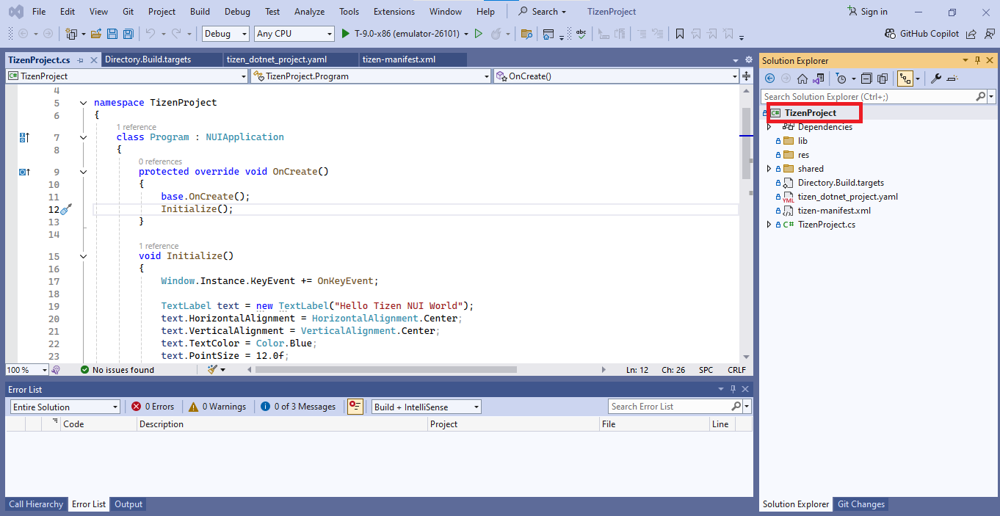
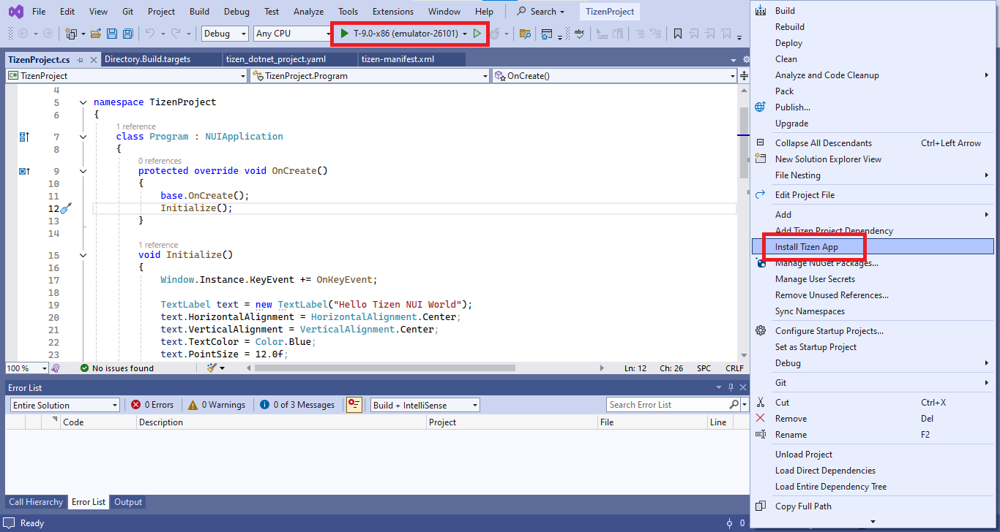
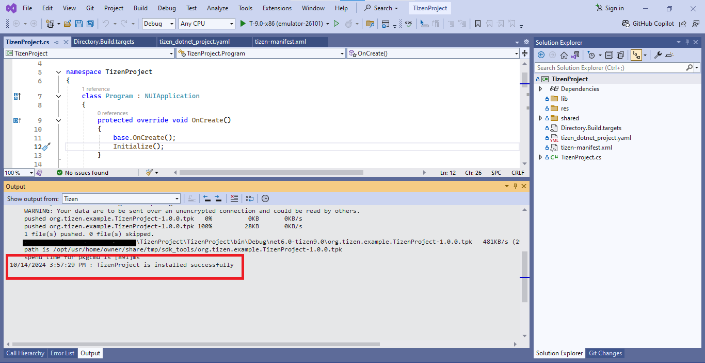

# To Install Tizen Applications via "Install Tizen App" Button
The **Install Tizen App** feature streamlines the process of building and deploying Tizen Applications directly from your development environment. Whether you're working on Tizen .NET Application, Web Application or Native Application, this feature simplifies the installation to selected Emulator with just a click. It supports the installation of .tpk, .rpk, and .wgt package formats.
## Prerequisites
Before using the "Install Tizen App" feature, ensure that you have the following setup:
* **Visual Studio Tools for Tizen installation:** Make sure you have the latest version of [Visual Studio Tools for Tizen](https://marketplace.visualstudio.com/items?itemName=tizen.VSToolsTizen2022) installed on your machine.
* **Configured Emulator:** An Emulator should be selected before you click the **Install Tizen App** button. If no Emulator is selected, the [Emulator Manager](https://docs.tizen.org/application/vstools/tools/emulator-manager/) will open, and prompt you to select an Emulator.
* **Proper Project Structure:**
    For Tizen .NET application, it should include a valid `tizen-manifest.xml` file.
## Step-by-step guide
Follow these steps to build and install your Tizen Application using the **Install Tizen App** button:

1. Right-Click on the **Tizen Project**:
 In the **Solution Explorer** panel of your Visual Studio IDE, locate your Tizen project. Right-click on the project name to open the context menu.

2. Select the **Install Tizen App** button:
 From the context menu, select the **Install Tizen App** option. This action initiates the build and deployment process. The last used Emulator will be chosen automatically. If no Emulator is selected, the [Emulator Manager](https://docs.tizen.org/application/vstools/tools/emulator-manager/) will open, prompting you to select an Emulator.

3. Build and install the App on the Emulator:
 Upon selecting the **Install Tizen App** button, the application will be built and installed in the selected Emulator. You can monitor the build and installation progress in the **Tizen Output** window of your IDE.

## Supported project types
The **Install Tizen App** feature supports various types of Tizen projects and packages. Below are the types of projects and files that are compatible with this feature:
1.	**Project Types**: The supported project types are **Tizen .NET Applications**, **Native Applications**, and **Web Applications**. 
2.	**Button Visibility**: If the Tizen .NET Application does not contain a **Tizen Manifest**, or it is not a Tizen Native or Web application, then the **Install Tizen App** button will not be visible to the user.