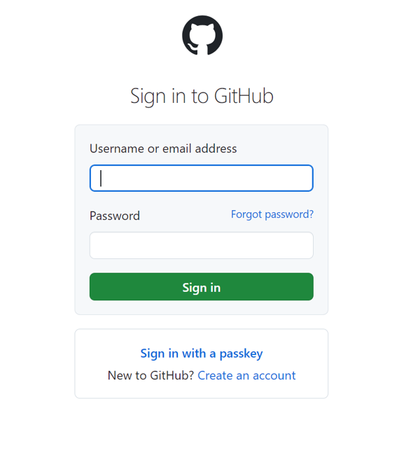

# Report an issue in Visual Studio Tools for Tizen
Reporting an issue is a key feature that enables you to directly report any issue that can occur while using Visual Studio Tools for Tizen platforms. To report an issue, follow these steps:
1. Launch Visual Studio and locate **Tools** on the top menu:

    

2. Select **Tools -> Tizen -> Report an Issue**:

    

3. Then a GitHub page will open in your default browser, where you need to enter your GitHub username or email address and password to Sign in:

    
4.	After signing in, a new page will open. It can be used to report two types of bugs/issues:

    a. **Documentation bug report** - Click on the **“Get started”** button (red rectangle), to report any issue associated with the documentation of VS Tools for Tizen.

    b.	**Platform bug report** - Click on the **“Get started”** button (blue rectangle) below, to report any issue that arises while using VS Tools for Tizen.

    

