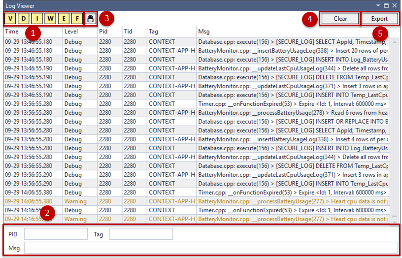

# Log Viewer

When you run an application, the events are logged and are used for debugging or tracing. To organize and display the events logged by the application in an interactive format, certain tools are available. Tizen Log Viewer is one such tool.

Tizen Log Viewer enables you to check your log messages in Visual Studio. This section explains about Tizen Log Viewer and how to:

- [Launch Tizen Log Viewer](#launch-tizen-log-viewer)
- [Manage logs](#manage-logs)

>**Note**
>
> Tizen Log Viewer is same as the [Log View](device-manager.md#logview) in Device Manager. However, Tizen Log Viewer displays the log details within Visual Studio, whereas the Device Manager Log View is a part of the Device Manager window.

Tizen Log Viewer helps you to debug your application. It captures all the events logged by the platform and your application in the same order as they are logged. Additionally, it displays the logs using the dlog logging service. The service consists of the following:

- **dlogutil**: You can see the logs using the `dlogutil` command in the CLI environment.
- **dlog**: You can create the log entries with the dlog library.

Tizen Log Viewer displays a log table consisting of the following fields:

- **Time**: The time when an event is logged.
- **Level**: The level indicates the priority of the log message. **Fatal** is of the highest priority and **Verbose** is of the lowest.
- **Pid**: The process ID of the event.
- **Tid**: The Thread ID of the event.
- **Tag**: The log message source for identification.
- **Msg**: The log message in detail.

## Launch Tizen Log Viewer

In the Visual Studio menu, select **Tools &gt; Tizen &gt; Tizen Log Viewer**.

The **Log Viewer** window appears. 

## Manage Logs

To analyze the events and functions in the application, you can manage the logs. 

The log table consists of the following options and functions:

1.  **Log level filtering**   
    To filter the log messages, use the following log levels:
    - **V**: Verbose
	- **D**: Debug
	- **I**: Info
	- **W**: Warning
	- **E**: Error
	- **F**: Fatal 
2.  **Keyword filtering**   
    To filter the log messages, use the following keywords, **PID**, **Tag**, and **Msg**.  You can either select a keyword or you can enter a keyword in the respective text area available in the Tizen Log Viewer. You must separate the keywords with a space.
3.  **Scroll lock**  
    The log table shows all the latest logs by default. When you run the application, the content in the log table scrolls as new logs are added. To check a specific log when the logs are generated, you can stop the scrolling. 
	To stop scrolling, click .
4.  **Clear**  
    To remove all the log messages from the log tab, click **Clear**. To remove a specific log message, select it and click **Clear**. 
5.  **Export**  
    To export the current log messages and save them as a log file, click **Export** . By default, the file is saved in the **.txt** format.

	
	

