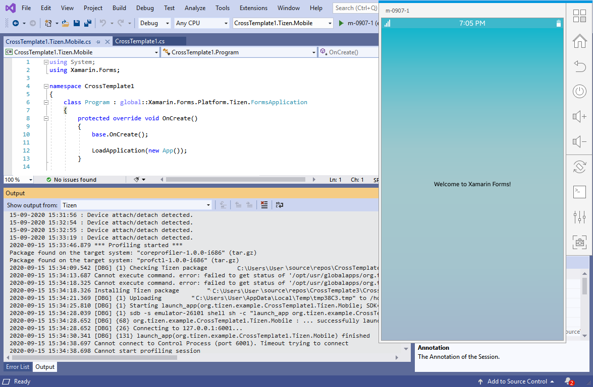

# Get Started with Memory Profiling
### Step 1. Running Memory Profiler
   - In the menu, choose **Tools > Tizen > Profiler > Run Memory Profiler**.

     

   - If no Tizen device is connected and no Tizen emulators are running then Emulator Manager will be started. Please launch the type of emulator you want to use for running and profiling your application. 

     

   - If everything is OK then the application starts as if you run it normally (using Start Debugging in Visual Studio). 

     

   - Output Window will display any information messages (debug, warnings, and so on). 

     

   - The memory profiling data will be displayed with the Memory Profiler GUI after finishing the application or after closing it. The application can be closed by pressing "Home" or "Back" buttons. 

     

   - Also you can display any previous debug session with Session Explorer (In the menu, **Tools > Tizen > Profiler > Session Explorer**).

     

     

### Step 2. Analyzing the results
   - The GUI application provides several views to the memory profiling data. The views include:

       - summary page with information on which process was profiled, its total runtime, some memory related statistics, and so on.
       - bottom-up table tree view of the code locations that allocated memory with their aggregated cost and stack traces
       - caller/callee table
       - top-down table tree view of the code locations
       - managed heap table tree view
       - flame graph visualization (explanation: <http://www.brendangregg.com/FlameGraphs/memoryflamegraphs.html>)
       - consumed memory size over time graph
       - number of instances over time graph
       - number of memory allocations over time graph
       - size of memory allocated over time graph
       - allocation histogram displaying the number of allocations (the total number and the several topmost code locations) belonging to one of the groups divided by allocation size (0 - 8 bytes, 9 - 16 bytes, ... , 512 bytes - 1 KB, more than 1 KB)

#### Managed heap view sample

   

#### Flame graph view sample

   

#### Memory allocations graph view sample

   

#### Allocation histogram view sample

   
