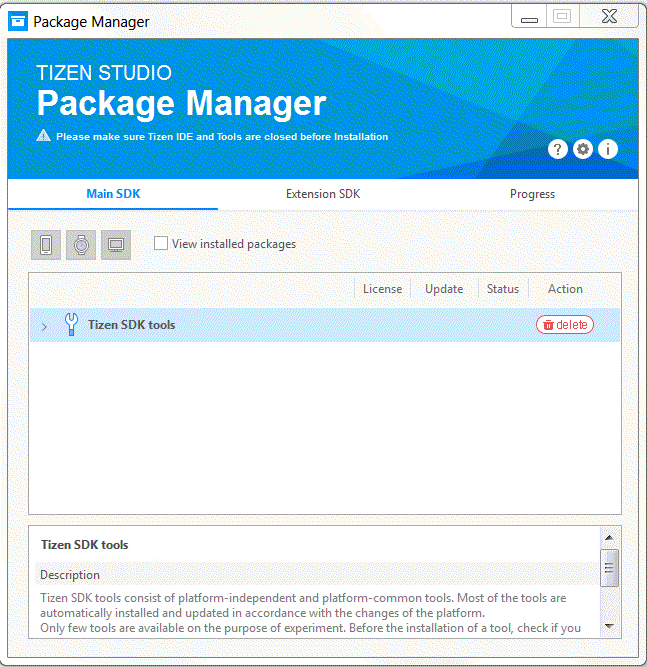

# Package Manager

Tizen platform and tools consist of collections of packages that contain necessary files, metadata, and installation and removal scripts. Each package has multiple dependencies with  other packages. Package Manager offers an easy and simple way to manage platforms and tools without understanding the complicated package dependencies. It is also used to retrieve detailed information of the installed packages on the device. 

To launch Package Manager, in the Visual Studio menu, select **Tools > Tizen > Tizen Package Manager**.

The **Package Manager** window appears:

For more information on Packager Manager, see:

- [Package Manager](../../../application/tizen-studio/setup/update-sdk.md#the-package-manager-is-composed-of-3-areas)
- [Configuring Package Manager](../../../application/tizen-studio/setup/advanced-configuration.md)
