# Get Started with Performance Profiling
## Configuring and running profiling
  - To start profiling select in the menu **Tools > Tizen > Profiler > Run profiler**.

    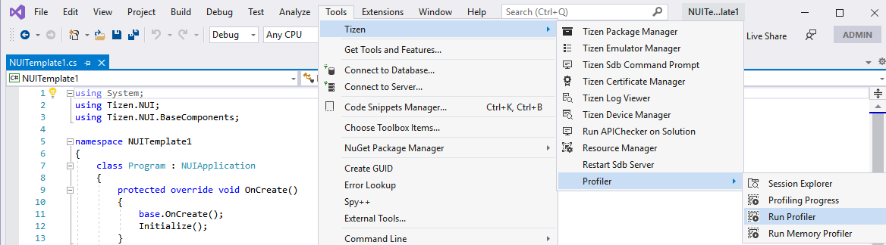

  - **Profiler Setting** window will be opened.
   
    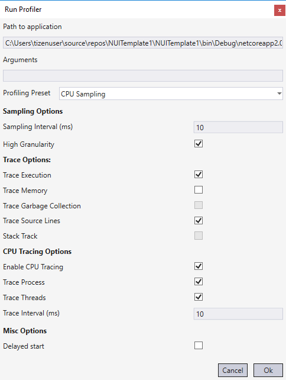

    - **Path to application** will be set up automatically in accordance with the opened Solution.    
    - **Profiling preset** - predefined sets of options for different profiling aspects (CPU, Memory Allocation, Source Lines). The less options are included - the less overhead and less data are collected and processed.

        | Profiling preset | CPU | Memory Allocation | Source Lines |
        | --- | :---: | :---: | :---: |
        | CPU Sampling | + | - | + |
        | Memory Allocation | - | + | + |
        | Complex Profiling | + | + | + |

    - **Options**

        | Option | Description | CPU Sampling | Memory Allocation | Complex Profiling |
        | --- | --- | :---: | :---: | :---: |
        | **Sampling Options** |
        | Sampling Interval | Time interval between samples in miliseconds | 10 | 10 | 10 |
        | High Granularity | Enable high accuracy and saturated samples. If option is disabled, samples will be dumped only on allocation and stack changing events | on | on | on |
        | **Trace Options** |
        | Trace Execution | Enable tracking of information about execution stack changes | on | off | on |
        | Trace Memory | Enable tracking of information about allocations | off | on | on |
        | Trace Garbage Collection | Enable tracking of information about Garbage Collector events | - | on | on |
        | Trace Source Lines | Enable tracking of instruction pointers for samples. Profiler generates information about IL to native code mapping that can be used for matching between IP and source code fragments | on | on | on |
        | Stack Track | Enable tracking of execution stack state for memory allocations | - | off | on |
        | **CPU Tracing Options** |
        | Enable CPU | Enable tracking of CPU usage by process and/or managed threads | on | on | on |
        | Trace Process | Enable tracking of CPU usage by application process | on | on | on |
        | Trace Threads | Enable tracking of CPU usage by application managed threads | on | on | on |
        | Trace Interval | Timeout between CPU usage measurements in milliseconds | 10 | 10 | 10 |
        | **Misc Options** |
        | Delayed start | Delay start of profiling. To start profiling it is need to click **Start** button in the **Profiling Progress** window | off | off | off |

    - Click **Ok** button.
    - **Output** window (highlighted with orange rectanlge, also be sure that window shows output from Tizen (green highlight)) and **Profiling Progress** window (red highlight) will be being shown during profiling.

      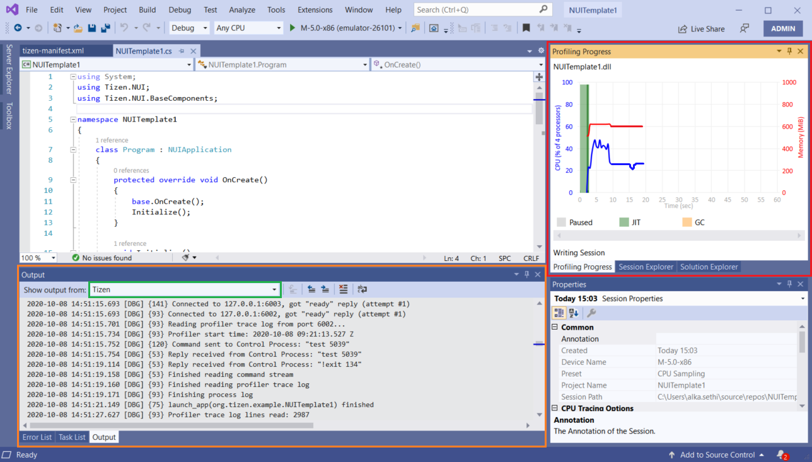

    - To stop profiling click **Stop** button in the **Profiling Progress** window. **Output** window will display information about stopping profiling process.
   
      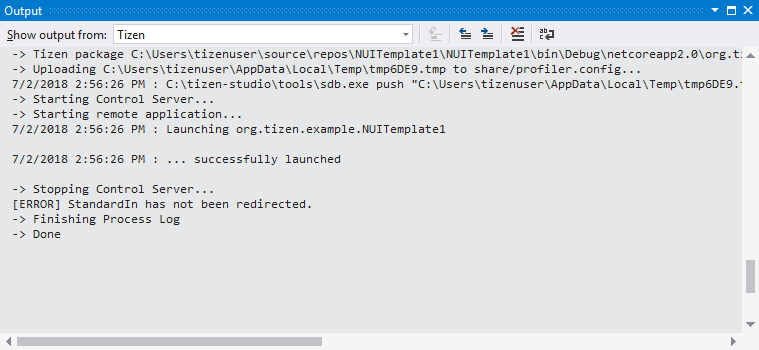

    - In the result session entity will be generated which can be opened and managed via **Session Explorer** window.

## Live profiling
  **Live Profiling** allows to profile an application during debugging.

  - To enable **Live Profiling** the next actions are need:
      - To open **Tizen** options select in the menu **Tools > Options > Tizen > Tools**.
      - Turn on option `Use new debugger when available`.
      - Turn on option `Use Live Profiler on debugging`.

      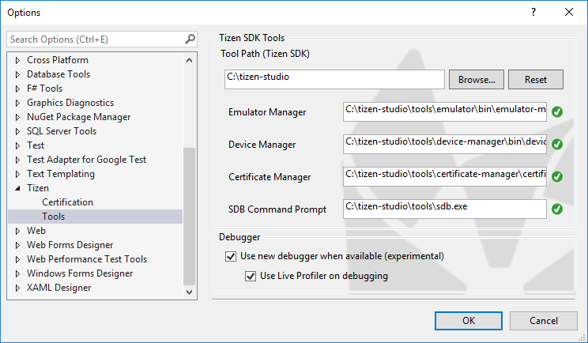

## Profiling Progress window
  The window shows CPU Utilization and Memory consumption by application in the real-time mode.

  

  - On the top right corner buttons **Pause/Resume** and **Stop** are located. But if the profiling was started in the `Delayed` mode instead **Pause/Resume** button **Start** button will be to start profiling.

  - Depends on the profiling options it is possibly to track JIT and GC events in the real-time mode.

    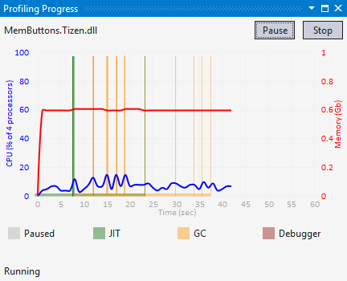

  - In the debug mode the window shows debugger events, for example : when an application was paused by breakpoint or debug pause button.

    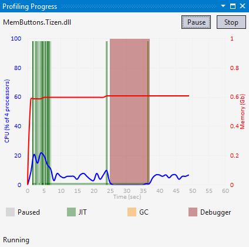
  
  - To pause profiling click **Pause** button.

  - To resume profiling click **Resume** button.

  - To stop profiling click **Stop** button.

  - On the left bottom corner current status is displayed.

## Managing session
  - To open **Session Explorer** window select in the menu **Tools > Tizen > Profiler > Session Explorer**.
   
     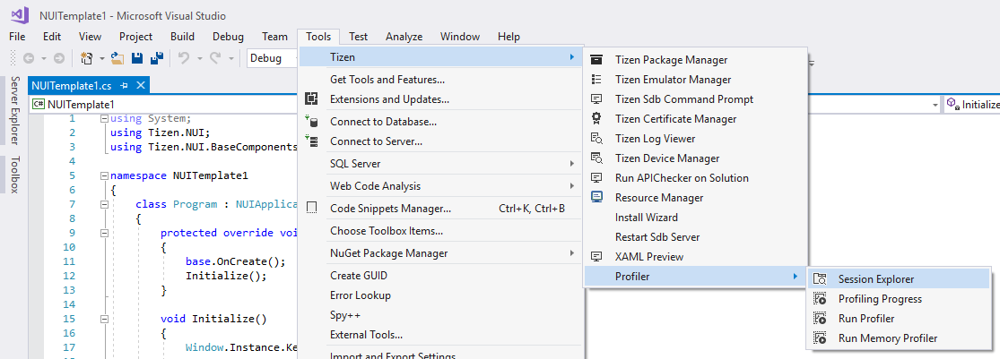

  - **Session Explorer** window contains a list of profiling sessions which have been collected within opened Solution. A list entry which is mapped to the session has the next describing fields:
    - Date - date and time of profiling session.
    - Preset - name of the used Profiling preset to create profiling session.
    - Device - name of the used device for profiling.
    - Project - name of the profilled project.
    - Annotation (optional) - user defined Session annotation.
      
      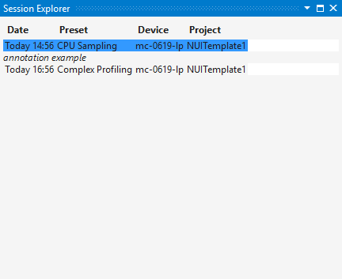

  - Additional session's information is displayed in **Properties** window (usually it is placed below **Session Explorer** window). The window contains information about specific session's parameters that had been used to configure the profiler for that session. Annotation field can be edited in this window.
    
      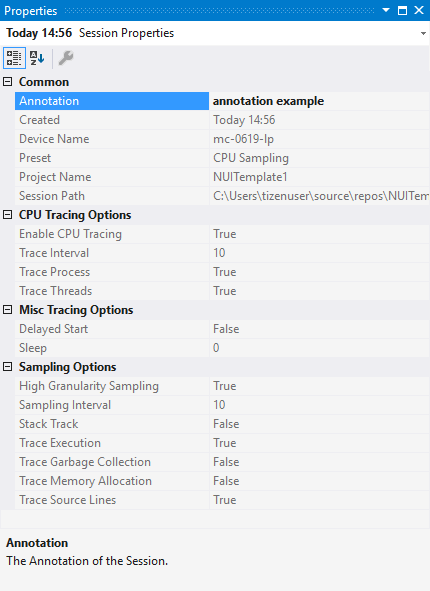

  - To open session double click on the session's entry.
  - To manage session click `Right Mouse Button` on the session's entry.
      
    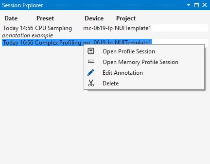

    The next possible operations with session entry are available:
    - Open Profile Session
    - Open Memory Profile Session (availability depends on the session's parameters)
    - Edit Annotation
    - Delete

## Analyzing session data
  Depends on the chosen Profiling preset there are available two types of the session data's viewers:
  - Profile Session viewer - if **CPU Samplings** or **Complex** preset had been chosen.
  - Memory Profile Session viewer - if **Memory Allocation** or **Complex** preset had been chosen.

  If **Complex** preset have been chosen both types of sessions will be available.

### Profile Session viewer

  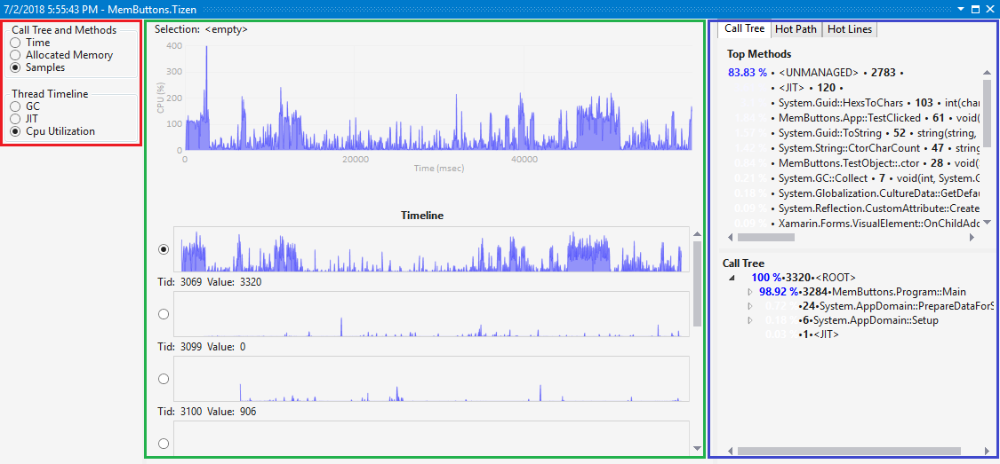

  The window wll be automatically shown during profiling or live profiling.

  To open it manually select in the menu **Tools > Tizen > Profiler > Profiling Progress**.

  The viewer has the next panels:

  - **Filters (red highlight)** - consists of the next types of filters:
    - Call Tree and methods
      - Time
      - Allocated Memory
      - Samples

      Depends on the selected filter **Timeline** and **Methods** panels will be filtered.

    - Thread Timeline
      - GC (Garbage Collection)
      - JIT (Just In Time Compilation)
      - Cpu Utilization
    
      Depends on the selected filter charts in the **Timeline** panel will display appropriate information.

  - **Timeline (green highlight)** - includes the next timeline charts:
    - CPU utilization of the application in the top of the panel.
    
      - Top left corner displays current **Time interval**. By default the application's lifespan is got as **Time interval** and in this case top left corner displays: `Selection: <empty>`; in other case current **Time interval** is shown, for example : `Selection: 21556 : 35899`.
      
        **All panels except Filters depend on the current Time interval.**

        It is possibly to set **Time interval** via mouse: click and drag `Left Mouse Button` to set new **Time interval**.

        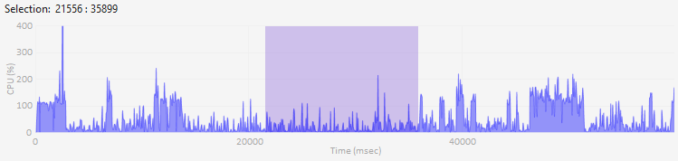

      - The chart can handle `Right Mouse Button`.

        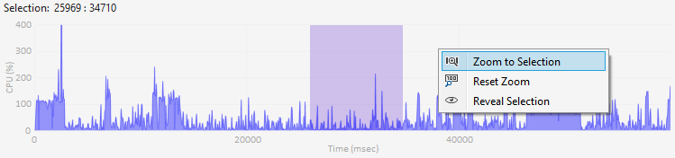

        Timeline Context Menu has next entries:
        - Zoom to Selection
        - Reset Zoom
        - Reveal Selection

      - To reset **Time interval** click outside selected area.

      - To set zoom in/out the combination `ctrl + Whell Up/Down Mouse Button` should bu used.

    - GC, JIT or CPU Utilization for separate threads in the rest part of the panel.
      
      Depends on the current **Call Tree and methods** filter field **Value** on the left below chart shows appropriate inforamtion: Time (for example: `Value: 00.59.920`), Allocated Memory (for example : `Value: 56.36 MB`) or Samples (for example : `Value: 3320`).

      Depends on the current **Thread Timeline** filter charts shows appropriate information.

      - GC

        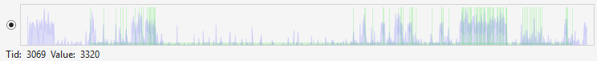

      - JIT

        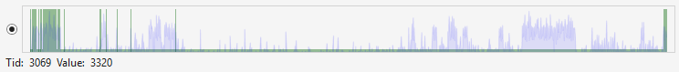

      - CPU Utilization

        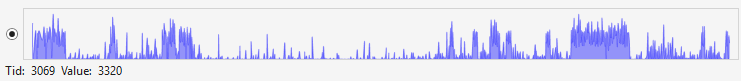

      **Methods panel depends on the selected thread.**

  - **Methods (blue highlight)**

    Panel consists of 3 tabs:
    - Top Methods and Call Tree - displays top methods and call tree by the selected **Call Tree and methods** filter on the selected **Time interval** for the selected thread.

      Each entry includes the next fields splitted by \`**&middot;**\` symbol:
      - Percentage ratio - method's percentage ratio based on the selected **Call Tree and methods** filter between total value and method's value.
      - Name of a method.
      - Absolute value - depends on the selected **Call Tree and methods** filter shows the next information:
        - Time - shows how much time method has occupied.
        - Allocated Memory - shows an amount of memory allocations within method (in `Kb` or `Mb`).
        - Samples - shows amount of samples within method.
      - Signature of a method (optional).

    - Hot Path - displays hot path by the selected **Call Tree and methods** filter on the selected **Time interval** for the selected thread. In the collapsed state the **Hot Path** tab displays the hottest method. In the  expanded state the **Hot Path** tab displays the whole path from this method to the root method.
         
      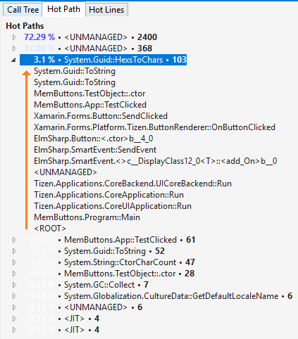

      Each entry includes the next fields splitted by \`**&middot;**\` symbol:
      - Percentage ratio - method's percentage ratio based on the selected **Call Tree and methods** filter between total value and method's value.
      - Name of a method.
      - Absolute value - depends on the selected **Call Tree and methods** filter shows the next information:
        - Time - shows how much time method has occupied.
        - Allocated Memory - shows an amount of memory allocations within method (in `Kb` or `Mb`).
        - Samples - shows amount of samples within method.
         

### Memory Profile Session viewer

  The viewer has 4 tabs:

  - **Heap Profile** - shows heap information during application's lifespan.

    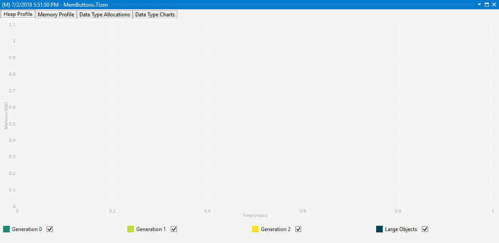

    The chart has 4 types of the optional curves:
    - Generation 0 - the youngest generation and contains short-lived objects. An example of a short-lived object is a temporary variable. Garbage collection occurs most frequently in this generation. 
    - Generation 1 - the generation contains short-lived objects and serves as a buffer between short-lived objects and long-lived objects.
    - Generation 2 - the generation contains long-lived objects. An example of a long-lived object is an object in a server application that contains static data that is live for the duration of the process.
    - Large Objects - contains very large objects that are 85,000 bytes and larger.

    For more information, see, [here](https://docs.microsoft.com/dotnet/standard/garbage-collection/fundamentals).

  - **Memory Profile** - shows dynamic memory information during application's lifespan.

    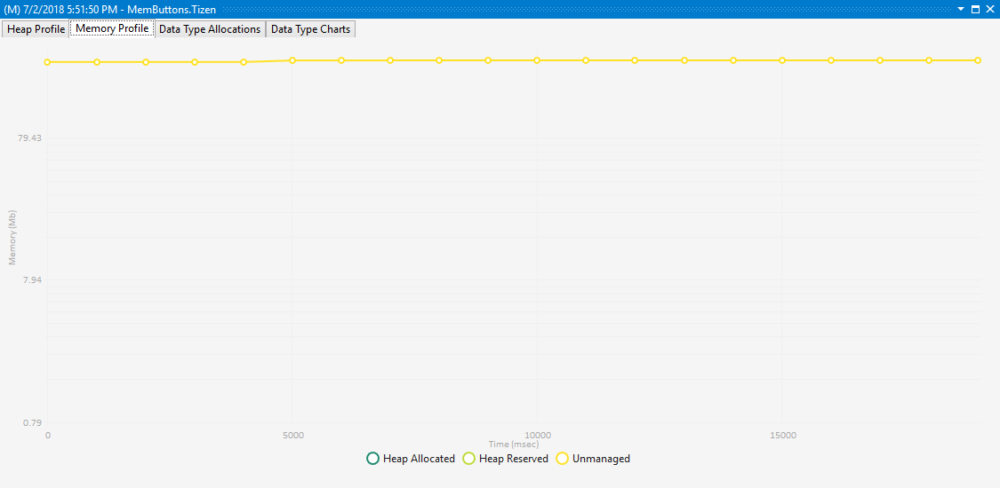

    The chart has 3 types of the curves:
    - Heap Allocated - allocated dynamic memory for objects.
    - Heap Reserved - reserved dynamic memory for allocations.
    - Unmanaged - total dynamic memory which application consumes.

  - **Data Type Allocations** - shows information about all allocations during application's lifespan.

    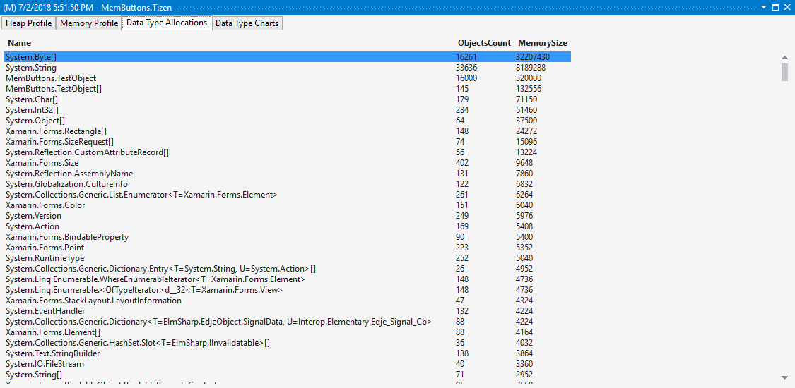

    There is list of all memory allocations. A list entry has the next fields:
    - Name - name of the data type.
    - Objects Count - number of the allocated objects.
    - Memory Size - total of allocated memory of the appropriate data type.

  - **Data Type Charts** - shows detailed information about all allocations during application's lifespan.

    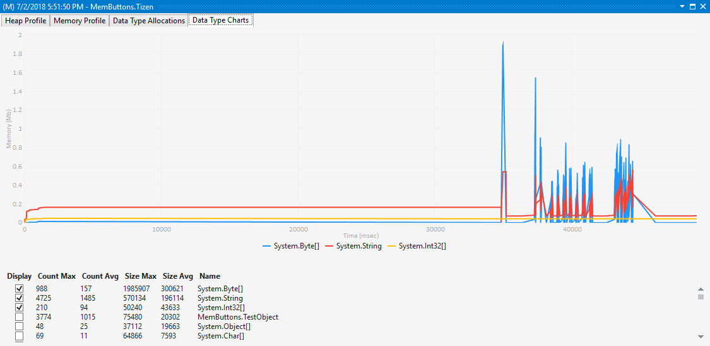

    The tab has two areas:
    - Chart - represents allocated memory by data type during application's lifespan.
    - List of the allocations - list of all allocations which can be represented in the chart. A list entry has the next fields:
      - Display - represent appropriate entry in the chart or not.
      - Count Max - max number of the allocated objects at once.
      - Count Avg - average number of the allocated objects.
      - Size Max - max size of the allocated memory at once.
      - Size Avg - average size of the allocated memory.
      - Name - name of the data type.
