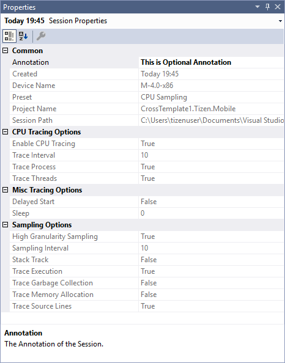

# Profiler

The profiler allows you to analyze the performance of your application. You can record, manage, and view profiling sessions.

## Recording Profiling Sessions

To record a profiling session:
1. In the Visual Studio menu, select **Tools &gt; Tizen &gt; Profiler &gt; Run Profiler**.  
  The profiler configuration dialog opens.

2. Define the profiling options.  
    
    - **Path to application** is automatically filled with the information for the current solution.
    - **Profiling Preset**  
    You can select from the following predefined profiling configurations:
      - **CPU Sampling**  
        Trace CPU and source lines, but not memory allocation.
      - **Memory Allocation**  
        Trace memory allocation and source lines, but not CPU.
      - **Complex Profiling**  
        Trace CPU, source lines, and memory allocation.
    - **Sampling Options**  
    You can set the following sampling options:
      - **Sampling Interval**  
        You can set the sampling time interval, in milliseconds. The default is 10 ms.
      - **High Granularity**  
        You can switch on high-granularity sampling. It enables better precision and sample regularity, at the cost of efficiency.
    - **Trace Options**  
    You can set the following trace options:
      - **Trace Execution**  
        You can trace CPU utilization.
      - **Trace Memory**  
        You can trace memory allocation for methods.
      - **Trace Garbage Collection**  
        You can trace garbage collection.
      - **Trace Source Lines**  
        You can switch on line source mapping.
      - **Stack Track**  
        You can enable a hybrid trace, which registers stack changes on memory allocation.
    - **CPU Tracing Options**  
    You can set the following CPU tracing options:
      - **Enable CPU Tracing**  
        You can switch on the CPU tracing features.
      - **Trace Process**  
        You can trace the application's CPU utilization.
      - **Trace Threads**  
        You can trace each processing thread's CPU utilization.
      - **Trace Interval (ms)**  
        You can set the sampling time interval, in milliseconds.
    - **Misc Options**  
    You can set the following additional option:
      - **Delayed start**  
        You can delay the application startup.

3. To start the profiling session, click **OK**.  
    The application is installed and launches on the emulator.  
    The **Output** panel displays the installation log, including any errors.  
    

    The **Profiling Progress** panel shows live CPU and memory usage information.  
    

4. To pause and resume profiling, in the **Profiling Progress** panel, click **Pause** and **Resume**.  
    The chart in the **Profiling Progress** panel uses a light-blue background to distinguish the time period when profiling is paused.  

5. To stop profiling, click **Stop**.  
The application is terminated and the profiling data is retrieved from the emulator.

   

## Managing Profiling Sessions

To manage the recorded profiling sessions:
1. In the Visual Studio menu, select **Tools &gt; Tizen &gt; Profiler &gt; Session Explorer**.  

   The **Session Explorer** panel opens. It lists the profiling sessions collected from the current solution.  
     

2. You can add a user-defined annotation to a session to, for example, identify what was tested during that session.  
   To add an annotation:
   1. In the **Session Explorer**, right-click the session and select **Edit Annotation**.  
      
   2. Enter the annotation text, and click **Ok**.  
      

3. To view the session properties, click the session in the **Session Explorer**.  
   The **Properties** panel (below the **Session Explorer** panel by default) displays additional information about the session, such as the profiling options used for the session.  
   

4. To delete a session, in the **Session Explorer**, right-click the session and select **Delete**.

## Viewing Profiling Sessions

To view a profiling session, in the **Session Explorer**, double-click on the session you want to view.  
A session view opens, consisting of 3 panels:

- Filters panel on the left
- Timeline panel in the center
- Methods panel on the right
  
**Figure: Session view**  

### Filters Panel

You can filter the profiling data by selecting from the following options:
  - **Call Tree and Methods** filters define which information is displayed in the methods panel:  
    - **Time** shows how much time each method has occupied.
    - **Allocated Memory** shows how much memory was allocated for each method.
    - **Samples** shows the number of samples for each method.
  - **Thread Timeline** filters define which information is displayed in the timeline panel.  
  You can display **GC** (garbage collection), **JIT** (just-in-time compilation), or **Cpu Utilization**.

### Timeline Panel

The timeline panel consists of 2 parts:
- The upper part of the panel shows the overall CPU utilization chart.

  

- The lower part of the panel shows GC, JIT or CPU utilization charts for each thread, depending on the selected filter.

  

You can select a specific time interval on the timeline, to view the detailed method data for it.  
To select a time interval:
  1. Highlight the interval you want to view in the upper part of the timeline panel.  
    
  The methods panel shows data for the selected interval.
  2. To clear the selected interval, click anywhere in the timeline chart.

### Methods Panel

The criteria for the data shown in the methods panel depends on the selected filter. The following figure shows examples of the data displayed in the methods panel.  

**Figure: Method filters**  

The methods panel consists of 3 tabs:

  - The **Call Tree** tab displays the **Top Methods** and **Call Tree** for the selected thread and time interval.  
  

  - The **Hot Path** tab displays the hottest paths for the selected thread and time interval.  
    
  The list displays the hottest methods. To view the call path from the method to its root, expand the list item.

  - The **Hot Lines** tab displays the top source lines for the selected thread and time interval.  The source line numbers are shown in brackets (**[ ]**).  
  
  
    To show a "hot line" entry in its source code context, double-click the method in the **Hot Lines** tab. The code line is highlighted with a color intensity corresponding to its hotness.  
    **Figure: "Hot line" in context**  
    
