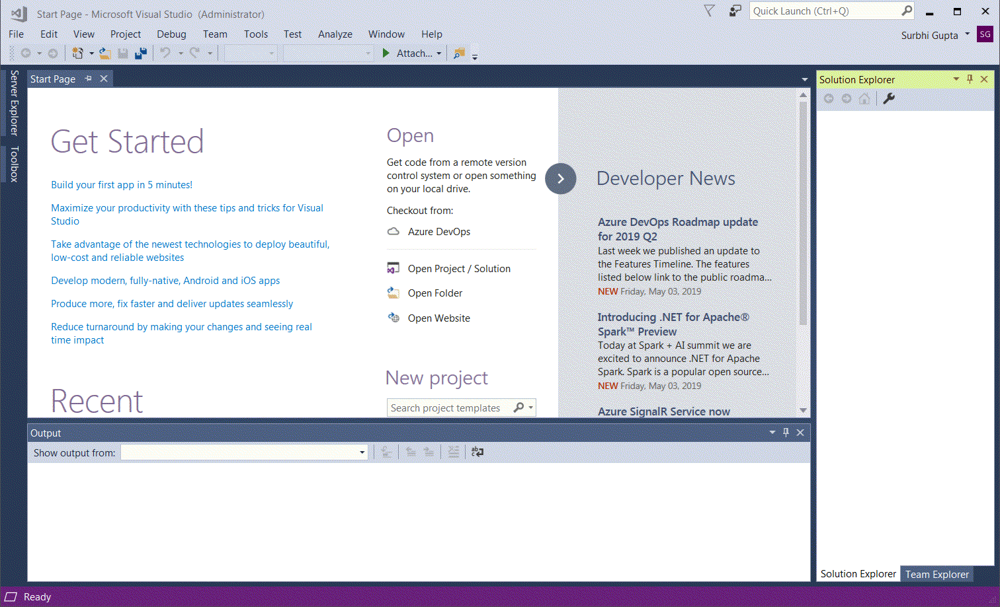

# Project Wizard

You can use Project Wizard to create Tizen .NET application projects. In Project Wizard, you can select a template and a profile to create the project. Aditionally, you can set the basic project properties, such as the project name, package name, location, and so on.

The Project Wizard provides the following project templates using which you can start a Tizen .NET application project:

Template | Description | Supported Tizen Versions
-------- | ----------- | ------------------------
**Blank App (ElmSharp-Beta)** | To create applications using the ElmSharp APIs. | 4.0 and 5.0
**Blank App (Tizen.NUI)** | To create applications using the Natural User Interface (NUI) toolkit. | 4.0 and 5.0
**Blank App (Xamarin.Forms)** | To create applications with Xamarin.Forms for multiple profiles. | 4.0 and 5.0
**Class Library (.NET Standard)** | To create .NET standard class library for Tizen. | 4.0 and 5.0
**Service App** | To create service applications for the Tizen platform. | 4.0 and 5.0
**Tizen OpenTK App** | To create applications using the Open Toolkit library. | 5.0
**Tizen Watchface App** | To create Watchface applications for wearable devices. | 4.0 and 5.0
**Tizen Wearable App** | To create applications for wearable devices. | 4.0 and 5.0
**Tizen Wearable Xaml App** | To create Tizen XAML applications for wearable devices. | 4.0 and 5.0
**Tizen XAML App (Xamarin.Forms)** | To create XAML applications using Xamarin.Forms for multiple profiles. | 4.0 and 5.0
**UI Test APP** | To create automated UI test applications for Tizen. | 4.0 and 5.0

You can navigate to the Project Wizard templates:

## Create New Project

When you create a new project with a specific template, the Project Wizard automatically creates the basic functionalities for the application based on the selected template. It also creates the default project files and folders.

To create a Tizen .NET application project:

1. In the Visual Studio menu, select **File &gt; New &gt; Project**. The **New Project Window** appears. 
2. Select **Installed &gt; Visual C#**. 
3. Select one of the available Tizen versions, **Tizen 4.0** or **Tizen 5.0** based on your requirement.
4. Select one of the available templates for your project. For example, **Tizen 5.0 > Blank App (Xamarin.Forms)**.
5. Set the basic project properties:
    - **Name**: Name of the project.
    - **Location**: Location of the local repository in your computer. Aditionally, you can also **Browse** for the local repository.
    - **Solution name**: The name of the solution file for the project. This option is enabled only if you select **Create directory for solution**.
    - **Create directory for solution**: Select this option to create a directory where the solution file will be automatically saved.
    - **Create new Git repository**: Select this option to create a new Git repository for your project.
6. Click **OK**. The **New Project Window** appears.
7. Select the profiles for which you want to create a solution, and click **OK**.

     

    The following figure shows a new .NET application project solution that contains Mobile, TV, and Wearable profiles:

    

The new project is created:

