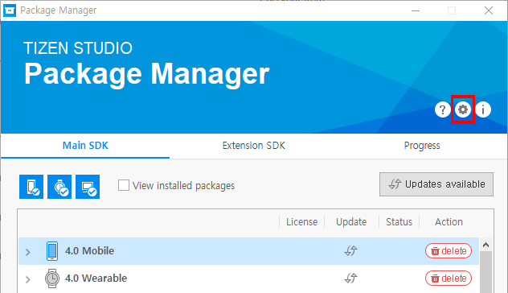
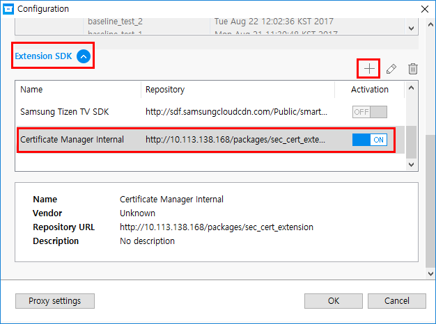
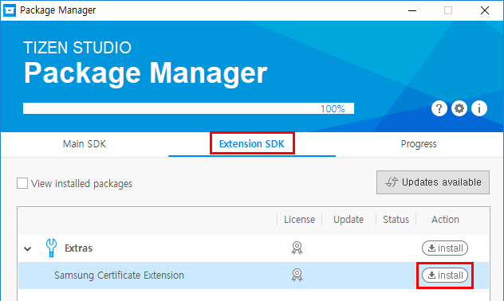
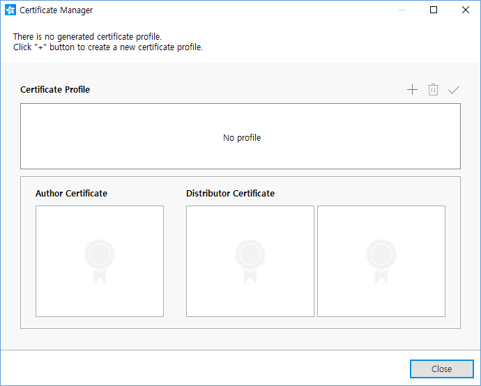

# Samsung Certificates
Before installing your application on a device, it must be signed with a certificate profile. The signature verifies the source of the application and makes sure it has not been tampered with since its publication.

## Installing the Samsung Certificate Extension

To install the Samsung Certificate Extension:

1. In the Visual Studio menu, select **Tools &gt; Tizen &gt; Tizen Package Manager**.  
2. Configure the repository server (during development stage only):
    1. In the **Package Manager** window, open the **Configuration** window by clicking the gear icon.  
    
    1. In the **Configuration** window, scroll down to the **Extension SDK** panel, or click **Extension SDK** to unfold it.  
    
    1. To open the **Add Repository** dialog box, click **+** above the repository information table.
    1. Enter a name for the repository, and in the **Repository** field, enter the following address: 
        > `http://10.113.138.168/packages/sec_cert_extension`
    1. Click **OK**.  
    The repository information is added to the table in the **Configuration** window.  
        
    1. Click **OK** to confirm.
3. Install the extension:  
   In the **Package Manager**, select the **Extension SDK** tab and click **install** next to **Samsung Certificate Extension**.  
   

## Creating Samsung Certificate Profiles

To create a Samsung Certificate profile:

1. In the Visual Studio menu, select **Tools &gt; Tizen &gt; Tizen Certificate Manager**.  

2. Click **+** to create a new certificate profile.  
   

3. Click **Samsung**.  
    

4. Enter the required information to create the certificate profile.  The process is similar to [creating a Tizen certificate profile](certificate-manager.md#creating-a-certificate-profile).  
    You must sign in with your Samsung Developer account, and enter the device ID (DUID) for each of your target devices.

## Selecting the Certificate Profile

To select the certificates used to package your application (to set the certificate active):

1. In the Visual Studio menu, go to **Tools &gt; Options &gt; Tizen &gt; Certification**.
2. Check the **Sign the .TPK file using the following option.** checkbox, and select **Use profile of Tizen Certificate Manager** from the drop-down list.
3. Make sure that your Samsung certificate profile is selected in the **Profile** drop-down list.  

4. Click **OK**.

## Allowing Application Installation
When using a version 1.0 distributor certificate, before you can test your application on an emulator or target device, you must push the `device_profiler.xml` file to it.

> **Note**
>
> Make sure that the DUID for your target device was entered during the [certificate creation process](#creating-samsung-certificate-profiles).

To allow applications to be installed on a target device:
1. In the Visual Studio menu, select **Tools &gt; Tizen &gt; Tizen Device Manager**.
2. Launch the emulator or connect the target device to your computer.  

3. Select the emulator or device from the list.
4. Right-click the **File Explorer** view, and select **Permit to install applications**.  
  
    The `device_profiler.xml` file is pushed to the device.  
    