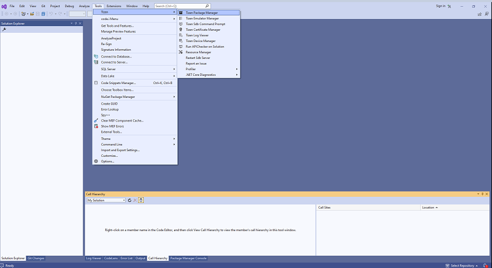
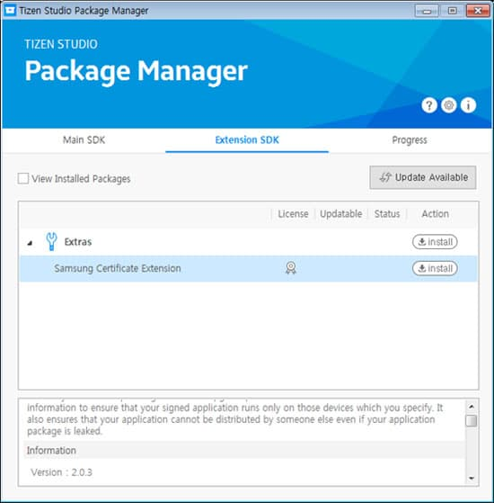
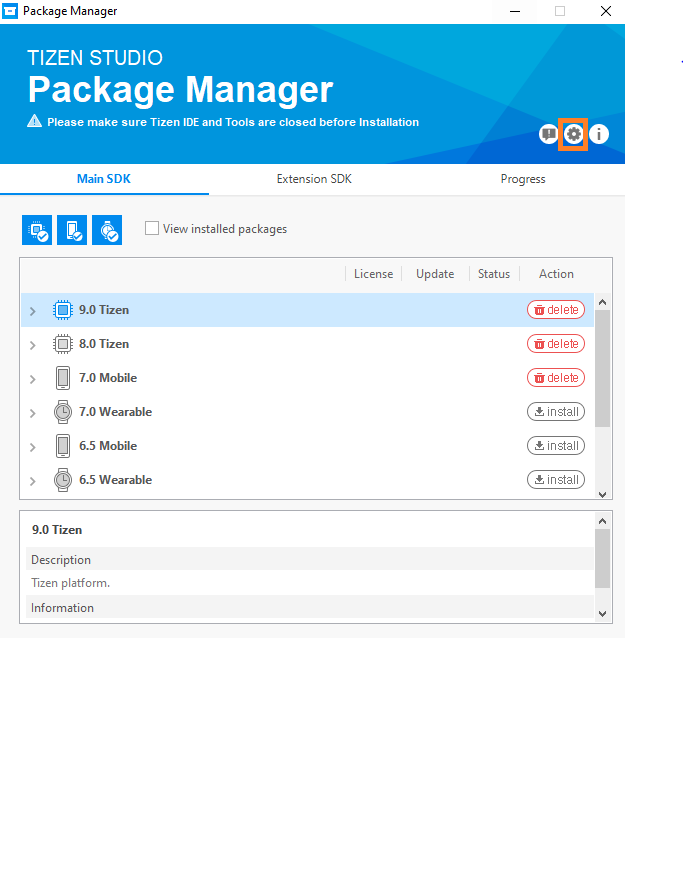
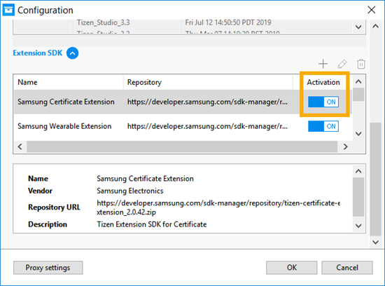

# Install Samsung Smart TV and Certificate Extensions

## Install Samsung Smart TV Extension
The Samsung Smart TV Extension allows developers to create applications for Samsung Smart TVs and emulate them for testing purposes.
It is an add-on SDK, which is installed using the Tizen Package Manager.

To install the Samsung Smart TV Extension, follow these steps:

1. In the Visual Studio menu, select **Tools > Tizen > Tizen Package Manager**.
2. In the **Tizen Package Manager** window that appears, select Extension SDK.
The list of available extensions appears.
3. Select **TV Extensions** from the list and click **Install**.

The video below shows how to install the Samsung Smart TV Extension:

<video controls="" height="400">
  <source src="media/vs-install-tv-extension.mp4" type="video/mp4">
</video>

## Install Samsung Certificate Extension
Samsung Certificate Extension provides functionalities to get and register certificates for Samsung commercial devices. It is an add-on SDK which could be installed using Package Manager. For opening package manager, in the Visual Studio menu, select **Tools > Tizen > Tizen Package Manager**. 

In the Extension SDK tab you can find the list of available extensions. The version of the extension is described in the lower window.

### Verify the Samsung Certificate Extension SDK is enabled

The Samsung Certificate Extension SDK is automatically enabled after installation. However, sometimes this may not happen and you must enable it manually.

1. From the Package Manager, click the gear icon, located in the upper right corner.

2. Locate Extension SDK, click to open, and verify that the Samsung Certificate Extension SDK is enabled.

