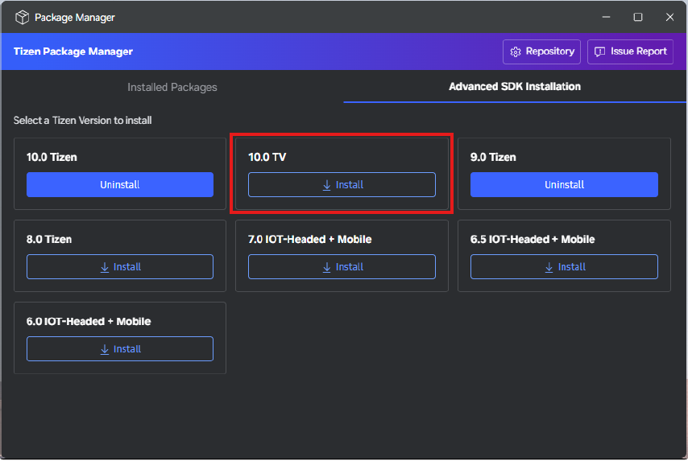

# Install Samsung Smart TV Extension

The Samsung Smart TV Extension allows developers to create applications for Samsung Smart TVs and emulate them for testing purposes.
It is an add-on SDK, which is installed using the Tizen Package Manager.

To install the Samsung Smart TV Extension, follow these steps:

1. In the Visual Studio menu, select **Tools > Tizen > Tizen Package Manager**.
2. Select **Advanced SDK Installation**.
3. Select **Install** next to the available tv version that you need.

