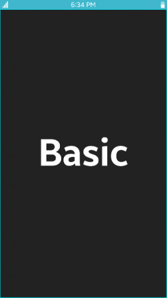
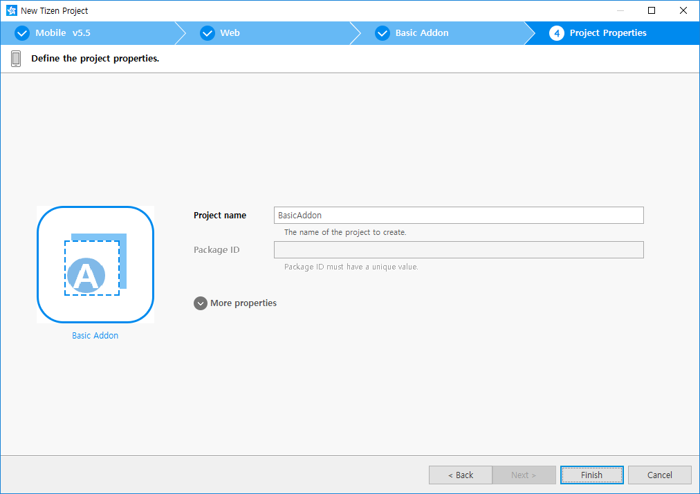
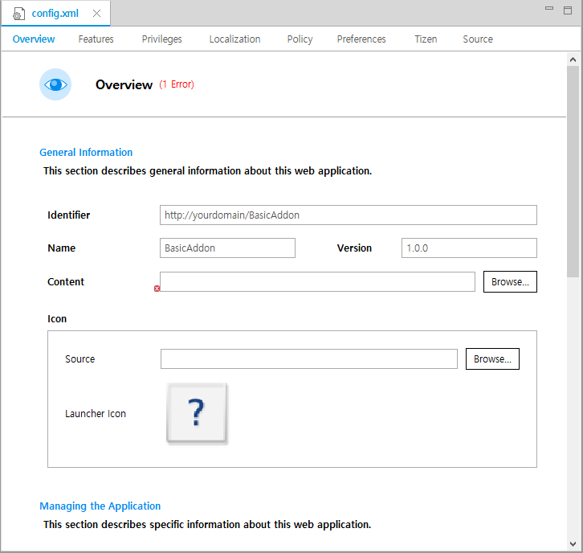
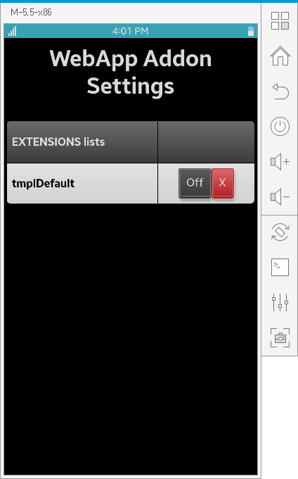
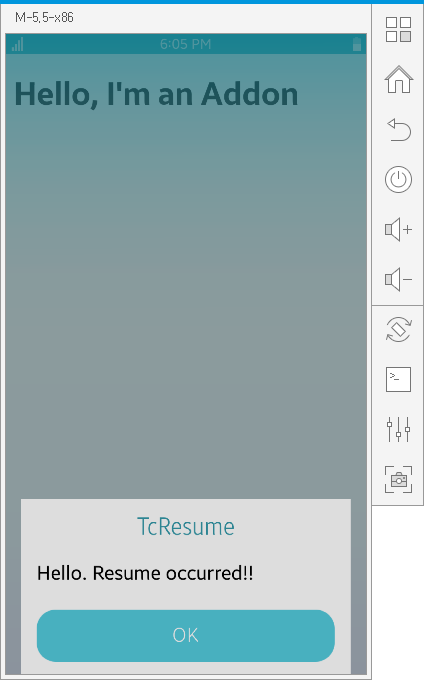

# Create Your First Tizen Web Application Addon

**Welcome to Tizen Web Application Addon development!**

An addon is a JavaScript snippet with a manifest file that allows additional common functionalities such as pop-up to Web applications.

Study the following instructions to help familiarize yourself with the Tizen [Web application development process](../../tutorials/process/app-dev-process.md) as well as using Tizen Studio and installing the created application on the emulator or target device. The addon is not a Web application, but it is very similar to the Web application in the developing process. With the following instructions, you can create and run a basic addon, which gets timings of various application life-cycle:

1.  Before you get started with developing Tizen addons, download and install [Tizen Studio](../../../tizen-studio/index.md).

    For more information on the installation process, see the [installation guide](../../../tizen-studio/setup/install-sdk.md).

2.  [Create an addon project](#create) using Tizen Studio.

    This step shows how you can use a predesigned project template that creates all the basic files and folders required for your project.

3.  [Build the addon](#build).

    After you have implemented code for the features you want, this step shows how you can build the addon to validate and compile the code.

4.  [Run the addon](#run).

    This step shows how you can run the addon on the emulator or a real target device.

5.  [Design a UI](#ui).

    This step shows how you can create the addon UI and make small alterations to it to improve the usability of your addon.

When you are developing a more complex addon, you can take advantage of the [Web tools included in Tizen Studio](../../../tizen-studio/web-tools/index.md) to ease the tasks of creating functionality and designing the addon UI.

<a name="create"></a>
## Create project

The following example shows you how to create and configure a basic addon project in Tizen Studio. An addon project contains all the files that are required to create an addon. Addon has a characteristic of dependent invocation unlike the Web applications. This implies that you can create an addon but you cannot run it solely. You must have Web applications to run the addons. In this section, we select **Tizen Basic UI Web Application**. For more information on Web application, see [Create Your First Tizen Mobile Web Application](../mobile/first-app.md).

**Figure: Basic UI Web Application**



To create the addon project:

1.  Launch Tizen Studio.

2.  In the Tizen Studio menu, select **File \> New \> Tizen Project**.

    

    The Project Wizard opens.

3.  In the Project Wizard, define the project details.

    The Project Wizard is used to create the basic addon skeleton with the required folder structure and mandatory files. You can easily create different addons by selecting an applicable template or sample for the Project Wizard to use.

    1.  Select the **Template** project type and click **Next**.

        

    2.  Select the profile (**Mobile**) and version from a drop-down list and click **Next**.

        The version depends on the platform version you have installed and with which you are developing the addon.

        

    3.  Select the **Web Application** application type and click **Next**.

        

    4.  Select the **Basic Addon** template and click **Next**.

        

    5.  Define the project properties and click **Finish**.

        You can enter the project name (3-50 characters) and the unique package ID. You can also select the location and working sets by clicking **More properties**.

        

        The Project Wizard sets up the project, creates the addon files using the default content from the template, and closes. For more information on the Project Wizard and the available templates, see [Creating Tizen Projects with Tizen Project Wizard](../../../tizen-studio/web-tools/project-wizard.md).

You can see the created project in the **Project Explorer** view. The most important files and folders include:

-   `shared/res`: Folder for addon files including the manifest file and JavaScript files.

-   **config.xml**: Addon configuration file used by the platform to install and launch the addon.

**Figure: Addon in the Project Explorer**


> [!NOTE]
> You can [view and modify the addon configuration](#configuration) in the addon configuration editor. In this example, no configuration changes are required.

Your addon project is now ready for further actions. Next, build the addon.

<a name="configuration"></a>
### Manage addon configuration

To view and modify the addon configuration:

1.  In the **Project Explorer** view, double-click the **config.xml** file of the addon. Tizen Studio opens the file in the addon configuration editor.

2.  In the configuration editor, view and modify the configuration details using the various tabs:

    
    > [!NOTE]
    > The **config.xml** file must conform to both the XML file format and the W3C specification requirements. Editing the file in the **Source** tab is intended for advanced users only.  
    > You can see an error in the preceding image of step 2. However, it does not affect on this process because **Content** is not used for addons.

    -   **Overview**: Define general information, such as the name and icon of the addon.

    -   **Features**: Define required software and hardware features. This information is used for addon filtering in Tizen Store.

    -   **Privileges**: Define the security-sensitive APIs or API groups accessed and used by the addon.

    -   **Localization**: Define localized values for the addon name, description, and license.

    -   **Policy**: Request network resource permissions to access external network resources.

    -   **Preferences**: Define name-value pairs that can be set or retrieved through the addon.

    -   **Tizen**: Edit the Tizen schema extension properties of the addon.

    -   **Source**: View and edit the source code of the **config.xml** file. Changes made and saved on the other tabs are reflected in the source code and vice versa.

3.  To save any changes, in the Tizen Studio menu, select **File \> Save All**.

For more information on configuring the addon, see [Setting the Web Application Configuration](../../tutorials/process/setting-properties.md#set_widget).

<a name="build"></a>
## Build your addon package

After you have created the addon project, you can implement the required features. In this example, only the default features from the project template are used, and no code changes are required.

When your addon code is ready, you must build the addon package. The building process performs a validation check and compiles your JavaScript and CSS files.

To build a signed package, right-click the project in the **Project Explorer** view and select **Build Signed Project**.

**Figure: Building the addon**


After you have built the addon, run it.

<a name="run"></a>
## Run your addon

You can run the addon on the [emulator](../../tutorials/process/run-debug-app.md#emulator) or a [real target device](../../tutorials/process/run-debug-app.md#target).

<a name="emulator"></a>
### Run on emulator

To run the addon on the emulator:

1.  Launch an emulator instance in [Emulator Manager](../../../tizen-studio/common-tools/emulator-manager.md):
    1. In the Tizen Studio menu, select **Tools \> Emulator Manager**.

        

    2.  In Emulator Manager, select a mobile emulator from the list and click **Launch**.

        If no applicable emulator instance exists, [create a new one](../../../tizen-studio/common-tools/emulator-manager.md#create).

        

        The emulator is launched in its own window. You can also see the new emulator instance and its folder structure in **Device Manager**.

        

2.  Generate a security profile.

    Before you run the addon, you must [sign your addon package with a certificate profile](../../../tizen-studio/common-tools/certificate-registration.md) in Tizen Studio.
   
3.  Run the addon: <a name="run-addon"></a>
    
    As mentioned, addons run as part of Web applications. Therefore, you cannot run them independently.

    1. In the **Project Explorer** view, right-click the project and select **Run As \> Tizen Web Application**.

        

        Alternatively, you can also select the project in the **Project Explorer** view and do one of the following:

        -   Press the **Ctrl + F11** key.
        -   Click the run icon in the toolbar.

        If you have created multiple emulator instances, select the instance you want from the combo box in the toolbar before selecting to run the application. If you select an offline emulator, it is automatically launched when you select to run the application.

        

    2.  In the error dialog that appears, to launch the application on the emulator, click **OK**.

        

        The **WebApp Addon Setting** icon appears in the emulator.

        

        When you run the application, you can see that the `tmplDefault` addon is installed.

        

    3.  Now, you can run Basic UI Web application by following the [instructions](../mobile/first-app.md#emulator).
        
        > [!NOTE]
        > You will find nothing different from running the Web application without the addon because there is no visible change in UI. You can make a change on UI later.

For more information on using the emulator features, see [Using Emulator Control Keys, Menu, and Panel](../../../tizen-studio/common-tools/emulator-control-panel.md) and [Using Extended Emulator Features](../../../tizen-studio/common-tools/emulator-features.md).

<a name="target"></a>
### Run on target device

To run the application on a target device, you can follow the steps similar for the emulator. For more information, see [running Basic UI Web application in a target device](../mobile/first-app.md#target).

In the target device, Basic UI will appear as expected.


<a name="ui"></a>
## Design simple UI

The callback function registered to addon event only prints out a log to console, so there is no viewable change even after installing the addon. To make viewable changes in the Web application, familiarize yourself with the [basics of addons](../../guides/applications/addon.md).

### Show pop-up on resume

In this section, the example explains how to get the timing of resuming event in the Web application. When the resume event occurs, a pop-up with **Hello. Resume occurred!!** appears.

Following is the **tmplDefault.js** JavaScripte file at `shared/res/`.


Following are the events used and its callback for addons in the code:

| Used Event     | Matched Callback    |
| -------------- | ------------------- |
| lcPrelaunch | prelaunch |
| lcResume | resume |
| lcSuspend | suspend |
| lcQuit | quit |

For more information, see [basic events in addons](../../guides/applications/addon.md#event).

In this file, each callback has only `console.log()` as implementation.

To show a pop-up with a message, use `lcResume`. Remove all the lines related to other events except `lcResume`.


`addonapi` includes APIs for addons. To show the pop-up, you can use `addonapi.window.showMessageBox()`.

```
const addonAPI = require('addonapi');

resume(winId) {
    const options = {
        type: 'info',
        buttons: ['OK'],
        title: 'Resume',
        message: 'Hello. Resume occurred!!'
    };
    addonAPI.window.showMessageBox(winId, options);
}
```


To verify whether the modified file works as expected, follow these steps:

1. Using the changed file, build a signed package again.

2. Before installing the newly built package, remove the installed addon. In WebApp Addon Setting App, to remove the installed addon, click **Uninstall** .

3. To install and run the newly built addon package, follow the [steps to run addon](#run-addon) again. 

    The following pop-up apprears:

    **Figure: Addon Pop-up on Resume Event in Basic UI**

    


<a name="load-html-from-addon"></a>
### Load HTML file from addon

In an addon, you can load your own HTML file. In this section, an example of an HTML file that shows `Hello, I'm an Addon` is explained.

Ensure that all the files related to an addon are located under `shared/res` of your addon project. Therefore, the added HTML file must also be located in the same directory.

To add a new HTML file for addon, expand **BasicAddon** in **Project Explorer**. Then, right-click on the **res** folder and select **New > File**. Enter the file name that you want to use. In this example, **hello.html** is inserted as the file name.


Following is an example of the **hello.html** file:

```
<!DOCTYPE html>
<html>
<head>
    <meta name="viewport" content="user-scalable=no, initial-scale=1.0, maximum-scale=1.0, minimum-scale=1.0, width=device-width">
</head>
<body>
    <h1>Hello, I'm an Addon</h1>
</body>
</html>
```

The HTML file must be loaded in the addon. To do so, you can use `addonapi.window.loadURL()` when the resume event occurs. Following is the code for the `resume()` event:

```
resume(winId) {
    console.log('TmplDefault.resume');
    addonAPI.window.loadURL(winId, 'file://' + __dirname + '/hello.html');
    const options = {
        type: 'info',
        buttons: ['OK'],
        title: 'TcResume',
        message: 'Hello. Resume occurred!!'
    };
    addonAPI.window.showMessageBox(winId, options);
}
```

To verify whether the HTML file is loaded in the addon, follow these steps:
1. Build a new addon package including HTML file and codes to load the file.
2. Remove the installed addon.
3. Install the newly built addon and run the Basic UI Web application.

    The following screen appears:


    

### Return to main page of Web application

When you implement to [load HTML file from addon](#load-html-from-addon), you will not be able to return to the main page of the Web application. This is because it loads **hello.html** in every resume event and does not know the URL of the main page of the Web application. To return to the main page, avoid showing the HTML page in every resume event.

The HTML page appears in every resume because of `loadURL` in the callback of the resume event, which occurs when you resume the Web application. Therefore, you must remove the code from `resume(winId)`. The list of addon events includes `lcPrelaunch`, which occurs only once when a Web application runs. It is recommended to move `loadURL` to a callback for `lcPrelaunch`. The callback must have a unique name. The following code shows a callback function named `myPrelaunch`:

```
activate() {
    ...
    this.evt.on('lcPrelaunch', this.myPrelaunch);
    ...
} 
deactivate() {
    ...
    this.evt.off('lcPrelaunch', this.myPrelaunch);
}
myPrelaunch(winId, orig) {
    addonAPI.window.loadURL(winId, 'file://' + __dirname + '/hello.html');  
}
...
```

With this modification, you can use one of the following ways to load the main page:

1. Using the occurrence of an addon event.
2. Using the Back key.


#### Using occurrence of addon event

In `myPrelaunch(winId, orig)`, the parameter `orig` has the URL of the main page of the Web application. Therefore, if you want to return to the main page when the addon is in the suspend state, you can load the URL in the callback of `lcSuspend` as shown in the following code:

```
constructor(em) {
    ...
    this.org = null;
}
activate() {
    ...
    this.evt.on('lcSuspend', this.returnToMain);
    ...
}
deactivate() {
    ...
    this.evt.off('lcSuspend', this.returnToMain);
    ...
}
myPrelaunch(winId, orig) {
    this.org = orig;
    ...
}
resume(winId) {
    ...
}
returnToMain(winId) {
    addonAPI.window.loadURL(winId, this.org);
}
```

To test the implementation, follow these steps:

1. In the Web application, press the **Home** key to enter the suspend state.
2. Long-press the **Home** key and select **Basic UI** to enter the resume state. You can see the main page of Basic UI Web application:

    

#### Using Back key

When you press the **Back** key in the **hello.html** page, nothing happens. It is usually expected to return to a previous page from the current page after pressing the **Back** key.
To implement it, modify **hello.html** as shown in the following code:

```
<head>
    <meta name="viewport" content="user-scalable=no, initial-scale=1.0, maximum-scale=1.0, minimum-scale=1.0, width=device-width">
    <script type="text/javascript">
        window.onload = function() {
            document.addEventListener("tizenhwkey", function(e) {
                if (e.keyName == "back") try {
                    // your action
                } catch (t) {}
            });
        }
    </script>
</head>
```

You can add your code in the `try` block to enable the **Back** key functionality in the **hello.html** page. In this case, it must return to the main page of the Web application. The preceding code is working on the renderer process. However, the API loadURL that you used earlier to change the page of the current window is working at the browser process. The browser process must know when the **Back** key is pressed.

There is a set of APIs for the messaging system between the two processes in the Addon APIs. You must specify the name of the message as you want. In this example, you can use `backkey` as the name. Then, in **hello.html**, it must send a message `backkey` to the browser process when the **Back** key is pressed. You can replace your action using the following code:

```
require('addonapi').messaging.send('backkey');
```

Additionally, you need to add some code to handle the message in `myPrelaunch()` of **tmplDefault.js** at the browser process:

```
myPrelaunch(winId, orig) {
    ...
    var this_ = this;
    addonAPI.messaging.on('backkey', (event, msg) => {
        addonAPI.window.loadURL(winId, this_.org);
    });
}
```
Now, when you test the newly built package after modifying the **hello.html** file, the **Back** key in **hello.html** will take you to the main page of the Web application.
If you are implementing the **Back** key in **hello.html**, you need to remove the `returnToMain()` method and all other code related to `lcSuspend`, which was added while resolving the issues of the addon events.
The final implementation is as shown in the following code:


**Final: tmplDefault.js**
```
const addonAPI = require('addonapi');

class TmplDefault {
    constructor(em) {
      this.evt = em;
      this.org = null;
    }
    activate() {
        this.evt.on('lcPrelaunch', this.myPrelaunch);
        this.evt.on('lcResume', this.resume);
    }
    deactivate() {
        this.evt.off('lcResume', this.resume);
        this.evt.off('lcPrelaunch', this.myPrelaunch);
    }
    myPrelaunch(winId, orig) {
    	this.org = orig;
    	var this_ = this;
    	addonAPI.window.loadURL(winId, 'file://' + __dirname + '/hello.html');
    	addonAPI.messaging.on('backkey', (event, msg) => {
    		addonAPI.window.loadURL(winId, this_.org);
    	});
    }
    resume(winId) {
        const options = {
            type: 'info',
            buttons: ['OK'],
            title: 'TcResume',
            message: 'Hello. Resume occurred!!'
        };
        addonAPI.window.showMessageBox(winId, options);
    }
}
module.exports = TmplDefault;
```

**Final: hello.html**
```
<!DOCTYPE html>
<html>
<head>
    <meta name="viewport" content="user-scalable=no, initial-scale=1.0, maximum-scale=1.0, minimum-scale=1.0, width=device-width">
    <script type="text/javascript">
        window.onload = function() {
            document.addEventListener("tizenhwkey", function(e) {
                if (e.keyName == "back") {
                    try {
                        require('addonapi').messaging.send('backkey');
                    } catch (t) {}
                }
            });
        };
    </script>
</head>
<body>
    <h1>Hello, I'm an Addon</h1>
</body>
</html>
```


