# Create Your First Tizen Mobile Web Application

Mobile Web applications are apps that help you to read messages, play games, shop online, and much more on the go. These applications are developed using various Web-native languages, such as HTML5, Cascading Style Sheets (CSS), and JavaScript. 

This page helps you to develop a Tizen Mobile application using Tizen Studio with Web-native languages. You can learn how to customize the UI of a basic app, and run it on an emulator and a target device. In addition, you can publish an app on the Tizen Store.

This page also demonstrates an example of a basic mobile Web application that displays some text and changes color using CSS and HTML.

## Prerequisites

Ensure that you download and install Tizen Studio. For more information, see the [installation guide](../../../tizen-studio/setup/install-sdk.md).

## Develop Mobile Web Application

To develop a mobile Web application that displays text and graphics on the screen, follow these steps:

1. [Create project](#create-project). 

2. [Design UI](#design-ui).

3. [Build application](#build-application).

4. [Run application](#run-application).

4. [Submit application on Tizen Store](#submit-application-on-tizen-store).

Tizen Studio includes various [Web tools](../../../tizen-studio/Web-tools/index.md) that help you to create new functionalities and design intuitive UI with utmost ease.

## Create Project

To create an application project, follow these steps:

1.  Launch Tizen Studio.

2.  In the Tizen Studio menu, select **File \> New \> Tizen Project**.

    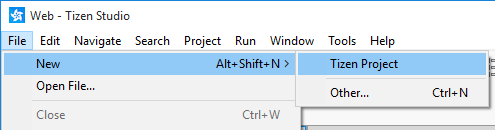

3.  In the Project Wizard window that appears, specify the project details.

    Project Wizard is used to create the basic application skeleton with the required folder structure and mandatory files. You can easily create different applications by selecting an applicable template or sample for Project Wizard to use.

    1. Select the **Template** project type and click **Next**.

        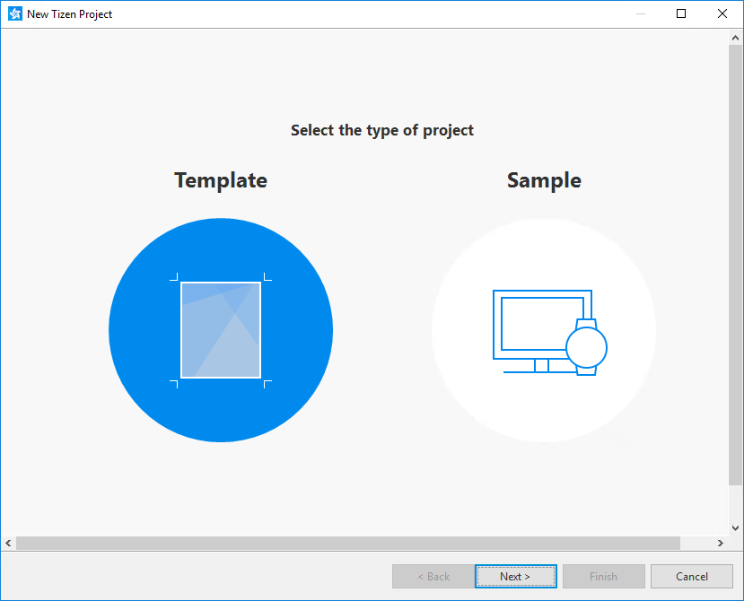

    2.  Select the **Mobile** profile and version from the drop-down list, and then click **Next**.

        

    3.  Select **Web Application** as the application type and click **Next**.

        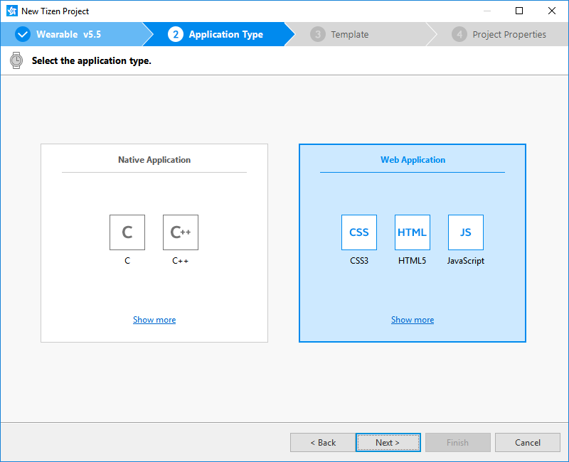

    4.  Select the **Basic UI** template and click **Next**.

        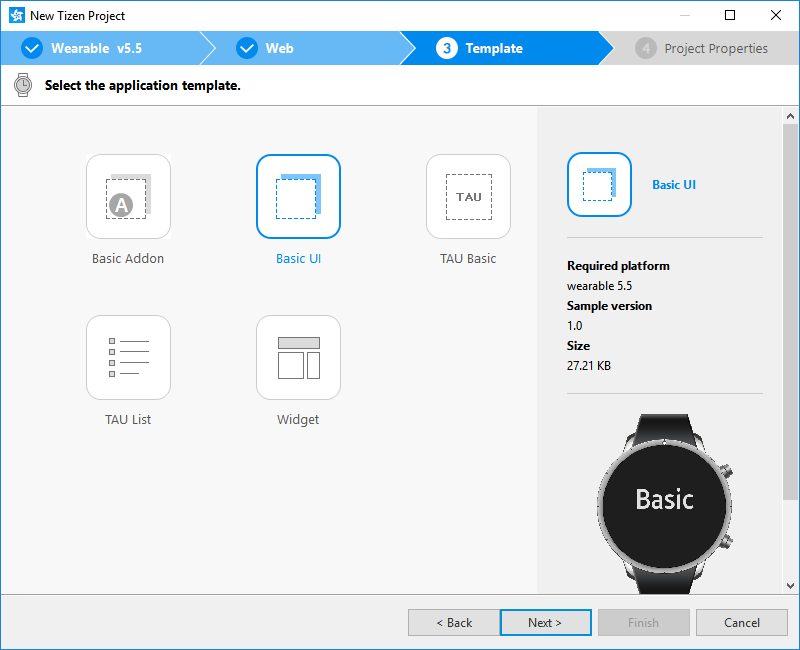

    5.  Enter a project name that has a maximum length of 3-50 characters and a unique package ID.

        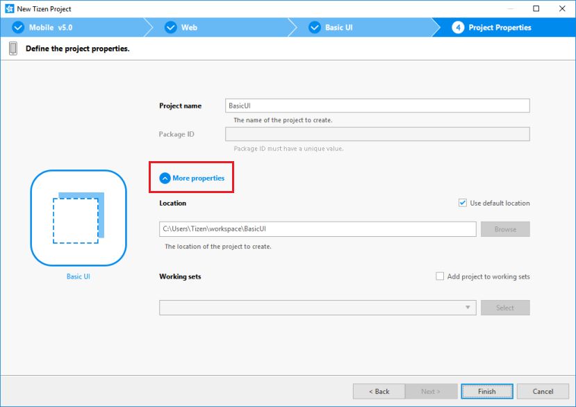

    6.  Click **More properties** to specify **Location** and **Working sets**, and then click **Finish**.

        Project Wizard sets up your application project and creates the required application files using the default content from the sample. 
        For more information, see [Creating Tizen Projects with Tizen Project Wizard](../../../tizen-studio/Web-tools/project-wizard.md).
		
		Your application project is now created.

You can see the created project in the **Project Explorer** view. 

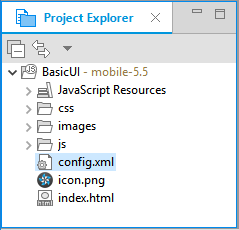

The **Project Explorer** view contains the following files and folders:

-   **css**: Folder for CSS files used by the application to style its content.

-   **js**: Folder for JavaScript files used by the application to implement its functional logic.

-   **config.xml**: Application configuration file used by the platform to install and launch the application.

-   **icon.png**: Application icon file used by the platform to represent the application.

-   **index.html**: Main HTML file for the layout of the application screen.

> **Note**
>
> In this [Create Project](#create-project) example, no configuration changes are required.

### Manage Application Configuration

To view and modify the application configuration, follow these steps:

1.  In the **Project Explorer** view, double-click the **config.xml** file of the application. 

2.  In the Web application configuration editor that appears, you can view and modify the configuration details.

    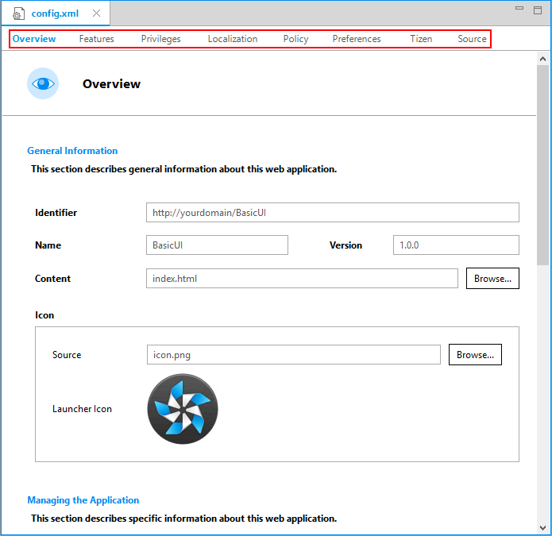

    -   **Overview**: Defines general information, such as the name and icon of the application.

    -   **Features**: Defines required software and hardware features. This information is used for application filtering in Tizen Store.

    -   **Privileges**: Defines the security-sensitive APIs or API groups accessed and used by the application.

    -   **Localization**: Defines localized values for the application name, description, and license.

    -   **Policy**: Requests network resource permissions to access external network resources.

    -   **Preferences**: Defines name-value pairs that can be set or retrieved through the application.

    -   **Tizen**: Edits the Tizen schema extension properties of the application.

    -   **Source**: Views and edits the source code of the **config.xml** file. Changes made and saved on the other tabs are reflected in the source code and vice versa.

       > **Note**
       >
       > The **config.xml** file must conform to both the XML file format and the W3C specification requirements. Editing the file in the **Source** tab is intended for advanced users only.

3.  To save the changes, in Tizen Studio, select **File \> Save All**.

For more information, see [Setting the Web Application Configuration](../../tutorials/process/setting-properties.md#set_widget).

## Design UI

The mobile application created with the **Basic UI** template has a simple user interface. The text component shows the **Basic** text in the middle of the screen.

**Figure: User interface in the Basic UI template**

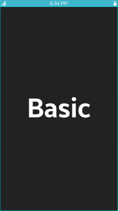

The UI is created using [W3C/HTML](https://www.w3schools.com). The W3C specifications provide HTML and CSS features for creating a user interface. With HTML, you can define the structure of the application screens, while CSS allows you to define the look and feel of the screens.

### Create Basic UI

The UI in the **Basic UI** template uses HTML Document Object Model (DOM), which is a structured model to control Web elements. It is an official W3C standard to express the document regardless of platforms or languages, and the foundation of the HTML5 APIs. The template contains the following components:

-   The `<html>` element is the top-level element of the HTML DOM tree that wraps the entire document. It has `<head>` and `<body>` elements as child nodes:

    ```html
    <!DOCTYPE html>
    <html>
       <head>
          <!--Content-->
       </head>
       <body>
          <!--Content-->
       </body>
    </html>
    ```

-   The `<head>` element contains the following information that a browser refers to when rendering the body element to interpret the information, such as the title of the HTML document, and the location of the related CSS and JavaScript files:

    -   `<title>`: Defines the title of the document.
    -   `<meta>`: Defines the information, such as encoding, creator, and keywords of the document.
    -   `<style>`, `<link>`: Sets the styles of the document.
    -   `<script>`, `<noscript>`: Adds functions to the document.

    ```html
    <head>
       <meta charset="utf-8"/>
       <meta name="viewport" content="width=device-width, initial-scale=1.0, maximum-scale=1.0">
       <meta name="description" content="Tizen Mobile Web Basic Template"/>

       <title>Tizen Mobile Web Basic Application</title>

       <link rel="stylesheet" type="text/css" href="css/style.css"/>
       <script src="js/main.js"></script>
    </head>
    ```

-   The `<body>` element defines the area displaying content on the browser screen. In this case, it defines the **Basic** text component:

    ```html
    <body>
       <div id="main" class="page">
          <div class="contents">
             <span id="content-text">Basic</span>
          </div>
       </div>
    </body>
    ```

### Modify Existing Style Components with CSS

CSS specifies the layout and styling of the Web application.

Following are the various ways to connect CSS with HTML:

-   `style` attribute in an HTML element.
-   `<link>` element in the `<head>` element.
-   `@import` attribute in the CSS area.
-   `<style>` element in the `<head>` element.

Applying the style of an HTML element directly with the `style` attribute has the highest priority. On the other hand, creating a separate CSS file and managing it separately is convenient when it comes to applying changes in the future.

In the **Basic UI** template, the CSS file is connected to the HTML file using a `<link>` element in the `<head>` element:

```html
<head>
   <meta charset="utf-8"/>
   <meta name="viewport" content="width=device-width, initial-scale=1.0, maximum-scale=1.0">
   <meta name="description" content="Tizen Mobile Web Basic Template"/>

   <title>Tizen Mobile Web Basic Application</title>

   <link rel="stylesheet" type="text/css" href="css/style.css"/>
   <script src="js/main.js"></script>
</head>
```

The following lines in the **css/style.css** file describe the styling of the text in an element with the `content-text` ID:

-   **css/style.css**:

    ```css
    #content-text {
       font-weight: bold;
       font-size: 5em;
    }
    ```

-   **index.html**:

    ```html
    <body>
       <div id="main" class="page">
          <div class="contents">
             <span id="content-text">Basic</span>
          </div>
       </div>
    </body>
    ```

By default, the text appears in white color `#ffffff` as defined for the `<body>` element. You can change the color by changing the value of the `content-text` ID in the CSS code. In the following example, the color is changed to red `#ff0000`:

```css
#content-text {
   font-weight: bold;
   font-size: 5em;
   color: #ff0000;
}
```

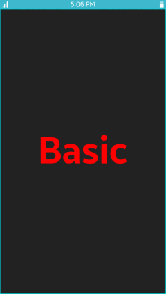

### Add Components and Functionalities with TAU

Tizen Advanced UI (TAU) is a Web UI library that enables you to create and manage various kinds of UI components. The components represent visual UI elements, such as button, checkbox, or list view. You can use the UI components to interact with the application screens. For more information, see [Tizen Advanced UI](../../guides/tau/tau.md) and [Tizen Advanced UI framework Reference](../../api/latest/ui_fw_api/ui_fw_api_cover.htm).

TAU helps you to create Tizen Web applications easily. The following figure shows the role of TAU and its relation to the Web application:

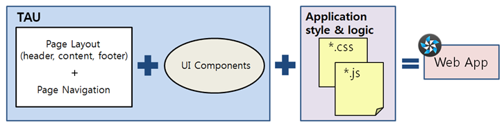

The UI in the **Basic UI** template contains only one visible text component. You can also create a UI with additional components.
 
To create a UI with additional components, screens, and functionalities, use the TAU library in your application. The following example shows how to create pages, a list on the page, and navigate between the pages.

To create a Web application and design its UI with TAU, follow these steps:

1.  Install TAU templates.

    In Tizen Studio, select **Tools \> Package Manager**. In the **Package Manager** window that appears, select **Main SDK \> 5.0 Mobile \> Advanced \> TAU (IDE)**.

    > **Note**
    > 
    > By default, the **TAU (IDE)** package is installed.

    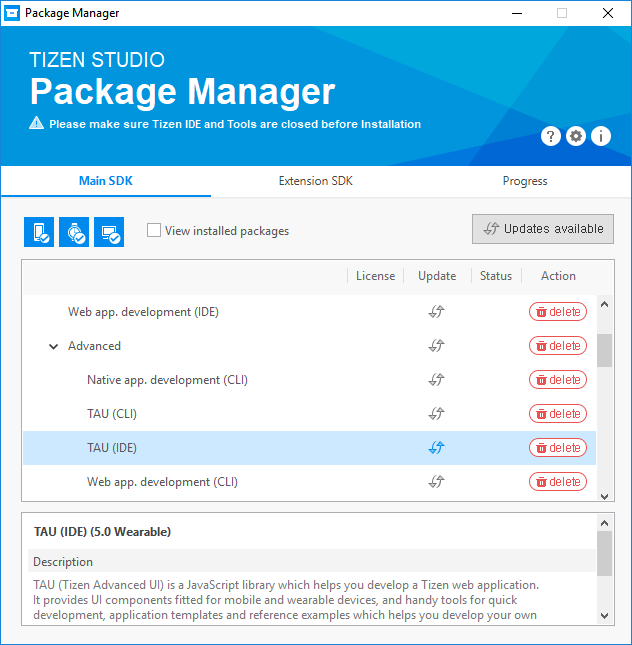

2.  Create a project that uses the TAU library.

    To create a project with a **TAU SinglePage** template, follow these steps:

    1.  In the Tizen Studio menu, select **File \> New \> Tizen Project**.
    2.  Select **Template \> Mobile v5.0 \> Web Application \> TAU SinglePage**.

        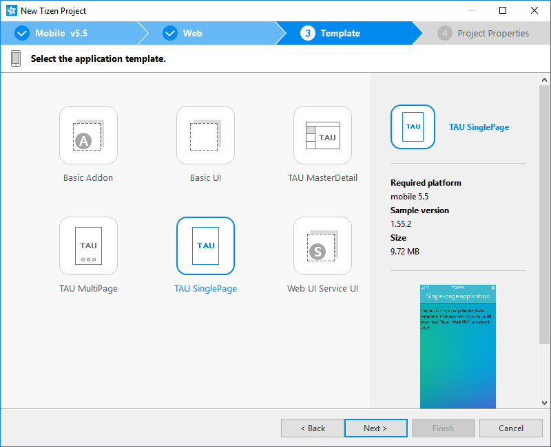

    3.  Enter a project name that has a maximum length of 3-50 characters and a unique package ID.

        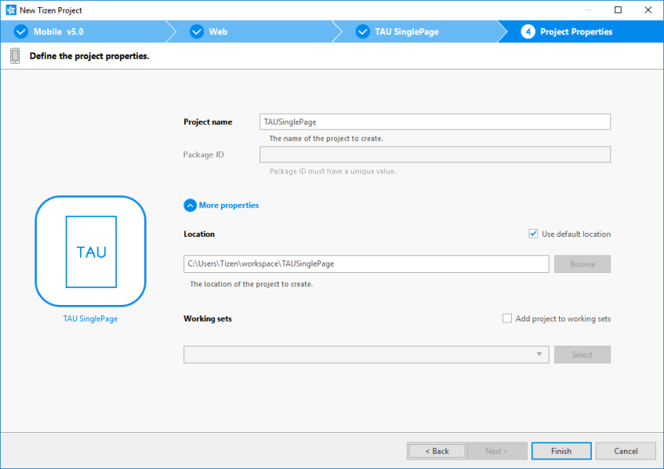

    4.  Click **More properties** to specify **Location** and **Working sets**, and then click **Finish**.
    
        You can see the created project in the **Project Explorer** view. 

        The TAU library is located in the `lib` folder.

        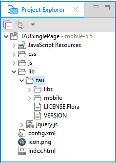

    You can create a new project using the TAU template or the TAU sample application included in Tizen Studio. You can also add the required TAU libraries to any existing Web project.

    To import TAU manually to an existing project in your HTML file, add the following elements to load the basic TAU libraries:

    -   Import the TAU library `tau(.min).js` with the `<script>` element.

        This element is mandatory as the TAU library uses the TAU JavaScript Interface.

    -   Import the TAU theme `tau(.min).css` with the `<link>` element.

        This element is also mandatory as you need the TAU library to use the TAU CSS.

    For better performance, all the CSS files must be included in the `<head>` element and all script elements must be included in the `</body>` element. The following example shows the **TAU SinglePage** template where the application title has been modified:

    ```html
    <!DOCTYPE html>
    <html>
       <head>
          <meta name="viewport" content="width=device-width, user-scalable=no"/>
          <link rel="stylesheet" href=".lib/tau/mobile/theme/default/tau.css"/>
          <link rel="stylesheet" type="text/css" href="css/style.css"/>
          <title>Hello TAU</title>
       </head>
       <body>
          <!--HTML BODY CONTENT-->
          <script type="text/javascript" src="lib/tau/mobile/js/tau.js"></script>
          <script src="./js/main.js"></script>
       </body>
    </html>
    ```

    To include your own scripts and style sheets, you can add additional `<script src="<CUSTOM_LIBRARY_OR_JS_FILE>">` or `<link rel="stylesheet" src="<CUSTOM_CSS>">` elements. However, place them after the default `<script>` element, so that you can use any TAU APIs provided by the default libraries.

3.  Create the first page.
    1. Open the `index.html` file. By default, the `<body>` element of the HTML file contains different `<div>` elements. Starting from `<div>` element with the `ui-page` class, which contains a header `<div>` element with the `ui-header` class and a content section `<div>` element with the `ui-content` class:

        ```html
        <body>
           <div class="ui-page" id="main">
              <div class="ui-header">
                 <h1>Single-page application </h1>
              </div><!-- /header -->

              <div class="ui-content">
                 <p>This is a single page boilerplate template that you can copy to build your first Tizen Web UI Framework page.</p>
              </div><!-- /content -->
           </div><!-- /page -->

           <script type="text/javascript" src="./lib/tau/mobile/js/tau.js"></script>
           <script src="./js/main.js"></script>
        </body>
        ```

        To layout the page, edit the contents of the header and content blocks, and add a footer with the `ui-footer` class:

        ```html
        <div class="ui-page" id="main">
           <div class="ui-header" data-position="fixed">
              <h1>Hello World</h1>
           </div>

           <div class="ui-content">
              <p>This is content area</p>
           </div>
           <div class="ui-footer">
              <p>This is footer area</p>
           </div>
        </div>
        ```

        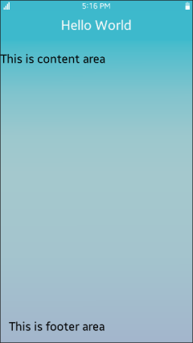

    2.  You can add your own styles for the content and footer areas by defining `id` attributes:

        ```html
        <body>
           <div class="ui-page" id="main">
              <div class="ui-header" data-position="fixed">
                 <h1>Hello World</h1>
              </div>

              <div class="ui-content" id="contentArea">
                 <p>This is content area</p>
              </div>
              <div class="ui-footer" id="footerArea">
                 <p>This is footer area</p>
              </div>
           </div>

           <script type="text/javascript" src="./lib/tau/mobile/js/tau.js"></script>
           <script src="./js/main.js"></script>
        </body>
        ```

        In the `style.css` file, add CSS styles for the new `id` attributes:

        ```css
        #contentArea {
           background-color: white;
        }
        #footerArea {
           background-color: blue;
        }
        ```
        
        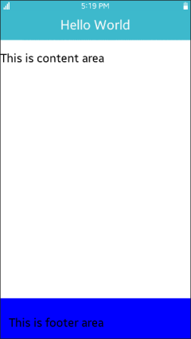

4.  Create additional content for the first page:
    -   Add a list.

        You can add a list with the TAU list view component using the `<ul>` element and the `ui-listview` class:

        -   Create a basic static list by overwriting the page content in the `index.html` file using the following code:

            ```html
            <body>
               <div class="ui-page" id="main">
                  <div class="ui-header" data-position="fixed">
                     <h1>Hello TAU</h1>
                  </div>
                  <div class="ui-content">
                     <ul class="ui-listview">
                        <li class="ui-li-static">List Item1</li>
                        <li class="ui-li-static">List Item2</li>
                        <li class="ui-li-static">List Item3</li>
                        <li class="ui-li-static">List Item4</li>
                     </ul>
                  </div>
               </div>

               <script type="text/javascript" src="./lib/tau/mobile/js/tau.js"></script>
               <script src="./js/main.js"></script>
            </body>
            ```

            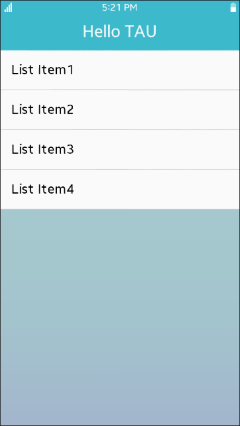

        -   For advanced options, you can also create an anchor list view. These items can be clicked to navigate to other pages or show a popup. The list items that are defined with the `<li>` elements in the following code, differ from the basic list by having an additional `<a>` element in them:

            ```html
            <div class="ui-page" id="main">
               <div class="ui-header" data-position="fixed">
                  <h1>Hello TAU</h1>
               </div>
               <div class="ui-content">
                  <ul class="ui-listview">
                     <li class="ui-li-anchor"><a href="#">Anchor List 1</a></li>
                     <li class="ui-li-anchor"><a href="#">Anchor List 2</a></li>
                     <li class="ui-li-anchor"><a href="#">Anchor List 3</a></li>
                     <li class="ui-li-anchor"><a href="#">Anchor List 4</a></li>
                  </ul>
               </div>
            </div>
            ```

            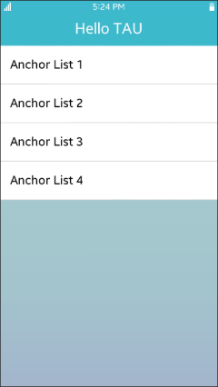

    -   Add a button in the footer.

        When you implement the Tizen mobile Web applications, you can use the `ui-footer` class as a footer area. You can add buttons to the footer area, by using the `<button>` elements:

        ```html
        <div class="ui-page" id="main">
           <div class="ui-header" data-position="fixed">
              <h1>Hello TAU</h1>
           </div>
           <div class="ui-content">
              <!--Content area with a list-->
           </div>
           <div class="ui-footer">
              <button>OK</button>
           </div>
        </div>
        ```

        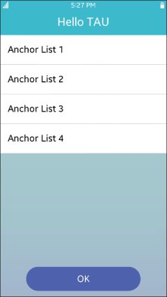

5.  Create the second page.

    1. In Tizen Studio, create a new HTML file and name it `second.html`.

       Add the following content to the file to create a title text in the header and a **Hello Tizen!** text in the content area:

        ```html
        <!DOCTYPE html>
        <html>
           <head>
              <title>Hello TAU</title>
              <link rel="stylesheet" href="lib/tau/mobile/theme/default/tau.css">
           </head>
           <body>
              <div class="ui-page" id="second">
                 <div class="ui-header" data-position="fixed">
                    <h1>Second Page</h1>
                 </div>
                 <div class="ui-content" id="secondPage">
                    <p>Hello Tizen!</p>
                 </div>
              </div>
              <script type="text/javascript" src="lib/tau/mobile/js/tau.js" data-build-remove="false"></script>
           </body>
        </html>
        ```

    2.  Decorate the page in the same way as `index.html`. In the `style.css` file, add the following CSS style to set the content area background to white:

        ```css
        #secondPage {
           background-color: white;
        }
        ```

          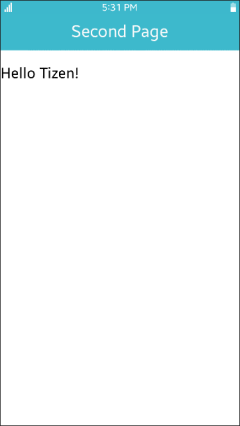

6.  Navigate between the pages.
    -   To navigate from the first page to the second, in the anchor list, add the path to the second page in the `<li><a href>` element:

        ```html
        <ul class="ui-listview">
           <li class="ui-li-anchor"><a href="second.html">Go to Second Page</a></li>
           <li class="ui-li-anchor"><a href="#">Anchor List 2</a></li>
           <li class="ui-li-anchor"><a href="#">Anchor List 3</a></li>
           <li class="ui-li-anchor"><a href="#">Anchor List 4</a></li>
        </ul>
        ```

        Run the application in the emulator, and click the **Go to Second Page** link to move from the `index.html` page to the `second.html` page.

        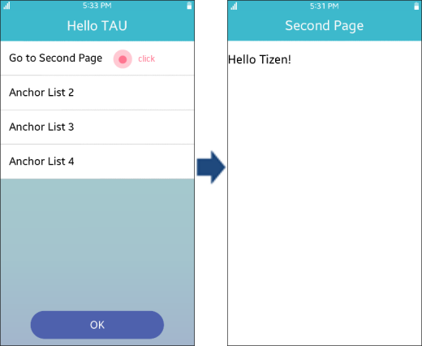

    -   To navigate from the second page back to the first, click the back key.

        You can navigate from one page to the other using the `<a href="PAGE_FILE_NAME">` element. However, you cannot navigate back. To return to the first page, you must add additional code in a JavaScript file.

        To create a new `app.js` JavaScript file, follow these steps:

        1. In the `index.html` file, add `<script src="app.js"></script>` in the `</body>` element:

            ```html
            <body>
               <div class="ui-page" id="main">
                  <div class="ui-header" data-position="fixed">
                     <h1>Hello TAU</h1>
                  </div>
                  <div class="ui-content">
                     <!--Content-->
                  </div>
                  <div class="ui-footer">
                     <button>OK</button>
                  </div>
               </div>
               <script type="text/javascript" src="lib/tau/mobile/js/tau.js"></script>
               <script src="app.js"></script>
            </body>
            ```

        2.  In the **Project Explorer** view, right-click the project and select **New \> JavaScript Source File**.

            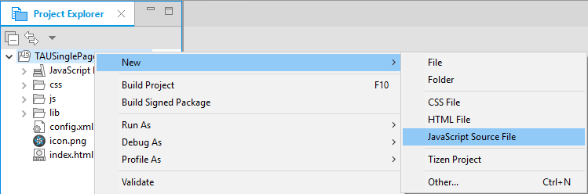

        3.  Type the file name as `app.js` and click **Finish**.
        4.  In the `app.js` file, all kinds of logic can be added to the application. In this case, add the code for returning to the previous page when the back key is pressed:

            ```javascript
            (function() {
                window.addEventListener('tizenhwkey', function(ev) {
                    if (ev.keyName === 'back') {
                        var page = document.getElementsByClassName('ui-page-active')[0],
                            pageid = page ? page.id : '';

                        if (pageid !== 'main') {
                            window.history.back();
                        }
                    }
                });
            }());
            ```

    -   To exit the application.

        You can make your application exit by adding more lines to the `app.js` file.

        You have to consider the fact that when you click the back key, the application can only exit if it is showing the first page. Therefore, if the application is showing the second page, then the application must return to the first page.

        The following code shows how to handle the back key input with page navigation and application exit. Similar code is included in the **TAU SinglePage** project template `main.js` file by default:

        ```javascript
        (function() {
            window.addEventListener('tizenhwkey', function(ev) {
                if (ev.keyName === 'back') {
                    var page = document.getElementsByClassName('ui-page-active')[0],
                        pageid = page ? page.id : '';

                    if (pageid === 'main') {
                        try {
                            tizen.application.getCurrentApplication().exit();
                        } catch (ignore) {}
                    } else {
                        window.history.back();
                    }
                }
            });
        }());
        ```

## Build Application

After you have created the application project, you can implement the required features. In this [Create Project](#create-project) example mentioned in this page, only the default features from the project template are used. Hence, no code changes are required.

When you build your application, the building process performs a validation check. It also compiles the JavaScript and the CSS files.

You can build the application in one of the following ways:

-   **Automatically**

    The automatic build means that Tizen Studio automatically builds the application whenever you change a source or resource file, and save the application project.

    To use the automatic build, follow these steps:

    1.  In the **Project Explorer** view, select the project.
    2.  In the Tizen Studio menu, select **Project \> Build Automatically**.

        

    You can toggle the automatic build on and off by selecting **Project \> Build Automatically** again.

-   **Manually**

    The manual build means that you determine when an application is built.

    To manually build an application, in the **Project Explorer** view, right-click the project and select **Build Project**.

    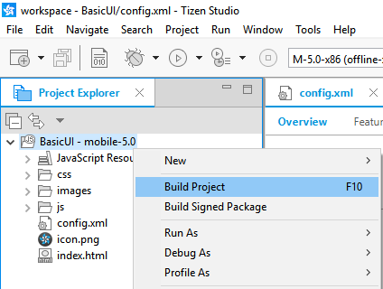

    Alternatively, in the **Project Explorer** view, you can select the project and Press **F10**.
	
After you have built the application, you can run the application.

## Run Application

You can run the Web application using an [emulator](../../tutorials/process/run-debug-app.md#emulator), a [Web simulator](../../tutorials/process/run-debug-app.md#simulator) or a [target device](../../tutorials/process/run-debug-app.md#target).

### Run Application on Emulator

To run the application on the emulator, follow these steps:

1.  Launch an emulator instance in [Emulator Manager](../../../tizen-studio/common-tools/emulator-manager.md):

    1. In the Tizen Studio menu, select **Tools \> Emulator Manager**.

        

    2.  In the **Emulator Manager** window that appears, select a Mobile emulator from the list and click **Launch**. If no applicable emulator instance exists, [create a new one](../../../tizen-studio/common-tools/emulator-manager.md#create).

        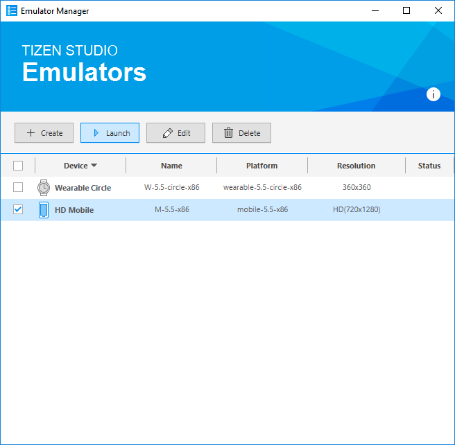

        The emulator is launched. You can also see the new emulator instance and its folder structure in **Tools \> Device Manager**.

        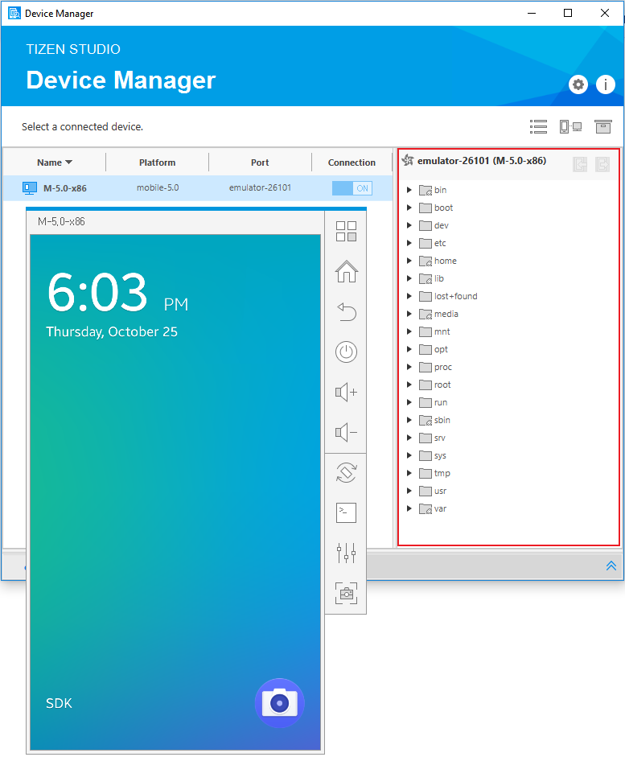

2.  Generate a security profile.

    Before you run the application, you must [sign your application package with a certificate profile](../../../tizen-studio/common-tools/certificate-registration.md) in Tizen Studio.

3.  Run the application:
    1. In the **Project Explorer** view, right-click the project and select **Run As \> Tizen Web Application**.

        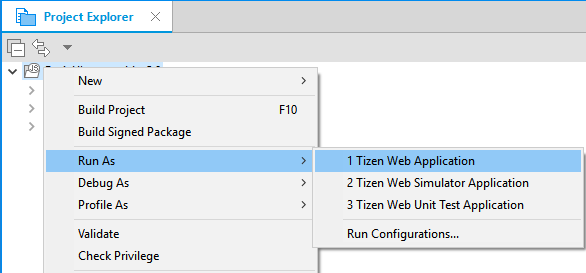

        Alternatively, you can select the project in the **Project Explorer** view and perform one of the following:

        -   Press **Ctrl + F11**.
        -   In the toolbar, click .

        If you have created multiple emulator instances, select the instance you want from the drop-down list in the toolbar. If you select an offline emulator, it is automatically launched when you run the application.

        

    2.  Verify whether the application launches on the emulator.

        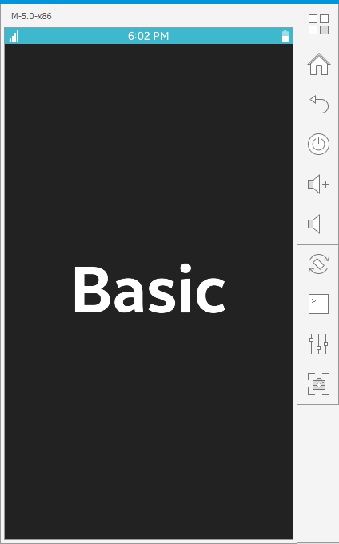

        While the application is running, you can see the logs, exception messages, and debug information using the **Log** view in Tizen Studio. To see the logs in Tizen Studio, select **Window \> Show View \> Log**.

For more information, see [Using Emulator Control Keys, Menu, and Panel](../../../tizen-studio/common-tools/emulator-control-panel.md) and [Using Extended Emulator Features](../../../tizen-studio/common-tools/emulator-features.md).

### Run Application on Simulator

To run the application on the Web Simulator, follow these steps:

1.  In the **Project Explorer** view, right-click the project and select **Run As \> Tizen Web Simulator Application**.

    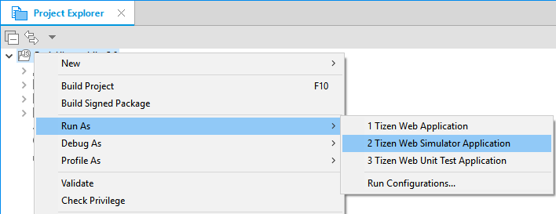

2.  Confirm that the application launches on the Web Simulator.

    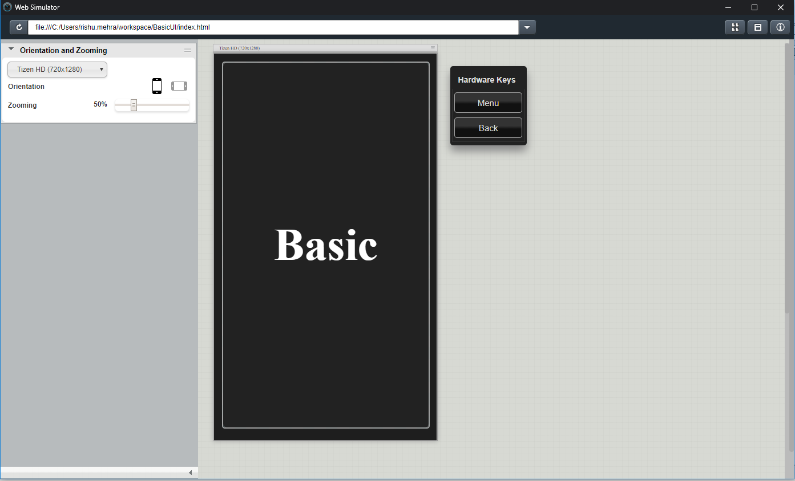

For more information, see [Taking Advantage of Web Simulator Features](../../../tizen-studio/web-tools/web-simulator-features.md).

### Run on Target Device

To run the application on a target device, follow these steps:

1.  Connect the mobile target device to your computer using a USB cable.

2.  Generate an author certificate.

    Before you run the application, you must [sign your application package with a certificate profile](../../../tizen-studio/common-tools/certificate-registration.md) in Tizen Studio.

3.  Run the application:

    1. In **Tools \> Device Manager**, select the device.

    2.  In **Project Explorer** view, right-click the project and select **Run As \> Tizen Web Application**.

        

        Alternatively, you can select the project in the **Project Explorer** view and perform one of the following:

        -   Press **Ctrl + F11**.
        -   In the toolbar, click .

        If you have both connected device and emulator instances, then select the device from the drop-down list in the toolbar.

        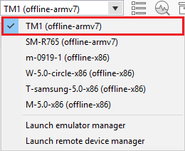

    3.  Verify whether the application launches on the target device.

        > **Note**
        >
        > The application launches with default launch configuration.
    
        To create and use custom launch configuration, follow these steps:
        
        1. In the **Project Explorer** view, right-click the project and select **Run As \> Run Configurations**. 

        2.  In the **Run Configurations** window that appears, select  and specify the configuration details.

            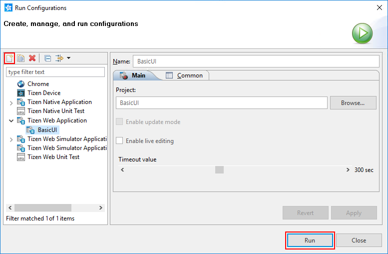

        3. To launch the application, click **Run**.

## Submit Application on Tizen Store

[Tizen Store](http://www.tizenstore.com/) is an app store designed specifically for Tizen mobile device. It caters in over 180 countries to download and install the apps that users want on their Tizen mobile. Tizen Store has a wide variety of useful apps in categories, such as Games, Entertainment, Kids, Finance, Health, Lifestyle, Music, and Social Networking.

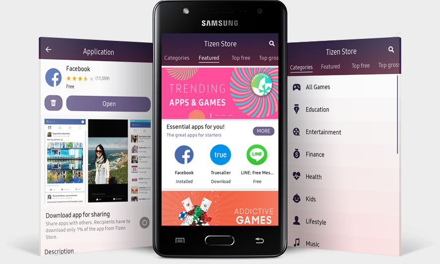

To submit your app on Tizen Store, you need to publish your app on [Tizen Seller Office](http://seller.tizenstore.com/). Tizen Seller Office supports individual developers and companies to sell their apps on Tizen Store. Tizen Seller Office enables you to easily register, manage, and promote your apps, as well as show statistics and payment details.

For more information on Tizen Store and how to distribute your app, check financial reports, and monitor other application management tasks on Tizen Seller Office, see [Tizen Distribution Overview](../../../distribute/index.md).