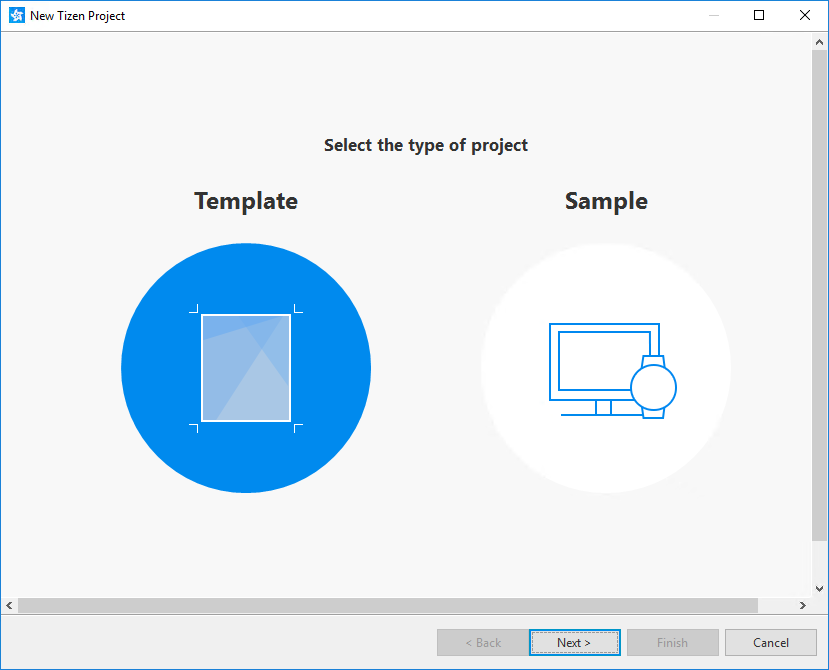
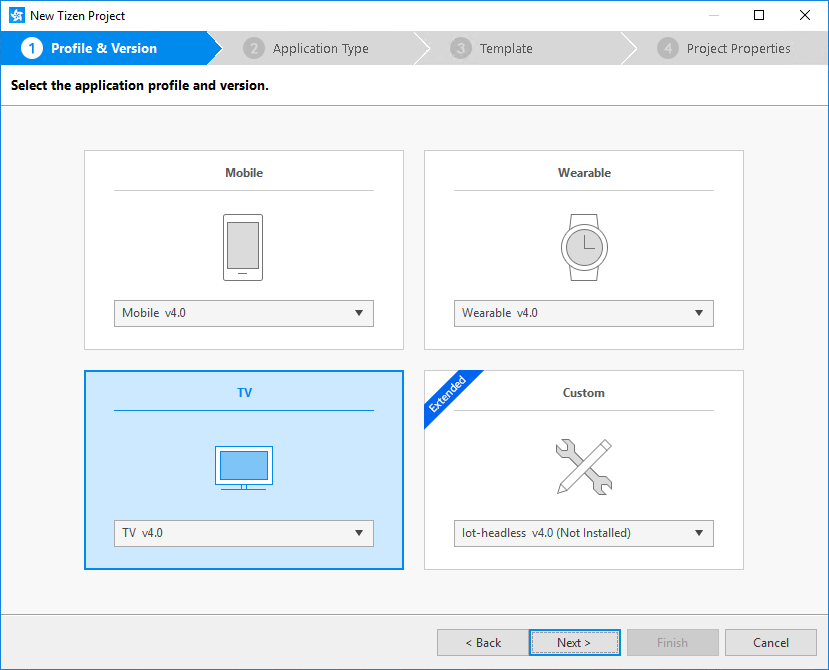
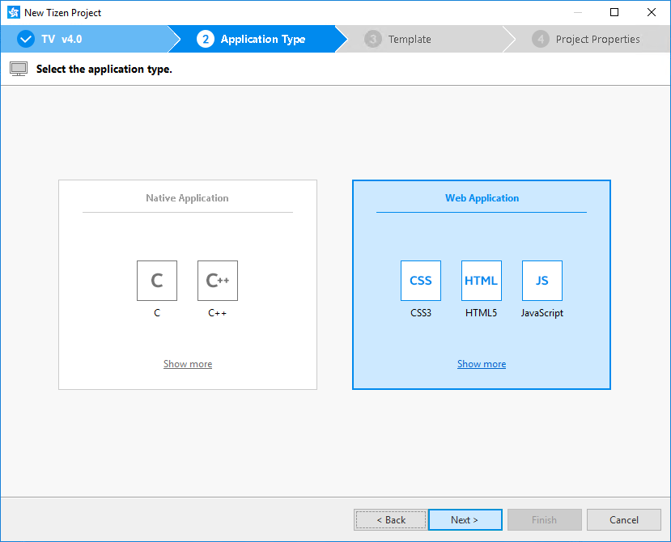
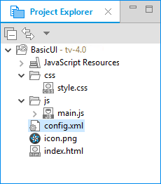
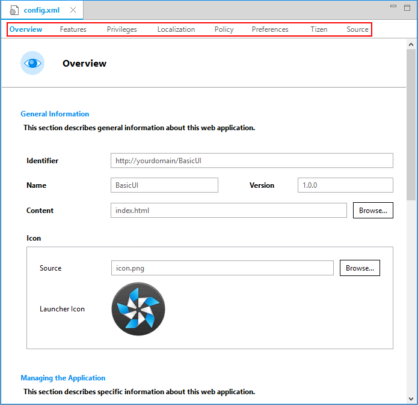
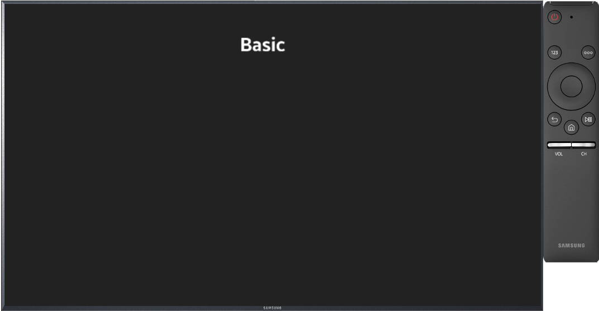
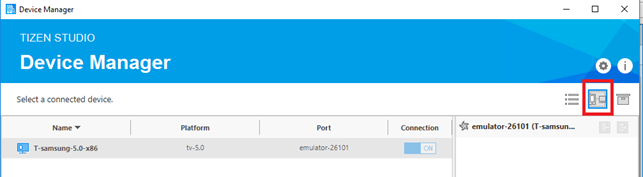

# Create Your First Samsung Smart TV Web Application

**Welcome to Tizen Web application development for Tizen TV!**


A Smart TV is a television set with the integrated Internet and interactive “Web 2.0” features. Samsung Smart TV running Tizen OS has lately been the most popular TV product, and some of the credit goes to its web apps that run on the TV. 

A TV Web application is a website developed mostly with a combination of various Web native languages such as HTML5, CSS, and JavaScript. 

The following sections guide you with developing a Tizen TV application using Web native languages and help you to: 

- Get hands on with using Tizen Studio for web app development. 
- Run a basic TV Web app on an emulator or a target device. 
- Customizing the UI of your app.

## Prerequisite

Ensure that the following prerequisite is met:

- Download and install Tizen Studio.

    For more information on the installation process, see the [installation guide](../../../tizen-studio/setup/install-sdk.md).
    
## Get Started

To develop TV Web application that displays text and graphics on the screen, you need to follow the following steps sequentially:

1. [Create a TV Web project](#create) using Tizen Studio.

2. [Design UI](#ui).

3. [Build and Run the application](#run).

Tizen Studio includes various [Web tools](../../../tizen-studio/Web-tools/index.md) that help you to create new functionalities, design intuitive UI with utmost ease.

### Create Project

To create the application project:

1. Launch Tizen Studio.

2. In Tizen Studio, select **File \> New \> Tizen Project**:

   
   
   As shown in the illustration, doing so opens the Project Wizard.

   > **Note**
   >
   > The Project Wizard lets you create the basic application skeleton with the required folder structure and mandatory files. You can easily create different applications by selecting an applicable template or sample for the Project Wizard to use.

3. In the Project Wizard, you can define the project details as follows:

    1. Select the **Template** project type and click  **Next**:
    
        

    2. Select the profile **(Custom)** and version **(TV-samsung v5.0)** from the drop-down list and click  **Next**:
    
        

    3. Select the **Web Application** as application type and click **Next**:
    
         

    4. Select the **Basic Project** and click **Next**:
    
        

    5. Define the project properties and click **Finish**.
    
       > **Note**
       >
       > You can enter the project name (3-50 characters) and the unique package ID. You can also select the location and working sets by clicking **More properties**:
    
       

The Project Wizard sets up your project, creates the required application files using the default content from the template. 

For more information on the Project Wizard and the available templates, see [Creating Tizen Projects with Tizen Project Wizard](../../../tizen-studio/Web-tools/project-wizard.md).

The following figure illustrates the basic application template for Tizen TV:

**Figure: TV Web Basic application**


## View Application Project

As you have set up your project, you can view your created project in the **Project Explorer**. 

A default application project contains all the files that are necessary to make up an application.

**Figure: Application in the Project Explorer**



Your project must have the following files and folders:

-   `css`: Folder for CSS files used by the application to style its content.

-   `js`: Folder for JavaScript files used by the application to implement its functional logic.

-   `config.xml`: Application configuration file used by the platform to install and launch the application.

-   `icon.png`: Application icon file used by the platform to represent the application.

-   `index.html`: Main HTML file for the layout of the application screen.

> **Note**
>
> You can [view and modify the application configuration](#configuration) in the Web application configuration editor. In this example, no configuration changes are required.

Your application project is now ready for further actions. Next, lets continue with application configuration.

<a name="configuration"></a>
## Configure Application

To view and modify the application configuration:

1.  In the **Project Explorer**, double-click the `config.xml` file of the application. Tizen Studio opens the file in the Web application configuration editor.

2.  In configuration editor, you can view and modify the configuration details in each tab:
    
    

    The functionality of each tab provides is as follows:
    
    -  **Overview**: Lets  you to identify the application using general information, such as the name and icon of your application.
    -  **Features**: Lets you to use software and hardware features, this information helps in filtering applications on Tizen Store.
    -  **Privileges**: Lets you to set security-sensitive APIs or API groups access .
    -  **Localization**: Lets you to define localized values for the application name, description, and license.
    -  **Policy**: Lets you to request network resource permission to access external network resources.
    -  **Preferences**: Lets you to get name-value pairs that can be set or retrieved.
    -  **Tizen**: Lets you to edit the Tizen schema extension properties.
    -  **Source**: Lets you to view and edit the source code of the `config.xml` file.
    
       > **Note**
       >
       > The `config.xml` file must confirm to both the XML file format and the W3C specification requirements. Editing the file in the  **Source**  tab is intended for advanced users only.
    
3. To save changes, select **File \> Save All**.

> **Note**
>
> For more information on configurations, see [Setting the Web Application Configuration](../../tutorials/process/setting-properties.md#set_widget).

Since you have setup the project, edited the configuration file as and if needed. Proceed with build application.

<a name="build"></a>
## Build Application

After you have created the application project, you can implement the required features. In our sample example, only the default features from the project template are used, thus no code changes are required.

When your application code is ready, you must build the application. The building process performs a validation check and compiles your JavaScript and CSS files.

You can build the application in the following ways:

- **Automatic Build**

    Automatic build ensures that Tizen Studio automatically builds and rebuilds the application whenever source or resource file changes, and saves the application project.

    To use the automatic build, follow these steps:

    1. Select the project in the **Project Explorer**.
   
    2. In Tizen Studio, select **Project \> Build Automatically**. You can always toggle the automatic build to on and off by re-selecting **Project \> Build Automatically**:
   
       
   
- **Manual Build**

    Manual build ensures that you determine yourself when the application will be built.

    To use the manual build, follow these steps:

    1.	Right-click the project in the **Project Explorer** view and select **Build Project**:

        **Figure: Manually building the application**
    
        

    Alternatively, you can also select the project in the **Project Explorer** and do either of the following:

    -   In Tizen Studio, select **Project \> Build Project**.

    -   Press the **F10** key.

After you have built the application, next step is to run your application.

## Run Application

You can run the Web application using any of the following processes:

-   [Samsung TV Emulator](../../tutorials/process/run-debug-app.md#emulator)
-   [Samsung TV Simulator](http://developer.samsung.com/tv/develop/getting-started/using-sdk/tv-simulator)
-   [Target Device](../../tutorials/process/run-debug-app.md#target)

### Run Application on Emulator

To run the application on emulator, follow these steps:

1.   Launch an emulator instance in the [Emulator Manager](../../../tizen-studio/common-tools/emulator-manager.md) as follows:

     1.  In Tizen Studio, select  **Tools \> Emulator Manager**:
   
           

     2.  In the **Emulator Manager** window, select a TV emulator from the list and click **Launch**. If no applicable emulator instance exists then you can [create a new one](../../../tizen-studio/common-tools/emulator-manager.md#create):
   
           

           The emulator launches in a new window. You can also see the new emulator instance in **Device Manager**:
   
           

2. Generate a security profile:

   > **Note**
   > 
   > Before you run the application, you must [sign your application package with a certificate profile](../../../tizen-studio/common-tools/certificate-registration.md) in Tizen Studio.

3. To run the application, follow these steps:

      1.  In the **Project Explorer**, right-click the project and select **Run As \> Tizen Web Application**:

          

          Alternatively, you can also select the project in the **Project Explorer** and do one of the following:

          - Press **Ctrl + F11** key.
          - Click run icon in the toolbar.

          If you have created multiple emulator instances, select desired instance listed in the toolbar before you run the application. 
          
          If you select an offline emulator, it automatically launches when you select to run the application:
		  
		  
		  
      2.  Confirm that the application launches on the emulator:
      
          
		  
		  While your application is running, you can view the logs, debug information, and exception messages using the **Log** view in Tizen Studio. 
          
          - To see the logs in Tizen Studio, select **Window \> Show View \> Log**.

For more information on using the emulator features, see [Using Emulator Control Keys, Menu, and Panel](../../../tizen-studio/common-tools/emulator-control-panel.md) and [Using Extended Emulator Features](../../../tizen-studio/common-tools/emulator-features.md).

### Run Application on Simulator

To run the application on the simulator:

1.  In the **Project Explorer**, right-click the project and select **Run As \> Tizen Web Simulator Application (Samsung TV)**:

    

2.  Confirm that the application launches in the simulator:

    

For more information on using the simulator features, see [TV Simulator](http://developer.samsung.com/tv/develop/getting-started/using-sdk/tv-simulator).

### Run on Target Device

To run the application on a target device:

1. Connect the TV target device to your computer:

    1. Define settings on the TV:
  
        1. Start the TV, press the **Smart Hub** key, and select **Apps**.
        2. In the **Apps** panel, enter the "Magic sequence" (keys **1, 2, 3, 4,** and **5**  in sequence).
        3. Set the **Developer mode** to **On**, and enter the IP address of your computer.
        4. Click **OK** and reboot the TV.

    2. In Tizen Studio, use the **Remote Device Manager** to connect the TV:
  
        1. In Tizen Studio select **Tools > Device Manager**, click **Remote Device Manager**:
		
		   
		
        2. In the **Remote Device Manager**, click **+**:
		
		   
		
        3. In the **Add Device** dialog, enter the device and network details, and click **Add**:
		
		   
		
        4. In the **Remote Device Manager** dialog, switch the new device on by toggling the switch under **Connect**:
		
		   

    3. In the **Device Manager** dialog, confirm that the device is connected (shown in the device list):
	
	   

    4. Right-click the device and select **Permit to install application**.

2. Generate a security profile:

   > **Note**
   >
   > Before you run the application, you must [sign your application package with a certificate profile](../../../tizen-studio/common-tools/certificate-registration.md) in Tizen Studio.
 
3. To run the application:
  
   1. In the **Device Manager**, select the device.
  
   2. In **Project Explorer**, right-click the project and select **Run As > Tizen Web Application**:
   
      

   Alternatively, you can also select the project in the **Project Explorer** and do one of the following:
   
    -   Press **Ctrl + F11** key.
    -   Click run icon in the toolbar.

   > **Note**
   >
   > If you have connected both device and existing emulator instances, select the device from the combo box in the toolbar before selecting to run the application:
   >
   >  

4. Confirm that the application launches on the target device.

    > **Note**
    >
    > The application launches with default launch configuration.
  
    To create and use custom launch configuration, follow these steps:

    1. In the **Project Explorer**, right-click the project and select **Run As > Run Configurations**.
  
    2. In the **Run Configurations** window, select the **New Launch Configuration** , define the configuration details, and launch the application by clicking **Run**:
  
         

## Customize User Interface

The TV application created with the **Basic Project** template has a simple user interface with different  components showing the different style of text, colors and font properties.

To customize UI see [W3C/HTML](https://www.w3schools.com) and help yourself with customizing the UI. The W3C specifications provide HTML and CSS features for creating a user interface. With HTML, you can define the structure of the application screens, while CSS allows you to define the look and feel of the screens.

**Figure: User interface in the Basic Project template**


### Create Basic UI

The UI of the **Basic Project** template is modelled using Document Object Modelling, which is a structured model. In addition, The HTML DOM is an API (Programming Interface) for JavaScript to perform various HTML customization tasks.

In contrast, it is an official W3C standard to express the document regardless of platforms or languages, and the foundation of the HTML5 APIs. 

The basic template contains the following components:

- The `<html>` element is the top-level element of the HTML DOM tree that wraps the entire document, and it has the `<head>` and `<body>` elements as child nodes:

    ```  
    <!DOCTYPE html>
    <html>
        <head>
           <!--Content-->
        </head>
        <body>
            <!--Content-->
        </body>

    </html>
    ```

- The `<head>` element includes a title for the document, scripts, styles, meta information, and more. The following elements can go inside the <head> element:

     - `<title>`: Defines the title of the document.
     - `<meta>`: Defines information, such as encoding, creator, and keywords of the document.
     - `<style>`, `<link>`: Sets the styles of the document.
     - `<script>`, `<noscript>`: Adds functions to the document.

    ``` 
    <head>
        <meta charset="utf-8" />
        <meta name="viewport" content="width=device-width, initial-scale=1.0, maximum-scale=1.0">
        <meta name="description" content="Tizen basic template generated by Tizen Web IDE" />

        <title> Tizen Web IDE - Tizen - Samsung Tizen TV basic Application </title>

        <link rel="stylesheet" type="text/css" href="css/style.css">
        <script src="js/main.js"></script>
    </head>
    ```

- The `<body>` element defines the area displaying content on the browser screen. In this case, it defines the heading, text, list, image, and hyperlink components:

    ```
    <body>
        <header>
            <hgroup>
                <h1>Tizen app</h1>
                <h2>Basic template of Samsung Tizen TV</h2>
            </hgroup>
        </header>
        <nav>
        <ul>
            <li><a href="#">Home</a></li>
            <li><a href="#">About Us</a></li>
            <li><a href="#">Contact Us</a></li>
        </ul>
        </nav>
  
        <article>
            <header>	
            <h1>
                  Application Name
            </h1>
            </header>
    
	        <p style="font-size:40px;">This is an empty template of Tizen Web Application. Tizen will support multiple device categories:</p>
    
	        <ul>
                <li style="font-size:40px;">smartphones, tablets and smart TVs
                <li style="font-size:40px;">netbooks, in-vehicle infotainment devices
            </ul>
     
	        <section>
                <p style="font-size:40px;">This is a basic section of a document.</p>
                <p style="font-size:40px;">The following button displays a time using JavaScript.</p>
                <div id="divbutton1" style="font-size:40px;">
                  <button onclick="startTime();" style="font-size:50px;">Clock</button>
                </div>
            </section>
	 
        </article>

        <footer>
            <p>&copy; 2015 Company Name. All rights reserved.</p>
        </footer>    
    
        </body>
	```

### Modify Existing Style Components with CSS

With Cascading Style Sheet (CSS), you can modify the layout and styling of your Web application, the basic step is to connect your CSS with HTML such that page renders the HTML with defined styles.

There are various ways to connect your CSS with HTML:

- Use of `style` attribute in an HTML element.
- Use of `<link>` element in the `<head>` element.
- Use of `@import` attribute in the CSS area.
- Use of `<style>` element in the `<head>` element.

Applying the style of an HTML element directly with the style attribute is the easiest of methods. On the other hand, creating a separate CSS file and managing it separately is convenient and recommended, when it comes to applying changes in the future.

Customize our CSS to change look and feel of the application:

- In the **Basic Project** template, the CSS file is connected to the HTML file using a `<link>` element in the `<head>` element:

    ``` 
    <head>
        <meta charset="utf-8"/>
        <meta name="viewport" content="width=device-width, initial-scale=1.0, maximum-scale=1.0">
        <meta name="description" content="Tizen TV basic template generated by Samsung TV Web IDE"/>

        <title>Tizen TV Web IDE - Tizen TV - Tizen TV basic Application</title>

        <link rel="stylesheet" type="text/css" href="css/style.css"/>
        <script src="js/main.js"></script>
    </head>
    ```

- The following lines in the CSS code describe the styling of the text in `<H1>` element with `header h1` class:

    ```
    header h1 {
        font-size: 108px;
        margin: 0px;
    }
    ```
    The `font-size` of `<H1>` is set to show up as _108px_. 

- To change the `font-size` of the text, change the CSS code by modifying the `font-size` attribute (in this case, it is changed to _90px_ to make the text smaller):

    ```
    header h1 {
        font-size: 90px;
        margin: 0px;
    }
    ```
    **Figure: Application screen with the new font-size for heading**

    

Similarly, if you are familiar with CSS, you can change overall look and feel of your application with ease.
