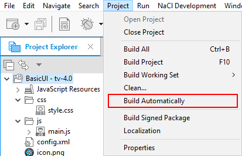
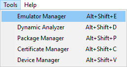
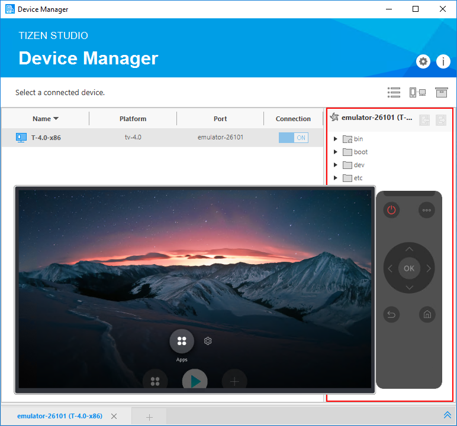
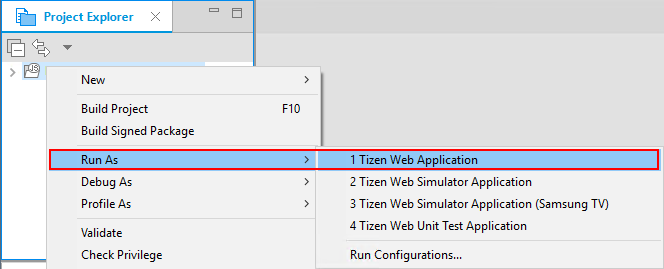
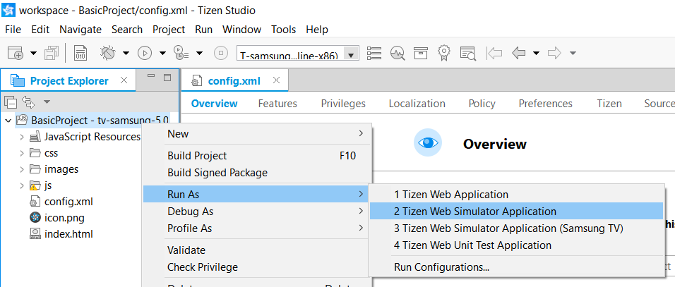
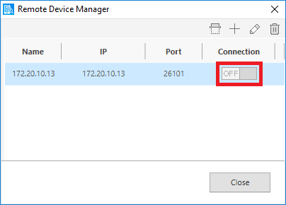

# Create Your First Tizen TV Web Application

**Welcome to Tizen TV Web application development!**

A TV Web application is basically a website stored on a TV. You can create it using web-native languages such as HTML5, CSS, and JavaScript.

Study the following instructions to help you familiarize yourself with the Tizen [Web application development process](../../tutorials/process/app-dev-process.md) and Tizen Studio. With these instructions, you can create and run a basic TV Web application that displays some text on the target device screen and on the next click, it changes the displayed text: 


1.  Download and install [Tizen Studio](../../../tizen-studio/index.md). For more information, see the [installation guide](../../../tizen-studio/setup/install-sdk.md).

2. [Create TV Web project](#create) using Tizen Studio.

3. [Build application](#build).

4. [Run application](#run).

5. [Enhance UI](#ui).

When you are developing a more complex application, you can take advantage of the [Web tools included in Tizen Studio](../../../tizen-studio/web-tools/index.md) to ease the task of creating functionality and designing the application UI. This section demonstrates an example that explains how to create and configure a basic TV Web application project in Tizen Studio.

<a name="create"></a>
## Create Project

An application project contains all the files that are needed to create an application. 

To create an application project:

1.  Launch Tizen Studio.

2. In the Tizen Studio menu, select **File \> New \> Tizen Project**.

    


3. In the Project Wizard window that appears, specify the project details.

   Project Wizard is used to create the basic application skeleton with the required folder structure and mandatory files. You can easily create different applications by selecting an applicable template or sample for the Project Wizard to use.

    1. Select the **Template** project type and click **Next**.

        

    2. Select the **TV** profile and the version from the drop-down list as shown in the following figure and click **Next**:
	
	    
		
		The version depends on the platform version you have installed and with which you are developing the application.

    3. Select **Web Application** as application type and click **Next**.

        

    4. Select the **Basic UI** template and click **Next**.

        

    5. In the Project Properties window that appears, you can enter a project name that has a maximum length of 3-50 characters and a unique package ID. 		
	6. Click **More properties** and select the location and working sets. 
	7. Specify the project properties and click **Finish**.
	
	   
	   
	   The Project Wizard sets up the project, creates the application files using the default content from the template, and closes automatically. For more information on the available templates, see [Creating Tizen Projects with Tizen Project Wizard](../../../tizen-studio/web-tools/project-wizard.md).

You can see the created project in the **Project Explorer** view. It contains the following files and folders:

-   `css`: Folder for CSS files used by the application to style its content.

-   `js`: Folder for JavaScript files used by the application to implement its functional logic.

-   `config.xml`: Application configuration file used by the platform to install and launch the application. You can view and modify Application configuration in the Web application configuration editor.

-   `icon.png`: Application icon file used by the platform to represent the application.

-   `index.html`: Main HTML file for the layout of the application screen.

**Figure: Application in the Project Explorer**


> **Note**
>
> In the example mentioned here, no configuration changes are required.

Your application project is now created.

<a name="configuration"></a>
### Manage Application Configuration

Following are the steps to view and modify the application configuration:

1.  In the **Project Explorer** view, double-click the `config.xml` file. 

2. In Tizen Studio Web application configuration editor that appears, you can view and modify the configuration details.

    

    -   **Overview**: Defines the general information such as the name and icon of the application.

    - **Features**: Defines the required software and hardware features. This information is used for application filtering in the Tizen Store.

    - **Privileges**: Defines the security-sensitive APIs or API groups accessed and used by the application.

    - **Localization**: Defines the localized values for the application name, description, and license.

    - **Policy**: Requests network resource permissions to access external network resources.

    - **Preferences**: Defines the name-value pairs that can be set or retrieved through the application.

    - **Tizen**: Edits the Tizen schema extension properties of the application.

    - **Source**: Views and edits the source code of the `config.xml` file. Changes made and saved on the other tabs are reflected in the source code and vice versa.

        > **Note**
        >
        > The `config.xml` file must conform to both the XML file format and the W3C specification requirements. Editing the `config.xml` file in the **Source** tab is intended for advanced users only.

3. To save the changes, in the Tizen Studio menu, select **File \> Save All**.

For more information, see [Setting the Web Application Configuration](../../tutorials/process/setting-properties.md#set_widget).

<a name="build"></a>
## Build Your Application

After you have created the application project, you can implement the required features. In the example mentioned here, only the default features from the project template are used. Hence, no code changes are required.

When you build your application, the building process performs a validation check. It also compiles the JavaScript and the CSS files.

You can build the application in one of the following ways:

-   **Automatically**

    The automatic build means that Tizen Studio automatically builds the application whenever you change a source or resource file and save the application project.

    To use the automatic build:

    1. In the **Project Explorer** view, select the project.
    2. In the Tizen Studio menu, select **Project \> Build Automatically**. A check mark appears next to the menu option.

        

    > **Note**
	>
	> You can toggle the automatic build to on and off using **Project \> Build Automatically**.

- **Manually**

    The manual build means that you determine when the application is built.

    To manually build the application, in the **Project Explorer** view, right-click the project and select **Build Project**.


    

    Alternatively, in the **Project Explorer** view, you can select the project and Press **F10**.

    

After you have built the application, you can run the application.

<a name="run"></a>
## Run Your Application

You can run the Web application on an [emulator](../../tutorials/process/run-debug-app.md#emulator), a [Samsung TV Simulator](http://developer.samsung.com/tv/develop/getting-started/using-sdk/tv-simulator), or a [real target device](../../tutorials/process/run-debug-app.md#target).

<a name="emulator"></a>
### Run on Emulator

To run the application on the emulator:

1.  Launch an emulator instance in [Emulator Manager](../../../tizen-studio/common-tools/emulator-manager.md).

    1.  In the Tizen Studio menu, select **Tools \> Emulator Manager**.

        

    2. In Emulator Manager window that appears, select a TV emulator from the list and click **Launch**.

        If no applicable emulator instance exists, [create a new one](../../../tizen-studio/common-tools/emulator-manager.md#create).

        

        The emulator instance is launched. Additionally, you can also see the new emulator instance and its folder structure in **Device Manager**.

        

2. Generate a security profile.

    Before you run the application, you must [sign your application package with a certificate profile](../../../tizen-studio/common-tools/certificate-registration.md) in Tizen Studio.

3. Run the application:
   1.  In the **Project Explorer** view, you can select the project and do in one of the following ways:
		- Right-click the project and select **Run As \> Tizen Web Application**.
		- Press **Ctrl + F11**.
        - Click **Run** in the toolbar.

        


        If you have created multiple emulator instances, select the instance you want from the drop-down list in the toolbar as shown in the figure, before selecting to run the application. If you select an offline emulator, it is automatically launched when you run the application.

        

   2. Verify that the application launches on the emulator.

        

        While the application is running, the log, debug, and exception messages appear in the **Log** view. To view the log messages, in Tizen Studio menu, select **Window \> Show View \> Log**.

For more information on using the emulator features, see [Using Emulator Control Keys, Menu, and Panel](../../../tizen-studio/common-tools/emulator-control-panel.md), and [Using Extended Emulator Features](../../../tizen-studio/common-tools/emulator-features.md).

<a name="simulator"></a>
### Run on Samsung TV Simulator

To run the application on the simulator:

1.  In the **Project Explorer** view, right-click the project and select **Run As \> Tizen Web Simulator Application (Samsung TV)**.

    

2. Verify that the application launches on the simulator.

    

For more information on using the simulator features, see [TV Simulator](http://developer.samsung.com/tv/develop/getting-started/using-sdk/tv-simulator).

<a name="target"></a>
### Run on Target Device

To run the application on a target device:

1. Connect the TV target device to your computer:

    1. Define settings on the TV:

         1. Start the TV, press the **Smart Hub** key, and select **Apps**.
         2. In the **Apps** panel, enter the Magic sequence (keys **1**, **2**, **3**, **4**, and **5** in sequence).
         3. Set the **Developer mode** to **On**, and enter the IP address of your computer.
         4. Click **OK** and reboot the TV.

    2. In Tizen Studio, use the **Remote Device Manager** to connect the TV:
   
        1. In **Device Manager**, click **Remote Device Manager**.

            

        2. In the **Remote Device Manager** window that appears, click **Add +**.

            

        3. In the **Add Device** window that appears, enter the device and network details, and click **Add**.

            

        4. In the **Remote Device Manager** window that appears, switch the new device on by clicking the switch under **Connect**.

            

   3. In **Device Manager**, confirm that the device is connected as shown in the device list.

        

   4. Right-click the device and select **Permit to install application**.

2. Generate an author certificate.

    Before you run the application, you must [sign your application package with a certificate profile](../../../tizen-studio/common-tools/certificate-registration.md) in Tizen Studio.

3. Run the application:
   1.  In **Device Manager**, select the device.
   2. In the **Project Explorer** view, you can select the project and do in one of the following ways:
		- Right-click the project and select **Run As \> Tizen Web Application**.
		- Press **Ctrl + F11**.
        - Click **Run** in the toolbar.

        


        If you have both a connected device and an existing emulator instance, select the device from the drop-down list in the toolbar as shown in the figure, before selecting to run the application.

        

   3. Verify that the application launches on the target device.

   > **Note**
   >
   > The application is launched using the default debug run configuration. To create and use another configuration:
   > 1.  In the **Project Explorer** view, right-click the project and select **Run As > Run Configurations**.
   > 2.  In the **Run Configurations** window that appears, click **New Launch Configuration** , define the configuration details, and click **Run** to launch the application.
   >    

Following are the two output screens of the application created:

-   The first figure shows the application screen when the application starts. The screen displays the **Basic** text.

-   The second figure shows the application screen after you click the text. The screen displays the **Sample** text. Clicking the text area switches between the two texts.

**Figure: TV Web Basic application**


<a name="ui"></a>
## Enhance Simple UI

The TV application created with the **Basic UI** template has a simple user interface with a text component showing the **Basic** text in the middle of the screen.

The UI is created using [W3C/HTML](https://www.w3schools.com). The W3C specifications provide HTML and CSS features for creating a user interface. With HTML, you can define the structure of the application screens. CSS allows you to define the look and feel of the screens.

**Figure: User interface in the Basic UI template**


### Create Basic UI

The UI in the **Basic UI** template uses the HTML DOM, which is a structured model to control the Web elements. It is an official W3C standard to express the document regardless of platforms or languages, and the foundation of the HTML5 APIs. The template contains the following components:

-   The `<html>` element is the top-level element of the HTML DOM tree that wraps the entire document, and it has the `<head>` and `<body>` elements as child nodes:

    ```
    <!DOCTYPE html>
    <html>
       <head>
          <!--Content-->
       </head>
       <body>
          <!--Content-->
       </body>
    </html>
    ```

- The `<head>` element contains the information that the browser refers to when rendering the body element to interpret information, such as the title of the HTML document, and the location of the related CSS and JavaScript files:

    -   `<title>`: Defines the title of the document.
    -   `<meta>`: Defines the information such as encoding, creator, and keywords of the document.
    -   `<style>`, `<link>`: Sets the styles of the document.
    -   `<script>`, `<noscript>`: Adds functions to the document.

    ```
    <head>
       <meta charset="utf-8"/>
       <meta name="viewport" content="width=device-width, initial-scale=1.0, maximum-scale=1.0">
       <meta name="description" content="Tizen TV basic template generated by Samsung TV Web IDE"/>

       <title>Tizen TV Web IDE - Tizen TV - Tizen TV basic Application</title>

       <link rel="stylesheet" type="text/css" href="css/style.css"/>
       <script src="js/main.js"></script>
    </head>
    ```

- The `<body>` element defines the area displaying content on the browser screen. In this case, it defines the **Basic** text component:

    ```
    <body>
       <div class="contents">
          <div style='margin:auto;'>
             <span class="content_text" id="textbox">Basic</span>
          </div>
       </div>
    </body>
    ```

### Modify Existing Components with CSS

Cascading Style Sheets (CSS) specifies the layout and styling of the Web application.

There are various ways to connect CSS with HTML:

-   `style`: attribute in an HTML element.
-   `<link>`: element in the `<head>` element.
-   `@import`: attribute in the CSS area.
-   `<style>`: element in the `<head>` element.

Applying the style of an HTML element directly with the `style` attribute has the highest priority. On the other hand, creating a separate CSS file and managing it separately is convenient when it comes to applying changes in the future.

In the **Basic UI** template, the CSS file is connected to the HTML file using a `<link>` element in the `<head>` element:

```
<head>
   <meta charset="utf-8"/>
   <meta name="viewport" content="width=device-width, initial-scale=1.0, maximum-scale=1.0">
   <meta name="description" content="Tizen TV basic template generated by Samsung TV Web IDE"/>

   <title>Tizen TV Web IDE - Tizen TV - Tizen TV basic Application</title>

   <link rel="stylesheet" type="text/css" href="css/style.css"/>
   <script src="js/main.js"></script>
</head>
```

The following lines in the CSS code describes the styling of the text in an element with the `content_text` class:

```
.content_text {
    font-weight:bold;
    font-size:5em;
    color:#fff;
}
```

The output text will be in bold and the text color will be as white (`#fff`). To change the color of the text, change the CSS code by modifying the `color` attribute (in this case, it is changed to `#2e9afe` to make the text blue):

```
.content_text {
    font-weight:bold;
    font-size:5em;
    color:#2e9afe;
}
```

**Figure: Application screen with the new text color**


