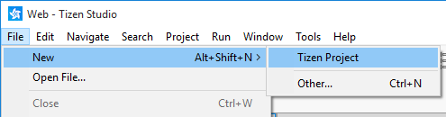
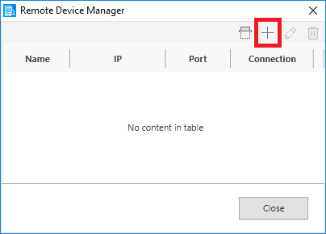

# Create Your First Samsung Smart TV Web Application

Samsung Smart TV web applications are apps that help you to watch movies, play games, browse internet websites, and much more on your Smart TV screen. These applications are developed using various Web-native languages, such as HTML5, Cascading Style Sheet (CSS), and JavaScript.

This page helps you to develop a Samsung Smart TV application using Tizen Studio with Web-native languages. You can also learn how to customize the UI of a basic app and run it on an emulator, a simulator, and a target device. In addition, you can publish an app on Samsung Apps TV Seller Office.

This page also demonstrates an example of a basic Smart TV application that displays text and graphics on the TV screen as a website.

## Prerequisites

1. Ensure that you download and install Tizen Studio. For more information, see the [installation guide](../../../tizen-studio/setup/install-sdk.md).

2. Set up Tizen Studio with Samsung Smart TV Extension. 

   To set up Samsung Smart TV Extension and the TV emulator, follow these steps:

   1. To launch the Package Manager, in Tizen Studio select **Tools \> Package Manager**.

       

   2. In the **Package Manager** window that appears, select the **Extension SDK** tab and click **install** next to **TV Extension-5.0**. 

       
	 
	  The Package Manager installs the Samsung Smart TV Extension packages.

      >**Note**
      >
      >Close the Tizen Studio IDE while installing **TV Extension SDK** from **Package Manager**.

For more information, see [Updating Tizen Studio](../../../tizen-studio/setup/update-sdk.md).

## Develop Samsung Smart TV Web Application

To develop Samsung Smart TV web application that displays text and graphics on the screen, follow these steps:

1. [Create project](#create-project). 

2. [Design UI](#design-ui).

3. [Build application](#build-application).

4. [Run application](#run-application).

5. [Submit application on Samsung Apps TV Seller Office](#submit-application-on-samsung-apps-tv-seller-office).

Tizen Studio includes various [Web tools](../../../tizen-studio/Web-tools/index.md) that help you create new functionalities and design intuitive UI with utmost ease.


## Create Project

To create the application project, follow these steps:

1. Launch Tizen Studio.

2. In the Tizen Studio menu, select **File \> New \> Tizen Project**.

    

3.  In the Project Wizard window that appears, specify the project details.

    Project Wizard is used to create the basic application skeleton with the required folder structure and mandatory files. You can easily create different applications by selecting an applicable template or sample for the Project Wizard to use.   

    1. Select the **Template** project type and click **Next**.

        

    2. Select the **TV** profile and version from the drop-down list and then click **Next**.

        

    3. Select **Web Application** as application type and click **Next**.

        

    4. Select the **Basic Project** template and click **Next**.

        

    5. Enter a project name that has a maximum length of 3-50 characters and a unique package ID.

        

    6. Click **More properties** to select **Location** and **Working sets**, and then click **Finish**.

       The Project Wizard sets up your project and creates the required application files using the default content from the template. 

       For more information on the Project Wizard and the available templates, see [Creating Tizen Projects with Tizen Project Wizard](../../../tizen-studio/Web-tools/project-wizard.md).

       Your application project is now created.

You can see the created project in the **Project Explorer** view. 


The **Project Explorer** view contains the following files and folders:

-   **css**: Folder for CSS files used by the application to style its content.

-   **js**: Folder for JavaScript files used by the application to implement its functional logic.

-   **config.xml**: Application configuration file used by the platform to install and launch the application.

-   **icon.png**: Application icon file used by the platform to represent the application.

-   **index.html**: Main HTML file for the layout of the application screen.

> **Note**
>
> In this [Create Project](#create-project) example, no configuration changes are required.

### Manage Application Configuration

To view and modify the application configuration, follow these steps:

1.  In the **Project Explorer** view, double-click the **config.xml** file of the application. 

2. In the Web application configuration editor that appears, you can view and modify the configuration details.

    

   - **Overview**: Defines general information, such as the name and icon of the application.

   - **Features**: Defines required software and hardware features. This information is used for application filtering in the Samsung Apps TV Seller Office.

    - **Privileges**: Defines the security-sensitive APIs or API groups accessed and used by the application.

    - **Localization**: Defines localized values for the application name, description, and license.

    - **Policy**: Requests network resource permissions to access external network resources.

    - **Preferences**: Defines name-value pairs that can be set or retrieved through the application.

    - **Tizen**: Edits the Tizen schema extension properties of the application.

    - **Source**: Views and edits the source code of the **config.xml** file. Changes made and saved on the other tabs are reflected in the source code and vice versa.

        > **Note**
        >
        > The **config.xml** file must conform to both the XML file format and the W3C specification requirements. Editing the file in the **Source** tab is intended for advanced users only.

3. To save any changes, in Tizen Studio, select **File \> Save All**.

For more information, see [Setting the Web Application Configuration](../../tutorials/process/setting-properties.md#set_widget).

## Design UI

The Samsung Smart TV application created with the **Basic Project** template has a simple user interface with basic HTML and JavaScript.

**Figure: User interface in the Basic Project template**


The UI is created using [W3C/HTML](https://www.w3schools.com). The W3C specifications provide HTML and CSS features for creating a user interface. With HTML, you can define the structure of the application screens, while CSS allows you to define the look and feel of the screens.

### Create Basic UI

The UI in the **Basic Project** template uses the HTML DOM, which is a structured model to control Web elements. It is an official W3C standard to express the document regardless of platforms or languages, and the foundation of the HTML5 APIs. The template contains the following components:

-   The `<html>` element is the top-level element of the HTML DOM tree that wraps the entire document. It has the `<head>` and `<body>` elements as child nodes:

    ```html
    <!DOCTYPE html>
    <html>
       <head>
          <!--Content-->
       </head>
       <body>
          <!--Content-->
       </body>
    </html>
    ```

- The `<head>` element contains the following information that browser refers to when rendering the body element to interpret the information, such as the title of the HTML document, and the location of the related CSS and JavaScript files:

    -   `<title>`: Defines the title of the document.
    -   `<meta>`: Defines information, such as encoding, creator, and keywords of the document.
    -   `<style>`, `<link>`: Sets the styles of the document.
    -   `<script>`, `<noscript>`: Adds functions to the document.

  ```html
   <head>
       <meta charset="utf-8" />
       <meta name="description" content="Tizen basic template generated by Tizen Web IDE"/>
       <title>Tizen Web IDE - Tizen - Samsung Tizen TV basic Application</title>
       <link rel="stylesheet" type="text/css" href="css/style.css"/>
       <script src="js/main.js"></script>
   </head>
  ```

- The `<body>` element defines the area displaying content on the browser screen. In this case, it defines the **Basic** text component:

    ```html
    <body>
      <header>
        <hgroup>
           ...
        </hgroup>
      </header>

      <nav>
        <ul>
           <li><a href="#">Home</a></li>
           <li> ... </li>
        </ul>
      </nav>

      <article>
        <header>
           ...
        </header>
        <section>
           ...
          <div id="divbutton1" style="font-size:40px;">
            <button onclick="startTime();" style="font-size:50px;">Clock</button>
          </div>
        </section>
      </article>

      <footer>
        <p>&copy; 2015 Company Name. All rights reserved.</p>
      </footer>
    </body>
    ```

### Modify Existing Components using CSS

CSS specifies the layout and styling of the Web application.

Following are the various ways to connect CSS with HTML:

-   `style` attribute in an HTML element.
-   `<link>` element in the `<head>` element.
-   `@import` attribute in the CSS area.
-   `<style>` element in the `<head>` element.

Applying the style of an HTML element directly with the `style` attribute has the highest priority. On the other hand, creating a separate CSS file and managing it separately is convenient when it comes to applying changes in the future.

In the **Basic Project** template, the CSS file is connected to the HTML file using a `<link>` element in the `<head>` element:

```html
<head>
   <link rel="stylesheet" type="text/css" href="css/style.css"/>
</head>
```

The following lines in the **css** code describe the styling of the navigation bar in an element with the `nav` class:

```css
nav ul {
    list-style: none;
    padding: 20px;
    display: block;
    clear: right;
    background-color: #666;
    padding-left: 4px;
    height: 48px;
}
```

The background is colored gray `#666`. To change the color of the background, change the CSS code by modifying the `background-color` attribute. In the following example, the color is changed to `#d3d3d3`:

```css
nav ul {
    list-style: none;
    padding: 20px;
    display: block;
    clear: right;
    background-color: #d3d3d3;
    padding-left: 4px;
    height: 48px;
}
```

### Display Current Time using JavaScript

JavaScript is a programming language of HTML and Web.

In the **Basic Project** template, the **js** file is included in the HTML file using a `<script>` element in the `<head>` element:

```html
<head>
   <script src="js/main.js"></script>
</head>
```

The following code in the JavaScript defines the `startTime()` function, which is executed when the HTML is loading:

```js
function startTime() {
    var today = new Date();
    var h = today.getHours();
    var m = today.getMinutes();
    var s = today.getSeconds();
    m = checkTime(m);
    s = checkTime(s);
    document.getElementById('divbutton1').innerHTML='Current time: ' + h + ':' + m + ':' + s;
    setTimeout(startTime, 10);
}
```

The current time shows as 24-hour format between 0 and 23, in the **Basic Project** template. You can convert 24-hour to 12-hour format, using the following code:
```js
function startTime() {
    var today = new Date();
    var h = today.getHours();
    var m = today.getMinutes();
    var s = today.getSeconds();
    console.log(h);
    if ( (h  / 12) >= 1 ) {
        meri = ' PM';
    }
    else {
        meri = ' AM';
    }

    h = h % 12;
    if ( h == 0 ) {
        h = 12;
    }
    m = checkTime(m);
    s = checkTime(s);

    document.getElementById('divbutton1').innerHTML='Current time: ' + h + ':' + m + ':' + s + ' ' + meri;
    setTimeout(startTime, 10);
}
```

**Figure: Updated UI of the Samsung TV Basic Project application**


## Build Application

After you have created the application project, you can implement the required features. In this [Create Project](#create-project) example mentioned in this page, only the default features from the project template are used. Hence, no code changes are required.

When you build your application, the building process performs a validation check. It also compiles the JavaScript and the CSS files.

You can build the application in one of the following ways:

- **Automatically**

    The automatic build means that Tizen Studio automatically builds the application whenever you change a source or resource file, and save the application project.

    To use the automatic build, follow these steps:

    1.  In the **Project Explorer** view, select the project.
    2.  In the Tizen Studio menu, select **Project > Build Automatically**.
	

    You can toggle the automatic build on and off by reselecting **Project \> Build Automatically**.

- **Manually**

    The manual build means that you determine when an application is built.

    To manually build an application, in the **Project Explorer** view, right-click the project and select **Build Project**.

    

    Alternatively, in the **Project Explorer** view, you can select the project and Press **F10**.
	
After you have built the application, you can run the application.

## Run Application

You can run the TV Web application using an [emulator](../../tutorials/process/run-debug-app.md#emulator), a [Samsung TV Web simulator](http://developer.samsung.com/tv/develop/getting-started/using-sdk/tv-simulator), or a [target device](../../tutorials/process/run-debug-app.md#target).

### Run Application on Emulator

To run the application on the emulator, follow these steps:

1. Launch an emulator instance in [Emulator Manager](../../../tizen-studio/common-tools/emulator-manager.md):

    1. In the Tizen Studio menu, select **Tools \> Emulator Manager**.

        

    2.  In the **Emulator Manager** window that appears, select a TV emulator from the list and click **Launch**. If no applicable emulator instance exists, [create a new one](../../../tizen-studio/common-tools/emulator-manager.md#create).

        

        The emulator is launched. You can also see the new emulator instance in **Tools \> Device Manager**.

        

2. Generate a security profile.

    Before you run the application, you must [sign your application package with a certificate profile](../../../tizen-studio/common-tools/certificate-registration.md) in Tizen Studio.

3. Run the application:
    1. In the **Project Explorer** view, right-click the project and select **Run As \> Tizen Web Application**.

        

        Alternatively, you can also select the project in the **Project Explorer** view and perform one of the following:

        -   Press **Ctrl + F11**.
        -   In the toolbar, click .

        If you have created multiple emulator instances, select the instance you want from the drop-down list in the toolbar. If you select an offline emulator, it is automatically launched when you run the application.

        

    2. Verify whether the application launches on the emulator.

        

        While the application is running, you can see the logs, exception messages, and debug information using the **Log** view in Tizen Studio. To see the logs in Tizen Studio, select **Window \> Show View \> Log**.

For more information, see [Using Emulator Control Keys, Menu, and Panel](../../../tizen-studio/common-tools/emulator-control-panel.md) and [Using Extended Emulator Features](../../../tizen-studio/common-tools/emulator-features.md).

### Run Application on Simulator

To run the application on the Web Simulator, follow these steps:

1.  In the **Project Explorer** view, right-click the project and select **Run As \> Tizen Web Simulator Application (Samsung TV)**.

    

2. Confirm that the application launches on the Web simulator.

    

For more information, see [Samsung TV web simulator](http://developer.samsung.com/tv/develop/getting-started/using-sdk/tv-simulator).

### Run on Target Device

To run the application on a target device, follow these steps:

1. Connect the TV target device to your computer:

    1. Define the TV settings:

        1. Start the TV, press the **Smart Hub** key, and select **Apps**.
        2. In the **Apps** panel, enter the magic sequence for TV. Enter keys **1**, **2**, **3**, **4**, and **5** in sequence.
        3. Set the **Developer mode** to **On** and enter the IP address of your computer.
        4. Click **OK** and reboot the TV.

    2. In Tizen Studio, use the **Remote Device Manager** to connect the TV:

        1. In the **Device Manager**, click **Remote Device Manager**.

            

        2. In the **Remote Device Manager** window, click **Add** **+**.

            

        3. In the **Add Device** window, enter the device and network details and select **Add**.

            

        4. In the **Remote Device Manager** window, toggle the new device to **ON** by clicking the switch under **Connection**.

            

    3. Verify whether the device is listed in **Device Manager**.

        

    4. Right-click the device and select **Permit to install application**.

2. Generate an author certificate.

    Before you run the application, you must [sign your application package with a certificate profile](../../../tizen-studio/common-tools/certificate-registration.md) in Tizen Studio.

3. Run the application:

    1.  In **Tools \> Device Manager**, select the device.

    2. In **Project Explorer** view, right-click the project and select **Run As \> Tizen Web Application**.

        

        Alternatively, you can also select the project in the **Project Explorer** view and perform one of the following:

        -   Press **Ctrl + F11**.
        -   In the toolbar, click .

        If you have both connected device and emulator instances, then select the device from the drop-down list in the toolbar.

        

    3.  Verify whether the application launches on the target device.

        > **Note**
        >
        > The application launches with default launch configuration. 
    
        To create and use the custom launch configuration, follow these steps:

        1.  In the **Project Explorer** view, right-click the project and select **Run As \> Run Configurations**. 
    
        2.  In the **Run Configurations** window that appears, select  and specify the configuration details.

            

        3. To launch the application click **Run**.

## Submit Application on Samsung Apps TV Seller Office

[Samsung Apps TV Seller Office](http://seller.samsungapps.com/tv/) is the official store for Smart TV apps certification and management. It provides all the features required to submit your application for app verification, manage app versions, usage statistics and metadata, and get feedback from the Samsung team.


To submit and distribute app for Samsung Smart TV, you need to submit your app package, related files, and app details on [Samsung Apps TV Seller Office](http://seller.samsungapps.com/tv/).

For more information on app submission prerequisites and how to publish app on Samsung Apps TV Seller Office, see [Samsung TV Application Publication Process](https://developer.samsung.com/tv/distribute/application-publication-process).