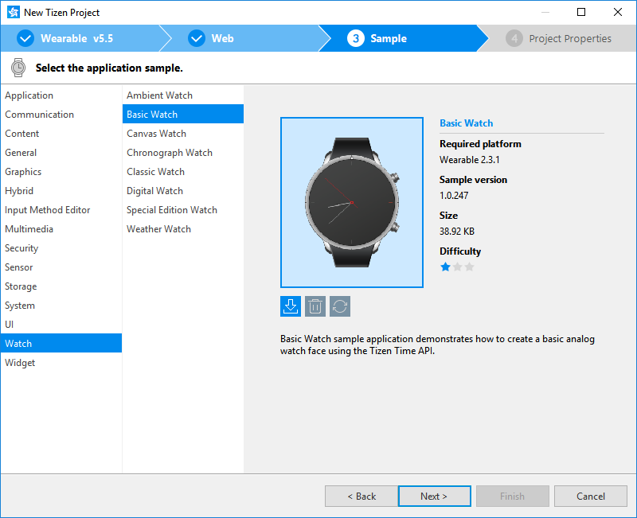
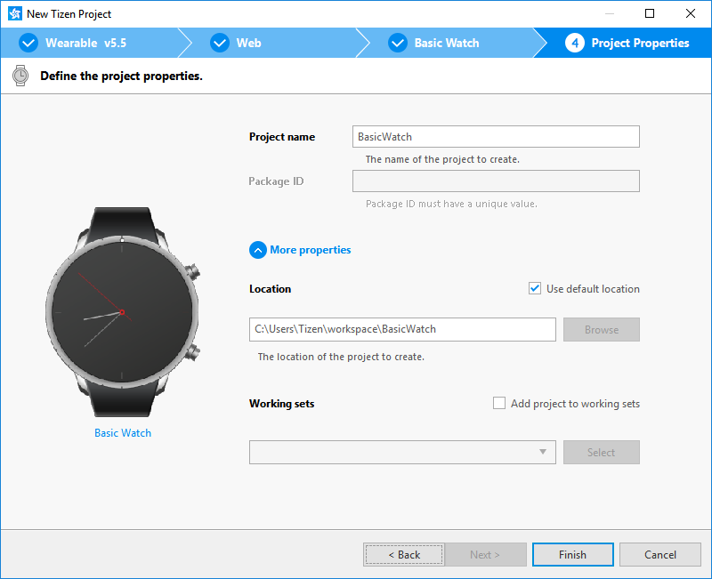
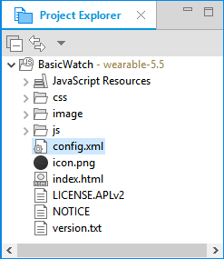

# Create Your First Tizen Wearable Web Application using Sample

Wearable Web applications are apps that help you to monitor health, show time, play games, and much more on your wrist. These applications are developed using various Web-native languages, such as HTML5, Cascading Style Sheets (CSS), and JavaScript.

This page helps you to develop a Tizen wearable application using Tizen Studio sample with Web-native languages. You can learn how to customize the UI of a basic app and run it on an emulator, a simulator, and a target device. In addition, you can publish an app on the Samsung Galaxy Store for wearables.

This page also demonstrates an example of a basic wearable Web application sample that displays the current time, which is set as a watch face.

## Prerequisites

Ensure that you download and install Tizen Studio. For more information, see the [installation guide](../../../tizen-studio/setup/install-sdk.md).

## Develop Wearable Web Application using Sample

To develop a wearable Web application that displays text and graphics on the screen, follow these steps:

1. [Create project](#create-project). 

2. [Design UI](#design-ui).

3. [Build application](#build-application).

4. [Run application](#run-application).

4. [Submit application on Samsung Galaxy Store](#submit-application-on-samsung-galaxy-store).

Tizen Studio includes various [Web tools](../../../tizen-studio/Web-tools/index.md) that help you to create new functionalities and design intuitive UI with utmost ease.

## Create Project

To create an application project, follow these steps:

1.  Launch Tizen Studio.

2.  In the Tizen Studio menu, select **File \> New \> Tizen Project**.

    

3.  In the Project Wizard window that appears, specify the project details.

    Project Wizard is used to create the basic application skeleton with the required folder structure and mandatory files. You can easily create different applications by selecting an applicable sample for Project Wizard to use.

    1.  Select the **Sample** project type and click **Next**.

        

    2.  Select the **Wearable** profile and version from the drop-down list and click **Next**.

        

    3.  Select **Web Application** as the application type and click **Next**.

        

    4.  Select the **Watch \> Basic Watch** sample and click **Next**.

        

    5.  Enter a project name that has a maximum length of 3-50 characters and a unique package ID. 

        
	
	6.  Click **More properties** to specify **Location** and **Working sets**, and then click **Finish**.

        Project Wizard sets up your application project and creates the required application files using the default content from the sample. For more information, see [Creating Tizen Projects with Tizen Project Wizard](../../../tizen-studio/Web-tools/project-wizard.md).
		
		Your application project is now created.

You can see the created project in the **Project Explorer** view. 



The **Project Explorer** view contains the following files and folders:

-   **css**: Folder for CSS files used by the application to style its content.

-   **js**: Folder for JavaScript files used by the application to implement its functional logic.

-   **config.xml**: Application configuration file used by the platform to install and launch the application.

-   **icon.png**: Application icon file used by the platform to represent the application.

-   **index.html**: Main HTML file for the layout of the application screen.

> **Note**
>
> In this [Create Project](#create-project) example, no configuration changes are required.

### Manage Application Configuration

To view and modify the application configuration, follow these steps:

1.  In the **Project Explorer** view, double-click the **config.xml** file of the application. 

2.  In the Web application configuration editor that appears, you can view and modify the configuration details.

    

    -   **Overview**: Defines general information, such as the name and icon of the application.

    -   **Features**: Defines required software and hardware features. This information is used for application filtering in Samsung Galaxy Store.

    -   **Privileges**: Defines the security-sensitive APIs or API groups accessed and used by the application.

    -   **Localization**: Defines localized values for the application name, description, and license.

    -   **Policy**: Requests network resource permissions to access the external network resources.

    -   **Preferences**: Defines name-value pairs that can be set or retrieved through the application.

    -   **Tizen**: Edits the Tizen schema extension properties of the application.

    -   **Source**: Views and edits the source code of the **config.xml** file. Changes made and saved on the other tabs are reflected in the source code and vice versa.

        > **Note**
        >
        > The **config.xml** file must conform to both the XML file format and the W3C specification requirements. Editing the file in the **Source** tab is intended for advanced users only.

3.  To save the changes, in Tizen Studio, select **File \> Save All**.

For more information, see [Setting the Web Application Configuration](../../tutorials/process/setting-properties.md#set_widget).

### Understand Source Code

Following are the key highlights of an application to understand how the application is designed and how it works based on different Samsung Wearable platforms. For more information on the source code related to the UI, see [Design UI](#design-ui).

-   The watch application category settings are defined in the **config.xml** file. The file defines the application as a watch application through a category:

    ```xml
    <widget xmlns="http://www.w3.org/ns/widgets" xmlns:tizen="http://tizen.org/ns/widgets"
            id="http://yourdomain/BasicWatch" version="1.0.0" viewmodes="maximized">
       <tizen:application id="4lVHc7hUkz.BasicWatch" package="4lVHc7hUkz" required_version="2.3.1"/>
       <tizen:category name="http://tizen.org/category/wearable_clock"/>
       <content src="index.html"/>
       <feature name="http://tizen.org/feature/screen.shape.circle"/>
       <feature name="http://tizen.org/feature/screen.size.all"/>
       <icon src="icon.png"/>
       <name>BasicWatch</name>
       <tizen:profile name="wearable"/>
    </widget>
    ```

    > **Note**
    >
    > By default, the BasicWatch sample application category is defined as `<tizen:category name="http://tizen.org/category/wearable_clock"/>`. To run your application on Samsung Gear and Samsung Gear Active devices, use `<tizen:category name="com.samsung.wmanager.WATCH_CLOCK"/>`.

-   On a low-powered wearable device, an ambient mode is available. In this mode, the watch application shows a limited UI and receives only the ambient tick event every minute to reduce the power consumption.

    If the application contains a custom UI for the [ambient mode](../../tutorials/event-handling.md#ambient), the ambient mode support is also shown in the **config.xml** file. However, the BasicWatch sample application does not support a custom ambient UI.

## Design UI

The wearable application is created with the **Basic Watch** sample. It has a simple user interface that consists of four images, a background image and separate images for the hour, minute, and second hands of the clock. The clock hands rotate on the screen every second to show the current time.

The UI is created using [W3C/HTML](https://www.w3schools.com). The W3C specifications provide HTML and CSS features for creating a user interface. With HTML, you can define the structure of the application screens, while CSS allows you to define the look and feel of the screens.

**Figure: User interface in the Basic Watch sample**


### Create Basic UI

The UI in the **Basic Watch** sample uses HTML Document Object Model (DOM), which is a structured model to control Web elements. It is an official W3C standard to express the document regardless of platforms or languages, and the foundation of the HTML5 APIs. The template contains the following components:

-   The `<html>` element is the top-level element of the HTML DOM tree that wraps the entire document. It has `<head>` and `<body>` elements as child nodes:

    ```html
    <!DOCTYPE html>
    <html>
       <head>
          <!--Content-->
       </head>
       <body>
          <!--Content-->
       </body>
    </html>
    ```

-   The `<head>` element contains the following information that the browser refers to when rendering the body element to interpret the information, such as the title of the HTML document, and the location of the related CSS and JavaScript files:

    -   `<title>`: Defines the title of the document.
    -   `<meta>`: Defines the information, such as encoding, creator, and keywords of the document.
    -   `<style>`, `<link>`: Sets the styles of the document.
    -   `<script>`, `<noscript>`: Adds functions to the document.

    ```html
    <head>
       <meta charset="utf-8"/>
       <meta name="viewport" content="width=device-width, initial-scale=1.0, maximum-scale=1.0"/>
       <meta name="description" content="Tizen Wearable Web Basic Watch Face"/>

       <title>Basic Watch</title>

       <link rel="stylesheet" type="text/css" href="css/style.css"/>
    </head>
    ```

-   The `<body>` element defines the area displaying content on the browser screen. In this case, it defines the main UI elements, such as background image and clock hands:

    ```html
    <body>
       <div id="container">
          <div id="background">
             <div id="components-main">
                <div id="hand-main-hour"></div>
                <div id="hand-main-minute"></div>
                <div id="hand-main-second"></div>
             </div>
          </div>
       </div>

       <script src="js/app.js"></script>
    </body>
    ```

### Modify Existing Components using CSS

CSS specifies the layout and styling of the Web application.

Following are the various ways to connect CSS with HTML:
-   `style` attribute in an HTML element.
-   `<link>` element in the `<head>` element.
-   `@import` attribute in the CSS area.
-   `<style>` element in the `<head>` element.

Applying the style of an HTML element directly with the `style` attribute has the highest priority. On the other hand, creating a separate CSS file and managing it separately is convenient when it comes to applying changes in the future.

In the **Basic Watch** sample, the CSS file is connected to the HTML file using a `<link>` element in the `<head>` element:

```html
<head>
   <meta charset="utf-8"/>
   <meta name="viewport"
         content="width=device-width, initial-scale=1.0, maximum-scale=1.0"/>
   <meta name="description" content="Tizen Wearable Web Basic Watch Face"/>

   <title>Basic Watch</title>

   <link rel="stylesheet" type="text/css" href="css/style.css"/>
</head>
```

The lines in the **css/style.css** file describe the styling of the main UI elements using the IDs defined in the HTML file.

Each main element is represented by a specific image file. The background image covers the entire screen. The clock hand images are placed such that they start from the upper middle of the screen, for example, 12:00 noon or midnight time.

-   **css/style.css**:

    ```css
    #background {
       width: 100%;
       height: 100%;
       background-image: url("../image/watch_bg.png");
    }

    #components-main {
       position: absolute;
       width: 100%;
       height: 100%;
    }

    #hand-main-hour {
       position: absolute;
       left: 172.5px;
       top: 0px;
       width: 15px;
       height: 360px;
       background-image: url("../image/watch_hand_hour.png");
       background-position: center top;
       background-size: contain;
    }

    #hand-main-minute {
       position: absolute;
       left: 172px;
       top: 0px;
       width: 16px;
       height: 360px;
       background-image: url("../image/watch_hand_minute.png");
       background-position: center top;
       background-size: contain;
    }

    #hand-main-second {
       position: absolute;
       left: 172px;
       top: 0px;
       width: 16px;
       height: 360px;
       background-image: url("../image/watch_hand_second.png");
       background-position: center top;
       background-size: contain;
    }
    ```

-   **index.html**:

    ```html
    <div id="background">
       <div id="components-main">
          <div id="hand-main-hour"></div>
          <div id="hand-main-minute"></div>
          <div id="hand-main-second"></div>
       </div>
    </div>
    ```

By default, the watch uses a background image. You can change the CSS code and replace the background image with a background color. In the following example, background is changed to dark blue `#3805AF`:

```css
#background {
   width: 100%;
   height: 100%;
   background-color: #3805AF;
}
```


### Display Current Time with W3C

To display the current time, use the [CSS Transforms](../../api/latest/w3c_api/w3c_api_w.html#transforms) API in the **app.js** file:

1.  When the application is shown on the device screen, initialize it to update the clock hands every second:

    ```javascript
    function init() {
        bindEvents();

        /* Update the clock hands every second */
        setInterval(function() {
            updateTime();
        }, 1000);
    }

    window.onload = init();
    ```

2.  To retrieve the current time, use `updateTime()` and call the `rotateElement()` method for each clock hand:

    ```javascript
    function updateTime() {
        var datetime = tizen.time.getCurrentDateTime(),
            hour = datetime.getHours(),
            minute = datetime.getMinutes(),
            second = datetime.getSeconds();

        /* Rotate the clock hands */
        rotateElement('hand-main-hour', (hour + (minute / 60) + (second / 3600)) * 30);
        rotateElement('hand-main-minute', (minute + second / 60) * 6);
        rotateElement('hand-main-second', second * 6);
    }
    ```

3.  To rotate the clock hand based on the angle that is calculated from the current time, use `rotateElement(elementID, angle)`:

    ```javascript
    function rotateElement(elementID, angle) {
        var element = document.querySelector('#' + elementID);

        element.style.transform = 'rotate(' + angle + 'deg)';
    }
    ```

## Build Application

After you have created the application project, you can implement the required features. In the example mentioned in this page, only the default features from the project template are used. Hence, no code changes are required.

When you build your application, the building process performs a validation check. It also compiles the JavaScript and the CSS files.

You can build the application in one of the following ways:

-   **Automatically**

    The automatic build means that Tizen Studio automatically builds the application whenever you change a source or resource file, and save the application project.

    To use the automatic build, follow these steps:

    1.  In the **Project Explorer** view, select the project.
    2.  In the Tizen Studio menu, select **Project \> Build Automatically**.

        

    You can toggle the automatic build on and off by selecting **Project \> Build Automatically**.

-   **Manually**

    The manual build means that you determine when an application is built.

    To manually build an application, in the **Project Explorer** view, right-click the project and select **Build Project**.

    

    Alternatively, in the **Project Explorer** view, you can select the project and Press **F10**.
	
After you have built the application, you can run the application.

## Run Application

You can run the Web application using an [emulator](../../tutorials/process/run-debug-app.md#emulator) or a [target device](../../tutorials/process/run-debug-app.md#target).

> **Note**
>
> Since the Web Simulator does not support a circular UI, this topic does not cover the instructions for running the application on the [Web Simulator](../../tutorials/process/run-debug-app.md#simulator).

### Run Application on Emulator

To run the application on the emulator, follow these steps:

1.  Launch an emulator instance in [Emulator Manager](../../../tizen-studio/common-tools/emulator-manager.md):

    1.  In the Tizen Studio menu, select **Tools \> Emulator Manager**.

        

    2.  In the **Emulator Manager** window that appears, select a wearable emulator from the list and click **Launch**. If no applicable emulator instance exists, [create a new one](../../../tizen-studio/common-tools/emulator-manager.md#create).

        

        The emulator is launched. You can also see the new emulator instance and its folder structure in **Tools \> Device Manager**.

        

2.  Generate a security profile.

    Before you run the application, you must [sign your application package with a certificate profile](../../../tizen-studio/common-tools/certificate-registration.md) in Tizen Studio.

3.  Run the application:

    1.  In the **Project Explorer** view, right-click the project and select **Run As \> Tizen Web Application**.

        

        Alternatively, you can select the project in the **Project Explorer** view and perform one of the following:

        -   Press **Ctrl + F11**.
        -   In the toolbar, click .

        If you have created multiple emulator instances, select the instance you want from the drop-down list in the toolbar. If you select an offline emulator, it is automatically launched when you run the application.

        

    2.  Verify whether the application launches on the emulator.

        

        > **Note**
        >
        > If the emulator display is switched off, you cannot see the application launch. To activate, click the power key in the lower-right corner of the emulator.

    3.  Change the watch face.

        To change the device watch face and enable the installed watch application visible on the home screen, follow these steps:

        

        1.  If the emulator display is switched off, activate it by clicking the power key in the lower-right corner of the emulator.

        2.  On the home screen, when the default watch face appears, click the power key.

        3.  In the apps screen, select **Settings \> Watch faces and styles \> Watch faces**.

        4.  Swipe right until you find your application icon, and select it. The **Clock changed** message appears.

        5.  Click the back key in the upper-right corner of the emulator device multiple times, until the home screen with your new watch face appears.

            

        While the application is running, you can see the logs, exception messages, and debug information using the **Log** view in Tizen Studio. To see the logs in Tizen Studio, select **Window \> Show View \> Log**.

For more information, see [Using Emulator Control Keys, Menu, and Panel](../../../tizen-studio/common-tools/emulator-control-panel.md) and [Using Extended Emulator Features](../../../tizen-studio/common-tools/emulator-features.md).

### Run on Target Device

To run the application on a target device, follow these steps:

1.  Connect the wearable target device to your computer:
    1.  Define the settings on the device:
        -   Select **Settings \> Connections**, and switch on **Bluetooth**.

            

            

        -  Select **Settings \> Connections**, and switch on **Wi-Fi**.

            The device and the computer must be connected to the same Wi-Fi network.

            

            > **Note** 
            >
            > After connecting to the Wi-Fi network, the IP address appears on the device. 

        -   Select **Settings \> Gear info**, and switch on **Debugging**.

            

    2.  In **Tools \> Device Manager**, verify whether the device is connected. 

        
		
		> **Note**
		>
		> Tizen Studio automatically detects the device. In the Tizen Studio toolbar, the device appears in the device list. You can also connect your device using [Remote Device Manager](../wearable/first-app.md#remote_device).

    3.  To allow the Samsung Wearable device to read log data and copy application files from the wearable device, install the application manually and select the accept mark.

        
		
		> **Note**
		>
		> In the first attempt, the connection fails and the device asks for user confirmation.  

2.  Generate an author certificate.

    Before you run the application, you must [sign your application package with a certificate profile](../../../tizen-studio/common-tools/certificate-registration.md) in Tizen Studio.

3.  Run the application:

    1.  In **Tools \> Device Manager**, select the device.
    
    2.  In the **Project Explorer** view, right-click the project and select **Run As \> Tizen Web Application**.

        

        Alternatively, you can select the project in the **Project Explorer** view and perform one of the following:

        -   Press **Ctrl + F11**.
        -   In the toolbar, click .

        If you have both connected device and emulator instances, then select the device from the drop-down list in the toolbar.

        

    3.  Verify whether the application launches on the target device.

        > **Note**
        >
        > The application launches with default launch configuration. 
    
        To create and use the custom launch configuration, follow these steps:

        1.  In the **Project Explorer** view, right-click the project and select **Run As \> Run Configurations**. 

        2.  In the **Run Configurations** window that appears, select  and specify the configuration details.
               
			   
		   
		3.  To launch the application, click **Run**.

## Submit Application on Samsung Galaxy Store

[Samsung Galaxy Store](https://seller.samsungapps.com/) is an app store designed specifically for Samsung Galaxy and Watch devices. It caters in over 180 countries to download and install the apps that users want on their Samsung Galaxy and Watch devices. Samsung Galaxy Store has a wide variety of useful apps in categories, such as Entertainment, Finance, Health, Music, and Social Networking.


To submit and distribute your app, you need to submit your app package and details on [Seller Office at Samsung Galaxy Store](https://seller.samsungapps.com/).


For more information on how to distribute your app for Samsung Galaxy Gear and Wearable, see [Samsung Galaxy Watch Distribution](https://developer.samsung.com/galaxy-watch/distribute/how-to-distribute).