# Create Your First Tizen Wearable Web Application using Template

Wearable Web applications are apps that help you to monitor health, show time, play games, and much more on your wrist. These applications are developed using various Web-native languages, such as HTML5, Cascading Style Sheets (CSS), and JavaScript.

This page helps you to develop a Tizen wearable application using Tizen Studio template with Web-native languages. You can learn how to customize the UI of a basic app and run it on an emulator, a simulator, and a target device. In addition, you can publish an app on the Samsung Galaxy Store for wearables.

This page also demonstrates an example of a basic wearable Web application template that changes the color of the text on a click.

## Prerequisites

Ensure that you download and install Tizen Studio. For more information, see the [installation guide](../../../tizen-studio/setup/install-sdk.md).

## Develop Wearable Web Application using Template

To develop a wearable Web application that displays text and graphics on the screen, follow these steps:

1. [Create project](#create-project). 

2. [Design UI](#design-ui).

3. [Build application](#build-application).

4. [Run application](#run-application).

4. [Submit application on Samsung Galaxy Store](#submit-application-on-samsung-galaxy-store).

Tizen Studio includes various [Web tools](../../../tizen-studio/Web-tools/index.md) that help you to create new functionalities and design intuitive UI with utmost ease.

## Create Project

To create an application project, follow these steps:

1.  Launch Tizen Studio.

2.  In the Tizen Studio menu, select **File \> New \> Tizen Project**.

    

3.  In the Project Wizard window that appears, specify the project details.
    
	Project Wizard is used to create the basic application skeleton with the required folder structure and mandatory files. You can easily create different applications by selecting an applicable template for Project Wizard to use.

    1.  Select the **Template** project type and click **Next**.

        

    2.  Select the **Wearable** profile and version from the drop-down list and click **Next**.

        

    3.  Select **Web Application** as the application type and click **Next**.

        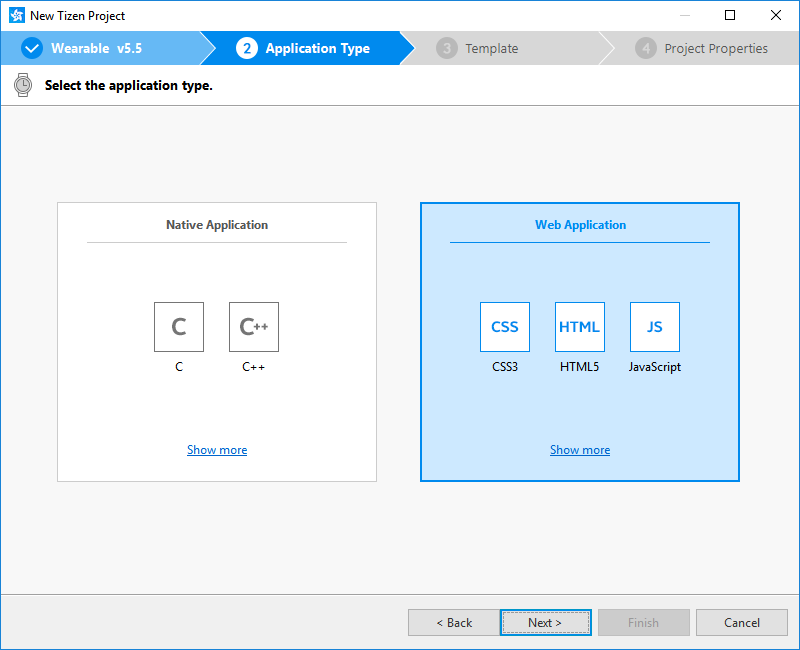

    4.  Select the **Basic UI** template and click **Next**.

        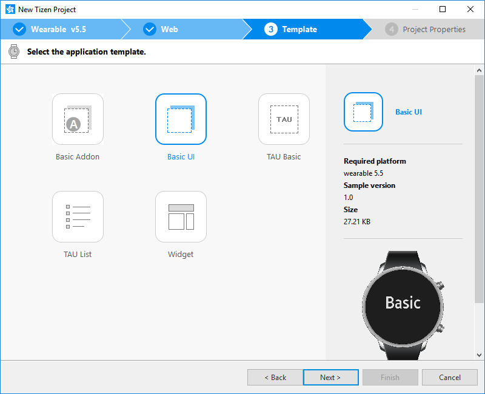

    5.  Enter a project name that has a maximum length of 3-50 characters and a unique package ID.

        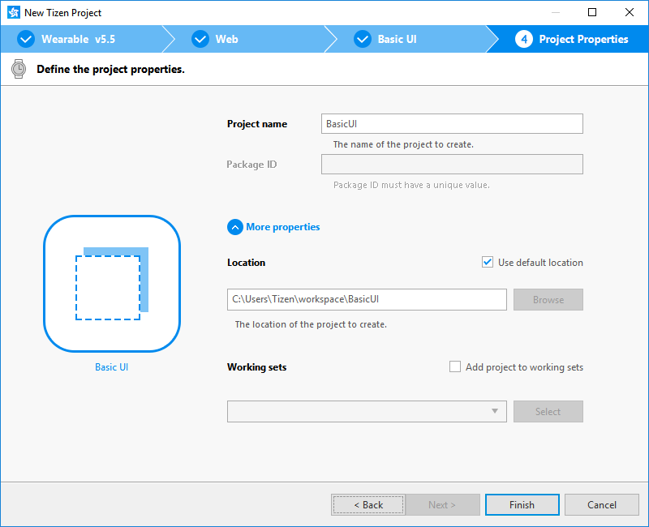
	
	6.  Click **More properties** to specify **Location** and **Working sets**, and then click **Finish**.

        Project Wizard sets up your application project and creates the required application files using the default content from the template. For more information, see [Creating Tizen Projects with Tizen Project Wizard](../../../tizen-studio/Web-tools/project-wizard.md).
		
		Your application project is now created.

You can see the created project in the Project Explorer view.

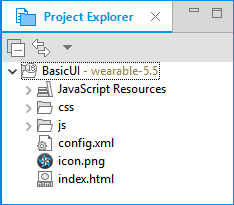

The Project Explorer view contains the following files and folders:

-   **css**: Folder for CSS files used by the application to style its content.

-   **js**: Folder for JavaScript files used by the application to implement its functional logic.

-   **config.xml**: Application configuration file used by the platform to install and launch the application.

-   **icon.png**: Application icon file used by the platform to represent the application.

-   **index.html**: Main HTML file for the layout of the application screen.

> **Note**
>
> In this [Create Project](#create-project) example, no configuration changes are required.

### Manage Application Configuration

To view and modify the application configuration, follow these steps:

1.  In the **Project Explorer** view, double-click the **config.xml** file of the application. 

2.  In the Web application configuration editor that appears, you can view and modify the configuration details.

    

    -   **Overview**: Defines general information, such as the name and icon of the application.

    -   **Features**: Defines required software and hardware features. This information is used for application filtering in Samsung Galaxy Store.

    -   **Privileges**: Defines the security-sensitive APIs or API groups accessed and used by the application.

    -   **Localization**: Defines localized values for the application name, description, and license.

    -   **Policy**: Requests network resource permissions to access external network resources.

    -   **Preferences**: Defines name-value pairs that can be set or retrieved through the application.

    -   **Tizen**: Edits the Tizen schema extension properties of the application.

    -   **Source**: Views and edits the source code of the **config.xml** file. Changes made and saved on the other tabs are reflected in the source code and vice versa.

        > **Note**
        >
        > The **config.xml** file must conform to both the XML file format and the W3C specification requirements. Editing the file in the **Source** tab is intended for advanced users only.

3.  To save the changes, in Tizen Studio menu, select **File \> Save All**.

For more information, see [Setting the Web Application Configuration](../../tutorials/process/setting-properties.md#set_widget).

## Design UI

The wearable application created with the **Basic UI** template has a simple user interface with a text component showing the **Basic** text in the middle of the screen.

The UI is created using [W3C/HTML](https://www.w3schools.com). The W3C specifications provide HTML and CSS features for creating a user interface. Using HTML, you can define the structure of the application screens, while CSS allows you to define the look and feel of the screens.

**Figure: User interface in the Basic UI template**

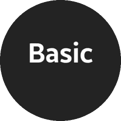

### Create Basic UI

The UI in the **Basic UI** template uses the HTML Document Object Model (DOM), which is a structured model to control Web elements. It is an official W3C standard to express the document regardless of platforms or languages, and the foundation of the HTML5 APIs. The template contains the following components:

-   The `<html>` element is the top-level element of the HTML DOM tree that wraps the entire document. It has `<head>` and `<body>` elements as child nodes:

    ```html
    <!DOCTYPE html>
    <html>
       <head>
          <!--Content-->
       </head>
       <body>
          <!--Content-->
       </body>
    </html>
    ```

-   The `<head>` element contains the following information that the browser refers to when rendering the body element to interpret the information, such as the title of the HTML document, and the location of the related CSS and JavaScript files:

    -   `<title>`: Defines the title of the document.
    -   `<meta>`: Defines the information, such as encoding, creator, and keywords of the document.
    -   `<style>`, `<link>`: Sets the styles of the document.
    -   `<script>`, `<noscript>`: Adds functions to the document.

    ```html
    <head>
       <meta charset="utf-8"/>
       <meta name="viewport" content="width=device-width, initial-scale=1.0, maximum-scale=1.0">
       <meta name="description"
             content="Tizen Wearable basic template generated by Samsung Wearable Web IDE"/>

       <title>
          Tizen Wearable Web IDE - Tizen Wearable - Tizen Wearable basic Application
       </title>

       <link rel="stylesheet" type="text/css" href="css/style.css"/>
       <script src="js/main.js"></script>
    </head>
    ```

-   The `<body>` element defines the area displaying content on the browser screen. In this case, it defines the **Basic** text component:

    ```html
    <body>
       <div class="contents">
          <div style='margin:auto;'>
             <span class="content_text" id="textbox">Basic</span>
          </div>
       </div>
    </body>
    ```
### Modify Existing Components using CSS

CSS specifies the layout and styling of the Web application.

Following are the various ways to connect CSS with HTML:

-   `style` attribute in an HTML element.
-   `<link>` element in the `<head>` element.
-   `@import` attribute in the CSS area.
-   `<style>` element in the `<head>` element.

Applying the style of an HTML element directly with the `style` attribute has the highest priority. On the other hand, creating a separate CSS file and managing it separately is convenient when it comes to applying changes in the future.

In the **Basic UI** template, the CSS file is connected to the HTML file using a `<link>` element in the `<head>` element:

```html
<head>
   <meta charset="utf-8"/>
   <meta name="viewport" content="width=device-width, initial-scale=1.0, maximum-scale=1.0">
   <meta name="description"
         content="Tizen Wearable basic template generated by Samsung Wearable Web IDE"/>

   <title>
      Tizen Wearable Web IDE - Tizen Wearable - Tizen Wearable basic Application
   </title>

   <link rel="stylesheet" type="text/css" href="css/style.css"/>
   <script src="js/main.js"></script>
</head>
```

The following code shows how to use the `<style>` attribute to set the margin of the `<div>` element to be automatic, so that the browser calculates the margin automatically and the text is placed in the center:

```html
<body>
   <div class="contents">
      <div style='margin:auto;'>
         <span class="content_text" id="textbox">Basic</span>
      </div>
   </div>
</body>
```

The following lines in the **css/style.css** file describe the styling of the text in an element with the `content_text` class:

-   **css/style.css**:

    ```css
    .content_text {
        font-weight:bold;
        font-size:5em;
        color:#fff;
    }
    ```

-   **index.html**:

    ```html
    <body>
       <div class="contents">
          <div style='margin:auto;'>
             <span class="content_text" id="textbox">Basic</span>
          </div>
       </div>
    </body>
    ```

By default, the text uses the color `#fff`. You can change the color by changing the value of the `content_text` class. In the following example, the text color is changed to red `#ff0000`:

```css
.content_text {
   font-weight: bold;
   font-size: 5em;
   color: #ff0000;
}
```

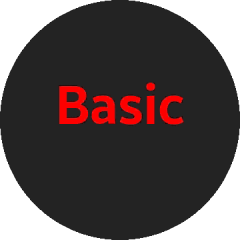

### Add Components and Functionalities with TAU

Tizen Advanced UI (TAU) is a Web UI library that enables you to create and manage various kinds of UI components. The components represent visual UI elements, such as button, checkbox, or list view. You can use the UI components to interact with the application screens. For more information, see [Tizen Advanced UI](../../guides/tau/tau.md) and [Tizen Advanced UI framework Reference](../../api/latest/ui_fw_api/ui_fw_api_cover.htm).

UI components for wearable devices is enhanced to support a circular screen. You can create an application that runs on both rectangular and circular screens using a single source code.

TAU helps you to create Tizen Web applications easily. The following figure shows the role of TAU and its relation to the Web application:


The UI in the **Basic UI** template contains only one visible text component. You can also create a UI with additional components.

To create a UI with more components, screens, and functionalities, use the TAU library in your application. The following example shows how to create pages, a list on a page, and navigate between the pages.

To create a Web application and design its UI with TAU, follow these steps:

1.  Install TAU templates.

    In Tizen Studio, select **Tools \> Package Manager**. In the **Package Manager** window that appears, select **Main SDK \> 5.0 Wearable \> Advanced \> TAU (IDE)**.

    >**Note**
    >
    >By default, the **TAU (IDE)** package is installed.

    

2.  Create a project that uses the TAU library.

    To create a project with a **TAU Basic** template, follow these steps:

    1.  In the Tizen Studio menu, select **File \> New \> Tizen Project**.
    2.  Select **Template \> Wearable v5.0 \> Web Application \> TAU Basic**.

        

    3.  Enter a project name that has a maximum length of 3-50 characters and a unique package ID.
	
        
    
	4.  Click **More properties** to specify **Location** and **Working sets**, and then click **Finish**.
	
        You can see the created project in the **Project Explorer** view. 

        The TAU library is located in the `lib` folder.

        

    You can create a new project using the TAU template or the TAU sample application included in Tizen Studio. You can also add the required TAU libraries to any existing Web project.

    To import TAU manually to an existing project in your HTML file, add the following elements to load the basic TAU libraries:
	
    -   Import the TAU library `tau(.min).js` with the `<script>` element.

        This element is mandatory as the TAU library uses the TAU JavaScript Interface.

    -   Import the TAU theme `tau(.min).css` with the `<link>` element.

        This element is mandatory.

    -   Import the circular TAU theme `tau.circle(.min).css` with the `<link>` element.

        This element is optional. However, if you want to develop a Web application on a circular device, this element is mandatory.

    -   Import JavaScript support `circle-helper.js` with the `<script>` element.

        This element is optional. If you import this file, you can easily get a list view that handles the rotary events.

    For better performance, all the CSS files must be included in the `<head>` element and all script elements must be included in the `</body>` element. The following example shows the **TAU Basic** template:

    ```html
    <!DOCTYPE html>
    <html>
       <head>
          <meta name="viewport" content="width=device-width, user-scalable=no"/>
          <title>Basic</title>
          <link rel="stylesheet" href="lib/tau/wearable/theme/default/tau.min.css"/>
          <link rel="stylesheet" media="all and (-tizen-geometric-shape: circle)" href="lib/tau/wearable/theme/default/tau.circle.min.css">
          <!--Load theme file for your application-->
          <link rel="stylesheet" href="css/style.css"/>
       </head>
       <body>
          <!--HTML BODY CONTENT-->
          <script src="lib/tau/wearable/js/tau.min.js"></script>
          <script src="js/app.js"></script>
          <script src="js/lowBatteryCheck.js"></script>
          <script src="js/circle-helper.js"></script>
       </body>
    </html>
    ```

    To include your own scripts and style sheets, you can add additional `<script src="<CUSTOM_LIBRARY_OR_JS_FILE>">` or `<link rel="stylesheet" src="<CUSTOM_CSS>">` elements. However, place them after the default `<script>` element, so that you can use any TAU APIs provided by the default libraries.

3.  Create the first page. 
    1.  Open the `index.html` file. By default, the `<body>` element of the HTML file contains one page composed of `<div>` element with the `ui-page` class that contains a header and a text paragraph:

        ```html
        <body>
           <div class="ui-page ui-page-active" id="main">
              <header>
                 <h2 class="ui-title">TAU Basic</h2>
              </header>
              <div class="ui-content ui-content-padding">
                 <p>Hello! </p>
              </div>
           </div>
           <script src="lib/tau/wearable/js/tau.min.js"></script>
           <script src="js/app.js"></script>
           <script src="js/lowBatteryCheck.js"></script>
           <script src="js/circle-helper.js"></script>
        </body>
        ```

    2.  Edit the contents of the first page:

        ```html
        <div class="ui-page ui-page-active" id="main">
           <header class="ui-header">
              <h2 class="ui-title">Hello World</h2>
           </header>
           <div class="ui-content content-padding">
              <p>This is content area</p>
           </div>
        </div>
        ```

        

    3.  You can add your own style for the content area with a defined `id` attribute:

        ```html
        <div class="ui-page ui-page-active" id="main">
           <header class="ui-header">
              <h2 class="ui-title">Hello World</h2>
           </header>
           <div class="ui-content content-padding" id="contentArea">
              <p>This is content area</p>
           </div>
        </div>
        ```

    4.  In the `style.css` file, add a CSS style for the new `id` attribute:

        ```css
        #contentArea {
           color: #8be3d1;
        }
        ```

        The style addition modifies the screen to show the content area text with the turquoise color.

        

4.  Add a list in the first page.

    You can add a list with the TAU list view component using the `<ul>` element and the `ui-listview` class:

    -   Create a basic static list by overwriting the page content in the `index.html` file:

        ```html
        <body>
           <div class="ui-page ui-page-active" id="main">
              <header class="ui-header">
                 <h2 class="ui-title">Hello World</h2>
              </header>
              <div class="ui-content content-padding">
                 <ul class="ui-listview">
                    <li><a href="#">List Item1</a></li>
                    <li><a href="#">List Item2</a></li>
                    <li><a href="#">List Item3</a></li>
                    <li><a href="#">List Item4</a></li>
                    <li><a href="#">List Item5</a></li>
                 </ul>
              </div>
           </div>
           <script src="lib/tau/wearable/js/tau.min.js"></script>
           <script src="js/app.js"></script>
           <script src="js/lowBatteryCheck.js"></script>
           <script src="js/circle-helper.js"></script>
        </body>
        ```

        

    -   For an advanced option on a circular device, you can also create a snap list view, which is a circular-specialized list view component.

        To create `SnapListview` using the `tau.helper` class, copy the following function to a JavaScript file in your project. If you have not done it previously, add the `circle-helper.js` file to the `<script>` element of `index.html`:  

        ```javascript
        (function(tau) {
            var page,
                list,
                listHelper;

            /* Check for a circular device */
            if (tau.support.shape.circle) {
                document.addEventListener('pagebeforeshow', function(e) {
                    page = e.target;
                    list = page.querySelector('.ui-listview');
                    if (list) {
                        /* Create SnapListView and binding rotary event using tau.helper */
                        listHelper = tau.helper.SnapListStyle.create(list);
                    }
                 });

                document.addEventListener('pagebeforehide', function(e) {
                    listHelper.destroy();
                });
            }
        }(tau));
        ```

        With `SnapListview`, you can scroll the list with the bezel.

        

5.  Create the second page.

    In Tizen Studio, create a new HTML file and name it `second.html`.

    Add the following content to the file to create a title text in the header area and a **Hello Tizen!** text in the content area:

    ```html
    <!DOCTYPE html>
    <html>
       <head>
          <meta name="viewport" content="width=device-width, user-scalable=no"/>
          <title>Hello TAU</title>
          <link rel="stylesheet"  href="lib/tau/wearable/theme/default/tau.min.css">
          <link rel="stylesheet" media="all" href="lib/tau/wearable/theme/default/tau.circle.min.css">
       </head>
       <body>
          <div class="ui-page" id="second">
             <header class="ui-header">
                <h2 class="ui-title">Second Page</h2>
             </header>
             <div id="secondContent" class="ui-content">
                Hello Tizen!
             </div>
          </div>
          <script type="text/javascript" src="lib/tau/wearable/js/tau.min.js"></script>
       </body>
    </html>
    ```

    

6.  Navigate between the pages.
    -   To navigate from the first page to the second page, in the `index.html` file, add the path of the second page  to the `<li><a href>` element:

        ```html
        <ul class="ui-listview">
           <li><a href="second.html">Go to Second Page</a></li>
           <li><a href="#">List Item2</a></li>
           <li><a href="#">List Item3</a></li>
           <li><a href="#">List Item4</a></li>
           <li><a href="#">List Item5</a></li>
        </ul>
        ```

        Run the application in the emulator, and click the **Go to Second Page** link to move from the `index.html` page to the `second.html` page.

        

    -   To navigate from the second page back to the first, click the back key.

        You can navigate from one page to the other using the `<a href="PAGE_FILE_NAME">` element. However, you cannot navigate back. 
		To enable the user to navigate back to the first page, you must add some code in a JavaScript file.

        To create a new `app.js` JavaScript file, follow these steps:

        1.  In the `index.html` file, add `<script src="app.js"></script>` the `</body>` element:

            ```html
            <body>
               <div class="ui-page" id="main">
                  <header class="ui-header">
                     <h2 class="ui-title">Hello TAU</h2>
                  </header>
                  <div class="ui-content">
                     <!--Content-->
                  </div>
               </div>
               <script type="text/javascript"
                       src="lib/tau/wearable/js/tau.min.js"></script>
               <script type="text/javascript" src="js/circle-helper.js"></script>
               <script src="app.js"></script>
            </body>
            ```

        2.  In the **Project Explorer** view, right-click the project and select **New \> JavaScript Source File**.
        3.  Type the file name as `app.js` and click **Finish**.
        4.  In the `app.js` file, all kinds of logic can be added to the application. In this case, add the code for returning to the previous page when the back key is pressed:

            ```javascript
            (function() {
                window.addEventListener('tizenhwkey', function(ev) {
                    if (ev.keyName === 'back') {
                        var page = document.getElementsByClassName('ui-page-active')[0],
                            pageid = page ? page.id : '';

                        if (pageid !== 'main') {
                            window.history.back();
                        }
                    }
                });
            }());
            ```

    -   To exit the application.

        You can make your application exit by adding more lines to the `app.js` file.

        You have to consider the fact that when you click the back key, the application can only exit if it is showing the first page. Therefore, if the application is showing the second page, then the application must return to the first page.

        The following code shows how to handle the back key input with page navigation and application exit. Similar code is included in the **TAU Basic** project template `app.js` file by default:

        ```javascript
        (function() {
            window.addEventListener('tizenhwkey', function(ev) {
                if (ev.keyName === 'back') {
                    var page = document.getElementsByClassName('ui-page-active')[0],
                        pageid = page ? page.id : '';

                    if (pageid === 'main') {
                        try {
                            tizen.application.getCurrentApplication().exit();
                        } catch (ignore) {}
                    } else {
                        window.history.back();
                    }
                }
            });
        }());
        ```

## Build Application

After you have created the application project, you can implement the required features. In this [Create Project](#create-project) example mentioned in this page, only the default features from the project template are used. Hence, no code changes are required.

When you build your application, the building process performs a validation check. It also compiles the JavaScript and the CSS files.

You can build the application in one of the following ways:

-   **Automatically**

    The automatic build means that Tizen Studio automatically builds the application whenever you change a source or resource file, and save the application project.

    To use the automatic build, follow these steps:

    1.  In the **Project Explorer** view, select the project
    2.  In the Tizen Studio menu, select **Project \> Build Automatically**.

        

    You can toggle the automatic build on and off by selecting **Project \> Build Automatically**.

-   **Manually**

    The manual build means that you determine when an application is built.

    To manually build an application, in the **Project Explorer** view, right-click the project and select **Build Project**.

    

    Alternatively, in the **Project Explorer** view, you can select the project and Press **F10**.

After you have built the application, you can run the application.

## Run Application

You can run the Web application using an [emulator](../../tutorials/process/run-debug-app.md#emulator) or a [target device](../../tutorials/process/run-debug-app.md#target)

>**Note**
>
>Web Simulator does not support circular UI. Therefore, this section does not cover the instructions for running the application on the [Web Simulator](../../tutorials/process/run-debug-app.md#simulator).

### Run Application on Emulator

To run the application on the emulator, follow these steps:

1.  Launch an emulator instance in [Emulator Manager](../../../tizen-studio/common-tools/emulator-manager.md):

    1.  In the Tizen Studio menu, select **Tools \> Emulator Manager**.

        

    2. In the **Emulator Manager** window that appears, select a wearable emulator from the list and click **Launch**. If no applicable emulator instance exists, [create a new one](../../../tizen-studio/common-tools/emulator-manager.md#create).

        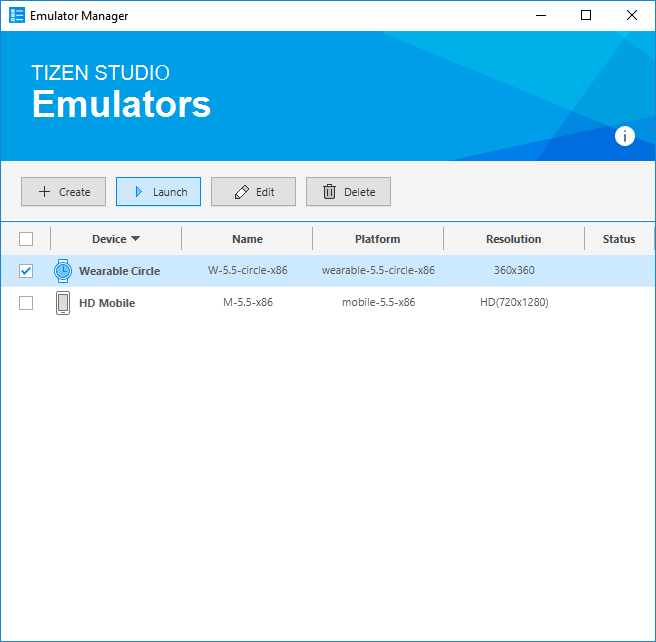

        The emulator is launched. You can also see the new emulator instance and its folder structure in **Tools \> Device Manager**.

        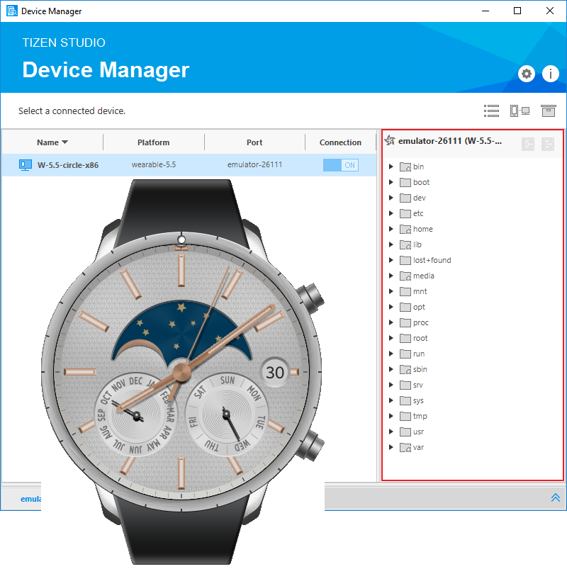

2.  Generate a security profile.

    Before you run the application, you must [sign your application package with a certificate profile](../../../tizen-studio/common-tools/certificate-registration.md) in Tizen Studio.

3.  Run the application:
    1.  In the **Project Explorer** view, right-click the project and select **Run As \> Tizen Web Application**.

        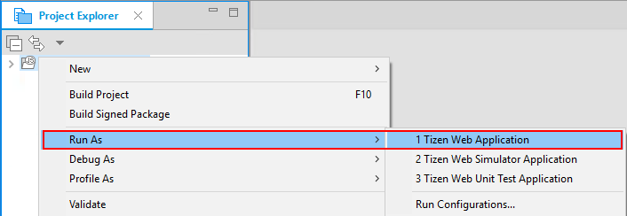

        Alternatively, you can also select the project in the **Project Explorer** view and perform one of the following:

        -   Press **Ctrl + F11**.
        -   In the toolbar, click .

        If you have created multiple emulator instances, select the instance you want from the drop-down list in the toolbar. If you select an offline emulator, it is automatically launched when you run the application.

        

    2.  Verify whether the application launches on the emulator.

        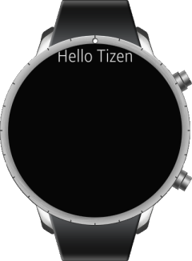

        > **Note**
        >
        > If the emulator display has switched off, you cannot see the application launch. To activate, click the power key in the lower-right corner of the emulator.

        While the application is running, you can see the logs, exception messages, and debug information using the **Log** view in Tizen Studio. To see the logs in Tizen Studio, select **Window \> Show View \> Log**.

For more information, see [Using Emulator Control Keys, Menu, and Panel](../../../tizen-studio/common-tools/emulator-control-panel.md) and [Using Extended Emulator Features](../../../tizen-studio/common-tools/emulator-features.md).

### Run on Target Device

To run the application on a target device, follow these steps:

1.  Connect the wearable target device to your computer:
    1.  Define settings on the device:
        -   Select **Settings \> Connections**, and switch on **Bluetooth**.

            

            

        -   Select **Settings \> Connections**, and switch on **Wi-Fi**.

            The device and the computer must be connected to the same Wi-Fi network.

            

            >**Note** 
            >
            >After connecting to the WiFi network, the IP address appears on the device. 

        -   Select **Settings \> Gear info**, and switch on **Debugging**.

            

    2.  In **Tools \> Device Manager**, verify whether the device is connected.
        
		
		
		>**Note**
		>
		>Tizen Studio automatically detects the device. In the Tizen Studio toolbar, the device appears in the device list. You can also connect your device using [Remote Device Manager](../wearable/first-app.md#remote_device).

    3.  To allow the Samsung Wearable device to read log data and copy application files from the wearable device, install the application manually and select the accept mark.

        
		
		>**Note**
		>
		>In the first attempt, the connection fails and the device asks for user confirmation.    

2.  Generate an author certificate.

    Before you run the application, you must [sign your application package with a certificate profile](../../../tizen-studio/common-tools/certificate-registration.md) in Tizen Studio.

3.  Run the application:
    1.  In **Tools \> Device Manager**, select the device.
    2.  In **Project Explorer** view, right-click the project and select **Run As \> Tizen Web Application**.

        

        Alternatively, you can select the project in the **Project Explorer** view and perform one of the following:

        -   Press **Ctrl + F11**.
        -   In the toolbar, click .

        If you have both connected device and emulator instances, then select the device from the drop-down list in the toolbar.

        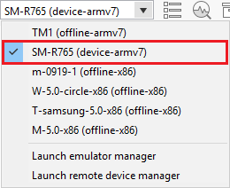

    3.  Verify whether the application launches on the target device.

        >**Note**
        >
        >The application launches with default launch configuration. 
    
        To create and use custom launch configuration, follow these steps:

        1. In the **Project Explorer** view, right-click the project and select **Run As > Run Configurations**.
       
        2. In the **Run Configurations** window that appears, select  and define the configuration details.
           
		    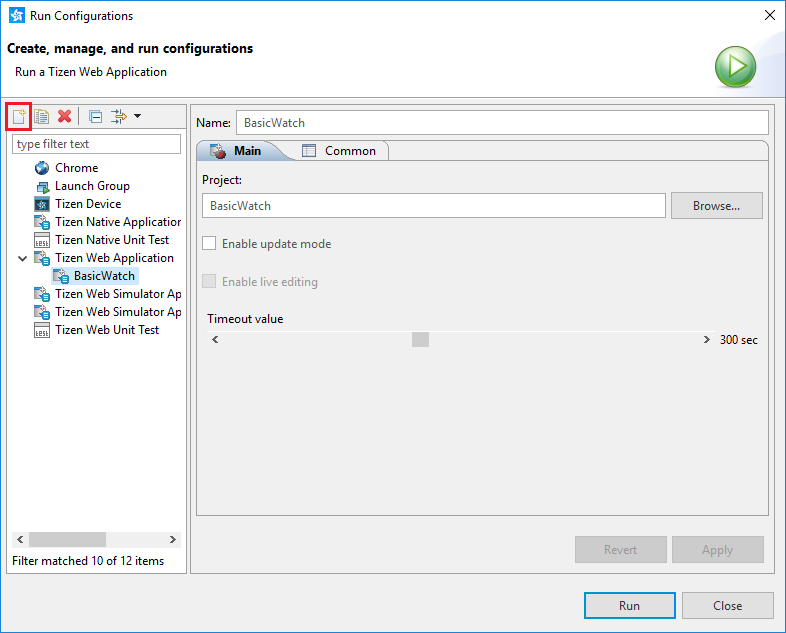
			   
	    3.  To launch the application, click **Run**. 

## Submit Application on Samsung Galaxy Store

[Samsung Galaxy Store](https://seller.samsungapps.com/) is an app store designed specifically for Samsung Galaxy and Watch devices. It caters in over 180 countries to download and install the apps that users want on their Samsung Galaxy and Watch devices. Samsung Galaxy Store has a wide variety of useful apps in categories, such as Entertainment, Finance, Health, Music, and Social Networking.


To submit and distribute app for Samsung Galaxy Wearable you need to submit you app package and details on [Seller Office at Samsung Galaxy Store](https://seller.samsungapps.com/).

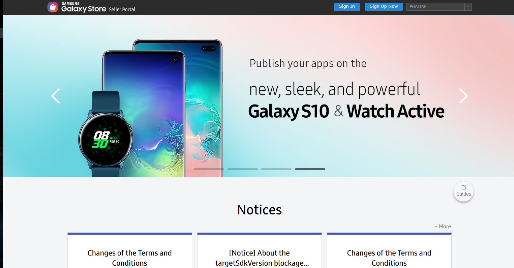

For more information on how to distribute app for Samsung Galaxy Gear and Wearable, see [Samsung Galaxy Watch Distribution](https://developer.samsung.com/galaxy-watch/distribute/how-to-distribute).