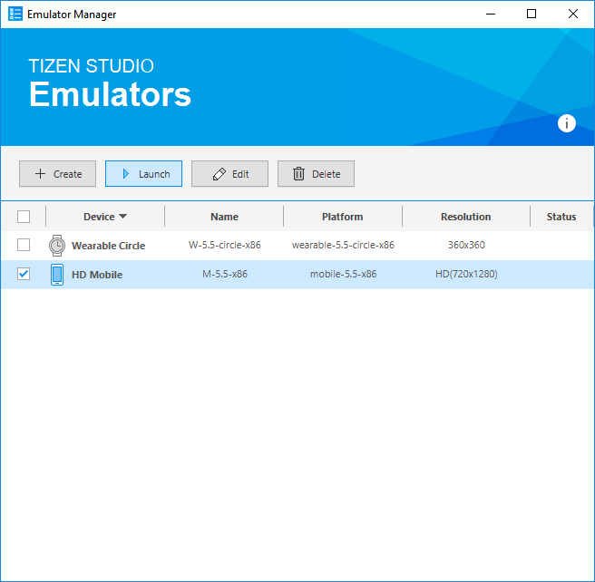
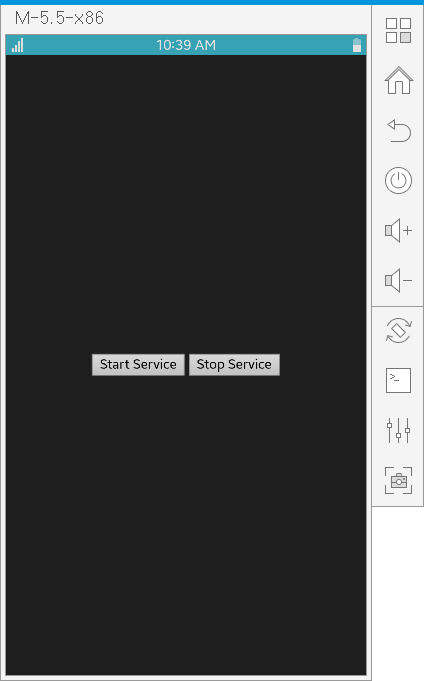

# Create Your First Web Service Application

**Welcome to Web service application development!**

A Web service consists of a JavaScript file with its business logic running on the Node.js runtime and a config.xml file specifying a Tizen package. This means that you can also use Tizen Web service life-cycle and Node.js built-in modules.

Study the following instructions to help familiarize yourself with Tizen [Web application development process](../../tutorials/process/app-dev-process.md) as well as using Tizen Studio and installing the created application on the emulator or target device. The Web service is a kind of Web application and its development is similar to Web application development.

The following instructions help you to create and run a basic Web service, which enables Web service life-cycle and ensures communication between the Web service and the Web application:

1.  Before you get started with developing Web service application, download and install [Tizen Studio](../../../tizen-studio/index.md)

    For more information on the installation process, see the [installation guide](../../../tizen-studio/setup/install-sdk.md).

2.  [Create a Web Service Project](#create) using Tizen Studio

    This step shows how you can use a predesigned project template that creates all the basic files and folders required for your project.

3.  [Build your Web Service Package](#build)

    After you have implemented code for the features you want, this step shows how you can build the Web service to validate and compile the code.

4.  [Run Web Service](#run)

    This step shows how you can run the Web service on an emulator or real target devices.

5.  [Control Web Service from Web Application](#design_ui)

    This step shows how you can start and stop the Web service using Web application.

6.  [Structure Web Service](#structure_service)

    This step shows how you can use Web service life-cycle callbacks.

When you are developing a more complex Web service, you can take advantage of the [Web tools included in Tizen Studio](../../../tizen-studio/web-tools/index.md) to ease the tasks of creating functionality and designing Web applications that use the Web service.

<a name="create"></a>
## Create a Project

The following example shows you how to create and configure a basic Web service project in Tizen Studio.

A Web service project contains all the files required for developing a Web service. Web service runs in the background and does not have a graphical interface, which means that you can create a Web service, but it is dependent on the corresponding Web application to run.

To create the Web service project:

1.  Launch Tizen Studio.

2.  In Tizen Studio menu, select **File \> New \> Tizen Project**.

    

    The Project Wizard opens.

3.  In the Project Wizard, define the project details.

    The Project Wizard is used to create the basic Web service skeleton with the required folder structure and mandatory files. You can easily create different Web services by selecting an applicable template or sample from the Project Wizard to use.

    1.  Select the **Template** project type and click **Next**.

        

	2.  Select the profile (**Mobile**) and version from a drop-down list and click **Next**.

        The version depends on the platform version you have installed and with which you are developing the Web service.

        

    3.  Select the **Web Application** application type and click **Next**.

        

    4.  Select the **Web UI Service UI** template and click **Next**.

        

    5.  Define the project properties and click **Finish**.

        You can enter the project name (3-50 characters) and the unique package ID. You can also select the location and working sets by clicking **More properties**.

        

        The Project Wizard sets up configurations and creates the Web service files using the template. For more information on the Project Wizard and the available templates, see [Create Tizen Projects with Tizen Project Wizard](../../../tizen-studio/web-tools/project-wizard.md).

<a name="build"></a>
## Build Web Service Package

After the Web service project is created, you can implement the required features. In the following example, only the default features from the project template are used, thus no code changes are required.

When your Web service code is ready, you must build the Web service. The building process performs a validation check and packs your resource files.

To build the signed Web service package, right-click the project in the **Project Explorer** view and select **Build Signed Package**.

**Figure: Build Web Service**


After you have built the Web service, run it.

<a name="run"></a>
## Run your Web Service

You can run the Web service on the [emulator](../../tutorials/process/run-debug-app.md#emulator) or a [real target device](../../tutorials/process/run-debug-app.md#target).

<a name="emulator"></a>
### Run on Emulator

To run the Web service on the emulator:

1. Launch an emulator instance in the [Emulator Manager](../../../tizen-studio/common-tools/emulator-manager.md):
    1. In Tizen Studio menu, select **Tools \> Emulator Manager**.

        

    2.  In the Emulator Manager, select a mobile emulator from the list and click **Launch**.

        If no applicable emulator instance exists, [create a new one](../../../tizen-studio/common-tools/emulator-manager.md#create).

        

        The emulator is launched in its own window. You can also see the new emulator instance and its folder structure in the **Device Manager**.

        

2. Generate a security profile.

    Before you run the Web service, you must [sign your Web service package with a certificate profile](../../../tizen-studio/common-tools/certificate-registration.md) in Tizen Studio.

3. Run Web service:

    Web services run by Web applications. Therefore, you need to run a Web application first.

    In the **Project Explorer** view, right-click the Web application project and select **Run As \> Tizen Web Application**.

      

      Alternatively, you can also select the project in the **Project Explorer** view and do one of the following:

      -   Press the **Ctrl + F11** keys.
      -   Click the run icon in the toolbar.

      If you have created multiple emulator instances, select the instance you want from the combo box in the toolbar before selecting to run the application. If you select an offline emulator, it is automatically launched when you select to run the application.

      

<a name="emulator"></a>
### Run on Target Device

To run the Web service on the real target device:

1. Generate a security profile.

    Before you run the Web service, you must [sign your Web service package with a certificate profile](../../../tizen-studio/common-tools/certificate-registration.md) in Tizen Studio.

2. Run Web service:

    1. Choose real target device in the toolbar.

        

    2. Run application.

        

<a name="design_ui"></a>
## Control Web Service from Web Application

The following example shows a Web application that runs or terminates Web service using `startService()` and `stopService()`:

- Launching a Web service by Web application

  The Web application launches a Web service by calling the `startService()` method with a parameter Web service ID:

  ```
  <script type="module">
  import * as service from 'wrt:service';

  var pkg_id = tizen.application.getCurrentApplication().appInfo.packageId;
  var service_id = pkg_id + ".Service";

  service.startService(service_id).then(function() {
    alert("Succeeded to start service");
    var xhttp = new XMLHttpRequest();
    xhttp.onreadystatechange = function() {
      if (this.readyState == 4 && this.status == 200) {
        alert("Data from Web service : " + this.responseText);
      }
    };
    xhttp.open("GET", "/tmp/" + pkg_id + "/data.txt", true);
    xhttp.send();
  }, function() {
      alert("Failed to start service");
  });
  </script>
  ```

- Terminating a Web service by Web application

  The Web application teminates a Web service by calling the `stopService()` method with a parameter Web service ID:

  ```
  <script type="module">
  import * as service from 'wrt:service';

  var pkg_id = tizen.application.getCurrentApplication().appInfo.packageId;
  var service_id = pkg_id + ".Service";

  service.stopService(service_id).then(function() {
    alert("Succeeded to stop service");
  }, function(error) {
    alert("Failed to stop service : " + error);
  });
  </script>
  ```

<a name="structure_service"></a>
## Structure Web Service

The following code shows a simple Web service with Web service life-cycle callbacks. The callbacks are called by the Web application with `startService()` and `stopService()`.

```
module.exports.onStart = function() {
  console.log("onStart is called");
  try {
    var pkg_id = 'gWHpKEGBUQ';
    var folder = '/tmp/' + pkg_id;
    if (!fs.existsSync(folder)) {
      fs.mkdirSync(folder);
    }
    // TODO: Add your background logic here and store the result.
    var data = 'Data is written by Web service.';
    fs.writeFileSync(folder + '/data.txt', data);
  } catch(err) {
    // An error occurred
    console.log(err);
  }
};
module.exports.onStop = function() {
  console.log("onStop is called");
};
```