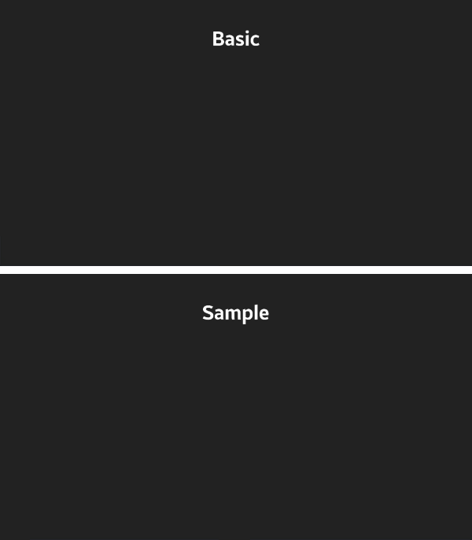
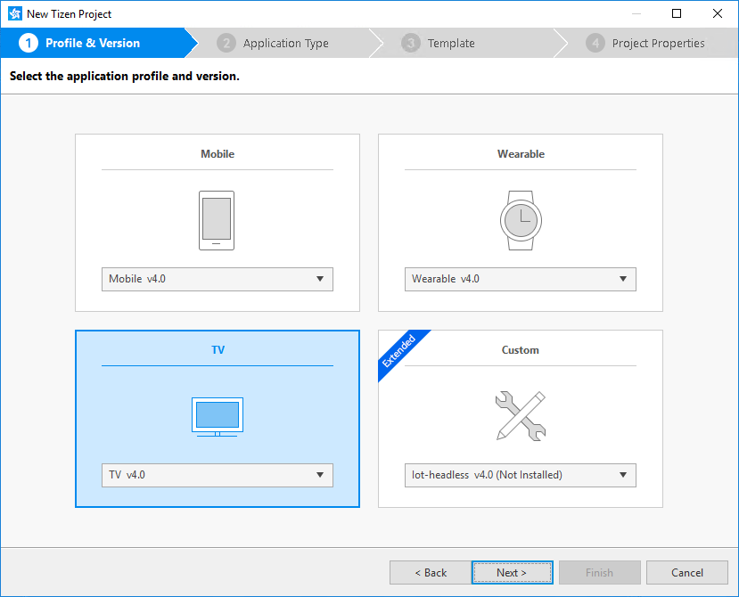
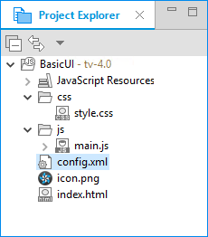
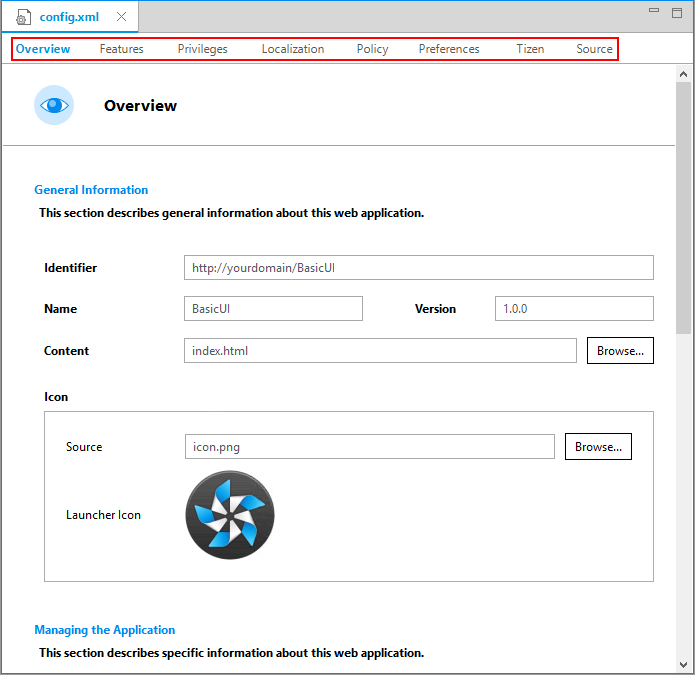
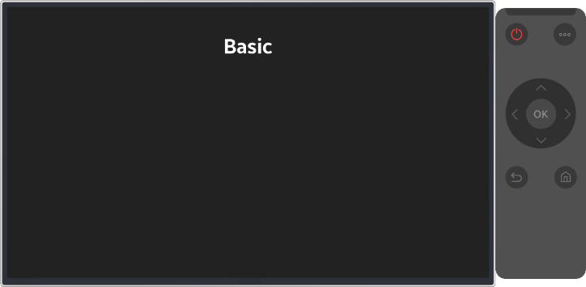

# Creating Your First Tizen TV Web Application

**Welcome to Tizen TV Web application development!**

A TV Web application is basically a Web site stored on a TV. You can create it using Web-native languages, such as HTML5, CSS, and JavaScript.

Study the following instructions to help familiarize yourself with the Tizen [Web application development process](../../tutorials/process/app-dev-process.md) as well as using the Tizen Studio and installing the created application on the emulator or target device. With the instructions, you can create and run a basic TV Web application, which displays some text on the screen and changes the text when the user clicks it:

1.  Before you get started with developing Tizen applications, download and install the [Tizen Studio](../../../tizen-studio/index.md).

    For more information on the installation process, see the [installation guide](../../../tizen-studio/setup/install-sdk.md).

2. [Create a TV Web project](#create) using the Tizen Studio.

    This step shows how you can use a predesigned project template that creates all the basic files and folders required for your project.

3. [Build the application](#build).

    After you have implemented code for the features you want, this step shows how you can build the application to validate and compile the code.

4. [Run the application](#run).

    This step shows how you can run the application on the emulator, simulator, or a real target device.

5. [Design a UI](#ui).

    This step shows how you can create the application UI and make small alterations to it to improve the usability of your application.

When you are developing a more complex application, you can take advantage of the [Web tools included in the Tizen Studio](../../../tizen-studio/web-tools/overview.md) to ease the tasks of creating functionality and designing the application UI.

<a name="create"></a>
## Creating a Project

The following example shows you how to create and configure a basic TV Web application project in the Tizen Studio. An application project contains all the files that make up an application.

The following figure illustrates the application to be created:

-   The top figure shows the application screen when the application starts. The screen displays the **Basic** text.

-   The bottom figure shows the application screen after you click the text. The screen now displays the **Sample** text. Clicking the text area switches between the 2 texts.

**Figure: TV Web Basic application**



To create the application project:

1. Launch the Tizen Studio.
2. Make sure the **Web** perspective is selected in the upper-right corner of the Tizen Studio window.

    

    If not, select it. If the perspective is not visible, in the Tizen Studio menu, select **Window &gt; Perspective &gt; Open Perspective &gt; Other &gt; Web**, and click **OK**.

3. In the Tizen Studio menu, select **File &gt; New &gt; Tizen Project**.

    

    The Project Wizard opens.

4. In the Project Wizard, define the project details.

    The Project Wizard is used to create the basic application skeleton with the required folder structure and mandatory files. You can easily create different applications by selecting an applicable template or sample for the Project Wizard to use.

    1. Select the **Template** project type and click **Next**.

        

    2. Select the profile (**TV**) and version from a drop-down list and click **Next**.

        The version depends on the platform version you have installed and with which you are developing the application.

        

    3. Select the **Web Application** application type and click **Next**.

        

    4. Select the **Basic UI** template and click **Next**.

        

    5. Define the project properties and click **Finish**.

        You can enter the project name (3-50 characters) and the unique package ID. You can also select the location and working sets by clicking **More properties**.

        

        The Project Wizard sets up the project, creates the application files using the default content from the template, and closes. For more information on the Project Wizard and the available templates, see [Creating Tizen Projects with Tizen Project Wizard](../../../tizen-studio/web-tools/project-wizard.md).

You can see the created project in the **Project Explorer** view. The most important files and folders include:

-   `css`: Folder for CSS files used by the application to style its content

-   `js`: Folder for JavaScript files used by the application to implement its functional logic

-   `config.xml`: Application configuration file used by the platform to install and launch the application

-   `icon.png`: Application icon file used by the platform to represent the application

-   `index.html`: Main HTML file for the layout of the application screen

**Figure: Application in the Project Explorer**



> **Note**  
> You can [view and modify the application configuration](#configuration) in the Web application configuration editor. In this example, no configuration changes are required.

Your application project is now ready for further actions. Next, build the application.

<a name="configuration"></a>
### Managing the Application Configuration

To view and modify the application configuration:

1.  In the **Project Explorer** view, double-click the `config.xml` file of the application. The Tizen Studio opens the file in the Web application configuration editor.

2. In the configuration editor, view and modify the configuration details using the various tabs:

    

    -   **Overview**: Define general information, such as the name and icon of the application.

    - **Features**: Define required software and hardware features. This information is used for application filtering in the Tizen Store.

    - **Privileges**: Define the security-sensitive APIs or API groups accessed and used by the application.

    - **Localization**: Define localized values for the application name, description, and license.

    - **Policy**: Request network resource permissions to access external network resources.

    - **Preferences**: Define name-value pairs that can be set or retrieved through the application.

    - **Tizen**: Edit the Tizen schema extension properties of the application.

    - **Source**: View and edit the source code of the `config.xml` file. Changes made and saved on the other tabs are reflected in the source code and vice versa.

        > **Note**  
        > The `config.xml` file must conform to both the XML file format and the W3C specification requirements. Editing the file in the **Source** tab is intended for advanced users only.

3. To save any changes, in the Tizen Studio menu, select **File &gt; Save All**.

For more information on configuring the application, see [Setting the Web Application Configuration](../../tutorials/process/setting-properties.md#set_widget).

<a name="build"></a>
## Building Your Application 

After you have created the application project, you can implement the required features. In this example, only the default features from the project template are used, and no code changes are required.

When your application code is ready, you must build the application. The building process performs a validation check and compiles your JavaScript and CSS files.

You can build the application in the following ways:

-   **Automatically**

    The automatic build means that the Tizen Studio automatically rebuilds the application whenever you change a source or resource file and save the application project.

    To use the automatic build:

    1.  Select the project in the **Project Explorer** view.
    2. In the Tizen Studio menu, select **Project &gt; Build Automatically**.

        

        A check mark appears next to the menu option.

    You can toggle the automatic build on and off by reselecting **Project &gt; Build Automatically**.

- **Manually**

    The manual build means that you determine yourself when the application is built.

    To manually build the application, right-click the project in the **Project Explorer** view and select **Build Project**.

    **Figure: Manually building the application**

    

    Alternatively, you can also select the project in the **Project Explorer** view and do one of the following:

    -   In the Tizen Studio menu, select **Project &gt; Build Project**.
    -   Press the **F10** key.

After you have built the application, run it.

<a name="run"></a>
## Running Your Application

You can run the Web application on the [emulator](../../tutorials/process/run-debug-app.md#emulator), [Samsung TV Simulator](http://developer.samsung.com/tv/develop/getting-started/using-sdk/tv-simulator), or a [real target device](../../tutorials/process/run-debug-app.md#target).

<a name="emulator"></a>
### Running on the Emulator 

To run the application on the emulator:

1. Launch an emulator instance in the [Emulator Manager](../../../tizen-studio/common-tools/emulator-manager.md):

    1. In the Tizen Studio menu, select **Tools &gt; Emulator Manager**.

        

    2. In the Emulator Manager, select a TV emulator from the list and click **Launch**.

        If no applicable emulator instance exists, [create a new one](../../../tizen-studio/common-tools/emulator-manager.md#create).

        

        The emulator is launched in its own window. You can also see the new emulator instance and its folder structure in the **Device Manager**.

        

2. Generate a security profile.

    Before you run the application, you must [sign your application package with a certificate profile](../../../tizen-studio/common-tools/certificate-registration.md) in the Tizen Studio.

3. Run the application:
   1.  In the **Project Explorer** view, right-click the project and select **Run As &gt; Tizen Web Application**.

        

        Alternatively, you can also select the project in the **Project Explorer** view and do one of the following:

        -   Press the **Ctrl + F11** key.
        -   Click the run icon in the toolbar.

        If you have created multiple emulator instances, select the instance you want from the combo box in the toolbar before selecting to run the application. If you select an offline emulator, it is automatically launched when you select to run the application.

        

   2. Confirm that the application launches on the emulator.

        

        While the application is running, the **Log** view in the Tizen Studio shows the log, debug, and exception messages from the methods defined in the log macros. To see the view, in the Tizen Studio menu, go to **Window &gt; Show View &gt; Log**.

For more information on using the emulator features, see [Using Emulator Control Keys, Menu, and Panel](../../../tizen-studio/common-tools/emulator-control-panel.md) and [Using Extended Emulator Features](../../../tizen-studio/common-tools/emulator-features.md).

<a name="simulator"></a>
### Running on the Samsung TV Simulator

To run the application on the simulator:

1.  In the **Project Explorer** view, right-click the project and select **Run As &gt; Tizen Web Simulator Application (Samsung TV)**.

    

2. Confirm that the application launches on the simulator.

    

For more information on using the simulator features, see [TV Simulator](http://developer.samsung.com/tv/develop/getting-started/using-sdk/tv-simulator).

<a name="target"></a>
### Running on a Target Device

To run the application on a target device:

1. Connect the TV target device to your computer:

    1. Define settings on the TV:

         1. Start the TV, press the **Smart Hub** key, and select **Apps**.
         2. In the **Apps** panel, enter the "Magic sequence" (keys **1**, **2**, **3**, **4**, and **5** in sequence).
         3. Set the **Developer mode** to **On**, and enter the IP address of your computer.
         4. Click **OK** and reboot the TV.

    2. In the Tizen Studio, use the Remote Device Manager to connect the TV:
   
        1. In the **Device Manager**, click the **Remote Device Manager** button.

            

        2. In the **Remote Device Manager** window, click **+**.

            

        3. In the **Add Device** window, enter the device and network details, and click **Add**.

            

        4. In the **Remote Device Manager** window, switch the new device on by clicking the switch under **Connect**.

            

   3. In the **Device Manager**, confirm that the device is connected (shown in the device list).

        

   4. Right-click the device and select **Permit to install application**.

2. Generate an author certificate.

    Before you run the application, you must [sign your application package with a certificate profile](../../../tizen-studio/common-tools/certificate-registration.md) in the Tizen Studio.

3. Run the application:
   1.  In the **Device Manager**, select the device.
   2. In **Project Explorer** view, right-click the project and select **Run As &gt; Tizen Web Application**.

        

        Alternatively, you can also select the project in the **Project Explorer** view and do one of the following:

        -   Press the **Ctrl + F11** key.
        -   Click the run icon in the toolbar.

        If you have both a connected device and existing emulator instances, select the device from the combo box in the toolbar before selecting to run the application.

        

   3. Confirm that the application launches on the target device.

   > **Note**  
   > The application is launched using the default debug run configuration. To create and use another configuration:
   > 1.  In the `Project Explorer` view, right-click the project and select `Run As > Run Configurations`.
   > 2.  In the `Run Configurations` window, click the `New Launch Configuration` icon (), define the configuration details, and launch the application by clicking `Run`.
   >    

<a name="ui"></a>
## Designing a Simple UI

The TV application created with the **Basic UI** template has a simple user interface with a text component showing the **Basic** text in the middle of the screen.

The UI is created using [W3C/HTML](https://www.w3schools.com). The W3C specifications provide HTML and CSS features for creating a user interface. With HTML, you can define the structure of the application screens, while CSS allows you to define the look and feel of the screens.

**Figure: User interface in the Basic UI template**


### Creating the Basic UI

The UI in the **Basic UI** template uses the HTML DOM, which is a structured model to control Web elements. It is an official W3C standard to express the document regardless of platforms or languages, and the foundation of the HTML5 APIs. The template contains the following components:

-   The `<html>` element is the top-level element of the HTML DOM tree that wraps the entire document, and it has the `<head>` and `<body>` elements as child nodes:

    ```
    <!DOCTYPE html>
    <html>
       <head>
          <!--Content-->
       </head>
       <body>
          <!--Content-->
       </body>
    </html>
    ```

- The `<head>` element contains the information that the browser refers to when rendering the body element to interpret information, such as the title of the HTML document, and the location of the related CSS and JavaScript files:

    -   `<title>`: Defines the title of the document.
    -   `<meta>`: Defines information, such as encoding, creator, and keywords of the document.
    -   `<style>`, `<link>`: Sets the styles of the document.
    -   `<script>`, `<noscript>`: Adds functions to the document.

    ```
    <head>
       <meta charset="utf-8"/>
       <meta name="viewport" content="width=device-width, initial-scale=1.0, maximum-scale=1.0">
       <meta name="description" content="Tizen TV basic template generated by Samsung TV Web IDE"/>

       <title>Tizen TV Web IDE - Tizen TV - Tizen TV basic Application</title>

       <link rel="stylesheet" type="text/css" href="css/style.css"/>
       <script src="js/main.js"></script>
    </head>
    ```

- The `<body>` element defines the area displaying content on the browser screen. In this case, it defines the **Basic** text component:

    ```
    <body>
       <div class="contents">
          <div style='margin:auto;'>
             <span class="content_text" id="textbox">Basic</span>
          </div>
       </div>
    </body>
    ```

### Modifying Existing Components with CSS

CSS (Cascading Style Sheets) specifies the layout and styling of the Web application.

There are various ways to connect CSS with HTML:

-   `style` attribute in an HTML element
-   `<link>` element in the `<head>` element
-   `@import` attribute in the CSS area
-   `<style>` element in the `<head>` element

Applying the style of an HTML element directly with the `style` attribute has the highest priority. On the other hand, creating a separate CSS file and managing it separately is convenient when it comes to applying changes in the future.

In the **Basic UI** template, the CSS file is connected to the HTML file using a `<link>` element in the `<head>` element:

```
<head>
   <meta charset="utf-8"/>
   <meta name="viewport" content="width=device-width, initial-scale=1.0, maximum-scale=1.0">
   <meta name="description" content="Tizen TV basic template generated by Samsung TV Web IDE"/>

   <title>Tizen TV Web IDE - Tizen TV - Tizen TV basic Application</title>

   <link rel="stylesheet" type="text/css" href="css/style.css"/>
   <script src="js/main.js"></script>
</head>
```

The following lines in the CSS code describe the styling of the text in an element with the `content_text` class:

```
.content_text {
    font-weight:bold;
    font-size:5em;
    color:#fff;
}
```

The text is set to show up as bolded, and colored white (`#fff`). To change the color of the text, change the CSS code by modifying the `color` attribute (in this case, it is changed to `#2e9afe` to make the text blue):

```
.content_text {
    font-weight:bold;
    font-size:5em;
    color:#2e9afe;
}
```

**Figure: Application screen with the new text color**


