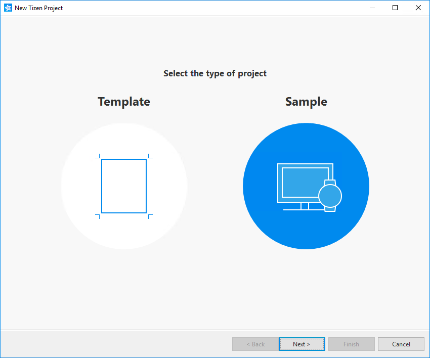
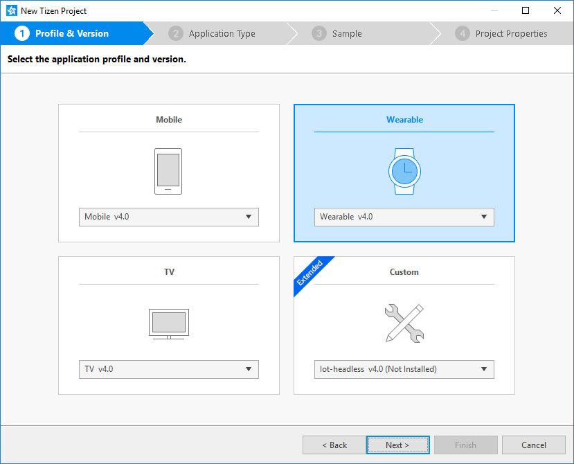
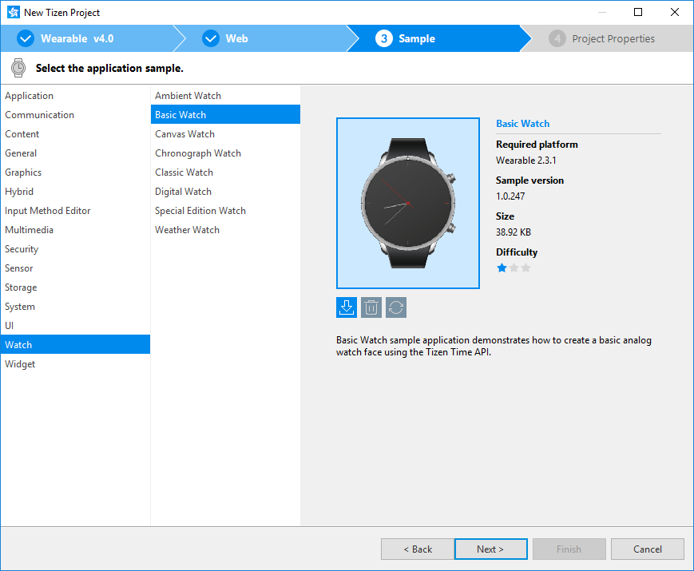
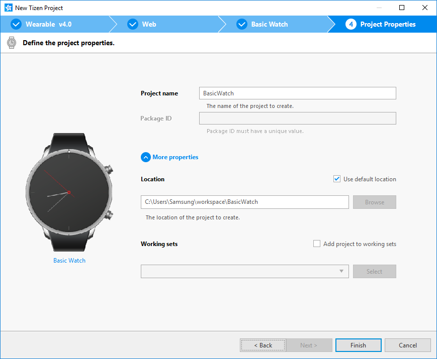
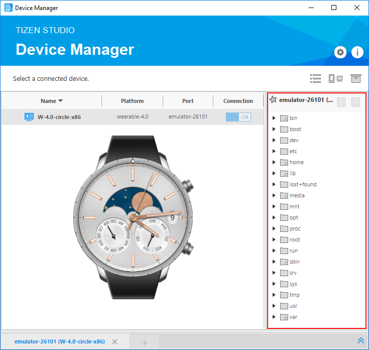
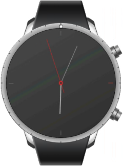
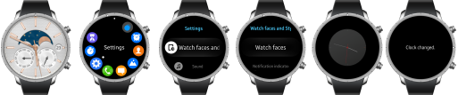
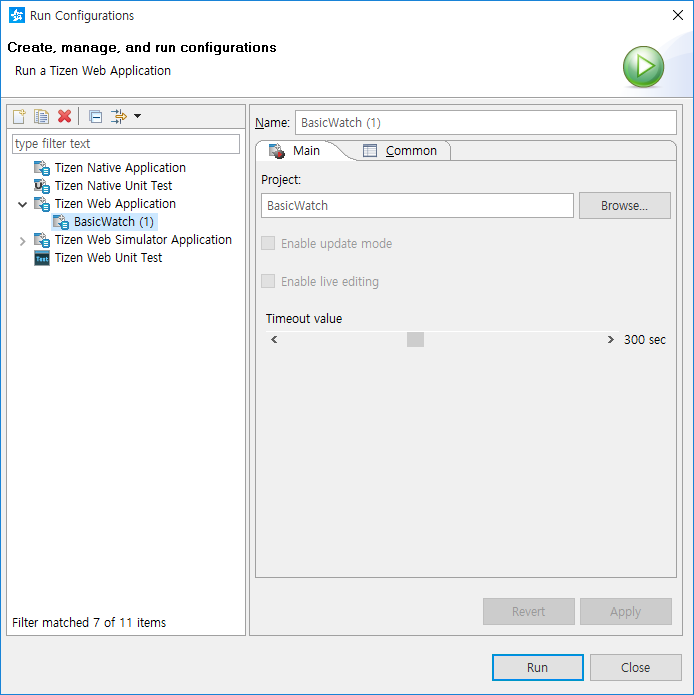
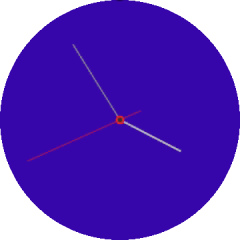

# Creating Your First Tizen Wearable Web Watch Application

**Welcome to Tizen wearable Web watch application development!**

A wearable Web application is basically a Web site stored on a wearable device. You can create it using Web-native languages, such as HTML5, CSS, and JavaScript, and run it on Tizen wearable devices to display a customized watch face to the user.

Study the following instructions to help familiarize yourself with the Tizen [Web application development process](../../tutorials/process/app-dev-process.md) as well as using the Tizen Studio and installing the created application on the emulator or target device. With the instructions, you can create and run a basic wearable Web watch application, which displays an analog watch face with the current time on the screen:

1.  Before you get started with developing Tizen applications, download and install the [Tizen Studio](../../../tizen-studio/index.md).

    For more information on the installation process, see the [installation guide](../../../tizen-studio/setup/install-sdk.md).

2.  [Create a wearable Web watch project](#create) using the Tizen Studio.

    This step shows how you can use a predesigned project template that creates all the basic files and folders required for your project.

3.  [Build the application](#build).

    After you have implemented code for the features you want, this step shows how you can build the application to validate and compile the code.

4.  [Run the application](#run).

    This step shows how you can run the application on the emulator or a real target device.

5.  [Design a UI](#ui).

    This step shows how you can create the application UI and make small alterations to it to improve the usability of your application.

When you are developing a more complex application, you can take advantage of the [Web tools included in the Tizen Studio](../../../tizen-studio/web-tools/overview.md) to ease the tasks of creating functionality and designing the application UI.

<a name="create"></a>
## Creating a Project

The following example shows you how to create and configure a basic wearable Web watch application project in the Tizen Studio. An application project contains all the files that make up an application.

The following figure illustrates the application to be created. The application screen displays the analog watch face and the current time, which continues to be refreshed every second while the application runs.

**Figure: Wearable Web Watch application**


To create the application project:

1.  Launch the Tizen Studio.

2.  Make sure the **Web** perspective is selected in the upper-right corner of the Tizen Studio window.

    

    If not, select it. If the perspective is not visible, in the Tizen Studio menu, select **Window &gt; Perspective &gt; Open Perspective &gt; Other &gt; Web**, and click **OK**.

3.  In the Tizen Studio menu, select **File &gt; New &gt; Tizen Project**.

    

    The Project Wizard opens.

4.  In the Project Wizard, define the project details.

    The Project Wizard is used to create the basic application skeleton with the required folder structure and mandatory files. You can easily create different applications by selecting an applicable template or sample for the Project Wizard to use.

    1.  Select the **Sample** project type and click **Next**.

        

    2.  Select the profile (**Wearable**) and version from a drop-down list and click **Next**.

        The version depends on the platform version you have installed and with which you are developing the application.

        

    3.  Select the **Web Application** application type and click **Next**.

        

    4.  Select the **Watch &gt; Basic Watch** sample and click **Next**.

        

    5.  Define the project properties and click **Finish**.

        You can enter the project name (3-50 characters) and the unique package ID. You can also select the location and working sets by clicking **More properties**.

        

        The Project Wizard sets up the project, creates the application files using the default content from the template, and closes. For more information on the Project Wizard and the available templates, see [Creating Tizen Projects with Tizen Project Wizard](../../../tizen-studio/web-tools/project-wizard.md).

You can see the created project in the **Project Explorer** view. The most important files and folders include:

-   `css`: Folder for CSS files used by the application to style its content

-   `js`: Folder for JavaScript files used by the application to implement its functional logic

-   `config.xml`: Application configuration file used by the platform to install and launch the application

-   `icon.png`: Application icon file used by the platform to represent the application

-   `index.html`: Main HTML file for the layout of the application screen

**Figure: Application in the Project Explorer**


> **Note**  
> You can [view and modify the application configuration](#configuration) in the Web application configuration editor. In this example, no configuration changes are required.

Your application project is now ready for further actions. Next, build the application.

<a name="configuration"></a>
### Managing the Application Configuration

To view and modify the application configuration:

1.  In the **Project Explorer** view, double-click the `config.xml` file of the application. The Tizen Studio opens the file in the Web application configuration editor.

2.  In the configuration editor, view and modify the configuration details using the various tabs:

    

    -   **Overview**: Define general information, such as the name and icon of the application.

    -   **Features**: Define required software and hardware features. This information is used for application filtering in the Tizen Store.

    -   **Privileges**: Define the security-sensitive APIs or API groups accessed and used by the application.

    -   **Localization**: Define localized values for the application name, description, and license.

    -   **Policy**: Request network resource permissions to access external network resources.

    -   **Preferences**: Define name-value pairs that can be set or retrieved through the application.

    -   **Tizen**: Edit the Tizen schema extension properties of the application.

    -   **Source**: View and edit the source code of the `config.xml` file. Changes made and saved on the other tabs are reflected in the source code and vice versa.

        > **Note**  
		> The `config.xml` file must conform to both the XML file format and the W3C specification requirements. Editing the file in the **Source** tab is intended for advanced users only.

3.  To save any changes, in the Tizen Studio menu, select **File &gt; Save All**.

For more information on configuring the application, see [Setting the Web Application Configuration](../../tutorials/process/setting-properties.md#set_widget).

### Understanding the Source Code

Pay attention to the following main issues in the application source code, to understand how the application is designed and how it works. For source code details related to the UI, see [Designing a Simple UI](#ui).

-   The watch application settings are defined in the `config.xml` file.

    The file defines the application as a watch application through a category:

    ```
    <widget xmlns="http://www.w3.org/ns/widgets" xmlns:tizen="http://tizen.org/ns/widgets"
            id="http://yourdomain/BasicWatch" version="1.0.0" viewmodes="maximized">
       <tizen:application id="4lVHc7hUkz.BasicWatch" package="4lVHc7hUkz" required_version="2.3.1"/>
       <tizen:category name="http://tizen.org/category/wearable_clock"/>
       <content src="index.html"/>
       <feature name="http://tizen.org/feature/screen.shape.circle"/>
       <feature name="http://tizen.org/feature/screen.size.all"/>
       <icon src="icon.png"/>
       <name>BasicWatch</name>
       <tizen:profile name="wearable"/>
    </widget>
    ```

    > **Note**  
	> By default, the BasicWatch sample has the application category defined as `<tizen:category name="http://tizen.org/category/wearable_clock"/>`. To run your application on Samsung Gear 2, Samsung Gear 2 Neo, and Samsung Gear S devices, use `<tizen:category name="com.samsung.wmanager.WATCH_CLOCK"/>` instead.

-   On a low-powered wearable device, an ambient mode is available. In this mode, the watch application shows a limited UI and receives only the ambient tick event every minute to reduce power consumption.

    If the application contains a custom UI for the [ambient mode](../../tutorials/event-handling.md#ambient), the ambient mode support is also shown in the `config.xml` file. However, this sample application does not support a custom ambient UI.

<a name="build"></a>
## Building Your Application

After you have created the application project, you can implement the required features. In this example, only the default features from the project template are used, and no code changes are required.

When your application code is ready, you must build the application. The building process performs a validation check and compiles your JavaScript and CSS files.

You can build the application in the following ways:

-   **Automatically**

    The automatic build means that the Tizen Studio automatically rebuilds the application whenever you change a source or resource file and save the application project.

    To use the automatic build:

    1.  Select the project in the **Project Explorer** view.
    2.  In the Tizen Studio menu, select **Project &gt; Build Automatically**.

        

        A check mark appears next to the menu option.

    You can toggle the automatic build on and off by reselecting **Project &gt; Build Automatically**.

-   **Manually**

    The manual build means that you determine yourself when the application is built.

    To manually build the application, right-click the project in the **Project Explorer** view and select **Build Project**.

    **Figure: Manually building the application**

    

    Alternatively, you can also select the project in the **Project Explorer** view and do one of the following:

    -   In the Tizen Studio menu, select **Project &gt; Build Project**.
    -   Press the **F10** key.

After you have built the application, run it.

<a name="run"></a>
## Running Your Application

You can run the Web watch application on the [emulator](../../tutorials/process/run-debug-app.md#emulator) or a [real target device](../../tutorials/process/run-debug-app.md#target).

> **Note**  
> Since the Web Simulator does not support a circular UI, this topic does not cover the instructions for running the application on the Web Simulator.

<a name="emulator"></a>
### Running on the Emulator

To run the application on the emulator:

1.  Launch an emulator instance in the [Emulator Manager](../../../tizen-studio/common-tools/emulator-manager.md):
    1.  In the Tizen Studio menu, select **Tools &gt; Emulator Manager**.

        

    2.  In the Emulator Manager, select a wearable emulator from the list and click **Launch**.

        If no applicable emulator instance exists, [create a new one](../../../tizen-studio/common-tools/emulator-manager.md#create).

        

        The emulator is launched in its own window. You can also see the new emulator instance and its folder structure in the **Device Manager**.

        

2.  Generate a security profile.

    Before you run the application, you must [sign your application package with a certificate profile](../../../tizen-studio/common-tools/certificate-registration.md) in the Tizen Studio.

3.  Run the application:
    1.  In the **Project Explorer** view, right-click the project and select **Run As &gt; Tizen Web Application**.

        

        Alternatively, you can also select the project in the **Project Explorer** view and do one of the following:

        -   Press the **Ctrl + F11** key.
        -   Click the run icon in the toolbar.

        If you have created multiple emulator instances, select the instance you want from the combo box in the toolbar before selecting to run the application. If you select an offline emulator, it is automatically launched when you select to run the application.

        

    2.  Confirm that the application launches on the emulator.

        

        > **Note**  
        > If the emulator display has switched off, you cannot see the application launch. To switch the display on, click the **Power** key (in the lower-right corner of the emulator).

    <a name="watchface"></a>

    3. Change the watch face.

        To change the device watch face and make the installed watch application visible on the home screen:

        

        1.  If the emulator display has been switched off, activate it by pressing the **Power** key (in the lower-right corner of the emulator).
        2.  On the home screen (showing the default watch face), press the **Power** key.
        3.  In the Recent Apps screen, select **Settings &gt; Watch faces and styles &gt; Watch faces**.
        4.  Swipe right until you find your application icon, and select it.

            The **Clock changed** message is displayed.

        5.  Press the **Back** key (in the upper-right corner of the emulator device) multiple times, until the home screen with your new watch face is shown.

            

        While the application is running, the **Log** view in the Tizen Studio shows the log, debug, and exception messages from the methods defined in the log macros. To see the view, in the Tizen Studio menu, go to **Window &gt; Show View &gt; Log**.

For more information on using the emulator features, see [Using Emulator Control Keys, Menu, and Panel](../../../tizen-studio/common-tools/emulator-control-panel.md) and [Using Extended Emulator Features](../../../tizen-studio/common-tools/emulator-features.md).

<a name="target"></a>
### Running on a Target Device

To run the application on a target device:

1.  Connect the wearable target device to your computer:
    1.  Define settings on the device:
        -   Go to **Settings &gt; Connections**, and switch on Bluetooth.

            

            

        -   Go to **Settings &gt; Connections**, and switch on Wi-Fi.

            The device and the computer must be connected to the same Wi-Fi network.

            Note the IP address the device is using.

            

        -   Go to **Settings &gt; Gear info**, and switch on the debugging mode.

            

    2.  In the terminal, enter the following commands:

        ```
        cd tizen-sdk/tools
        ./sdb connect <IP address of Gear S2>
        ```

        Use the IP address you noted before.

        Instead of the terminal, you can also use the [Remote Device Manager](../wearable/first-app.md#remote_device) for the connection.

    3.  In the first attempt, the connection fails and the device asks for user confirmation. To allow Gear to read log data, copy files to and from your computer, and install the application manually, click the accept mark.

        

    4.  In the **Device Manager**, confirm that the device is connected (shown in the device list).

        

2.  Generate an author certificate.

    Before you run the application, you must [sign your application package with a certificate profile](../../../tizen-studio/common-tools/certificate-registration.md) in the Tizen Studio.

3.  Run the application:
    1.  In the **Device Manager**, select the device.
    2.  In **Project Explorer** view, right-click the project and select **Run As &gt; Tizen Web Application**.

        

        Alternatively, you can also select the project in the **Project Explorer** view and do one of the following:

        -   Press the **Ctrl + F11** key.
        -   Click the run icon in the toolbar.

        If you have both a connected device and existing emulator instances, select the device from the combo box in the toolbar before selecting to run the application.

        

    3.  Confirm that the application launches on the target device.

        Like with the [emulator](#watchface), you can change the watch face in the device settings to see the watch application on the home screen.

    > **Note**  
	> The application is launched using the default debug run configuration. To create and use another configuration:
    > 1.  In the `Project Explorer` view, right-click the project and select `Run As > Run Configurations`.
    > 2.  In the `Run Configurations` window, click the `New Launch Configuration` icon (), define the configuration details, and launch the application by clicking `Run`.
    >     

<a name="ui"></a>
## Designing a Simple UI

The wearable watch application created with the **Basic Watch** sample has a simple user interface that consists of 4 images (background image and separate images for the hour, minute, and second hands of the clock). The hand images are rotated on the screen every second to show the current time.

The UI is created using [W3C/HTML](https://www.w3schools.com) in the `index.html` file. The W3C specifications provide HTML and CSS features for creating a user interface. With HTML, you can define the structure of the application screens, while CSS allows you to define the look and feel of the screens.

**Figure: User interface in the Basic Watch sample**


### Creating the Basic UI

The UI in the **Basic Watch** sample uses the HTML DOM, which is a structured model to control Web elements. It is an official W3C standard to express the document regardless of platforms or languages, and the foundation of the HTML5 APIs. The template contains the following components:

-   The `<html>` element is the top-level element of the HTML DOM tree that wraps the entire document, and it has the `<head>` and `<body>` elements as child nodes:

    ```
    <!DOCTYPE html>
    <html>
       <head>
          <!--Content-->
       </head>
       <body>
          <!--Content-->
       </body>
    </html>
    ```

-   The `<head>` element contains the information that the browser refers to when rendering the body element to interpret information, such as the title of the HTML document, and the location of the related CSS and JavaScript files:

    -   `<meta>`: Defines information, such as encoding, creator, and keywords of the document.
    -   `<style>`, `<link>`: Sets the styles of the document.
    -   `<script>`, `<noscript>`: Adds functions to the document.

    ```
    <head>
       <meta charset="utf-8"/>
       <meta name="viewport" content="width=device-width, initial-scale=1.0, maximum-scale=1.0"/>
       <meta name="description" content="Tizen Wearable Web Basic Watch Face"/>

       <title>Basic Watch</title>

       <link rel="stylesheet" type="text/css" href="css/style.css"/>
    </head>
    ```

-   The `<body>` element defines the area displaying content on the browser screen. In this case, it defines the main UI elements - a background and the clock hands:

    ```
    <body>
       <div id="container">
          <div id="background">
             <div id="components-main">
                <div id="hand-main-hour"></div>
                <div id="hand-main-minute"></div>
                <div id="hand-main-second"></div>
             </div>
          </div>
       </div>

       <script src="js/app.js"></script>
    </body>
    ```

### Modifying Existing Components with CSS

CSS (Cascading Style Sheets) specifies the layout and styling of the Web application.

There are various ways to connect CSS with HTML:

-   `style` attribute in an HTML element
-   `<link>` element in the `<head>` element
-   `@import` attribute in the CSS area
-   `<style>` element in the `<head>` element

Applying the style of an HTML element directly with the `style` attribute has the highest priority. On the other hand, creating a separate CSS file and managing it separately is convenient when it comes to applying changes in the future.

In the **Basic Watch** sample, the CSS file is connected to the HTML file using a `<link>` element in the `<head>` element:

```
<head>
   <meta charset="utf-8"/>
   <meta name="viewport"
         content="width=device-width, initial-scale=1.0, maximum-scale=1.0"/>
   <meta name="description" content="Tizen Wearable Web Basic Watch Face"/>

   <title>Basic Watch</title>

   <link rel="stylesheet" type="text/css" href="css/style.css"/>
</head>
```

The following lines in the CSS code describe the styling of the main UI elements using the IDs defined in the HTML file.

Each main element is represented by a specific image file. The background image covers the entire screen, while the clock hand images are placed so that they start from the middle of the screen, and point up (showing by default the time at noon or midnight).

-   `css/style.css`:

    ```
    #background {
       width: 100%;
       height: 100%;
       background-image: url("../image/watch_bg.png");
    }

    #components-main {
       position: absolute;
       width: 100%;
       height: 100%;
    }

    #hand-main-hour {
       position: absolute;
       left: 172.5px;
       top: 0px;
       width: 15px;
       height: 360px;
       background-image: url("../image/watch_hand_hour.png");
       background-position: center top;
       background-size: contain;
    }

    #hand-main-minute {
       position: absolute;
       left: 172px;
       top: 0px;
       width: 16px;
       height: 360px;
       background-image: url("../image/watch_hand_minute.png");
       background-position: center top;
       background-size: contain;
    }

    #hand-main-second {
       position: absolute;
       left: 172px;
       top: 0px;
       width: 16px;
       height: 360px;
       background-image: url("../image/watch_hand_second.png");
       background-position: center top;
       background-size: contain;
    }
    ```

-   `index.html`:

    ```
    <div id="background">
       <div id="components-main">
          <div id="hand-main-hour"></div>
          <div id="hand-main-minute"></div>
          <div id="hand-main-second"></div>
       </div>
    </div>
    ```

By default, the watch uses a background image. If you change the CSS code and replace the background image with a background color, the background changes (in this case, to \#3805AF dark blue):

```
#background {
   width: 100%;
   height: 100%;
   background-color: #3805AF;
}
```

**Figure: Screen with a background color**



### Showing the Current Time with W3C

To display the current time, use the [CSS Transforms](../../api/latest/w3c_api/w3c_api_w.html#transforms) API in the `app.js` file to rotate the clock hand images:

1.  When the application is shown on the device screen, initialize it to update the clock hands every second:

    ```
    function init() {
        bindEvents();

        /* Update the clock hands every second */
        setInterval(function() {
            updateTime();
        }, 1000);
    }

    window.onload = init();
    ```

2.  Every second, use the `updateTime()` method to retrieve the current time and call the `rotateElement()` method for each clock hand:

    ```
    function updateTime() {
        var datetime = tizen.time.getCurrentDateTime(),
            hour = datetime.getHours(),
            minute = datetime.getMinutes(),
            second = datetime.getSeconds();

        /* Rotate the clock hands */
        rotateElement('hand-main-hour', (hour + (minute / 60) + (second / 3600)) * 30);
        rotateElement('hand-main-minute', (minute + second / 60) * 6);
        rotateElement('hand-main-second', second * 6);
    }
    ```

3.  Rotate the clock hand based on the angle that is calculated from the current time:

    ```
    function rotateElement(elementID, angle) {
        var element = document.querySelector('#' + elementID);

        element.style.transform = 'rotate(' + angle + 'deg)';
    }
    ```
