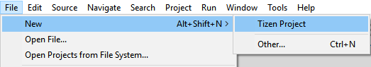
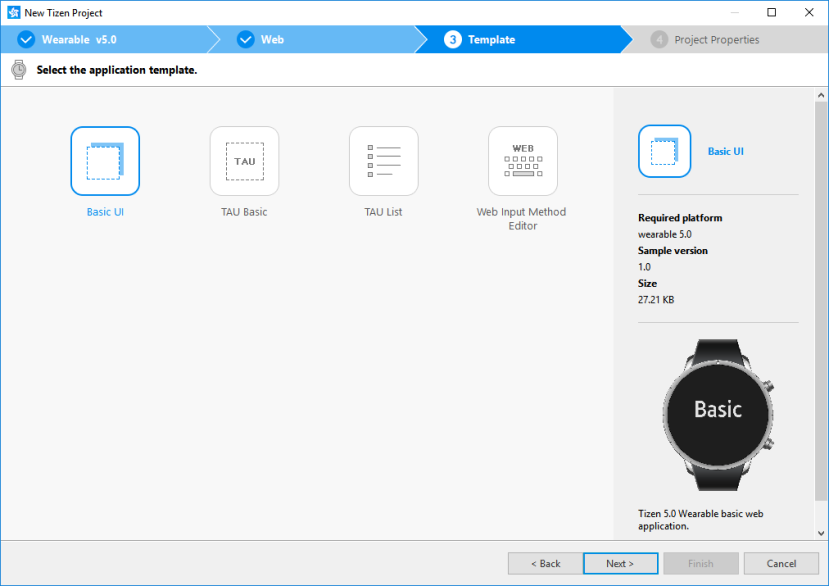
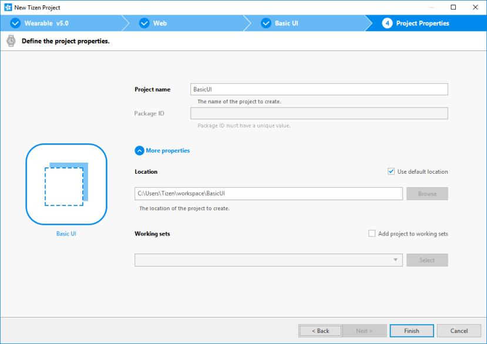
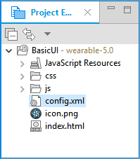
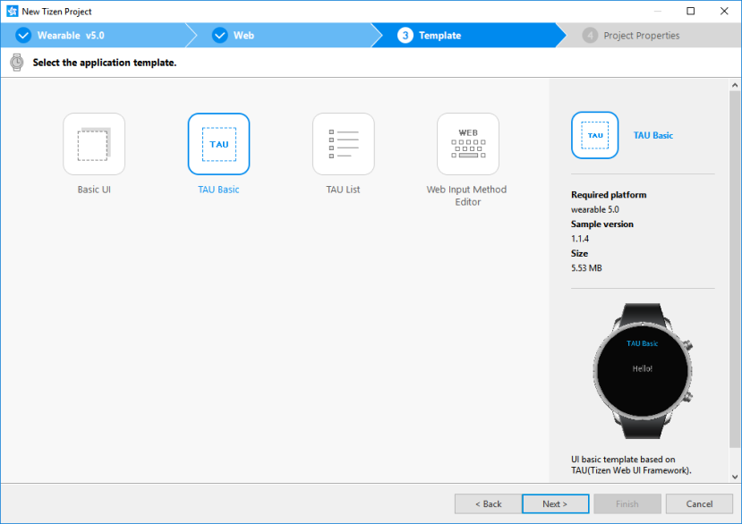
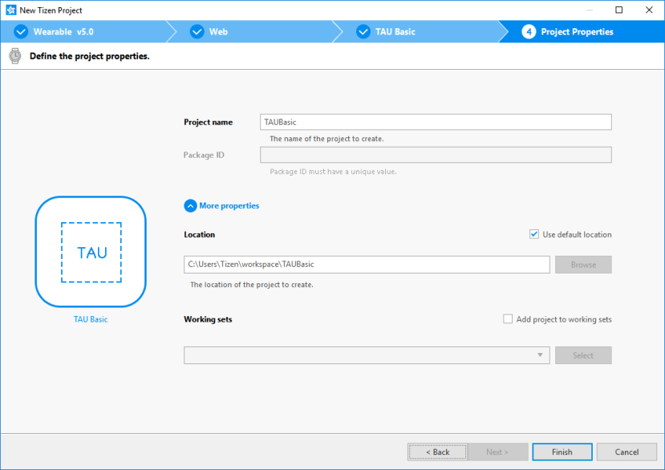
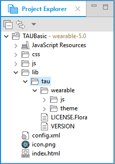

# Creating Your First Tizen Wearable Web Application

**Welcome to Tizen wearable Web application development!**

A wearable Web application is basically a Web site stored on a wearable device. You can create it using Web-native languages, such as HTML5, CSS, and JavaScript.

Study the following instructions to help familiarize yourself with the Tizen [Web application development process](../../tutorials/process/app-dev-process.md) as well as using the Tizen Studio and installing the created application on the emulator or target device. With the instructions, you can create and run a basic wearable Web application, which displays some text on the screen and changes the text when the user clicks it:

1.  Before you get started with developing Tizen applications, download and install the [Tizen Studio](../../../tizen-studio/index.md).

    For more information on the installation process, see the [installation guide](../../../tizen-studio/setup/install-sdk.md).

2.  [Create a wearable Web project](#create) using the Tizen Studio.

    This step shows how you can use a predesigned project template that creates all the basic files and folders required for your project.

3.  [Build the application](#build).

    After you have implemented code for the features you want, this step shows how you can build the application to validate and compile the code.

4.  [Run the application](#run).

    This step shows how you can run the application on the emulator or a real target device.

5.  [Design a UI](#ui).

    This step shows how you can create the application UI and make small alterations to it to improve the usability of your application.

When you are developing a more complex application, you can take advantage of the [Web tools included in the Tizen Studio](../../../tizen-studio/web-tools/overview.md) to ease the tasks of creating functionality and designing the application UI.

<a name="create"></a>
## Creating a Project

The following example shows you how to create and configure a basic wearable Web application project in the Tizen Studio. An application project contains all the files that make up an application.

The following figure illustrates the application to be created:

-   On the left, the figure shows the application screen when the application starts. The screen displays the **Basic** text.

-   On the right, the figure shows the application screen after you tap the text. The screen now displays the **Sample** text. Tapping the text area switches between the 2 texts.

**Figure: Wearable Web Basic application**

 

To create the application project:

1.  Launch the Tizen Studio.

2.  Make sure the **Web** perspective is selected in the upper-right corner of the Tizen Studio window.

    

    If not, select it. If the perspective is not visible, in the Tizen Studio menu, select **Window &gt; Perspective &gt; Open Perspective &gt; Other &gt; Web**, and click **OK**.

3.  In the Tizen Studio menu, select **File &gt; New &gt; Tizen Project**.

    

    The Project Wizard opens.

4.  In the Project Wizard, define the project details.

    The Project Wizard is used to create the basic application skeleton with the required folder structure and mandatory files. You can easily create different applications by selecting an applicable template or sample for the Project Wizard to use.

    1.  Select the **Template** project type and click **Next**.

        

    2.  Select the profile (**Wearable**) and version from a drop-down list and click **Next**.

        The version depends on the platform version you have installed and with which you are developing the application.

        

    3.  Select the **Web Application** application type and click **Next**.

        

    4.  Select the **Basic UI** template and click **Next**.

        

    5.  Define the project properties and click **Finish**.

        You can enter the project name (3-50 characters) and the unique package ID. You can also select the location and working sets by clicking **More properties**.

        

        The Project Wizard sets up the project, creates the application files using the default content from the template, and closes. For more information on the Project Wizard and the available templates, see [Creating Tizen Projects with Tizen Project Wizard](../../../tizen-studio/web-tools/project-wizard.md).

You can see the created project in the **Project Explorer** view. The most important files and folders include:

-   `css`: Folder for CSS files used by the application to style its content

-   `js`: Folder for JavaScript files used by the application to implement its functional logic

-   `config.xml`: Application configuration file used by the platform to install and launch the application

-   `icon.png`: Application icon file used by the platform to represent the application

-   `index.html`: Main HTML file for the layout of the application screen

**Figure: Application in the Project Explorer**



> **Note**  
> You can [view and modify the application configuration](#configuration) in the Web application configuration editor. In this example, no configuration changes are required.

Your application project is now ready for further actions. Next, build the application.

<a name="configuration"></a>
### Managing the Application Configuration

To view and modify the application configuration:

1.  In the **Project Explorer** view, double-click the `config.xml` file of the application. The Tizen Studio opens the file in the Web application configuration editor.

2.  In the configuration editor, view and modify the configuration details using the various tabs:

    

    -   **Overview**: Define general information, such as the name and icon of the application.

    -   **Features**: Define required software and hardware features. This information is used for application filtering in the Tizen Store.

    -   **Privileges**: Define the security-sensitive APIs or API groups accessed and used by the application.

    -   **Localization**: Define localized values for the application name, description, and license.

    -   **Policy**: Request network resource permissions to access external network resources.

    -   **Preferences**: Define name-value pairs that can be set or retrieved through the application.

    -   **Tizen**: Edit the Tizen schema extension properties of the application.

    -   **Source**: View and edit the source code of the `config.xml` file. Changes made and saved on the other tabs are reflected in the source code and vice versa.

        > **Note**  
		> The `config.xml` file must conform to both the XML file format and the W3C specification requirements. Editing the file in the **Source** tab is intended for advanced users only.

3.  To save any changes, in the Tizen Studio menu, select **File &gt; Save All**.

For more information on configuring the application, see [Setting the Web Application Configuration](../../tutorials/process/setting-properties.md#set_widget).

<a name="build"></a>
## Building Your Application

After you have [created the application project](#create), you can implement the required features. In this example, only the default features from the project template are used, and no code changes are required.

When your application code is ready, you must build the application. The building process performs a validation check and compiles your JavaScript and CSS files.

You can build the application in the following ways:

-   **Automatically**

    The automatic build means that the Tizen Studio automatically rebuilds the application whenever you change a source or resource file and save the application project.

    To use the automatic build:

    1.  Select the project in the **Project Explorer** view.
    2.  In the Tizen Studio menu, select **Project &gt; Build Automatically**.

        

        A check mark appears next to the menu option.

    You can toggle the automatic build on and off by reselecting **Project &gt; Build Automatically**.

-   **Manually**

    The manual build means that you determine yourself when the application is built.

    To manually build the application, right-click the project in the **Project Explorer** view and select **Build Project**.

    **Figure: Manually building the application**

    

    Alternatively, you can also select the project in the **Project Explorer** view and do one of the following:

    -   In the Tizen Studio menu, select **Project &gt; Build Project**.
    -   Press the **F10** key.

After you have built the application, run it.

<a name="run"></a>
## Running Your Application

You can run the Web application on the [emulator](../../tutorials/process/run-debug-app.md#emulator) or a [real target device](../../tutorials/process/run-debug-app.md#target).

> **Note**  
> Since the Web Simulator does not support a circular UI, this topic does not cover the instructions for running the application on the Web Simulator.

<a name="emulator"></a>
### Running on the Emulator

To run the application on the emulator:

1. Launch an emulator instance in the [Emulator Manager](../../../tizen-studio/common-tools/emulator-manager.md):
    1. In the Tizen Studio menu, select **Tools &gt; Emulator Manager**.

        

    2. In the Emulator Manager, select a wearable emulator from the list and click **Launch**.

        If no applicable emulator instance exists, [create a new one](../../../tizen-studio/common-tools/emulator-manager.md#create).

        

    3. The emulator is launched in its own window. You can also see the new emulator instance and its folder structure in the **Device Manager**.

        

2.  Generate a security profile.

    Before you run the application, you must [sign your application package with a certificate profile](../../../tizen-studio/common-tools/certificate-registration.md) in the Tizen Studio.

3.  Run the application:
    1.  In the **Project Explorer** view, right-click the project and select **Run As &gt; Tizen Web Application**.

        

        Alternatively, you can also select the project in the **Project Explorer** view and do one of the following:

        -   Press the **Ctrl + F11** key.
        -   Click the run icon in the toolbar.

        If you have created multiple emulator instances, select the instance you want from the combo box in the toolbar before selecting to run the application. If you select an offline emulator, it is automatically launched when you select to run the application.

        

    2.  Confirm that the application launches on the emulator.

        

    > **Note**  
    > If the emulator display has switched off, you cannot see the application launch. To switch the display on, click the **Power** key (in the lower-right corner of the emulator).

    While the application is running, the **Log** view in the Tizen Studio shows the log, debug, and exception messages from the methods defined in the log macros. To see the view, in the Tizen Studio menu, go to **Window &gt; Show View &gt; Log**.

    For more information on using the emulator features, see [Using Emulator Control Keys, Menu, and Panel](../../../tizen-studio/common-tools/emulator-control-panel.md) and [Using Extended Emulator Features](../../../tizen-studio/common-tools/emulator-features.md).

<a name="target"></a>

### Running on a Target Device

To run the application on a target device:

1.  Connect the wearable target device to your computer:
    1.  Define settings on the device:
        -   Go to **Settings &gt; Connections**, and switch on Bluetooth.

            

            

        -   Go to **Settings &gt; Connections**, and switch on Wi-Fi.

            The device and the computer must be connected to the same Wi-Fi network.

            Note the IP address the device is using.

            

        -   Go to **Settings &gt; Gear info**, and switch on the debugging mode.

            

    <a name="remote_device"></a>

    2.  Use the Remote Device Manager to connect the wearable device:
        1.  In the **Device Manager**, click the **Remote Device Manager** button.

            

        2.  In the **Remote Device Manager** window, click **+**.

            

        3.  In the **Add Device** window, enter the device and network details (use the IP address you noted before), and click **Add**.

            

        4.  In the **Remote Device Manager** window, switch the new device on by clicking the switch under **Connect**.

            

    3.  The device asks for user confirmation. To allow Gear to read log data, copy files to and from your computer, and install the application manually, click the accept mark.

        

    4.  In the **Device Manager**, confirm that the device is connected (shown in the device list).

        

2.  Generate an author certificate.

    Before you run the application, you must [sign your application package with a certificate profile](../../../tizen-studio/common-tools/certificate-registration.md) in the Tizen Studio.

3.  Run the application:
    1.  In the **Device Manager**, select the device.
    2.  In **Project Explorer** view, right-click the project and select **Run As &gt; Tizen Web Application**.

        

        Alternatively, you can also select the project in the **Project Explorer** view and do one of the following:

        -   Press the **Ctrl + F11** key.
        -   Click the run icon in the toolbar.

        If you have both a connected device and existing emulator instances, select the device from the combo box in the toolbar before selecting to run the application.

        

    3.  Confirm that the application launches on the target device.

    > **Note**  
	>The application is launched using the default debug run configuration. To create and use another configuration:
    > 1.  In the `Project Explorer` view, right-click the project and select `Run As > Run Configurations`.
    > 2.  In the `Run Configurations` window, click the `New Launch Configuration` icon (), define the configuration details, and launch the application by clicking `Run`.
    > 

<a name="ui"></a>
## Designing a Simple UI

The wearable application created with the **Basic UI** template has a simple user interface with a text component showing the **Basic** text in the middle of the screen.

The UI is created using [W3C/HTML](https://www.w3schools.com). The W3C specifications provide HTML and CSS features for creating a user interface. With HTML, you can define the structure of the application screens, while CSS allows you to define the look and feel of the screens.

**Figure: User interface in the Basic UI template**


### Creating the Basic UI

The UI in the **Basic UI** template uses the HTML DOM, which is a structured model to control Web elements. It is an official W3C standard to express the document regardless of platforms or languages, and the foundation of the HTML5 APIs. The template contains the following components:

-   The `<html>` element is the top-level element of the HTML DOM tree that wraps the entire document, and it has the `<head>` and `<body>` elements as child nodes:

    ```
    <!DOCTYPE html>
    <html>
       <head>
          <!--Content-->
       </head>
       <body>
          <!--Content-->
       </body>
    </html>
    ```

-   The `<head>` element contains the information that the browser refers to when rendering the body element to interpret information, such as the title of the HTML document, and the location of the related CSS and JavaScript files:

    -   `<title>`: Defines the title of the document.
    -   `<meta>`: Defines information, such as encoding, creator, and keywords of the document.
    -   `<style>`, `<link>`: Sets the styles of the document.
    -   `<script>`, `<noscript>`: Adds functions to the document.

    ```
    <head>
       <meta charset="utf-8"/>
       <meta name="viewport" content="width=device-width, initial-scale=1.0, maximum-scale=1.0">
       <meta name="description"
             content="Tizen Wearable basic template generated by Samsung Wearable Web IDE"/>

       <title>
          Tizen Wearable Web IDE - Tizen Wearable - Tizen Wearable basic Application
       </title>

       <link rel="stylesheet" type="text/css" href="css/style.css"/>
       <script src="js/main.js"></script>
    </head>
    ```

-   The `<body>` element defines the area displaying content on the browser screen. In this case, it defines the **Basic** text component:

    ```
    <body>
       <div class="contents">
          <div style='margin:auto;'>
             <span class="content_text" id="textbox">Basic</span>
          </div>
       </div>
    </body>
    ```

<a name="css"></a>
### Modifying Existing Components with CSS

CSS (Cascading Style Sheets) specifies the layout and styling of the Web application.

There are various ways to connect CSS with HTML:

-   `style` attribute in an HTML element
-   `<link>` element in the `<head>` element
-   `@import` attribute in the CSS area
-   `<style>` element in the `<head>` element

Applying the style of an HTML element directly with the `style` attribute has the highest priority. On the other hand, creating a separate CSS file and managing it separately is convenient when it comes to applying changes in the future.

In the **Basic UI** template, the CSS file is connected to the HTML file using a `<link>` element in the `<head>` element:

```
<head>
   <meta charset="utf-8"/>
   <meta name="viewport" content="width=device-width, initial-scale=1.0, maximum-scale=1.0">
   <meta name="description"
         content="Tizen Wearable basic template generated by Samsung Wearable Web IDE"/>

   <title>
      Tizen Wearable Web IDE - Tizen Wearable - Tizen Wearable basic Application
   </title>

   <link rel="stylesheet" type="text/css" href="css/style.css"/>
   <script src="js/main.js"></script>
</head>
```

The following code shows how to use the `<style>` attribute to set the margin of the `<div>` element to be automatic so that the browser calculates the margin automatically and the text is placed in the center:

```
<body>
   <div class="contents">
      <div style='margin:auto;'>
         <span class="content_text" id="textbox">Basic</span>
      </div>
   </div>
</body>
```

The following lines in the CSS code describe the styling of the text in an element with the `content_text` class:

-   `css/style.css`:

    ```
    .content_text {
        font-weight:bold;
        font-size:5em;
        color:#fff;
    }
    ```

-   `index.html`:

    ```
    <body>
       <div class="contents">
          <div style='margin:auto;'>
             <span class="content_text" id="textbox">Basic</span>
          </div>
       </div>
    </body>
    ```

By default, the text uses the `#fff` color (white). If you change the CSS code and alter the color value for the `content_text` class, the text color changes (in this case, to `#ff0000` red):

```
.content_text {
   font-weight: bold;
   font-size: 5em;
   color: #ff0000;
}
```

**Figure: Screen with a new text color**


### Adding More Components and Functionality with TAU

TAU (Tizen Advanced UI) is a Web UI library that enables you to create and manage various kinds of UI components. The components represent a visual UI element, such as a button, checkbox, or list view. You can manipulate and interact with the application screens through the UI components. For more information, see [Tizen Advanced UI](../../guides/tau/tau.md) and [Tizen Advanced UI framework Reference](../../api/latest/ui_fw_api/ui_fw_api_cover.htm).

UI components for wearable devices have been enhanced to support a circular screen. You can make an application that runs on both rectangular and circular screens with a single source code.

TAU helps you to create Tizen Web applications easily. The following figure shows the role of TAU and its relation to the Web application.

**Figure: TAU and the Web application**


The UI in the **Basic UI** template only contains one visible text component. To create a more elaborate UI with more components, screens, and functionality, use the TAU library in your application. The following example shows how to create a list on a page (screen), create a second page, and move between the pages.

To create a Web application and design its UI with TAU:

1.  Install TAU templates.

    The Tizen Studio comes with the Package Manager tool, which you can use to install the TAU packages required for TAU application development.

    Make sure that you have the **TAU (IDE)** package installed to enable you to create the Web application using a TAU template.

    

2.  Create a project that uses the TAU library.

    To create a project with a **TAU Basic** template:

    1.  Go to **File &gt; New &gt; Tizen Project**.
    2.  Select **Template &gt; Wearable v4.0 &gt; Web Application &gt; TAU Basic**.

        

    3.  Define the project properties and click **Finish**.

        

    4.  In the **Project Explorer** view, view the project.

        The TAU library is located in the `lib` folder.

        

    You can create a new project using a TAU template or a TAU sample application included in the Tizen Studio, as shown above, or you can add the required TAU libraries to any existing Web project.

    To import TAU manually to an existing project to load the basic Tizen Advanced UI (TAU) libraries, use the following elements in your HTML file:

    -   Import the TAU library with the `<script>` element: `tau(.min).js`

        This element is mandatory, since you need the TAU library to use the TAU JavaScript Interface.

    -   Import the TAU theme with the `<link>` element: `tau(.min).css`

        This element is also mandatory.

    -   Import the circular TAU theme with the `<link>` element: `tau.circle(.min).css`

        This element is optional, but mandatory if you want to develop a Web application on a circular device.

    -   Import JavaScript support with the `<script>` element: `circle-helper.js`

        This element is optional. If you import this file, you can easily get a list view that handles rotary events.

    For better performance, all CSS files must be included in the header and all script elements must be put before the closing `</body>` element. The following example shows the **TAU Basic** template:

    ```
    <!DOCTYPE html>
    <html>
       <head>
          <meta name="viewport" content="width=device-width, user-scalable=no"/>
          <title>Basic</title>
          <link rel="stylesheet" href="lib/tau/wearable/theme/default/tau.min.css"/>
          <link rel="stylesheet" media="all and (-tizen-geometric-shape: circle)" href="lib/tau/wearable/theme/default/tau.circle.min.css">
          <!--Load theme file for your application-->
          <link rel="stylesheet" href="css/style.css"/>
       </head>
       <body>
          <!--HTML BODY CONTENT-->
          <script src="lib/tau/wearable/js/tau.min.js"></script>
          <script src="js/app.js"></script>
          <script src="js/lowBatteryCheck.js"></script>
          <script src="js/circle-helper.js"></script>
       </body>
    </html>
    ```

    You can add additional `<script src="<CUSTOM_LIBRARY_OR_JS_FILE>">` or `<link rel="stylesheet" src="<CUSTOM_CSS>">` elements to include your own scripts and style sheets. However, place them after the default `<script>` elements, so that you can use any TAU APIs provided by the default libraries.

3.  Create the first page.
    1.  Open the `index.html` file. By default, the `<body>` element of the HTML file contains 1 page (`<div>` element with the `ui-page` class) that contains a header and a text paragraph.

        ```
        <body>
           <div class="ui-page ui-page-active" id="main">
              <header>
                 <h2 class="ui-title">TAU Basic</h2>
              </header>
              <div class="ui-content ui-content-padding">
                 <p>Hello! </p>
              </div>
           </div>
           <script src="lib/tau/wearable/js/tau.min.js"></script>
           <script src="js/app.js"></script>
           <script src="js/lowBatteryCheck.js"></script>
           <script src="js/circle-helper.js"></script>
        </body>
        ```

        Edit the contents of the first page:

        ```
        <div class="ui-page ui-page-active" id="main">
           <header class="ui-header">
              <h2 class="ui-title">Hello World</h2>
           </header>
           <div class="ui-content content-padding">
              <p>This is content area</p>
           </div>
        </div>
        ```

        

    2.  You can add your own style for the content area with a defined `id` attribute:

        ```
        <div class="ui-page ui-page-active" id="main">
           <header class="ui-header">
              <h2 class="ui-title">Hello World</h2>
           </header>
           <div class="ui-content content-padding" id="contentArea">
              <p>This is content area</p>
           </div>
        </div>
        ```

        In the `style.css` file, add a CSS style for the new `id` attribute:

        ```
        #contentArea {
           color: #8be3d1;
        }
        ```

        The above style addition modifies the screen to show the content area text with the turquoise color.

        

4.  Add a list for the first page.

    You can add a list with the TAU list view component using the `<ul>` element and the `ui-listview` class:

    -   Create a basic static list by overwriting the page content in the `index.html` file with the following code:

        ```
        <body>
           <div class="ui-page ui-page-active" id="main">
              <header class="ui-header">
                 <h2 class="ui-title">Hello World</h2>
              </header>
              <div class="ui-content content-padding">
                 <ul class="ui-listview">
                    <li><a href="#">List Item1</a></li>
                    <li><a href="#">List Item2</a></li>
                    <li><a href="#">List Item3</a></li>
                    <li><a href="#">List Item4</a></li>
                    <li><a href="#">List Item5</a></li>
                 </ul>
              </div>
           </div>
           <script src="lib/tau/wearable/js/tau.min.js"></script>
           <script src="js/app.js"></script>
           <script src="js/lowBatteryCheck.js"></script>
           <script src="js/circle-helper.js"></script>
        </body>
        ```

        

    -   For a more advanced option on a circular device, you can also create a snap list view, which is a circular-specialized list view component.

        To create a SnapListview using the `tau.helper` class, copy the following function to a JavaScript file in your project. If you have not done it previously, add the `circle-helper.js` file to the `index.html` file in a `<script>` element.

        ```
        (function(tau) {
            var page,
                list,
                listHelper;

            /* Check for a circular device */
            if (tau.support.shape.circle) {
                document.addEventListener('pagebeforeshow', function(e) {
                    page = e.target;
                    list = page.querySelector('.ui-listview');
                    if (list) {
                        /* Create SnapListView and binding rotary event using tau.helper */
                        listHelper = tau.helper.SnapListStyle.create(list);
                    }
                 });

                document.addEventListener('pagebeforehide', function(e) {
                    listHelper.destroy();
                });
            }
        }(tau));
        ```

        With the SnapListview, you can scroll the list with the bezel.

        

5.  Create the second page.

    In the Tizen Studio, create a new HTML file and name it `second.html`.

    Add the following content to the file to create a title text in the header and a **Hello Tizen!** text in the content area:

    ```
    <!DOCTYPE html>
    <html>
       <head>
          <meta name="viewport" content="width=device-width, user-scalable=no"/>
          <title>Hello TAU</title>
          <link rel="stylesheet"  href="lib/tau/wearable/theme/default/tau.min.css">
          <link rel="stylesheet" media="all" href="lib/tau/wearable/theme/default/tau.circle.min.css">
       </head>
       <body>
          <div class="ui-page" id="second">
             <header class="ui-header">
                <h2 class="ui-title">Second Page</h2>
             </header>
             <div id="secondContent" class="ui-content">
                Hello Tizen!
             </div>
          </div>
          <script type="text/javascript" src="lib/tau/wearable/js/tau.min.js"></script>
       </body>
    </html>
    ```

    

6.  Create navigation between the pages.
    -   To navigate from the first page to the second, in the list in the `index.html` file, add the path to the second page in the `<li><a href>` element:

        ```
        <ul class="ui-listview">
           <li><a href="second.html">Go to Second Page</a></li>
           <li><a href="#">List Item2</a></li>
           <li><a href="#">List Item3</a></li>
           <li><a href="#">List Item4</a></li>
           <li><a href="#">List Item5</a></li>
        </ul>
        ```

        Run the application in the emulator, and click the **Go to Second Page** link to move from the `index.html` page to the `second.html` page.

        

    -   To navigate from the second page back to the first, use the **Back** key.

        You can navigate from page to page with the `<a href="PAGE_FILE_NAME">` elements, but you cannot go back. To enable the user to return to the first page, you must add some code in a JavaScript file.

        Create a new `app.js` JavaScript file:

        1.  In the `index.html` file, add the `<script src="app.js"></script>` line before closing the `</body>` element:

            ```
            <body>
               <div class="ui-page" id="main">
                  <header class="ui-header">
                     <h2 class="ui-title">Hello TAU</h2>
                  </header>
                  <div class="ui-content">
                     <!--Content-->
                  </div>
               </div>
               <script type="text/javascript"
                       src="lib/tau/wearable/js/tau.min.js"></script>
               <script type="text/javascript" src="js/circle-helper.js"></script>
               <script src="app.js"></script>
            </body>
            ```

        2.  In the **Project Explorer** view, right-click the project and select **New &gt; JavaScript Source File**.
        3.  Enter the file name as **app.js** and click **Finish**.
        4.  In the `app.js` file, all kinds of logic can be added to the application. In this case, add the code for returning to the previous page when the **Back** key is pressed:

            ```
            (function() {
                window.addEventListener('tizenhwkey', function(ev) {
                    if (ev.keyName === 'back') {
                        var page = document.getElementsByClassName('ui-page-active')[0],
                            pageid = page ? page.id : '';

                        if (pageid !== 'main') {
                            window.history.back();
                        }
                    }
                });
            }());
            ```

    -   To exit the application.

        You can make your application exit by adding more lines to the `app.js` file.

        You have to consider the fact that when the user clicks the **Back** key, the application can only exit if it is showing the first page. If the second page is showing, the application must return to the first page.

        The following example shows how to handle the **Back** key input with page navigation and application exit. This code is included in the **TAU Basic** project template `app.js` file by default.

        ```
        (function() {
            window.addEventListener('tizenhwkey', function(ev) {
                if (ev.keyName === 'back') {
                    var page = document.getElementsByClassName('ui-page-active')[0],
                        pageid = page ? page.id : '';

                    if (pageid === 'main') {
                        try {
                            tizen.application.getCurrentApplication().exit();
                        } catch (ignore) {}
                    } else {
                        window.history.back();
                    }
                }
            });
        }());
        ```
