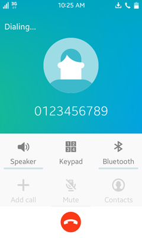
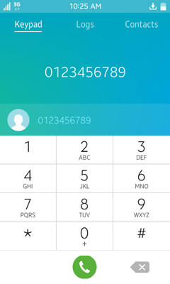
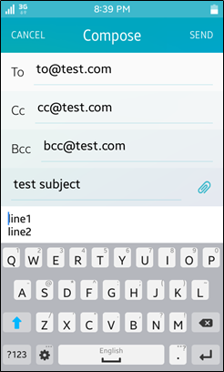
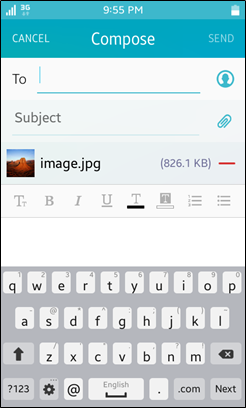
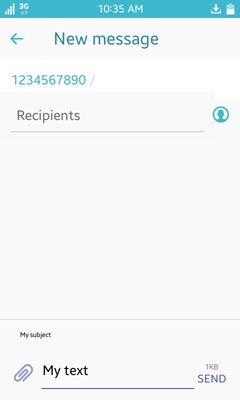
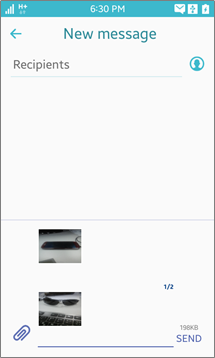

# Common Application Controls

An application control provides functions for launching other applications with a specific operation, URI, MIME type, and extra data. The requesting application can get a result back from the launched application. This topic introduces the common application controls that you can use.

The Application API is mandatory for Tizen mobile, wearable, and TV profiles, which means that it is supported on all mobile, wearable, and TV devices. All mandatory APIs are supported on the Tizen Emulators.

> **Note**  
> It is possible that no application suitable to receive the application control exists. In that case, before you send the launch request, verify that a suitable application exists.

## Browser

### Performing a Web Search

The search operation is supported in mobile and TV applications only.

To find what you are looking for on the Web, use the `http://tizen.org/appcontrol/operation/search` operation.

**Figure: Performing a Web search**


#### Operation

`http://tizen.org/appcontrol/operation/search`

#### Extra Input

| Key                                     | Description                              | Note                   |
| --------------------------------------- | ---------------------------------------- | ---------------------- |
| `http://tizen.org/appcontrol/data/text` | The text to search for. This key must be passed as a string. | This key is mandatory. |

#### Example Code

```
var appControlData = new tizen.ApplicationControlData('http://tizen.org/appcontrol/data/text', ['tizen']);

var appControl = new tizen.ApplicationControl('http://tizen.org/appcontrol/operation/search',
                                              null, null, null, [appControlData], null);

tizen.application.launchAppControl(appControl, null, function() {
    console.log('launch application control succeed');
}, function(e) {
    console.log('launch application control failed. reason: ' + e.message);
}, null);
```

### Loading a Web Page

The view operation is supported in mobile applications only.

To open a Web page, use the `http://tizen.org/appcontrol/operation/view` operation and specify the Web URL in the URI.

**Figure: Loading a Web page**


#### Operation

`http://tizen.org/appcontrol/operation/view`

#### URI (Mandatory)

- `http:<path>`
- `https:<path>`
- `file:<path>`
- `javascript:<path>`

#### MIME Type (Optional)

- `image/svg+xml`
- `text/html`
- `application/xml`
- `application/xhtml+xml`
- `text/plain`

#### Example Code

```
var appControl = new tizen.ApplicationControl('http://tizen.org/appcontrol/operation/view',
                                              'https://www.tizen.org', null, null, null, null);

tizen.application.launchAppControl(appControl, null, function() {
    console.log('launch application control succeed');
}, function(e) {
    console.log('launch application control failed. reason: ' + e.message);
}, null);
```

## Calendar
The calendar application control is supported in mobile applications only.

### Adding a Calendar Event

To add a new event to the user's calendar, use the `http://tizen.org/appcontrol/operation/add` operation with the `application/vnd.tizen.calendar` MIME type. To specify various event details, refer to the extras defined below.

**Figure: Adding a calendar event**


#### Operation

`http://tizen.org/appcontrol/operation/add`

#### MIME Type (Mandatory)

`application/vnd.tizen.calendar`

#### Extra Input

| Key                                      | Description                              | Note                  |
| ---------------------------------------- | ---------------------------------------- | --------------------- |
| `http://tizen.org/appcontrol/data/calendar/all_day` | The string to indicate if an event applies to all day. The available values are `true` or `false`. This key must be passed as a string. | This key is optional. |
| `http://tizen.org/appcontrol/data/calendar/start_time` | The start time of the event (format: YYYY-MM-DD HH:MM:SS). This key must be passed as a string. | This key is optional. |
| `http://tizen.org/appcontrol/data/calendar/end_time` | The end time of the event (format: YYYY-MM-DD HH:MM:SS). This key must be passed as a string. | This key is optional. |
| `http://tizen.org/appcontrol/data/title` | The title of the event. This key must be passed as a string. | This key is optional. |
| `http://tizen.org/appcontrol/data/text`  | The description of the event. This key must be passed as a string. | This key is optional. |

#### Extra Output

| Key                                   | Description                              |
| ------------------------------------- | ---------------------------------------- |
| `http://tizen.org/appcontrol/data/id` | The database record ID of the event (ID in the `_calendar_event` view). This key must be passed as a string. |

#### Example Code

```
var appControlData = [new tizen.ApplicationControlData('http://tizen.org/appcontrol/data/title', ['My event']),
                      new tizen.ApplicationControlData('http://tizen.org/appcontrol/data/text', ['My event text'])];

var appControl = new tizen.ApplicationControl('http://tizen.org/appcontrol/operation/add', null,
                                              'application/vnd.tizen.calendar', null, appControlData, 'GROUP');

tizen.application.launchAppControl(appControl, null, function() {
    console.log('launch application control succeed');
}, function(e) {
    console.log('launch application control failed. reason: ' + e.message);
}, null);
```

### Editing a Calendar Event

To edit an existing event in the user's calendar, use the `http://tizen.org/appcontrol/operation/edit` operation with the `application/vnd.tizen.calendar` MIME type. To specify various event details, refer to the extras defined below.

**Figure: Editing a calendar event**


#### Operation

`http://tizen.org/appcontrol/operation/edit`

#### MIME Type (Mandatory)

`application/vnd.tizen.calendar`

#### Extra Input

| Key                                      | Description                              | Note                   |
| ---------------------------------------- | ---------------------------------------- | ---------------------- |
| `http://tizen.org/appcontrol/data/id`    | The database record ID of the event (ID in the `_calendar_event` view). This key must be passed as a string. | This key is mandatory. |
| `http://tizen.org/appcontrol/data/calendar/all_day` | The string to indicate if an event applies to all day. The available values are `true` or `false`. This key must be passed as a string. | This key is optional.  |
| `http://tizen.org/appcontrol/data/calendar/start_time` | The start time of event (format: YYYY-MM-DD HH:MM:SS). This key must be passed as a string. | This key is optional. |
| `http://tizen.org/appcontrol/data/calendar/end_time` | The end time of event (format: YYYY-MM-DD HH:MM:SS). This key must be passed as a string. | This key is optional. |
| `http://tizen.org/appcontrol/data/title` | The title of event. This key must be passed as a string. | This key is optional. |
| `http://tizen.org/appcontrol/data/text`  | The description of event. This key must be passed as a string. | This key is optional. |

#### Extra Output

| Key                                   | Description                              |
| ------------------------------------- | ---------------------------------------- |
| `http://tizen.org/appcontrol/data/id` | The database record ID of the event (ID in the `_calendar_event` view). This key must be passed as a string. |

#### Example Code

```
var appControlData = [new tizen.ApplicationControlData('http://tizen.org/appcontrol/data/id', ['1']),
                      new tizen.ApplicationControlData('http://tizen.org/appcontrol/data/title', ['Edited Title']),
                      new tizen.ApplicationControlData('http://tizen.org/appcontrol/data/all_day', ['true'])];

var appControl = new tizen.ApplicationControl('http://tizen.org/appcontrol/operation/edit', null,
                                              'application/vnd.tizen.calendar', null, appControlData, 'GROUP');

tizen.application.launchAppControl(appControl, null, function() {
    console.log('launch application control succeed');
}, function(e) {
    console.log('launch application control failed. reason: ' + e.message);
}, null);
```

### Viewing a Calendar Event

To display a specified event in the user's calendar, use the `http://tizen.org/appcontrol/operation/view` operation. To specify various event details, refer to the extras defined below.

To display a specified event from a vcalendar file, use the `file:` URI. To display a specified event using the calendar ID, use the `application/vnd.tizen.calendar` MIME type with `http://tizen.org/appcontrol/data/id`.

**Figure: Viewing a calendar event**


#### Operation

`http://tizen.org/appcontrol/operation/view`

#### URI

`file:<path>`

For example: `file://<media storage path>/file.vcs`

#### MIME Type

- `application/vnd.tizen.calendar`  
   If viewing an event by event ID, the event ID (ID in the `_calendar_event` view) extra data and `application/vnd.tizen.calendar` MIME type must be specified.
- `text/x-vcalendar` (for vcalendar file)
- `text/vcalendar` (for vcalendar file)

#### Extra Input

| Key                                   | Description                              | Note                                     |
| ------------------------------------- | ---------------------------------------- | ---------------------------------------- |
| `http://tizen.org/appcontrol/data/id` | The database record ID of the event (ID in the `_calendar_event` view). This key must be passed as a string. | This key is mandatory when the MIME type is set to `application/vnd.tizen.calendar`. |

#### Example Code

```
/* To view a calendar event from a vcs file */
var appControl = new tizen.ApplicationControl(http://tizen.org/appcontrol/operation/view',
                                              'file://<shared path of the app>/Calendar3.vcs',
                                              null, null, null, 'GROUP');

tizen.application.launchAppControl(appControl, null, function() {
    console.log('launch application control succeed');
}, function(e) {
    console.log('launch application control failed. reason: ' + e.message);
}, null);

/* To view a calendar event from a calendar event ID */
var appControlData = [new tizen.ApplicationControlData('http://tizen.org/appcontrol/data/id', ['1'])];

var appControl = new tizen.ApplicationControl('http://tizen.org/appcontrol/operation/view', null,
                                              'application/vnd.tizen.calendar', null, appControlData, null);

tizen.application.launchAppControl(appControl, null, function() {
    console.log('launch application control succeed');
}, function(e) {
    console.log('launch application control failed. reason: ' + e.message);
}, null);
```

### Selecting a Calendar Event

To select a specified event in the user's calendar, use the `http://tizen.org/appcontrol/operation/pick` operation with the `application/vnd.tizen.calendar` MIME type. To specify various event details, refer to the extras defined below.

**Figure: Selecting a calendar event**


#### Operation

`http://tizen.org/appcontrol/operation/pick`

#### MIME Type (Mandatory)

`application/vnd.tizen.calendar`

#### Extra Input

| Key                                      | Description                              | Note                  |
| ---------------------------------------- | ---------------------------------------- | --------------------- |
| `http://tizen.org/appcontrol/data/type`  | The type of items to be delivered. The available values are `id` (default) and `vcs`. This key must be passed as a string. | This key is optional. |
| `http://tizen.org/appcontrol/data/selection_mode` | The selection mode of the PICK operation. The available values are `single` (default) and `multiple`. This key must be passed as a string. | This key is optional. |
| `http://tizen.org/appcontrol/data/total_count` | The total number of events to be returned. This key must be passed as a string. | This key is optional. |

#### Extra Output

| Key                                      | Description                              |
| ---------------------------------------- | ---------------------------------------- |
| `http://tizen.org/appcontrol/data/type`  | The type of items to be delivered. The available values are `id` and `vcs`. This key must be passed as a string. |
| `http://tizen.org/appcontrol/data/selected` | The database record ID of the event (ID in the `_calendar_event` view) or the paths of the vcs files. This key must be passed as an array. |

#### Example Code

```
var appControlData = [new tizen.ApplicationControlData('http://tizen.org/appcontrol/data/type', ['id']),
                      new tizen.ApplicationControlData('http://tizen.org/appcontrol/data/selection_mode', ['single'])];

var appControl = new tizen.ApplicationControl('http://tizen.org/appcontrol/operation/pick', null,
                                              'application/vnd.tizen.calendar', null, appControlData, 'GROUP');

tizen.application.launchAppControl(appControl, null, function() {
    console.log('launch application control succeed');
}, function(e) {
    console.log('launch application control failed. reason: ' + e.message);
}, null);
```

## Call
The call application control is supported in mobile and wearable applications only.

### Making a Phone Call

To directly initiate a phone call, use the `http://tizen.org/appcontrol/operation/call` operation with a phone number URI scheme.

**Figure: Making a phone call**



#### Operation

`http://tizen.org/appcontrol/operation/call`

To request this operation, the `http://tizen.org/privilege/call` privilege is needed.

#### URI (Mandatory)

`tel:<number>`

For example: `tel:+821234567890`

#### Example Code

```
var appControl = new tizen.ApplicationControl('http://tizen.org/appcontrol/operation/call',
                                              'tel:0123456789', null, null, null, null);

tizen.application.launchAppControl(appControl, null, function() {
    console.log('launch application control succeed');
}, function(e) {
    console.log('launch application control failed. reason: ' + e.message);
}, null);
```

### Launching a Call Application with a Phone Number

To open a call application and display a predefined a phone number, use the `http://tizen.org/appcontrol/operation/dial` action with a phone number URI scheme. When the call application opens, it displays the phone number, but the user must press the **Call** button to initiate the phone call.

**Figure: Launching a Call application**



#### Operation

`http://tizen.org/appcontrol/operation/dial`

#### URI (Optional)

`tel:<number>`

If empty, a dialer UI without a number is presented.

For example: `tel:+821234567890`

#### Example Code

```
var appControl = new tizen.ApplicationControl('http://tizen.org/appcontrol/operation/dial',
                                              'tel:0123456789', null, null, null, null);

tizen.application.launchAppControl(appControl, null, function() {
    console.log('launch application control succeed');
}, function(e) {
    console.log('launch application control failed. reason: ' + e.message);
}, null);
```

## Camera
The camera application control is supported in mobile applications only.

### Capturing a Picture or Video

To take a picture or record video, use the `http://tizen.org/appcontrol/operation/create_content` operation with the MIME type. To specify an option, refer to the extras defined below.

**Figure: Taking pictures (left) and recording videos (right)**

 

#### Operation

`http://tizen.org/appcontrol/operation/create_content`

#### MIME Type (Mandatory)

- `image/*`
- `video/*`

#### Extra Input

| Key                                      | Description                              | Note                  |
| ---------------------------------------- | ---------------------------------------- | --------------------- |
| `http://tizen.org/appcontrol/data/total_size` | The total size of items to be returned in bytes. This key must be passed as a string. | This key is optional. |

#### Extra Output

| Key                                      | Description                              |
| ---------------------------------------- | ---------------------------------------- |
| `http://tizen.org/appcontrol/data/selected` | The path of the created image or video file. This key must be passed as a string. |

#### Example Code

```
var appControl = new tizen.ApplicationControl('http://tizen.org/appcontrol/operation/create_content',
                                              null, 'image/*', null, null, null);

tizen.application.launchAppControl(appControl, null, function() {
    console.log('launch application control succeed');
}, function(e) {
    console.log('launch application control failed. reason: ' + e.message);
}, null);
```

### Capturing a Picture

To capture a still image, use the `http://tizen.org/appcontrol/operation/image_capture` operation. To specify an option, refer to the extras defined below.

**Figure: Taking a picture**


#### Operation

`http://tizen.org/appcontrol/operation/image_capture`

#### Extra Input

| Key                                      | Description                              | Note                  |
| ---------------------------------------- | ---------------------------------------- | --------------------- |
| `http://tizen.org/appcontrol/data/total_size` | The total size of items to be returned in bytes. This key must be passed as a string. | This key is optional. |

#### Extra Output

| Key                                      | Description                              |
| ---------------------------------------- | ---------------------------------------- |
| `http://tizen.org/appcontrol/data/selected` | The path of the created file. This key must be passed as a string. |

#### Example Code

```
var appControl = new tizen.ApplicationControl('http://tizen.org/appcontrol/operation/image_capture',
                                              null, null, null, null, null);

tizen.application.launchAppControl(appControl, null, function() {
    console.log('launch application control succeed');
}, function(e) {
    console.log('launch application control failed. reason: ' + e.message);
}, null);
```

### Capturing a Video

To record a video, use the `http://tizen.org/appcontrol/operation/video_capture` operation. To specify an option, refer to the extras defined below.

**Figure: Record a video**


#### Operation

`http://tizen.org/appcontrol/operation/video_capture`

#### Extra Input

| Key                                      | Description                              | Note                  |
| ---------------------------------------- | ---------------------------------------- | --------------------- |
| `http://tizen.org/appcontrol/data/total_size` | The total size of items to be returned in bytes. This key must be passed as a string. | This key is optional. |

#### Extra Output

| Key                                      | Description                              |
| ---------------------------------------- | ---------------------------------------- |
| `http://tizen.org/appcontrol/data/selected` | The path of the created file. This key must be passed as a string. |

#### Example Code

```
var appControl = new tizen.ApplicationControl('http://tizen.org/appcontrol/operation/video_capture',
                                              null, null, null, null, null);

tizen.application.launchAppControl(appControl, null, function() {
    console.log('launch application control succeed');
}, function(e) {
    console.log('launch application control failed. reason: ' + e.message);
}, null);
```

## Contact

### Adding a Contact
The contact adding operation is supported in mobile and wearable applications only. Wearable applications support the `http://tizen.org/appcontrol/data/phone` and `http://tizen.org/appcontrol/data/name` keys only as extra input.

To add a new contact, use the `http://tizen.org/appcontrol/operation/add` operation with the `application/vnd.tizen.contact` MIME type. To specify various contact details, refer to the extras defined below.

**Figure: Adding a contact**


#### Operation

`http://tizen.org/appcontrol/operation/add`

#### MIME Type (Mandatory)

`application/vnd.tizen.contact`

#### Extra Input

| Key                                      | Description                              | Note                  |
| ---------------------------------------- | ---------------------------------------- | --------------------- |
| `http://tizen.org/appcontrol/data/phone` | The phone number. This key must be passed as a string. | This key is optional. |
| `http://tizen.org/appcontrol/data/email` | The email address. This key must be passed as a string. | This key is optional. |
| `http://tizen.org/appcontrol/data/url`   | The homepage URL. This key must be passed as a string. | This key is optional. |
| `http://tizen.org/appcontrol/data/name`  | The contact's name. This key must be passed as a string. | This key is optional. |

#### Extra Output

| Key                                   | Description                              |
| ------------------------------------- | ---------------------------------------- |
| `http://tizen.org/appcontrol/data/id` | The database record ID of the added person (ID in the `_contacts_person` view). This key must be passed as a string. |

#### Example Code

```
var appControlData = [new tizen.ApplicationControlData('http://tizen.org/appcontrol/data/phone', ['0123456789']),
                      new tizen.ApplicationControlData('http://tizen.org/appcontrol/data/email', ['tizen@tizen.org']),
                      new tizen.ApplicationControlData('http://tizen.org/appcontrol/data/name', ['Tizen User'])];

var appControl = new tizen.ApplicationControl('http://tizen.org/appcontrol/operation/add', null,
                                              'application/vnd.tizen.contact', null,
                                              appControlData, 'GROUP');

tizen.application.launchAppControl(appControl, null, function() {
    console.log('launch application control succeed');
}, function(e) {
    console.log('launch application control failed. reason: ' + e.message);
}, null);
```

### Editing a Contact
The contact editing operation is supported in mobile applications only.

To edit a known contact, use the `http://tizen.org/appcontrol/operation/edit` operation with the `application/vnd.tizen.contact` MIME type. To specify various contact details, refer to the extras defined below.

**Figure: Editing a contact**


#### Operation

`http://tizen.org/appcontrol/operation/edit`

#### MIME Type (Mandatory)

`application/vnd.tizen.contact`

#### Extra Input

| Key                                      | Description                              | Note                   |
| ---------------------------------------- | ---------------------------------------- | ---------------------- |
| `http://tizen.org/appcontrol/data/id`    | The database record ID of the person to be edited (ID in the `_contacts_person` view). This key must be passed as a string. | This key is mandatory. |
| `http://tizen.org/appcontrol/data/phone` | The phone number that is added to the contact. This key must be passed as a string. | This key is optional.  |
| `http://tizen.org/appcontrol/data/email` | The email address that is added to the contact. This key must be passed as a string. | This key is optional. |
| `http://tizen.org/appcontrol/data/url`   | The homepage URL that is added to the contact. This key must be passed as a string. | This key is optional. |

#### Extra Output

| Key                                   | Description                              |
| ------------------------------------- | ---------------------------------------- |
| `http://tizen.org/appcontrol/data/id` | The database record ID of the person to be edited (ID in the `_contacts_person` view). This key must be passed as a string. |

#### Example Code

```
var appControlData = [new tizen.ApplicationControlData('http://tizen.org/appcontrol/data/id', ['personId']),
                      new tizen.ApplicationControlData('http://tizen.org/appcontrol/data/phone', ['0123456789']),
                      new tizen.ApplicationControlData('http://tizen.org/appcontrol/data/email', ['2nd Email'])];

var appControl = new tizen.ApplicationControl('http://tizen.org/appcontrol/operation/edit',
                                              null, 'application/vnd.tizen.contact',
                                              null, appControlData, 'GROUP');

tizen.application.launchAppControl(appControl, null, function() {
    console.log('launch application control succeed');
}, function(e) {
    console.log('launch application control failed. reason: ' + e.message);
}, null);
```

### Viewing a Contact
The contact viewing operation is supported in mobile and wearable applications only. Wearable applications support the `application/vnd.tizen.contact` MIME type only.

To display a specified contact in the contact database, use the `http://tizen.org/appcontrol/operation/view` operation. To specify various contact details, refer to the extras defined below.

To display a specified contact from a vcard file, use the `file:` URI. To display a specified contact with the person ID, use the `application/vnd.tizen.contact` MIME type with `http://tizen.org/appcontrol/data/id`.

**Figure: Viewing a contact based on ID (left) and from a vcard file (right)**

 

#### Operation

`http://tizen.org/appcontrol/operation/view`

#### URI

`file:<path>`

#### MIME Type

- `application/vnd.tizen.contact`  
   If viewing a contact by person ID, the person ID (ID in the `_contact_person` view) extra data and `application/vnd.tizen.contact` MIME type must be specified.
- `text/vcard`
- `text/x-vcard`

#### Extra Input

| Key                                   | Description                              | Note                                     |
| ------------------------------------- | ---------------------------------------- | ---------------------------------------- |
| `http://tizen.org/appcontrol/data/id` | The database record ID of the edited person (ID in the `_contacts_person` view). This key must be passed as a string. | This key is mandatory when the MIME type is set to `application/vnd.tizen.contact`. |

#### Example Code

```
function launchContactDetails(personId) {
    var appControlData = [new tizen.ApplicationControlData('http://tizen.org/appcontrol/data/id', ['personId'])];

    var appControl = new tizen.ApplicationControl('http://tizen.org/appcontrol/operation/view',
                                                  null, 'application/vnd.tizen.contact',
                                                  null, appControlData, 'GROUP');

    tizen.application.launchAppControl(appControl, null, function() {
        console.log('launch application control succeed');
    }, function(e) {
        console.log('launch application control failed. reason: ' + e.message);
    }, null);
}

function launchViewVcard(uri) {
    var appControl = new tizen.ApplicationControl('http://tizen.org/appcontrol/operation/view',
                                                  uri, 'text/vcard', null, null, 'GROUP');

    tizen.application.launchAppControl(appControl, null, function() {
        console.log('launch application control succeed');
    }, function(e) {
        console.log('launch application control failed. reason: ' + e.message);
    }, null);
}
```

### Selecting a Contact

The contact selection operation is supported in mobile and wearable applications only. Wearable applications support only the `single` value in the `http://tizen.org/appcontrol/data/selection_mode` key and the `id` and `phone` values in the `http://tizen.org/appcontrol/data/type` key.

To select a specified contact in the user's contacts, use the `http://tizen.org/appcontrol/operation/pick` operation with the `application/vnd.tizen.contact` MIME type. To specify various contact details, refer to the extras defined below.

**Figure: Selecting a contact**


#### Operation

`http://tizen.org/appcontrol/operation/pick`

#### MIME Type (Mandatory)

`application/vnd.tizen.contact`

#### Extra Input

| Key                                      | Description                              | Note                  |
| ---------------------------------------- | ---------------------------------------- | --------------------- |
| `http://tizen.org/appcontrol/data/selection_mode` | The selection mode of the PICK operation. The available values are `single` (default) and `multiple`. This key must be passed as a string. | This key is optional. |
| `http://tizen.org/appcontrol/data/type`  | The type of items to be delivered. The available values are `id` (default), `phone`, `email`, and `vcf`. This key must be passed as a string. | This key is optional. |
| `http://tizen.org/appcontrol/data/total_count` | The total number of events to be returned. This key must be passed as a string. | This key is optional. |

#### Extra Output

| Key                                      | Description                              |
| ---------------------------------------- | ---------------------------------------- |
| `http://tizen.org/appcontrol/data/type`  | The type of items to be delivered. The available values are `id`, `phone`, `email`, and `vcf`. This key must be passed as a string. |
| `http://tizen.org/appcontrol/data/selected` | The extra field to get the return information. The content of this key depends on its type:<br> - `id`: The database record ID of the selected person (ID in the `_contacts_person` view).<Br> - `phone`: The database record ID of the number of the selected person (ID in the `_contacts_number` view).<br> - `email`: The database record ID of the email of the selected person (ID in the `_contacts_email` view).<br> - `vcf`: The path to the vCard file.<Br>This key must be passed as an array. |

#### Example Code

```
function launchContactPick(selectionMode, dataType) {
    var appControlReplyCallback = {
        onsuccess: function(data) {
            for (var i = 0; i < data.length; i++) {
                if (data[i].key == 'http://tizen.org/appcontrol/data/type') {
                    console.log('type: ' + data[i].value[0]);
                } else if (data[i].key == 'http://tizen.org/appcontrol/data/selected') {
                    console.log('result: ' + data[i].value[0]);
                }
            }
        },
        onfailure: function() {
            console.log('The launch application control failed');
        }
    }

    var appControlData = [new tizen.ApplicationControlData('http://tizen.org/appcontrol/data/selection_mode', [selectionMode]),
                          new tizen.ApplicationControlData('http://tizen.org/appcontrol/data/type', [dataType])];

    var appControl = new tizen.ApplicationControl('http://tizen.org/appcontrol/operation/pick',
                                                  null, 'application/vnd.tizen.contact',
                                                  null, appControlData, 'GROUP');

    tizen.application.launchAppControl(appControl, null, function() {
        console.log('launch application control succeed');
    }, function(e) {
        console.log('launch application control failed. reason: ' + e.message);
    }, appControlReplyCallback);
}
```

### Sharing a Contact
The contact sharing operation is supported in mobile applications only.

To share a single contact, use the `http://tizen.org/appcontrol/operation/share` operation with the `application/vnd.tizen.contact` MIME type. To specify various contact details, refer to the extras defined below.

#### Operation

`http://tizen.org/appcontrol/operation/share`

#### MIME Type (Mandatory)

`application/vnd.tizen.contact`

#### Extra Input

| Key                                     | Description                              | Note                   |
| --------------------------------------- | ---------------------------------------- | ---------------------- |
| `http://tizen.org/appcontrol/data/id`   | The database record ID of the person (ID in the `_contacts_person` view) when `http://tizen.org/appcontrol/data/type` is set to `person`.<br>The database record ID of my profile (ID in the `_contacts_my_profile` view) when `http://tizen.org/appcontrol/data/type` is set to `my_profile`. This key must be passed as a string. | This key is mandatory. |
| `http://tizen.org/appcontrol/data/type` | The type of contact. The available values are `my_profile` and `person`. This key must be passed as a string. | This key is mandatory. |

#### Example Code

```
var appControlData = [new tizen.ApplicationControlData('http://tizen.org/appcontrol/data/type', ['person']),
                      new tizen.ApplicationControlData('http://tizen.org/appcontrol/data/id', ['person_id'])];

var appControl = new tizen.ApplicationControl('http://tizen.org/appcontrol/operation/share',
                                              null, 'application/vnd.tizen.contact',
                                              null, appControlData, 'GROUP');

tizen.application.launchAppControl(appControl, null, function() {
    console.log('launch application control succeed');
}, function(e) {
    console.log('launch application control failed. reason: ' + e.message);
}, null);
```

### Sharing Multiple Contacts
The multiple contact sharing operation is supported in mobile applications only.

To share a set of contacts, use the `http://tizen.org/appcontrol/operation/multi_share` operation with the `application/vnd.tizen.contact` MIME type. To specify various contact details, refer to the extras defined below.

#### Operation

`http://tizen.org/appcontrol/operation/multi_share`

#### MIME Type (Mandatory)

`application/vnd.tizen.contact`

#### Extra Input

| Key                                   | Description                              | Note                   |
| ------------------------------------- | ---------------------------------------- | ---------------------- |
| `http://tizen.org/appcontrol/data/id` | The database record IDs of the person (ID in the `_contacts_person` view). This key must be passed as an array. | This key is mandatory. |

#### Example Code

```
var appControlData = [new tizen.ApplicationControlData('http://tizen.org/appcontrol/data/id',
                      ['person_Id1', 'person_Id2', 'person_Id3'])];

var appControl = new tizen.ApplicationControl('http://tizen.org/appcontrol/operation/multi_share',
                                              null, 'application/vnd.tizen.contact',
                                              null, appControlData, 'GROUP');

tizen.application.launchAppControl(appControl, null, function() {
    console.log('launch application control succeed');
}, function(e) {
    console.log('launch application control failed. reason: ' + e.message);
}, null);
```

## Email
The email application control is supported in mobile applications only.

### Composing an Email

To compose an email with optional recipients, subject, and body text, use the `http://tizen.org/appcontrol/operation/compose` operation.

**Figure: Composing an email**



#### Operation

`http://tizen.org/appcontrol/operation/compose`

#### URI (Mandatory)

`mailto:<email address>`

If the `mailto:` field is empty, it filters out all but email applications in the system, and you can use the extra data only to pass optional parameters.

#### Extra Input

| Key                                      | Description                              | Note                  |
| ---------------------------------------- | ---------------------------------------- | --------------------- |
| `http://tizen.org/appcontrol/data/to`    | The email address of the main recipients. This key must be passed as an array. | This key is optional. |
| `http://tizen.org/appcontrol/data/cc`    | The email address of the recipients that must be carbon copied. This key must be passed as an array. | This key is optional. |
| `http://tizen.org/appcontrol/data/bcc`   | The email address of the recipients that must be blind carbon copied. This key must be passed as an array. | This key is optional. |
| `http://tizen.org/appcontrol/data/subject` | The subject of an email message. This key must be passed as a string. | This key is optional. |
| `http://tizen.org/appcontrol/data/text`  | The body of the email to be sent. This key must be passed as a string. | This key is optional. |
| `http://tizen.org/appcontrol/data/path`  | The list of multiple file paths to be shared in an email message. This key must be passed as an array. | This key is optional. |

#### Example Code

```
var appControlData = [new tizen.ApplicationControlData('http://tizen.org/appcontrol/data/cc', ['cc@tizen.org', 'cc2@tizen.org']),
                      new tizen.ApplicationControlData('http://tizen.org/appcontrol/data/bcc', ['bcc@tizen.org', 'bcc2@tizen.org']),
                      new tizen.ApplicationControlData('http://tizen.org/appcontrol/data/subject', ['test subject']),
                      new tizen.ApplicationControlData('http://tizen.org/appcontrol/data/text', ['line1\nline2'])];

var appControl = new tizen.ApplicationControl('http://tizen.org/appcontrol/operation/compose',
                                              'mailto:to@tizen.org', null, null,
                                              appControlData, 'GROUP');

tizen.application.launchAppControl(appControl, null, function() {
    console.log('launch application control succeed');
}, function(e) {
    console.log('launch application control failed. reason: ' + e.message);
}, null);
```

### Sharing a Single File Using an Email Message

To share a single file of any MIME type in an email message, use the `http://tizen.org/appcontrol/operation/share` operation.

**Figure: Sharing a single file**



#### Operation

`http://tizen.org/appcontrol/operation/share`

#### URI (Mandatory)

- `file:<path>`
- `mailto:`  
   Only an empty `mailto:` field is allowed. This can be used to filter out all but email applications available in the system.

#### MIME Type

Any MIME type that your application needs, such as `image/jpg`, `video/*`, or `*/*`

If sharing a single item through `http://tizen.org/appcontrol/data/path` and the URI is specified with `mailto:`, the MIME type must be explicitly set.

#### Extra Input

| Key                                     | Description                              | Note                                     |
| --------------------------------------- | ---------------------------------------- | ---------------------------------------- |
| `http://tizen.org/appcontrol/data/path` | When the URI is set to `mailto`, a path to a single file to be shared must be provided using this key. Otherwise, the key is ignored. This key must be passed as a string. | This key is mandatory when the URI is set to `mailto:`. |

#### Example Code

```
var appControlData = [new tizen.ApplicationControlData('http://tizen.org/appcontrol/data/path', ['img_path'])];

var appControl = new tizen.ApplicationControl('http://tizen.org/appcontrol/operation/share',
                                              'mailto:', 'image/*', null,
                                              appControlData, 'GROUP');

tizen.application.launchAppControl(appControl, null, function() {
    console.log('launch application control succeed');
}, function(e) {
    console.log('launch application control failed. reason: ' + e.message);
}, null);
```

### Sharing Multiple Items Using an Email Message

To share multiple files of any MIME type using an email message, use the `http://tizen.org/appcontrol/operation/multi_share` operation.

**Figure: Sharing multiple items**


#### Operation

`http://tizen.org/appcontrol/operation/multi_share`

#### URI (Optional)

`mailto:`

Only an empty `mailto:` field is allowed. This can be used to filter out all but email applications available in the system.

#### MIME Type (Mandatory)

Any MIME type that your application needs, such as `image/jpg`, `video/*`, or `*/*`

If you try to share a set of files with different MIME types, use `<type>/*` or `*/*`. For example, if you send `video/mp4` and `audio/ogg`, the MIME type must be `*/*`.

#### Extra Input

| Key                                     | Description                              | Note                   |
| --------------------------------------- | ---------------------------------------- | ---------------------- |
| `http://tizen.org/appcontrol/data/path` | The list of multiple file paths to be shared in an email message. This key must be passed as an array. | This key is mandatory. |

#### Example Code

```
var appControlData = [new tizen.ApplicationControlData('http://tizen.org/appcontrol/data/path', ['img_path']),
                      new tizen.ApplicationControlData('http://tizen.org/appcontrol/data/path', ['img_path'])];

var appControl = new tizen.ApplicationControl('http://tizen.org/appcontrol/operation/multi_share',
                                              'mailto:', 'image/*', null,
                                              appControlData, 'GROUP');

tizen.application.launchAppControl(appControl, null, function() {
    console.log('launch application control succeed');
}, function(e) {
    console.log('launch application control failed. reason: ' + e.message);
}, null);
```

### Sharing Text in an Email

To share any text with an email message, use the `http://tizen.org/appcontrol/operation/share_text` operation. You can also define the message subject and a list of file attachments.

**Figure: Sharing text**


#### Operation

`http://tizen.org/appcontrol/operation/share_text`

#### URI (Mandatory)

`mailto:`

Only an empty `mailto:` field is allowed. It filters out all but email applications in the system.

#### Extra Input

| Key                                      | Description                              | Note                   |
| ---------------------------------------- | ---------------------------------------- | ---------------------- |
| `http://tizen.org/appcontrol/data/text`  | The body of the message to be sent. This key must be passed as a string. | This key is mandatory. |
| `http://tizen.org/appcontrol/data/subject` | The subject of an email message. This key must be passed as a string. | This key is optional.  |
| `http://tizen.org/appcontrol/data/path`  | The list of multiple file paths to be shared using an email message. This key must be passed as an array. | This key is optional. |

#### Example Code

```
var appControlData = [new tizen.ApplicationControlData('http://tizen.org/appcontrol/data/path', ['img_path']),
                      new tizen.ApplicationControlData('http://tizen.org/appcontrol/data/subject', ['test subject']),
                      new tizen.ApplicationControlData('http://tizen.org/appcontrol/data/text', ['line1\nline2'])];

var appControl = new tizen.ApplicationControl('http://tizen.org/appcontrol/operation/share_text',
                                              'mailto:', null, null,
                                              appControlData, 'GROUP');

tizen.application.launchAppControl(appControl, null, function() {
    console.log('launch application control succeed');
}, function(e) {
    console.log('launch application control failed. reason: ' + e.message);
}, null);
```

## File Storage
The file storage application control is supported in mobile applications only.

### Retrieving a Specific Type of File

To select any kind of file from the storage, use the `http://tizen.org/appcontrol/operation/pick` operation with the corresponding MIME type. To give options for the pick operation, refer to the extras defined below.

#### Operation

`http://tizen.org/appcontrol/operation/pick`

#### MIME Type (Optional)

\*/\*

#### Extra Input

| Key                                      | Description                              | Note                  |
| ---------------------------------------- | ---------------------------------------- | --------------------- |
| `http://tizen.org/appcontrol/data/selection_mode` | The selection mode of the pick operation. The available values are `single` (default) and `multiple`. This key must be passed as a string. | This key is optional. |
| `http://tizen.org/appcontrol/data/total_count` | The total number of items to be returned. This key must be passed as a string. | This key is optional. |
| `http://tizen.org/appcontrol/data/total_size` | The total size of items to be returned in bytes. This key must be passed as a string. | This key is optional. |

#### Extra Output

| Key                                      | Value Description                        |
| ---------------------------------------- | ---------------------------------------- |
| `http://tizen.org/appcontrol/data/selected` | The list of selected file paths. This key must be passed as an array. |

#### Example Code

```
var appControlData = [new tizen.ApplicationControlData('http://tizen.org/appcontrol/data/selection_mode', ['single'])];

var appControl = new tizen.ApplicationControl('http://tizen.org/appcontrol/operation/pick',
                                              null, null, null, appControlData, 'GROUP');

tizen.application.launchAppControl(appControl, null, function() {
    console.log('launch application control succeed');
}, function(e) {
    console.log('launch application control failed. reason: ' + e.message);
}, null);
```

### Downloading a File

To download a file, use the `http://tizen.org/appcontrol/operation/download` operation and specify the URL in the URI.

#### Operation

`http://tizen.org/appcontrol/operation/download`

To request this operation, the `http://tizen.org/privilege/download` privilege is needed since Tizen 2.4.

#### URI

- `http:<path>`
- `https:<path>`

#### Example Code

```
var appControl = new tizen.ApplicationControl('http://tizen.org/appcontrol/operation/download',
                                              'https://img_path', null, null, null, null);

tizen.application.launchAppControl(appControl, null, function() {
    console.log('launch application control succeed');
}, function(e) {
    console.log('launch application control failed. reason: ' + e.message);
}, null);
```

## Input Delegator

The input delegator application control is supported in wearable applications since Tizen 2.3.2, and in mobile and TV applications since Tizen 4.0. Some of the input types are not supported in mobile and TV applications.

### Receiving User Input

To receive a specific type of input from the user, use the `http://tizen.org/appcontrol/operation/get_input` operation. To give an option for the input delegator, refer to the extras defined below.

**Figure: Receiving user input**

 

#### Operation

- `http://tizen.org/appcontrol/operation/get_input`

#### MIME Type (Mandatory)

- `text/plain`
- `image/*`
- `audio/*`
- `*/*`

#### Extra Input

| Key                                      | Description                              | Note                                     |
| ---------------------------------------- | ---------------------------------------- | ---------------------------------------- |
| `http://tizen.org/appcontrol/data/input_type` | The input method type. This key must be passed as a string. The available values are:<br> - `input_voice`: Ask for voice input<br> - `input_emoticon`: Ask for emoticon input<br> - `input_keyboard`: Ask for keyboard input<br> - `input_reply`: Ask for reply input<br> - `input_drawing`: Ask for drawing input<br> - `input_recording`: Ask for recording input | This key is optional.<br>**The input_reply, input_drawing and input_recording values are supported since Tizen 4.0, in wearable applications only.** |
| `http://tizen.org/appcontrol/data/input_default_text` | The preformatted text to be used as default input, such as "http://" for Web addresses. This key must be passed as a string. | This key is optional.                    |
| `http://tizen.org/appcontrol/data/input_default_text` | The guide text, such as "Input user name". This key must be passed as a string. | This key is optional. |
| `http://tizen.org/appcontrol/data/input_guide_text` | The text to receive an answer result from a smart reply. This key must be passed as a string. | This key is optional. |
| `http://tizen.org/appcontrol/data/input_returnkey_type` | The return key used in the keyboard input type. This key must be passed as a string. The available values are:<Br> - `Done`: Set key label to **Done**<br> - `Send`: Set key label to **Send**<br> - `Join`: Set key label to **Join** <br> - `Login`: Set key label to **Login**<br> - `Next`: Set key label to **Next**<br> - `Sign-in`: Set key label to **Sign-in**<br> - `Search`: Set key label to **Search**<br> - `Go`: Set key label to **Go** | This key is optional, and **it is supported since Tizen 4.0.** |
| `http://tizen.org/appcontrol/data/input_max_text_length` | The maximum text length allowed in the keyboard input type. This key must be passed as a string. | This key is optional, and **it is supported since Tizen 4.0.** |
| `http://tizen.org/appcontrol/data/input_cursor_position_set` | The position where the cursor is to be set in the keyboard input type. This key must be passed as a string. | This key is optional, and **it is supported since Tizen 4.0.** |
| `http://tizen.org/appcontrol/data/input_cursor_position_get` | The current position of the cursor in the keyboard input type. This key must be passed as a string. | This key is optional, and **it is supported since Tizen 4.0.** |
| `http://tizen.org/appcontrol/data/input_reply_type` | The reply type. This key must be passed as a string. The available values are:<br> - `input_voice`: Receive the result as voice<br> - `input_emoticon`: Receive the result as an emoticon<Br> - `input_keyboard`: Receive the result as keyboard input<br> - `input_reply`: Receive the result as reply input<br> - `input_image`: Receive the result as an image<br> - `input_audio`: Receive the result as audio | This key is optional, and **it is supported since Tizen 4.0, in wearable applications only.** |

#### Extra Output

| Key                                     | Value description                        | Note                                     |
| --------------------------------------- | ---------------------------------------- | ---------------------------------------- |
| `http://tizen.org/appcontrol/data/text` | The result string from the input delegator. This key must be passed as a string. | -                                        |
| `http://tizen.org/appcontrol/data/path` | The list of multiple file paths from the input delegator. This key must be passed as an array. | **This key is supported since Tizen 4.0, in wearable applications only.** |

#### Example Code

```
var appControlData = new tizen.ApplicationControlData('http://tizen.org/appcontrol/data/input_type', ['input_voice']);

var appControl = new tizen.ApplicationControl('http://tizen.org/appcontrol/operation/get_input',
                                              null, 'text/plain', null, [appControlData], null);

tizen.application.launchAppControl(appControl, null, function() {
    console.log('launch application control succeed');
}, function(e) {
    console.log('launch application control failed. reason: ' + e.message);
}, null);
```

## Map

The map application control is supported in mobile and wearable applications only. In wearable applications, this application control is available since Tizen 2.3.2.


### Showing a Location on a Map

To open a map to show a location, use the `http://tizen.org/appcontrol/operation/view` operation with an URI. To specify various map details, refer to the extras defined below.

#### Operation

`http://tizen.org/appcontrol/operation/view`

#### URI (Mandatory)

- `geo:latitude,longitude`  
   Show the map with 2 values that represent the latitude and longitude. For example: `geo:50.1,-50.1`
- `geo:0,0?q=keyword`  
   Show the map at the location of a given keyword (address or POI). For example: `geo:0,0?q=Eiffel%20Tower`  
   All strings passed in the `geo:` URI must be encoded. If only `geo:` is used, it filters out all but map applications in the system, and the location to be shown depends on the application scenario and configuration.

#### Example Code

```
var appControl = new tizen.ApplicationControl('http://tizen.org/appcontrol/operation/view',
                                              'geo:50.1,-50.1', null, null, null, null);

tizen.application.launchAppControl(appControl, null, function() {
    console.log('launch application control succeed');
}, function(e) {
    console.log('launch application control failed. reason: ' + e.message);
}, null);
```

### Picking a Location from the Map

To pick a location from the map, use the `http://tizen.org/appcontrol/operation/pick` operation. To specify various map details, refer to the extras defined below.

#### Operation

`http://tizen.org/appcontrol/operation/pick`

#### URI (Mandatory)

`geo:0,0?q=keyword`

Show the map at the location of a given keyword (address or POI). For example: `geo:0,0?q=Eiffel%20Tower`

All strings passed in the `geo:` URI must be encoded.

If only `geo:` is used, it filters out all but map applications in the system, and the location to be shown depends on the application scenario and configuration.

#### Extra Input

| Key                                     | Description                              | Note                                     |
| --------------------------------------- | ---------------------------------------- | ---------------------------------------- |
| `http://tizen.org/appcontrol/data/type` | The type of items to be delivered. The available values are `address` (default), `image`, `poi`, `geocode`, `uri`, or `all`. This key must be passed as a string. | This key is optional. **The poi value is not supported in Tizen 2.4.** **The geocode and uri values are supported since Tizen 3.0.** |

#### Extra Output

| Key                                      | Description                              | Note                                     |
| ---------------------------------------- | ---------------------------------------- | ---------------------------------------- |
| `http://tizen.org/appcontrol/data/selected` | The address of the selected location. This key must be passed as a string. | -                                        |
| `http://tizen.org/appcontrol/data/name` | The name of the selected location. This key must be passed as a string. | **This key is not supported in Tizen 2.4.** |
| `http://tizen.org/appcontrol/data/location` | The geo-coordinates of the selected location. This key must be passed as a string. | **This key is supported since Tizen 3.0.** |
| `http://tizen.org/appcontrol/data/url`   | The URI of a place that shows the selected location. This key must be passed as a string. | **This key is supported since Tizen 3.0.** |
| `http://tizen.org/appcontrol/data/path`  | The file path of the image showing the selected location. This key must be passed as a string. | -                                        |

#### Example Code

```
var appControlData = [new tizen.ApplicationControlData('http://tizen.org/appcontrol/data/type', ['poi'])];

var appControl = new tizen.ApplicationControl('http://tizen.org/appcontrol/operation/pick',
                                              'geo:0,0?q=Eiffel Tower', null, null, null, 'GROUP');

var appControlReplyCallback = {
    onsuccess: function(data) {
        for (var i = 0; i < data.length; i++) {
            console.log('ret: ' + data[i].key);
            console.log('result: ' + data[i].value[0]);
        }
    },
    onfailure: function() {
        console.log('The launch application control failed');
    }
}

tizen.application.launchAppControl(appControl, null, function() {
    console.log('launch application control succeed');
}, function(e) {
    console.log('launch application control failed. reason: ' + e.message);
}, appControlReplyCallback);
```

## Message

### Composing a Message
The message composition operation is supported in mobile applications only.

To compose a new message, use the `http://tizen.org/appcontrol/operation/compose` operation. To specify various message details, refer to the extras defined below.

**Figure: Composing a message**



#### Operation

`http://tizen.org/appcontrol/operation/compose`

#### URI (Mandatory)

- `sms:<phone-number>`  
   For example: `sms:+17913331234`
- `mmsto:<phone-number>`  
   For example: `mmsto:+17913331234`

#### Extra Input

| Key                                      | Description                              | Note                  |
| ---------------------------------------- | ---------------------------------------- | --------------------- |
| `http://tizen.org/appcontrol/data/to`    | The phone numbers of recipients. This key must be passed as an array. | This key is optional. |
| `http://tizen.org/appcontrol/data/text`  | The body of the message to be sent. This key must be passed as a string. | This key is optional. |
| `http://tizen.org/appcontrol/data/subject` | The subject of an MMS message. If this value is set for an SMS message, the message is automatically converted to MMS. This key must be passed as a string. | This key is optional. |
| `http://tizen.org/appcontrol/data/path`  | The list of multiple file paths to be shared in a multimedia message. This key must be passed as an array. | This key is optional. |

#### Example Code

```
var appControlData = [new tizen.ApplicationControlData('http://tizen.org/appcontrol/data/text', ['My text']),
                      new tizen.ApplicationControlData('http://tizen.org/appcontrol/data/subject', ['My subject'])];

var appControl = new tizen.ApplicationControl('http://tizen.org/appcontrol/operation/compose',
                                              'msto:1234567890', null, null, null, 'GROUP');

tizen.application.launchAppControl(appControl, null, function() {
    console.log('launch application control succeed');
}, function(e) {
    console.log('launch application control failed. reason: ' + e.message);
}, null);
```

### Sharing a Single Item Using a Message
The single item sharing operation is supported in mobile applications only.

To share a single item using an MMS message, use the `http://tizen.org/appcontrol/operation/share` operation.

**Figure: Sharing a single item**


#### Operation

`http://tizen.org/appcontrol/operation/share`

#### URI (Mandatory)

- `mmsto:`  
   Only an empty `mmsto:` field is allowed. This can be used to filter out all but message applications available in the system.
- `file:<path>`  
   For example: `file://<media storage path>/item.jpg`

#### MIME Type

Any MIME type that your application needs, such as `image/jpg`, `video/*`, or `*/*`

If sharing a single item through `http://tizen.org/appcontrol/data/path` and the URI is specified with `mmsto:`, the MIME type must be explicitly set.

#### Extra Input

| Key                                     | Description                              | Note                                     |
| --------------------------------------- | ---------------------------------------- | ---------------------------------------- |
| `http://tizen.org/appcontrol/data/path` | When the URI is set to `mmsto`, a path to a single file to be shared must be provided using this key. Otherwise, the key is ignored. This key must be passed as a string. | This key is mandatory when the URI is set to `mmsto`. |

#### Example Code

```
var appControlData = [new tizen.ApplicationControlData('http://tizen.org/appcontrol/data/path', ['img_path'])];

var appControl = new tizen.ApplicationControl('http://tizen.org/appcontrol/operation/share',
                                              null, null, null, appControlData, 'GROUP');

tizen.application.launchAppControl(appControl, null, function() {
    console.log('launch application control succeed');
}, function(e) {
    console.log('launch application control failed. reason: ' + e.message);
}, null);
```

### Sharing Multiple Items Using a Message
The multiple item sharing operation is supported in mobile applications only.

To share multiple items using an MMS message, use the `http://tizen.org/appcontrol/operation/multi_share` operation.

**Figure: Sharing multiple items**



#### Operation

`http://tizen.org/appcontrol/operation/multi_share`

#### URI (Optional)

`mmsto:`

Only an empty `mmsto:` field is allowed. This can be used to filter out all but message applications available in the system.

#### MIME Type (Mandatory)

Any MIME type that your application needs, such as `image/jpg`, `video/*`, or `*/*`

If you try to share a set of files with different MIME types, use `<type>/*` or `*/*`. For example, if you send `video/mp4` and `audio/ogg`, the MIME type must be `*/*`.

#### Extra Input

| Key                                     | Description                              | Note                   |
| --------------------------------------- | ---------------------------------------- | ---------------------- |
| `http://tizen.org/appcontrol/data/path` | The list of multiple file paths to be shared in a multimedia message. This key must be passed as an array. | This key is mandatory. |

#### Example Code

```
var appControlData = [new tizen.ApplicationControlData('http://tizen.org/appcontrol/data/path', ['img_path']),
                      new tizen.ApplicationControlData('http://tizen.org/appcontrol/data/path', ['img_path'])];

var appControl = new tizen.ApplicationControl('http://tizen.org/appcontrol/operation/multi_share',
                                              'mmsto:', null, null,
                                              appControlData, 'GROUP');

tizen.application.launchAppControl(appControl, null, function() {
    console.log('launch application control succeed');
}, function(e) {
    console.log('launch application control failed. reason: ' + e.message);
}, null);
```

### Sharing Text in a Message
The text sharing operation is supported in mobile and wearable applications only.

To share any text with an SMS or MMS message, use the `http://tizen.org/appcontrol/operation/share_text` operation.

**Figure: Sharing text**


#### Operation

`http://tizen.org/appcontrol/operation/share_text`

#### URI (Mandatory)

- `sms:`
- `mmsto:`

Only an empty `sms:` or `mmsto:` field is allowed. This can be used to filter out all but message applications available in the system.

#### Extra Input

| Key                                      | Description                              | Note                   |
| ---------------------------------------- | ---------------------------------------- | ---------------------- |
| `http://tizen.org/appcontrol/data/text`  | The body of the message to be sent. This key must be passed as a string. | This key is mandatory. |
| `http://tizen.org/appcontrol/data/subject` | The subject of an MMS message. If it is set for an SMS message, the message is automatically converted to MMS. This key must be passed as a string. | This key is optional. |
| `http://tizen.org/appcontrol/data/path`  | The list of multiple file paths to be shared in a multimedia message. This key must be passed as an array. | This key is optional. |

#### Example Code

```
var appControlData = [new tizen.ApplicationControlData('http://tizen.org/appcontrol/data/text', ['Hello, My name is Tizy.']),
                      new tizen.ApplicationControlData('http://tizen.org/appcontrol/data/subject', ['My subject'])];

var appControl = new tizen.ApplicationControl('http://tizen.org/appcontrol/operation/share_text',
                                              'mmsto:', null, null,
                                              appControlData, 'GROUP');

tizen.application.launchAppControl(appControl, null, function() {
    console.log('launch application control succeed';
}, function(e) {
    console.log('launch application control failed. reason: ' + e.message);
}, null);
```

## Multimedia

### Playing an Audio or Video File
The audio or video file playback operation is supported in mobile and wearable applications only.

To play an audio or video file, use the `http://tizen.org/appcontrol/operation/view` operation with a URI. To specify various details, refer to the extras defined below.

#### Operation

`http://tizen.org/appcontrol/operation/view`

#### URI (Mandatory)

- `http:<path>`
- `https:<path>`
- `file:<path>`
- `rtsp:<path>`
- `rtp:<path>`

#### MIME Type (Optional)

- `audio/*`
- `video/*`
- `text/x-iMelody`
- `application/vnd.apple.mpegurl`
- `application/x-mpegurl`
- `application/sdp`
- `application/ogg`
- `application/x-smaf`
- `application/vnd.smaf`

#### Example Code

```
var appControl = new tizen.ApplicationControl('http://tizen.org/appcontrol/operation/view',
                                              'audio_uri', null, null, null, null);

tizen.application.launchAppControl(appControl, null, function() {
    console.log('launch application control succeed');
}, function(e) {
    console.log('launch application control failed. reason: ' + e.message);
}, null);
```

### Viewing an Image File
The image file viewing operation is supported in mobile and wearable applications only.

To display an image file, use the `http://tizen.org/appcontrol/operation/view` operation with a URI. To specify various details, refer to the extras defined below.

#### Operation

`http://tizen.org/appcontrol/operation/view`

#### URI (Mandatory)

- `http:<path>`
- `https:<path>`
- `file:<path>`

#### MIME Type (Optional)

- `image/*`

#### Example Code

```
var appControl = new tizen.ApplicationControl('http://tizen.org/appcontrol/operation/view',
                                              'image_uri', null, null, null, null);

tizen.application.launchAppControl(appControl, null, function() {
    console.log('launch application control succeed');
}, function(e) {
    console.log('launch application control failed. reason: ' + e.message);
}, null);
```

### Retrieving a Media File
The media file retrieval operation is supported in mobile and wearable applications only. Wearable applications support the `image/*` MIME type only.

To retrieve a specific type of media file, use the `http://tizen.org/appcontrol/operation/pick` operation. To specify various details, refer to the extras defined below.

#### Operation

`http://tizen.org/appcontrol/operation/pick`

#### MIME Type (Optional)

- `audio/*`
- `image/*`
- `video/*`

#### Extra Input

| Key                                      | Description                              | Note                  |
| ---------------------------------------- | ---------------------------------------- | --------------------- |
| `http://tizen.org/appcontrol/data/selection_mode` | The selection mode of the pick operation. The available values are `single` (default) and `multiple`. This key must be passed as a string. | This key is optional. |
| `http://tizen.org/appcontrol/data/total_count` | The total number of items to be returned. This key must be passed as a string. | This key is optional. |
| `http://tizen.org/appcontrol/data/total_size` | The total size of items to be returned in bytes. This key must be passed as a string. | This key is optional. |

#### Extra Output

| Key                                      | Value Description                        |
| ---------------------------------------- | ---------------------------------------- |
| `http://tizen.org/appcontrol/data/selected` | The paths of the selected files. This key must be passed as an array. |

#### Example Code

```
var appControl = new tizen.ApplicationControl('http://tizen.org/appcontrol/operation/pick',
                                              null, 'MIME_Type', null, null, 'GROUP');

tizen.application.launchAppControl(appControl, null, function() {
    console.log('launch application control succeed');
}, function(e) {
    console.log('launch application control failed. reason: ' + e.message);
}, null);
```

## System Settings
The system settings application control is supported in mobile applications only.


### Showing System Settings

To display various setting menus for, for example, Connections, Devices, and System Information, use the `http://tizen.org/appcontrol/operation/setting` operation.

**Figure: Showing system settings**


#### Operation

`http://tizen.org/appcontrol/operation/setting`

#### Example Code

```
var appControl = new tizen.ApplicationControl('http://tizen.org/appcontrol/operation/setting',
                                              null, null, null, null, null);

tizen.application.launchAppControl(appControl, null, function() {
    console.log('launch application control succeed');
}, function(e) {
    console.log('launch application control failed. reason: ' + e.message);
}, null);
```

## Settings for Bluetooth
The Bluetooth settings application control is supported in mobile and wearable applications only.


### Showing Bluetooth Settings to Activate Bluetooth

To launch the Bluetooth setting application to allow the user to activate or deactivate Bluetooth, use the `http://tizen.org/appcontrol/operation/setting/bt_enable` operation.

**Figure: Showing Bluetooth activation settings**

 

#### Operation

`http://tizen.org/appcontrol/operation/setting/bt_enable`

#### Example Code

```
var appControl = new tizen.ApplicationControl('http://tizen.org/appcontrol/operation/setting/bt_enable',
                                              null, null, null, null, null);

tizen.application.launchAppControl(appControl, null, function() {
    console.log('launch application control succeed');
}, function(e) {
    console.log('launch application control failed. reason: ' + e.message);
}, null);
```

### Showing Bluetooth Settings to Configure Visibility

To launch the Bluetooth setting application to allow the user to configure the visibility of the device, use the `http://tizen.org/appcontrol/operation/setting/bt_visibility` operation.

**Figure: Showing Bluetooth visibility settings**


#### Operation

`http://tizen.org/appcontrol/operation/setting/bt_visibility`

#### Example Code

```
var appControl = new tizen.ApplicationControl('http://tizen.org/appcontrol/operation/setting/bt_visibility',
                                              null, null, null, null, null);

tizen.application.launchAppControl(appControl, null, function() {
    console.log('launch application control succeed');
}, function(e) {
    console.log('launch application control failed. reason: ' + e.message);
}, null);
```

## Settings for Location
The location settings application control is supported in mobile applications only.

### Showing Location Settings

To launch the location setting application to allow the user to configure the source of the location information, use the `http://tizen.org/appcontrol/operation/setting/location` operation.

If the location service is not active when an application tries to use the `HumanActivityMonitorManager` interface (in [mobile](../../api/latest/device_api/mobile/tizen/humanactivitymonitor.html) and [wearable](../../api/latest/device_api/wearable/tizen/humanactivitymonitor.html) applications), an error occurs. To solve the problem, the application can try to launch the location setting application to let the user enable the location service. The user can activate the GPS, network positioning using the Wi-Fi Positioning System (WPS) and cellular network, or both.

**Figure: Showing location settings**

 

#### Operation

`http://tizen.org/appcontrol/operation/setting/location`

#### Example Code

```
var appControl = new tizen.ApplicationControl('http://tizen.org/appcontrol/operation/setting/location',
                                              null, null, null, null, null);

tizen.application.launchAppControl(appControl, null, function() {
    console.log('launch application control succeed');
}, function(e) {
    console.log('launch application control failed. reason: ' + e.message);
}, null);
```

## Settings for NFC
The NFC settings application control is supported in mobile applications only.

### Showing NFC Settings

To launch the NFC setting application to allow the user to activate or deactivate NFC, use the `http://tizen.org/appcontrol/operation/setting/nfc` operation.

**Figure: Showing NFC settings**


#### Operation

`http://tizen.org/appcontrol/operation/setting/nfc`

#### Extra Input

| Key                     | Description                              | Note                                     |
| ----------------------- | ---------------------------------------- | ---------------------------------------- |
| `APP_CONTROL_DATA_TYPE` | The NFC setting menu type to be shown. This key must be passed as a string. The available values are:<br>  - `nfc` (default): Default setting menu is launched<br>  - `tap_n_pay`: Tap & pay setting menu is launched. The support for this value depends on the device NFC settings. | This key is optional, and **it is supported since Tizen 3.0**. |

#### Example Code

```
var appControl = new tizen.ApplicationControl('http://tizen.org/appcontrol/operation/setting/nfc',
                                              null, null, null, null, null);

tizen.application.launchAppControl(appControl, null, function() {
    console.log('launch application control succeed');
}, function(e) {
    console.log('launch application control failed. reason: ' + e.message);
}, null);
```

## Settings for Wi-Fi
The Wi-Fi settings application control is supported in mobile applications only.

### Showing Wi-Fi Settings

To launch the Wi-Fi setting application to allow the user to activate and configure (or deactivate) Wi-Fi connections, use the `http://tizen.org/appcontrol/operation/setting/wifi` operation.

**Figure: Showing Wi-Fi settings**


#### Operation

`http://tizen.org/appcontrol/operation/setting/wifi`

#### Example Code

```
var appControl = new tizen.ApplicationControl('http://tizen.org/appcontrol/operation/setting/wifi',
                                              null, null, null, null, null);

tizen.application.launchAppControl(appControl, null, function() {
    console.log('launch application control succeed');
}, function(e) {
    console.log('launch application control failed. reason: ' + e.message);
}, null);
```

## Voice Recorder
The voice recorder application control is supported in wearable applications only.

### Recording Audio

To record audio, use the `http://tizen.org/appcontrol/operation/create_content` operation with the audio MIME type. To give an option for recording audio, refer to the extras defined below.

#### Operation

`http://tizen.org/appcontrol/operation/create_content`

#### MIME Type (Mandatory)

Audio MIME type, such as `audio/m4a`, `audio/ogg`, and `audio/*`

#### Extra Input

| Key                                      | Description                              | Note                  |
| ---------------------------------------- | ---------------------------------------- | --------------------- |
| `http://tizen.org/appcontrol/data/total_size` | The total size of items to be returned in bytes. This key must be passed as a string. | This key is optional. |

#### Extra Output

| Key                                      | Value Description                        |
| ---------------------------------------- | ---------------------------------------- |
| `http://tizen.org/appcontrol/data/selected` | The path of the created audio file. This key must be passed as a string. |

#### Example Code

```
var appControl = new tizen.ApplicationControl('http://tizen.org/appcontrol/operation/create_content',
                                              null, 'audio/m4a', null, null, 'GROUP');

tizen.application.launchAppControl(appControl, null, function() {
    console.log('launch application control succeed');
}, function(e) {
    console.log('launch application control failed. reason: ' + e.message);
}, null);
```

## Related Information
* Dependencies
  - Tizen 2.4 and Higher for Mobile
  - Tizen 2.3.2 and Higher for Wearable
  - Tizen 3.0 and Higher for TV
