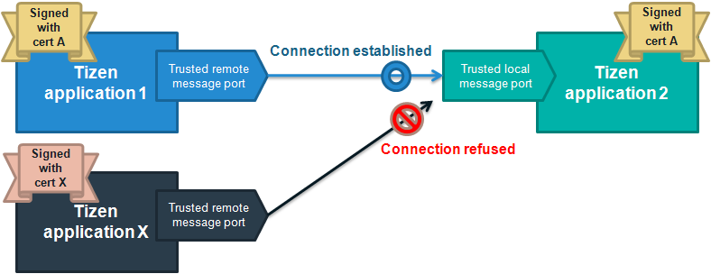

# Message Port

Your Web applications can communicate with other Web or native applications. The message data type for the communication is map data, which consists of a string key and value that can be a string, string array, byte stream, or byte stream array.

The Message Port API is mandatory for Tizen mobile, wearable, and TV profiles, which means that it is supported on all mobile, wearable, and TV devices. All mandatory APIs are supported on the Tizen Emulators.

The main features of the Message Port API include:

- Sending messages

  A Tizen Web application can [send messages](#managing-message-ports) to another application using the `sendMessage()` method of the `RemoteMessagePort` interface (in [mobile](../../api/latest/device_api/mobile/tizen/messageport.html#RemoteMessagePort), [wearable](../../api/latest/device_api/wearable/tizen/messageport.html#RemoteMessagePort), and [TV](../../api/latest/device_api/tv/tizen/messageport.html#RemoteMessagePort) applications).

- Receiving messages

  To [receive response messages](#managing-message-ports) from another application, your application can specify a local message port when it sends a message. You can receive response messages using the callback method which is registered through the `addMessagePortListener()` method of the `LocalMessagePort` interface (in [mobile](../../api/latest/device_api/mobile/tizen/messageport.html#LocalMessagePort), [wearable](../../api/latest/device_api/wearable/tizen/messageport.html#LocalMessagePort), and [TV](../../api/latest/device_api/tv/tizen/messageport.html#LocalMessagePort) applications).

  You can mostly receive message from applications implemented as Tizen native or Web applications. To implement a native application, see the native [Message Port Communication](../../../native/guides/app-management/message-port.md) guide.

  **Figure: Sending and receiving messages**

  

- Using trusted message ports

  For added security, you can restrict communication to only exchange messages with a trusted application that is signed with the same certificate as your application. Use the instances of the `LocalMessagePort` and `RemoteMessagePort` interfaces that are retrieved by the `requestTrustedLocalMessagePort()` and `requestTrustedRemoteMessagePort()` methods of the `tizen.messageport` object.

  **Figure: Trusted message ports**

  

## Managing Message Ports

You can send and receive messages through 2 types of message ports:

- The `LocalMessagePort` interface (in [mobile](../../api/latest/device_api/mobile/tizen/messageport.html#LocalMessagePort), [wearable](../../api/latest/device_api/wearable/tizen/messageport.html#LocalMessagePort), and [TV](../../api/latest/device_api/tv/tizen/messageport.html#LocalMessagePort) applications) is used to register your message port and prepare to receive messages from other applications.

   To receive messages from other applications, you must register a callback to the local message port.

- The `RemoteMessagePort` interface (in [mobile](../../api/latest/device_api/mobile/tizen/messageport.html#RemoteMessagePort), [wearable](../../api/latest/device_api/wearable/tizen/messageport.html#RemoteMessagePort), and [TV](../../api/latest/device_api/tv/tizen/messageport.html#RemoteMessagePort) applications) is used to send messages to other applications.

   The local message port information can be sent to another application for bi-directional communication, to enable the other application to send response messages.

You can retrieve the instances of the `LocalMessagePort` and `RemoteMessagePort` interfaces with the `requestLocalMessagePort()` and `requestRemoteMessagePort()` methods of the `tizen.messageport` object.

Learning how to send messages to and receive responses from other Tizen applications through message ports is a basic data communication skill:

1. To create a local port which receives messages, use the `requestLocalMessagePort()` method of the `LocalMessagePort` interface:

   ```
   var localPort = tizen.messageport.requestLocalMessagePort('SAMPLE_PORT');
   ```

2. To retrieve an instance of the `RemoteMessagePort` interface, use the `requestRemoteMessagePort()` method of the `tizen.messageport` object. The `RemoteMessagePort` interface sends messages to the port identified by an `ApplicationId` and a port name.

   ```
   var targetApplicationId = tizen.application.getCurrentApplication().appInfo.id;
   var remotePort = tizen.messageport.requestRemoteMessagePort(targetApplicationId, 'SAMPLE_PORT');
   ```

3. Use the `addMessagePortListener()` method of the `LocalMessagePort` interface to add a callback method that is invoked when the message arrives:

   ```
   var localPortWatchId = localPort.addMessagePortListener(function(data, replyPort) {
       for (var i = 0; i < data.length; i++) {
           var key = data[i].key;
           switch (key) {
               case 'command':
                   console.log('key:' + key + ' / value:' + data[i].value);
                   break;
               case 'data':
               case 'byteData':
                   console.log('key:' + key + ' / value:[');
                   for (var j = 0; j < data[i].value.length; j++) {
                       console.log(data[i].value[j] + ', ')
                   }
                   console.log(']');
                   break;
               case 'bytesData':
                   console.log('key:' + key + ' / value:[');
                   for (var j = 0; j < data[i].value.length; j++) {
                       console.log('[');
                       for (var k = 0; k < data[i].value.length; k++) {
                           console.log(data[i].value[j] + ', ')
                       }
                       console.log(']');
                   }
                   console.log(']');
                   break;
           }
       }
       if (replyPort) {
           console.log('replyPort given: ' + replyPort.messagePortName);
       }
   });
   ```

4. Use the `sendMessage()` method of the `RemoteMessagePort` interface to send a message:

   ```
   var messageData = [
       {key:'command', value:'begin'},
       {key:'data', value:{'dummy1', 'dummy2'}},
       {key:'byteData', value:[12, 23, 34, 45, 56, 67, 78]},
       {key:'bytesData', value:[[1, 2, 3, 255], [8, 9, 3, 4, 5]]}
   ];
   remotePort.sendMessage(messageData);
   ```

   If you expect a response message, pass the instance of the `LocalMessagePort` interface as the second parameter of the `sendMessage()` method to specify the message port where the response is sent:

   ```
   remotePort.sendMessage(messageData, localPort);
   ```

## Related information
* Dependencies   
   - Tizen 2.4 and Higher for Mobile
   - Tizen 2.3.1 and Higher for Wearable
   - Tizen 3.0 and Higher for TV
