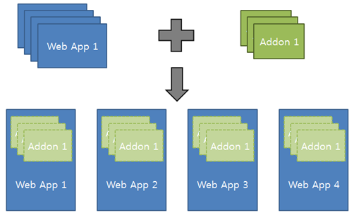
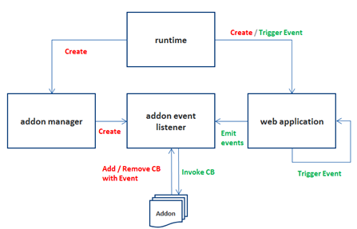
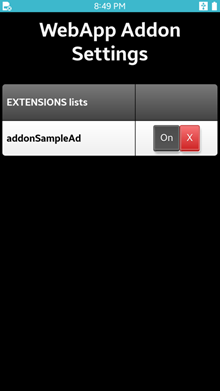

# Web Application Addon

Web Application addons are software programs that run on the Web applications. They work as part of each Web application. You can use addons to add or customize the Web application behavior according to your needs or preferences in all commonly installed Web applications. Web technologies such as HTML, JavaScript, and CSS are used to build them.

**Figure: Addon Concept**



> [!NOTE]
> This feature is supported from Tizen version 5.5.

The main features of the service application include:

- [Configuration](#configure)

  You must have a manifest file and a main JavaScript file.

- [Event](#event)

  You can use several events from a Web application to get the timing to perform what you want using addon on the Web application.

- [Mechanism](#mechanism)

  You can understand how each addon works.

- [Comparing to Chrome Extensions](#compare)

  Addons look similar to Chrome Extensions. However, there are certain differences that you can understand in this section.

- [API](#api)

  To write addons, you can use the predefined set of APIs.  

- [Packaging](#packaging)

  To generate a package for an addon, you can use Tizen Studio. There is a separate tag for addon in config.xml.

- [Management](#management)

  To manage installed addons, you can use a separate Web application named Web App Addon Setting.

<a name="configure"></a>
## Configuration

### Manifest file

You must have a manifest file.

The manifest file includes the metadata for an addon:

- **name**: Name of the addon.
- **version**: Version of the addon.
- **main**: Name of the main JavaScript.
- **settings**: Null (This is for future functionality)
- **description**: Description of the addon.

Following is an example of a manifest file. The filename must be `manifest.json`:
 
  ```
  {
      “name”: “addonSampleAd”,
      "version”: “0.0.1”,
      “main”: “addonSampleAd”,
      “settings”: “”,
      “description”: “Sample to show how to show up advertisement at prelaunch event”
  }
  ```

### Main JavaScript file

You must have a main JavaScript file.

The main JavaScript file must have the same name as `main` in the manifest file. The main JavaScript file includes:

  - `activate()`: To register a callback to an addon event.
  - `deactivate()`: To unregister the callback to an addon event.
  - `Callback Functions`: You can write your own code to define the behavior that happens when an addon event occurs.

Following is an example of a main JavaScript file:

  ```
  class AddonSampleAd {
      constructor(em) {
        console.log('AddonSampleAd constructor');
        this.evt = em;
      }
      activate() {
          console.log('AddonSampleAd.activate');
          this.evt.on('lcPrelaunch', this.prelaunch);
      }
      deactivate() {
          console.log('AddonSampleAd.dectivate');
          this.evt.off('lcPrelaunch', this.prelaunch);
      }
      prelaunch(winId, orgUrl) {
          console.log('AddonSampleAd.prelaunch');
      }
  }
  module.exports = AddonSampleAd;
  ```

<a name="event"></a>
## Event

| Event                                      | Description                              |
| ------------------------------------------ | ---------------------------------------- |
| `lcPrelaunch` | Emitted once for Web app launching just before the main page is shown. |
| `lcResume` | Emitted when the app is resumed. |
| `lcSuspend` | Emitted when the app is suspended. |
| `lcQuit` | Emitted before the app is closed. |
| `contentDidFinishLoad` | Emitted when the page navigation is done. | 

<a name="mechanism"></a>
## Mechanism

Addons are not standalone software programs, and only run when a Web application runs. They work on event-driven invocation. Each addon registers its callbacks to events that are pre-defined in Web Runtime JS (WRTjs). Registered callbacks are invoked whenever the registered events occur during the Web application’s life cycle.  

**Figure: Addon Mechanism**



<a name="compare"></a>
## Comparing to Chrome Extensions

Following are the differences from Chrome Extensions:

1. Applying to Multiple Applications

   Chrome Extensions are applied to multiple tabs in an application named Chrome browser. However, addons are applied to multiple Web applications in a platform such as Tizen.

2. Wide Range of Customization

   Addons can customize an action when each Web application’s life cycle event such as Prelaunch, Resume, Suspend, or Quit occurs. Addons get the notification after they register their own callback for a lifecycle event. That is possible because they run on WRTjs, also known as Web Runtime JS, which manages and controls from birth to death of Web applications.

<a name="api"></a>
## API

Addon APIs are provided to support the way to handle the window in both the browser process and the renderer process. More APIs will be added in future. The renderer process here is only available when the addon itself has HTML files and they are loaded.

**Table: Supported APIs**

| Module                                   | API                                      | Description                              | Type                                                                        |
| ---------------------------------------- | ---------------------------------------- | ---------------------------------------- | ---------------------------------------- |
| window | loadURL<br>show<br>showMessageBox | They provide core operation for window manipulation. | Browser |
| messaging | onMessage<br><br>sendMessage | They provide a way to communicate between the browser process and the renderer process.<br>Renderer is not the one of Web application but the one for the addon’s own page. | Browser<br><br>Renderer |

<a name="packaging"></a>
## Packaging

To generate a package for an addon, you can use Tizen Studio.

The characteristics of the addon packages include:

- Extension: WGT<br>
- Icon after installation: Not Shown<br>
- Tag in config file: `<tizen:addon>`

Following is an example of the config.xml file:

   ```
   <?xml version="1.0" encoding="UTF-8"?>
   <widget xmlns:tizen="http://tizen.org/ns/widgets" xmlns="http://www.w3.org/ns/widgets" id="http://yourdomain/AddonSampleAd" version="1.0.0" viewmodes="maximized">
       <tizen:addon package="TFh8kl6ztm" required_version="5.5"/>
       <name>AddonSampleAd</name>
       <tizen:profile name="mobile"/>
   </widget>
   ```

`<tizen:addon>` is a child element of the `<widget>` tag. You can set traits of an addon such as package id and required version. For required version, you must set it as 4.0 or higher. However, it is recommended to use 5.5 as addons are supported from Tizen version 5.5.

> [!NOTE]
> `<tizen:application>` is removed. It is replaced with `<tizen:addon>` in addon packaging.

### Location of Addon files

You must put the addon related files in the following directory:

   ```
   {project root}/shared/res
   ```

> [!CAUTION]
> If you put the addon related files in some other location then the addons will not be recognized.

<a name="management"></a>  
## Manage addons

Web App Addon Setting is pre-installed in the Tizen platform binary. It provides the following functionalities:

- **List Up**: It shows up all the installed addons.
- **Activation(On)**: You can activate each installed addon by clicking **On**.
- **Deactivation(Off)**: You can deactivate each installed addon by clicking **Off**.
- **Uninstallation**: You can uninstall each installed addon by clicking **X**.

**Figure: Addon Setting App**



## Related information
* Dependencies
   - Tizen 5.5 and Higher for Mobile
   - Tizen 5.5 and Higher for Wearable
