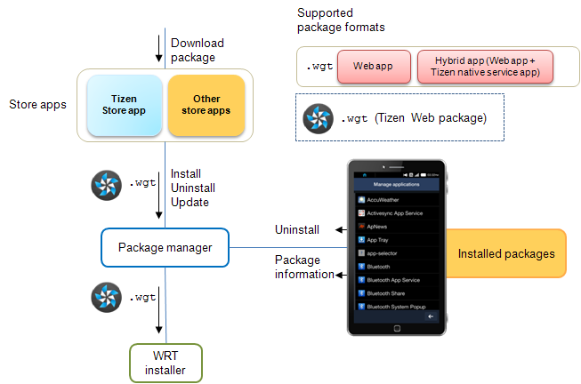

# Web Applications

The [Tizen Studio](../../../tizen-studio/index.md) enables you to create Web applications for mobile and wearable devices. A Web application consists of HTML, JavaScript, and CSS combined in a package, which can be installed on the Tizen device. A [Web application package](../../tutorials/process/app-dev-process.md#package) includes all the support files that are needed by the Web application. Therefore, a Web application can run without any additional external resources or network connectivity after installation.

The Application API is mandatory for Tizen mobile, wearable, and TV profiles, which means that it is supported on all mobile, wearable, and TV devices. All mandatory APIs are supported on the Tizen Emulators.

## Web Application Models

The application models support a rich set of standard W3C/HTML5 features, which include various JavaScript APIs as well as additional HTML markups and CSS features. These features along with the Tizen Device APIs and UI framework support can be used to create rich Web applications in a variety of categories, such as contact, messaging, device information access, multimedia, graphics, and games.

Tizen provides various application models to allow you to create applications targeted for specific tasks:

- UI Application

  The UI application has a graphical user interface. You can create diverse applications with a variety of features, and design versatile applications and intriguing user interfaces with text and graphics while taking advantage of many device functionalities, such as sensors and call operations. In addition, you can, for example, manage content and media files, use network and social services, and provide messaging functionality.

  The UI application is the most common Tizen application model.

  - [Watch Application](watch-app.md) **in wearable applications only**

    The watch application provides a watch face as its user interface, showing the current time and updating it every second. The watch application can be shown on the idle screen of the wearable device.

  - [Widget Application](web-widget.md) **in wearable applications only**

    The widget application (or widget) is a specialized application that provides the user with a quick view of specific information from the parent application. In addition, the widget allows the user to access certain features without launching the parent application. Combined with the parent application, your widget can have various features to increase the usability of your application.

- [Service Application](service-app.md)

  The service application is a Tizen Web application without a graphical user interface that runs in the background. They can be very useful in performing activities (such as getting sensor data in the background) that need to run periodically or continuously, but do not require any user intervention.

## Application Package Manager

The application package manager is one of the core modules of the Tizen application framework, and responsible for installing, uninstalling, and updating packages, and storing their information. Using the package manager, you can also retrieve information related to the packages that are installed on the device.

The application package manager module is expandable to support various types of applications, and designated installation modules can be added to it.

**Figure: Application package manager**

Tizen supports both Web application packages and hybrid application packages, which combine a Web application and one or more native service applications. Applications in the same package follow the same installation life-cycle, handled by the application package manager.

## Related Infromation
- Dependencies
  - Tizen 2.4 and Higher for Mobile
  - Tizen 2.3.1 and Higher for Wearable
  - Tizen 3.0 and Higher for TV

