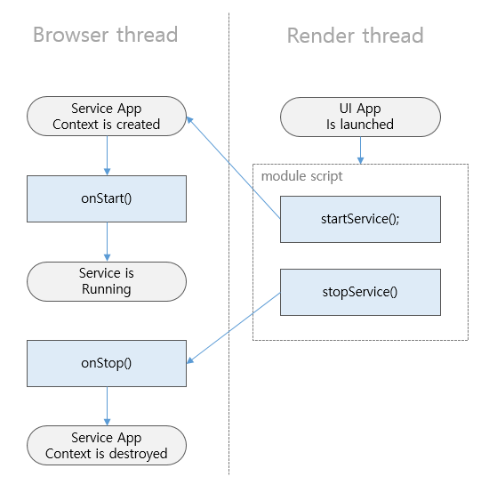

# Web Service

A Web service is a type of Tizen Web application that provides an environment for running JavaScript in the background without a graphical user interface (the Web service follows the [ECMA-262 specification](http://www.ecma-international.org/publications/standards/Ecma-262.htm)). Web services are useful in performing periodical or continuous activities that doesn't need user intervention, such as crawling data in the background. For example, a Web service can be used for getting data or listening for platform events in the background. As Web services do not have UI components, they run on top of a more light-weight runtime than Web applications. Therefore, you can expect them to perform better and consume less memory.

The main features of the Web service include:

- Managing the life-cycle

  To manage a Web service life-cycle, you must [define various callbacks](#create) to enable the application to be initialized and handle incoming requests.

- Packaging applications

  You must always [package a Web service](#package) with a Web application in a Web application package file. You can include multiple Web services in the same package with a single Web application.

- Launching and terminating applications

  You can [launch](#launch) and [terminate](#terminate) Web services using the `startService()` and `stopService()` method respectively.

The device main menu does not contain any icons for Web services, because the applications run in the background. The task switcher does not show them either. Web services can run simultaneously with other service and Web applications.

> [!NOTE]
> The TV Web service requires [partner-level certification](../../tutorials/sign-certificate.md) in Tizen 3.0.

## Prerequisites

To enable your application to use the Web service functionality:

1. To make your application visible in Tizen Store only for devices that support the Web service, the application must specify the following feature in the `config.xml` file:

   ```
   <widget>
      <tizen:feature name="http://tizen.org/feature/web.service"/>
   </widget>
   ```

2. To ensure that a Web service is acknowledged by the platform, you must add a Web service extension element (`<tizen:service>`) to the `config.xml` file of the application:

   ```
   <widget>
      <tizen:service id="{APP_ID}" type="ui">
         <tizen:content src="{PATH/TO/JS_File}"/>
         <tizen:name>{APP_NAME}</tizen:name>
         <tizen:description>{DESCRIPTION}</tizen:description>
      </tizen:service>
   </widget>
   ```

   The `<tizen:service>` element is a child of the `<widget>` element in the `config.xml` file. With the `<tizen:service>` element attributes, you can set the traits of a Web service, such as application ID, auto restart, and boot launching capability. With the `<tizen:service>` child elements, you can set the starting script, and name for the Web service.

   The definition of all service elements is listed and explained in the [Extending Configuration Elements](../../../tizen-studio/web-tools/config-editor.md#ww_extend).

> [!NOTE]
> No privileges need to be separately defined for Web services, since the Web service is always packaged with a Web application, and a privilege defined for the Web application covers the entire application package.

<a name="create"></a>
## Manage Web Service Life-cycle

To run a Web service, you must export a number of callbacks using the [CommonJS Modules](http://wiki.commonjs.org/wiki/Modules/1.1) API. The callbacks need to be added to the `module.exports` object, which is provided by the environment. The following callbacks are called when there are life-cycle changes or application control events which are triggered by the application management framework:

- `onStart()`: The entry point of the service. It is called after the service runtime finishes the set-up.
- `onStop()`: The exit point of the service. It is called to end a service. You can release resources or save the context by using this callback.

The Web service is running in browser thread of the Web application process.

**Figure: State transitions**



To manage Web service callbacks, follow these steps:

1. Create the service entry point with the `onStart()` callback. The callback is invoked when the service is launched. Within the callback, you can prepare resources and initialize whatever the Web service needs during the execution.

   ```
   module.exports.onStart = function() {
     console.log("onStart is called");
   };
   ```

2. Create the service exit point with the `onStop()` callback. The callback is invoked when the service is about to be stopped. All resources can be cleared and backed up within the callback.

   ```
   module.exports.onStop = function() {
     console.log("onStop is called");
   };
   ```

<a name="package"></a>
## Package Web Service

A Web application package can contain one Web application and several Web services. Each application in the Web application package shares the same package ID and has a unique application ID. In the following example, you can use the `<tizen:application>` element to define information for the Web application. The `<tizen:service>` element is used to define information about the Web service. The Web application and the Web service have the same package ID and different application IDs.

The Web application package file is installed, updated, and uninstalled as a single [package](../../index.md#package).

To package the Web service with a Web application, define the service in the `config.xml` file. The `<tizen:service>` element allows you to define the characteristics of the Web service. For example, you can specify the name, type and starting JavaScipt file of the Web service.

```
<?xml version="1.0" encoding="UTF-8"?>
<widget xmlns="http://www.w3.org/ns/widgets" xmlns:tizen="http://tizen.org/ns/widgets" id="http://yourdomain/ServiceSample" version="1.0.0" viewmodes="maximized">
    <tizen:application id="pmQZIjNqwQ.ServiceSample" package="pmQZIjNqwQ" required_version="5.5"/>
    <content src="index.html"/>
    <feature name="http://tizen.org/feature/screen.size.all"/>
    <icon src="icon.png"/>
    <name>ServiceSample</name>
    <tizen:profile name="mobile"/>
    <tizen:service id="pmQZIjNqwQ.Service" type="ui">
        <tizen:content src="service/service.js"/>
        <tizen:name>WebUIService</tizen:name>
        <tizen:description>WebUIService</tizen:description>
    </tizen:service>
</widget>
```

<a name="launch"></a>
## Launch Web Service by Web Application

The following code explains you how to launch a Web service by Web application.

The Web application launches a Web service by calling the `startService()` method with the Web service ID:

 ```
 <script type="module">
 import * as service from 'wrt:service';

 var pkg_id = tizen.application.getCurrentApplication().appInfo.packageId;
 var service_id = pkg_id + ".Service";

 service.startService(service_id).then(function() {
   alert("Succeeded to start service");
 }, function(error) {
   alert("Failed to start service : " + error);
 });
 </script>
 ```

<a name="terminate"></a>
## Terminate Web Service by Web Application

The following code explains you how to terminate a Web service by Web application.

The Web application terminates a Web service by calling the `stopService()` method with the Web service ID:

 ```
 <script type="module">
 import * as service from 'wrt:service';

 var pkg_id = tizen.application.getCurrentApplication().appInfo.packageId;
 var service_id = pkg_id + ".Service";

 service.stopService(service_id).then(function() {
   alert("Succeeded to stop service");
 }, function(error) {
   alert("Failed to stop service : " + error);
 });
 </script>
 ```

## Related information
- Dependencies
  - Tizen 5.5 and Higher for Mobile
  - Tizen 5.5 and Higher for Wearable
  - Tizen 3.0 and Higher for TV