# Widget Application

A widget application (or widget) is a specialized application that provides users with a quick view of specific information from the parent application. In addition, the widget can allow the user to access certain features without launching the parent application. Combined with the parent application, your widget can have various features to increase the usability of your application set.

This feature is supported in wearable applications only.

Web widgets are implemented using the Web programming technologies, such as HTML, CSS, and JavaScript; but only a subset of Tizen Web APIs. Web widgets run on wearable devices and are available to users in the widget board, which can be accessed by swiping right on the home screen (watch face).

**Figure: Widget board**

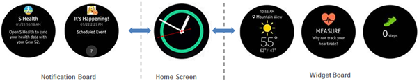

Web widgets occupy the entire screen to make the most out of the limited screen size. All content in a wearable widget must fit on 1 screen.

**Figure: Wearable widgets**

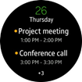 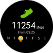

Since widgets are loaded on the widget board in the home screen layer, the only kind of interactivity available for the user is tapping. The users can tap an action button or anywhere on the widget screen to perform specified tasks or open the parent application.

**Figure: User actions on a widget**

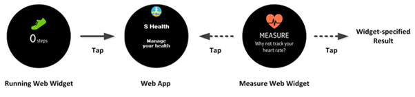

<a name="app_model"></a>
## Application Model

Web widgets use only a subset of HTML, CSS, and DOM APIs available for Web applications. Since a design goal of widgets is to provide a quick view of the widget content to the user, there are some restrictions in the Web widget implementation to prevent unnecessary performance degradation:

- Web widgets cannot use external network resource loading (for example, CSS, JavaScript, and image files).
- The total size of the HTML, CSS, and JavaScript files in the widget is limited to less than 50 Kbytes.
- The image resolution in a widget must be less than 1.5 times the base image resolution of the Web Widget Specification.
- Only JPEG, PNG, and GIF formats are allowed for image files.

You can create a standalone Web widget, with no parent Web application. In this case, the parent Web application is generated automatically by the Tizen Studio during packaging. However, this kind of widget is used for development and testing purposes only. To be published in the Tizen Store, Web widgets must be combined with a real parent application.

More than 1 Web widget can be included in a parent Web application, and all widgets and the parent are bundled in 1 package by the Tizen Studio. Web widget resources are included in its Web application package. The Tizen platform installs the Web widget when its parent Web application is installed, and uninstalls the Web widget when its parent Web application is uninstalled. The Web widget resources are all removed together with its parent.

**Figure: Widget and Web application packaging**

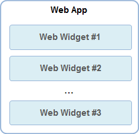

As multiple widgets are allowed in a package, each widget must be identified. The Web widget ID must be assigned with its parent Web application ID as a prefix, so the format is as follows:

```
<Web application ID>.<widget name>
```

The Web application ID is a combination of the package ID and the name of the Web application:

```
<package ID>.<Web application name>
```

The package ID is a random sequence of characters and numbers, which is automatically generated by the Tizen Studio, while you must define the Web application and widget name when creating the applications. For example, if you name your Web application `foo` and its widget `bar`, and the Tizen Studio creates the package ID as `Zyj5WR`, the Web application ID is `Zyj5WR.foo` and the Web widget ID is `Zyj5WR.foo.bar`.

<a name="lifecycle"></a>
### Life-cycle

The Tizen framework manages the operational states and life-cycle of the Web widgets: installation, creation, termination, and uninstallation. The following figure illustrates the Web widget's operational state changes.

**Figure: Operational state changes**

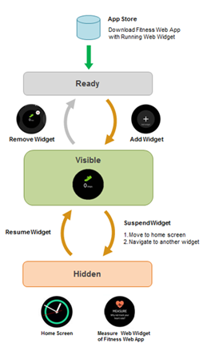

The Web widget life-cycle proceeds as follows:

1. The user downloads a Web application from an app store, and installs it with its Web widgets on a wearable device.

2. The users selects the widget in the **Add Widget** menu (by swiping right on the home screen), and the Tizen framework creates an instance of the Web widget and makes it available in the widget board.

3. When the user launches the widget from the widget board, an `onload` event is generated.

   A `visibilityChange` event is also generated and the value of the `visibilityState` property is set to `visible`. This means that the widget is in operation and its content is displayed on the screen. Whenever a widget is visible, the user can tap the UI screen to invoke specified tasks, such as launching the widget's parent application.

4. While the widget is running:

   - The user can suspend the widget by navigating away from the widget UI screen, for example, by rotating the Gear bezel. The `visibilityChange` event is generated and the value of the `visibilityState` property is set to `hidden`. The widget content is no longer visible on the UI screen, but the widget instance remains.
   - By navigating to the widget in the widget board, the user can resume the widget operations. The `visibilityChange` event is generated again, the value of the `visibilityState` property is set to `visible`, and the widget content is displayed on the screen.

   Other examples of the actions causing widget visibility changes are switching off the screen or switching the viewport to another application.

5. To remove the Web widget from the widget board, the user long-presses the widget and selects its **-** button. The Tizen framework terminates the widget operations and its instance. The widget and its resources remain on the wearable device, but the user must add the widget to the widget board again to use the widget.

   The parent Web application and its other Web widgets (if present) are not affected.

6. To uninstall the parent Web application and all its widgets, the user long-presses the Web application and selects its **-** button. In this case, the Web application package (including all its widgets and their resources) is deleted from the wearable device. The Tizen framework removes the Web application from the application tray and deletes all its widgets from the widget board.

### Packaging and Configuration

The Web widget application must be included in the same package with its parent Web application. The Web widgets are placed in the `widget` subdirectory, which is generated automatically by the Tizen Studio. The following example shows a typical structure of a Web application package with 2 Web widgets:

```
.wgt
   index.html
   config.xml
   icon.png
   css
   images
   js
   lib
   locales
   widget
      widget001
         index.html
         config.xml
         preview.png
         css
         images
         js
         lib
         locales
      widget002
         index.html
         config.xml
         preview.png
         css
         images
         js
         lib
         locales
```

The package contains a general `config.xml` file for the entire package, and a separate `config.xml` file for each widget:

- The `config.xml` file of the package contains the information from all the widget configuration files, in addition to the details of the parent Web application. The runtime of the Tizen platform uses the general `config.xml` file for installing the widget applications.
- The `config.xml` file of each widget has that widget's own information.

The following examples show the `config.xml` files in a Web application package:

- The general `config.xml` file for the Web application package:

  ```
  <?xml version="1.0" encoding="UTF-8"?>
  <widget xmlns="http://www.w3.org/ns/widgets" xmlns:tizen="http://tizen.org/ns/widgets"
     id="http://yourdomain/DynamicSample">

     <!--Information about widget001-->
     <tizen:app-widget id="Zyj5WRVa13.DynamicSample.widget001" primary="true">
        <tizen:widget-label>TEST_1</tizen:widget-label>
        <tizen:widget-content src="widget/widget001/index.html">
           <tizen:widget-size preview="widget/widget001/preview.png">2x2</tizen:widget-size>
        </tizen:widget-content>
     </tizen:app-widget>

     <!--Information about widget002-->
     <tizen:app-widget id="Zyj5WRVa13.DynamicSample.widget002" primary="false">
        <tizen:widget-label>TEST_2</tizen:widget-label>
        <tizen:widget-content src="widget/widget002/index.html">
           <tizen:widget-size preview="widget/widget002/preview.png">2x2</tizen:widget-size>
        </tizen:widget-content>
     </tizen:app-widget>

     <tizen:application id="Zyj5WRVa13.DynamicSample" package="Zyj5WRVa13" required_version="2.3.2"/>
     <icon src="icon.png"/>
     <name>DynamicSample</name>
  </widget>
  ```

- The `config.xml` file for widget001:

  ```
  <tizen:app-widget id="Zyj5WRVa13.DynamicSample.widget001" primary="true">
     <tizen:widget-label>TEST_1</tizen:widget-label>
     <tizen:widget-content src="widget/widget001/index.html">
        <tizen:widget-size preview="widget/widget001/preview.png">2x2</tizen:widget-size>
     </tizen:widget-content>
  </tizen:app-widget>
  ```

- The `config.xml` file for widget002:

  ```
  <tizen:app-widget id="Zyj5WRVa13.DynamicSample.widget002" primary="false">
     <tizen:widget-label>TEST_2</tizen:widget-label>
     <tizen:widget-content src="widget/widget002/index.html">
        <tizen:widget-size preview="widget/widget002/preview.png">2x2<tizen:widget-size>
     </tizen:widget-content>
  </tizen:app-widget>
  ```

<a name="ui_design"></a>
## UI Design

Although only limited subsets of the Tizen Web APIs are supported for Web widgets, they provide a wide range of UI designs sufficient for wearable devices. The following sections show various design examples using the HTML elements and CSS properties supported in Web widgets.

<a name="layout"></a>
### Layout

The following UI layouts with code examples are common use cases in widgets on wearable devices.

**Figure: UI layouts**


- Text layout

  The text layout is the most fundamental layout. You only need to place the text in proper positions by setting margins and paddings of the content element. You can also use the `text-align` CSS property to align the text to left, right, or center.

  **Figure: Text layout**

  

  ```
  <head>
     <style>
        body {
           margin: 0px;
           text-align: center;
        }
        #content {
           margin-top: 10px;
           padding-left: 33px;
           padding-right: 33px;
           font-size: 20px;
        }
     </style>
  </head>
  <body>
     <div id="content">
        Go grandmaster Lee Sedol regained a sizeable slice of human pride on Sunday night
        when he won the latest game in his historic match with
        an artificially intelligent machine built by Google researchers.
     </div>
  </body>
  ```

- Paragraph layout

  You can design a paragraph layout by grouping its content with `<div>` elements and applying styles for each group.

  **Figure: Paragraph layout**

  

  ```
  <head>
     <style>
        body {
           text-align: center;
        }
        #secondDiv {
           padding-top: 10px; padding-bottom: 10px;
        }
     </style>
  </head>
  <body>
     <div id="parentDiv">
        <div id="firstDiv">
           <div id="firstChildDiv1">Text1</div>
           <div id="firstChildDiv2">Text2</div>
        </div>
        <div id="secondDiv">
           <div id="secondChildDiv1">Text1</div>
           <div id="secondChildDiv2">Text2</div>
        </div>
        <div id="thirdChildDiv">Text1</div>
     </div>
  </body>
  ```

- Paragraph with images layout

  By adding images to a paragraph `<div>` group, you can implement the paragraph layout with images, whose styles are inherited from a parent `<div>` element.

  **Figure: Paragraph with images layout**

  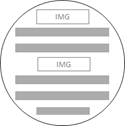

  ```
  <style>
     body {
        text-align: center;
     }
  </style>
  <body>
     <div id="parentDiv">
        <div>
           <div id="firstChildDiv1"></div>
           <div id="firstChildDiv2">Text2</div>
           <div id="firstChildDiv3">Text3</div>
        </div>
        <div>
           <div id="secondChildDiv1"></div>
           <div id="secondChildDiv2">Text2</div>
           <div id="secondChildDiv3">Text3</div>
        </div>
     </div>
  </body>
  ```

- Large image layout

  For this layout, you have to check whether the image must be resized by setting the `width` and `height` CSS properties. The image size must be smaller than the screen size.

  **Figure: Large image layout**

  

  ```
  <head>
     <style>
        body {
           text-align: center;
        }
        #largeImage {
           width: 150px; height: 150px;
        }
     </style>
  </head>
  <body>
     <div>
        <div id="firstChildDiv1">Text1</div>
        <div id="firstChildDiv2">Text2</div>
     </div>
     <div>
        <div id="secondChildDiv1"></div>
     </div>
     <div>
        <div id="thirdChildDiv1">Text1</div>
        <div id="thirdChildDiv2">Text2</div>
     </div>
  </body>
  ```

- Vertical split layout

  You can implement the vertical split layout using the `display` CSS property with the `inline-block` value. The `inline-block` elements are inline elements with additional `width` and `height` properties. With an `inline-block` element, you can easily achieve a grid-like layout.

  **Figure: Vertical split layout**

  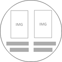

> **Note**  
> The widget engine only supports the `block`, `inline`, `inline-block`, and `none` values for the `display` property.
> ```
> #more {   
>    .display: inline-block;
> }
> ```

  ```
  <head>
     <style>
        #leftDiv {
           text-align: right;
        }
        #rightDiv {
           text-align: left;
        }
        .split {
           display: inline-block;
           width: 45%; height: 100%;
        }
        .imgArea {
           width: 50px; height: 100px;
        }
     </style>
  </head>
  <body>
     <div id="parentDiv">
        <div class="split" id="leftDiv">
           <div id="leftChildDiv1"></div>
           <div id="leftChildDiv2">Text</div>
        </div>
        <div class="split" id="rightDiv">
           <div id="rightChildDiv1"></div>
           <div id="rightChildDiv2">Text</div>
        </div>
     </div>
  </body>
  ```

- Icon layout

  In this layout, icons are arranged to the screen shape. For this kind of content layout, you can use static or absolute values for the `position` CSS property. You can select a preferred one, but static is recommended for a responsive Web design.

  **Figure: Icon layout**

  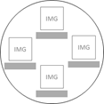

  Absolute positioning:

  ```
  <head>
     <style>
        body {
           width: 360px; height: 360px; margin: 0;
        }
        .box {
           position: absolute;
           width: 100px; height: 100px;
        }
        #topDiv {
           left: 130px; /* (360/2)-(100/2) */
        }
        #leftDiv {
           top: 100px;
        }
        #rightDiv {
           top: 100px;
           left: 260px; /* 360-100 */
        }
        #bottomDiv {
           top: 200px;
           left: 130px; /* (360/2)-(100/2) */
        }
     </style>
  </head>
  <body>
     <div class="box" id="topDiv">
        <div id="topChildDiv1"></div>
        <div id="topChildDiv2">Top Text</div>
     </div>
     <div class="box" id="leftDiv">
        <div id="leftChildDiv1"></div>
        <div id="leftChildDiv2">Left Text</div>
     </div>
     <div class="box" id="rightDiv">
        <div id="rightChildDiv1"></div>
        <div id="rightChildDiv2">Right Text</div>
     </div>
     <div class="box" id="bottomDiv">
        <div id="bottomChildDiv1"></div>
        <div id="bottomChildDiv2">Bottom Text</div>
     </div>
  </body>
  ```

  Static positioning:

  ```
  <head>
     <style>
        body {
           width: 360px; height: 360px; margin: 0;
        }
        .box {
           width: 100px; height: 100px;
           display: inline-block;
        }
        #topDiv, #midDiv, #bottomDiv {
           text-align: center;
        }
        #leftDiv {
           margin-right: 50px;
        }
        #rightDiv {
           margin-left: 50px;
        }
     </style>
  </head>
  <body>
     <div id="topDiv">
        <div class="box" id="topInnerDiv">
           <div id="topChildDiv1"></div>
           <div id="topChildDiv2">Top Text</div>
        </div>
     </div>
     <div id="midDiv">
        <div class="box" id="leftDiv">
           <div id="leftChildDiv1"></div>
           <div id="leftChildDiv2">Left Text</div>
        </div>
        <div class="box" id="rightDiv">
           <div id="rightChildDiv1"></div>
           <div id="rightChildDiv2">Right Text</div>
        </div>
     </div>
     <div id="bottomDiv">
        <div class="box" id="bottomInnerDiv">
           <div id="bottomChildDiv1"></div>
           <div id="bottomChildDiv2">Bottom Text</div>
        </div>
     </div>
  </body>
  ```

### Style

You can set the widget content styles, such as font and border, by changing the CSS properties. For example, you can set the font and border properties as follows:

```
#text {
   font-size: 20pt;
   font-weight: bold; /* Available values: normal, bold, bolder, lighter, number */
   text-align: center;
}
#more {
   border-style: solid;
   border-left-color: lightgray;
   border-top-color: lightgray;
}
```

The following example shows a calendar widget implementation with styles.

**Figure: Calendar widget**

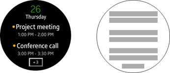

```
<!--HTML-->
<!DOCTYPE html>
<html>
   <body>
      <div id="viewport">
         <div id="day">26</div>
         <div id="week">Thursday</div>
         <div id="scheduleTitle">Project meeting</div>
         <div id="scheduleTime">1:00PM-2:00PM</div>
         <div id="scheduleTitle">Conference call</div>
         <div id="scheduleTime">3:00PM-3:30PM</div>
         <div id="more">+3</div>
      </div>
   </body>
</html>

<!--CSS-->
#viewport {
   font-size: 20pt;
   text-align: center;
}
#day {
   color: green;
   font-size: 30pt;
}
#scheduleTitle {
   margin-top: 5%;
   height: 13%;
   font-weight: bold;
   font-size: 30pt;
}
#more {
   font-size: 16pt;
   width: 50px;
   display: inline-block;
   border-style: solid;
   border-left-color: lightgray;
   border-top-color: lightgray;
}
#scheduleTime, #more {
   margin-top: 2%;
   color: gray;
}
```

### Image

You can manage images in a widget with JavaScript code for updating the content.

The following example shows a news briefing widget implementation with images.

**Figure: News briefing widget**

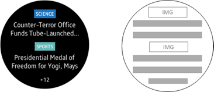

```
<!--HTML-->
<!DOCTYPE html>
<html>
   <body>
      <div class="category"></div>
      <div id="content1">Counter-Terror Office Funds Tube-Launched...</div>
      <div class="category"></div>
      <div id="content2">Presidential Medal of Freedom for Yogi, Mays</div>
      <div class="more">+12</div>
   </body>
</html>

<!--CSS-->
body {
   position: absolute;
   width: 360px; height: 360px;
   font-size: 20px;
   text-align: center;
}
* {
   display: block;
   margin: 0px; padding: 0px;
}
.category {
   margin-top: 40px;
   margin-left: 137.5px;
}
.content {
   margin-top: 10px;
   padding-left: 33px;
   padding-right: 33px;
   height: 66px;
   font-size: 26px;
}
.more {
   margin-top: 28px;
   height: 20.2px;
}
```

```
/* JavaScript */
function onload() {
    /* Load news data here */

    /* Content update */
    document.getElementById('imgCategory1').src = newsData.firstNewsType + '.png';
    document.getElementById('imgCategory2').src = newsData.secondNewsType + '.png';
    document.getElementById('content1').textContent = newsData.firstNewsData.substring(0,40) + '...';
    document.getElementById('content2').textContent = newsData.secondNewsData.substring(0,40) + '...';
}
```

<a name="animation"></a>
### Animation

For simple and smooth animation effects, use the `requestAnimationFrame()` JavaScript method.

The following example shows a weather widget implementation with an image animation.

**Figure: Weather widget**

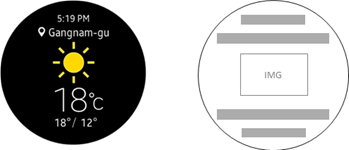

```
var cntImage = 0;

function step() {
    document.getElementById('imgWeather').src = 'images/sun_' + (cntImage++) + '.png';
    if (cntImage < 4) {
        window.requestAnimationFrame(step);
    }
}

function goAni() {
    window.requestAnimationFrame(step);
}
```

Similarly, you can create a text scrolling effect using the `requestAnimationFrame()` method. This is useful, for example, when displaying a lengthy music title. (Remember that the marquee element is not supported in Web widgets.)

**Figure: Scrolling effect**

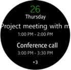

```
var scrollLength = 0;

function step() {
    document.getElementById('scheduleTitle').style.transform='translateX(' + (scrollLength--) + 'px)'
    if (scrollLength > -300) { /* Max length */
        window.requestAnimationFrame(step);
   }
}

function goAni() {
    window.requestAnimationFrame(step);
}
```

<a name="event"></a>
## Event Handling

The Web widget applications support the following events: `onload`, `onclick`, and `visibilityChange`:

- `onload`

  This event is generated when the Web widget content is loaded onto the widget board. Use it to implement Web widget initialization procedures. For example, initialize Web widget configurations by reading shared data from the parent Web application.

  **Figure: onload event**

  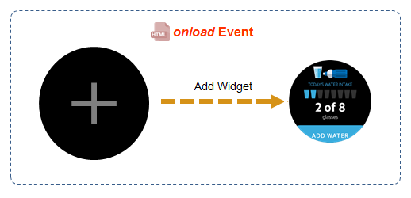

  ```
    <!--HTML-->
    <element onload="load">
    ```

    ```
    /* JavaScript */

    /* Define the event */
    object.onload=load;

    /* Set the event listener */
    object.addEventListener('load', load);

    /* Define the event handler in the main.js file */
    function load() {
        /* Load water data from shared file */
        loadWaterData();

        /* Change the current amount of water */
        document.getElementById('currentWaterNum').textContent = currentWaterNum;

        /* Change the color of the water cups */
        for (var i = 1; i <= currentWaterNum; ++i) {
            document.getElementById('watercup' + i)).style.backgroundColor = 'blue';
        }
    }
  ```

- `onclick`

  This event is generated when the user taps on an action button, whose function is specified by an HTML element. The following example code shows how to define the function for the **ADD WATER** button.

  **Figure: onclick event**    

  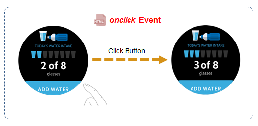

    ```
    <!--HTML-->
    <element onclick="click">
    ```

    ```
    /* JavaScript */

    /* Define the event */
    object.onclick=click;

    /* Set the event listener */
    object.addEventListener('click', click);

    /* Define the event handler in the main.js file */
    /* When the user clicks the button, update the status and change the style */
    function click() {
        /* Increase the water amount */
        currentWaterNum++;

        /* Change the current amount of water */
        document.getElementById('currentWaterNum').textContent = currentWaterNum;

        /* Change the color of the water cup */
        document.getElementById('watercup' + currentWaterNum).style.backgroundColor = 'blue';

        /* Store water data into a shared file */
        storeWaterData();
    }
  ```

- `visibilityChange`

   This event is generated when the Web widget content becomes visible or hidden.

  **Figure: visibilityChange event**  

  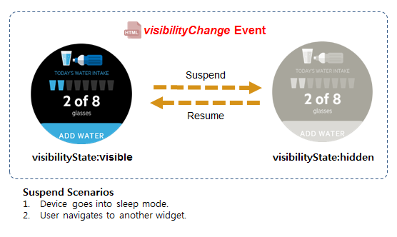

  ```
    /* JavaScript */

    /* Set the event listener */
    document.addEventListener('visibilitychange', visibilitychange);

    /* Define the event handler in the main.js file */
    function visibilitychange() {
        if (document.visibilityState === 'hidden') {
            /* Store shared data */
        } else {
            /* Load stored data and update the page */
        }
    }
  ```

<a name="communication"></a>
## Communication Between Web Widgets and Other Applications

Web widgets can communicate with other applications in various ways. As shown in the following table, the available methods depend on the type of the application the Web widget interacts with.

**Table: Web widget communication methods**

| Communication type                                                              | Available method |
|---------------------------------------------------------------------------------|-------------------------------------------------------------------------------------------------------------------------------------------|
| [Web widget &lt;--&gt; Parent application](#comm_parent) (on a wearable device) | Preference API |
| [Web widget &lt;--&gt; Host application](#comm_host) (on a host device)         | SAP (Samsung Accessory Protocol) |
  [Web widget &lt;--&gt; Web server](#comm_server)                                | XMLHttpRequest |

<a name="comm_parent"></a>
### Communicating with a Web Application on a Wearable Device

For data sharing between a Web widget and its parent application on the same device, use the Tizen [Preference API](../../api/latest/device_api/wearable/tizen/preference.html). The Preference API allows a Web widget to communicate with its parent Web app (and vice versa) by storing key-value pairs in a hashtable-like data structure. The data stored by the Preference API has a "package" scope, which means that any widgets (or a Web app) in a package can access the data stored by the other widgets (or a Web app) in the same package. In addition, the Preference API does not need additional permissions, so no modifications in the `config.xml` file are required.

The following table lists the Preference API methods.

**Table: Preference API methods**

| Method                                                | Description
|-------------------------------------------------------|---------------------------------------------|
| `tizen.preference.setValue("key", "value")`           | Stores a key-value pair. |
| `tizen.preference.getValue("key")`                    | Retrieves a value for the "key" key. |
| `tizen.preference.exists("key")`                      | Returns `true` if the given key exists. |
| `tizen.preference.remove("key")`                      | Removes a key-value pair for the "key" key. |
| `tizen.preference.setChangeListener("key", listener)` | Registers a change listener for "key". |
| `tizen.preference.unsetChangeListener("key")`         | Unregisters the change listener for "key". |


The following example shows how to set a key-value pair in the `Widget_main.js` file:

```
function checkPreference() {
    if (!tizen.preference.exists('KEY')) {
        tizen.preference.setValue('KEY', 'Widget_HELLOWORLD1');
    }

    if (tizen.preference.exists('KEY')) {
        tizen.preference.remove('KEY');
        tizen.preference.setValue('KEY', 'Widget_HELLOWORLD2');
    }

    /* [Log] value for KEY: Widget_HELLOWORLD2 */
    console.log('value for KEY: ' + tizen.preference.getValue('KEY'));

    /* Callback function */
    var listener = function(data) {
        /* [Log] Preference with the key: KEY has a new value: APP_HELLOWORLD */
        console.log('Preference with the key: ' + data.key + ' has a new value: ' + data.value);
        tizen.preference.unsetChangeListener('KEY');
    };

    tizen.preference.setChangeListener('KEY', listener);
}
```

To set the value in the `WebApp_main.js` file:

```
window.onload = function() {
    var timer = setInterval(function() {
        clearInterval(timer);
        try {
            tizen.preference.setValue('KEY', 'APP_HELLOWORLD');
            tizen.application.getCurrentApplication().exit();
        } catch (ignore) {}
    }, 2000);
};
```

#### Tizen Application API

The [Application](../../api/latest/device_api/wearable/tizen/application.html) API allows a widget to launch and access installed applications on the same device. For this, you need to set the following privileges:

```
<tizen:privilege name="http://tizen.org/privilege/application.info"/>
<tizen:privilege name="http://tizen.org/privilege/application.launch"/>
<tizen:privilege name="http://tizen.org/privilege/appmanager.certificate"/>
<tizen:privilege name="http://tizen.org/privilege/appmanager.kill"/>
```

In addition, to launch an application, its application ID must be used to identify the application:

```
/* Launch the application */
tizen.application.launch('ApplicationIDToLaunch', onGetAppsContextSuccess);
```

> **Note**  
> It is not recommended for a Web widget to launch other Web widgets. This feature is deprecated in Tizen 3.0.

<a name="comm_host"></a>
### Communicating with a Host Application on a Host Device

The widget and its parent application can reside on separate devices, as when a Web widget is on a wearable device while the host (parent) application is on a mobile device. In this case, the widget and parent applications can communicate through [SAP (Samsung Accessory Protocol)](http://developer.samsung.com/onlinedocs/samsung_webapi_guide_public_2.0/html/wapi_spec/sap.html) to share data between the widget (the consumer in SAP) and the parent application (the provider in SAP).

The following example shows SAP communication implementation between a Web widget on a Tizen wearable device and its parent application on an Android&trade; mobile device:

- Widget on a Tizen wearable device:

  ```
  <!--Privilege-->
  <tizen:privilege name="http://developer.samsung.com/privilege/accessoryprotocol"/>

  <!--HTML-->
  <body>
     <button id="button1" onclick="getDataFromHostApp();">GetData</button>
     <div id="result"></div>
  </body>
  ```

  ```
  /* JavaScript */
  var SAAgent = 0;
  var SASocket = 0;
  var CHANNELID = 2000;
  var providerAppName = 'WeatherProvider';

  function onerror(err) {
      /* Error handling */
  }

  var agentCallback = {
      onconnect: function(socket) {
          SASocket = socket;
          SASocket.setSocketStatusListener(function(reason) {
              disconnect();
          });
          SASocket.setDataReceiveListener(onreceive);
          /* Request the provider to get weather info */
          SASocket.sendData(CHANNELID, 'request');
      },
      onerror: onerror
  };

  var peerAgentFindCallback = {
      onpeeragentfound: function(peerAgent) {
          try {
              if (peerAgent.appName == providerAppName) {
                  SAAgent.setServiceConnectionListener(agentCallback);
                  SAAgent.requestServiceConnection(peerAgent);
              }
          } catch (err) {
              /* Error handling */
          }
      },
     onerror: onerror
  };

  function onsuccess(agents) {
      try {
          if (agents.length > 0) {
              SAAgent = agents[0];
              SAAgent.setPeerAgentFindListener(peerAgentFindCallback);
              SAAgent.findPeerAgents();
          }
      } catch (err) {
          /* Error handling */
      }
  }

  function onreceive(channelId, data) {
      document.getElementById('result').textContent = data;
  }

  function getDataFromHostApp() {
      if (SASocket) {
          return false; /* Already connected */
      }
      try {
          webapis.sa.requestSAAgent(onsuccess, function(err) {
              /* Error handling */
          });
      } catch (err) {
          /* Error handling */
      }
  }
  ```

- Parent application on an Android mobile device:

  For the provider application on the host device, you need to:

  - Declare the permissions, service, broadcast receiver, and intent-filter in the Android manifest file.
  - Add the Accessory Service Profile in the `config.xml` and `AndroidManifest.xml` files in order to allow the applications to communicate with each other.

  ```
  <!--Permissions-->
  <uses-permission android:name="android.permission.BLUETOOTH"/>
  <uses-permission android:name="android.permission.BLUETOOTH_ADMIN"/>
  <uses-permission android:name="com.samsung.accessory.permission.ACCESSORY_FRAMEWORK"/>
  <uses-permission android:name="com.samsung.wmanager.APP"/>
  <uses-permission android:name="com.samsung.wmanager.ENABLE_NOTIFICATION"/>

  <!--Service registration-->
  <service android:name=".WeatherProviderForWidget"/>

  <!--Broadcast receiver and intent-filter-->
  <receiver android:name="com.samsung.android.sdk.accessory.ServiceConnectionIndicationBroadcastReceiver">
     <intent-filter>
        <action android:name="android.accessory.service.action.ACCESSORY_SERVICE_CONNECTION_IND"/>
     </intent-filter>
  </receiver>
  <receiver android:name="com.samsung.android.sdk.accessory.RegisterUponInstallReceiver">
     <intent-filter>
        <action android:name="android.accessory.device.action.REGISTER_AFTER_INSTALL"/>
     </intent-filter>
  </receiver>

  <!--Service profile information-->
  <meta-data android:name="AccessoryServicesLocation"
             android:value="/res/xml/accessoryservices.xml"/>
  ```

  ```
  // Activity (Main) code
  try {
      // To widget
      WeatherProviderForWidget.mConnectionHandler.send(WeatherProviderForWidget.WIDGET_CHANNEL_ID, jsonData.toString().getBytes());
  } catch (JSONException e) {
      e.printStackTrace();
  } catch (IOException e_io) {
      e_io.printStackTrace();
  }

  // Service (WeatherProviderForWidget)
  @Override
  protected void onServiceConnectionResponse(SAPeerAgent peerAgent, SASocket socket, int result) {
      if (result == SAAgent.CONNECTION_SUCCESS) {
          if (socket != null) {
              mConnectionHandler = (ServiceConnection) socket;
          }
      } else if (result == SAAgent.CONNECTION_ALREADY_EXIST) {
          Log.e(TAG, "onServiceConnectionResponse, CONNECTION_ALREADY_EXIST");
      }
  }

  public class WeatherProviderForWidget extends SAAgent {
      private static final String TAG = "WeatherProviderForWidget";
      private static final Class<ServiceConnection> SASOCKET_CLASS = ServiceConnection.class;
      static ServiceConnection mConnectionHandler = null;
      static final int WIDGET_CHANNEL_ID = 1000;

      @Override
      public void onCreate() {
          super.onCreate();
          SA mAccessory = new SA();
          try {
              mAccessory.initialize(this);   // Connect to Widget
          } catch (Exception e1) {
              e1.printStackTrace();
          }
      }

      @Override
      protected void onServiceConnectionRequested(SAPeerAgent peerAgent) {
          if (peerAgent != null) {
           acceptServiceConnectionRequest(peerAgent);   // Connection Accepted
          }
      }

      public class ServiceConnection extends SASocket {
          public ServiceConnection() {
              super(ServiceConnection.class.getName());
          }

          @Override
          public void onReceive(int channelId, byte[] data) {
              if (mConnectionHandler == null) {
                  return;
              }
              String req_message = new String(data);   // Get data from Widget

              if (req_message.equals(new String("request"))) {
                  final JSONObject jsonData = new JSONObject();
                  try {
                      Calendar calendar = new GregorianCalendar();
                      SimpleDateFormat dateFormat = new SimpleDateFormat("hh:mm");
                      String timeStr = dateFormat.format(calendar.getTime());
                      jsonData.put("time_text", timeStr);
                      jsonData.put("city_text", "city name");
                      mConnectionHandler.send(WIDGET_CHANNEL_ID, jsonData.toString().getBytes());
                  } catch (JSONException e) {
                      e.printStackTrace();
                  } catch (IOException e) {
                      e.printStackTrace();
                  }
              } else if (req_message.equals(new String("delete_widget"))) {
                  Log.e(TAG, "The widget was deleted from the viewer");
              } else if (req_message.equals(new String("Add city"))) {
                  Context context = getApplicationContext();
                  Intent intent = new Intent(context, ProviderActivity.class);
                  intent.addFlags(Intent.FLAG_ACTIVITY_NEW_TASK);
                  context.startActivity(intent);
              }
          }

          @Override
          protected void onServiceConnectionLost(int reason) {
              Log.e(TAG, "Service Connection is Lost");
              mConnectionHandler = null;
          }
      }
  }
  ```

<a name="comm_server"></a>
### Communicating with a Web Server

To get data from a Web server through the Internet, use the XMLHttpRequest API. The Web widget engine, however, does not support the full XMLHttpRequest specification. It only supports the `GET` and `POST` methods, and the `TEXT` and `JSON` data types. This design decision emphasizes the read-only behavior of the Web widgets and meets the runtime memory requirements. Use Web widgets to display information in a compact manner, and do not create new resources using the `PUT` method: as user interaction is not intended and can exceed the widget's maximum allowed memory, it can lead to security risks.

The following example shows Web widget communication with a Web server:

```
<!--Privilege-->
<tizen:privilege name="http://tizen.org/privilege/internet"/>

<!--HTML-->
<body>
   <button id="button1" onclick="getDataFromNetwork('txt.txt', handleResponseTEXT);">Text</button>
   <button id="button2" onclick="getDataFromNetwork('json.json', handleResponseJSON);">Json</button>
   <div id="result"></div>
</body>
```

```
/* JavaScript */
function errorHandling(e) {
    if (e.target.readyState == 3) {
        /* Error handling */
        e.target.abort();
    }
}

function getDataFromNetwork(file, handler) {
    var xhr = new XMLHttpRequest();
    xhr.open('GET', file, true);
    xhr.onreadystatechange = handler;
    xhr.onload = function() {
        if (this.status == 200) {
            /* Handle the response */
        }
    };
    xhr.send();
}

/* If getting Text data */
function handleResponseTEXT(e) {
    if (e.target.readyState == 4) {
        if (e.target.status == 200) {
            document.getElementById('result').textContent = e.target.responseText;
        } else {
            /* Error handling */
        }
    }
}

/* If getting JSON data */
function handleResponseJSON(e) {
    if (e.target.readyState == 4) {
        if (e.target.status == 200) {
            var data = JSON.parse(e.target.responseText);
            var val = data.employees;
            var result = val[0].firstName + ' ' + val[0].lastName;
            document.getElementById('result').textContent = result;
        } else {
            /* Error handling */
        }
    }
}
```

<a name="cookbook"></a>
## Locale Information Formatting

You can use a `Date` object to format locale information in a widget.

The following example provides the date information in different formats:

```
var d = new Date();
d.toLocaleString(); /* '2/1/2013 7:37:08 AM' */
d.toLocaleDateString(); /* '2/1/2013' */
d.toLocaleTimeString(); /* '7:38:05 AM' */
```

<a name="debug"></a>
## Debugging

You can debug and validate your Web widget. Currently, there are 2 approaches to debugging a Web widget:

- Console log
- Web debugger

The validation process checks whether a Web widget is compliant with the specifications and whether it contains unsupported HTML elements and CSS properties.

<a name="consolelog"></a>
### Debugging with the Console Log

Using the `console.log()` method is a simple and convenient way of debugging a Web widget. The following figure shows how to debug a Web widget using the Tizen Studio.

**Figure: Debugging with the console log**

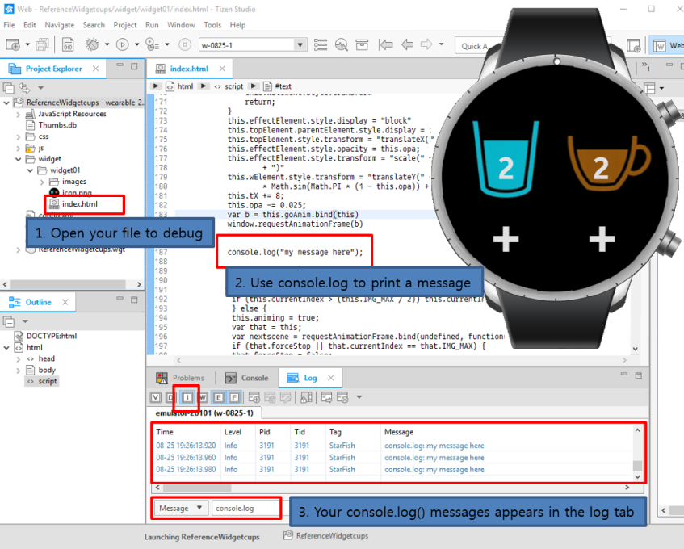

In addition, you can use the following command to print the `console.log()` message in the terminal:

```
sdb dlog | grep StarFish
```

The following figure shows the `sbd dlog` command in action.

**Figure: Debugging messages in the terminal**


<a name="web_debug"></a>
### Debugging with the Web Debugger

To make Web widgets lighter, debugging features may not be supported by default. In this case, take the following steps to use a built-in Web application debugger:

1. Create an empty Web application template.
2. Copy the Web widget-related files (create a Web application with the same content as in the Web widget).
3. Run the built-in Web debugger.

The following figure shows how to run the built-in Web debugger.

**Figure: Web debugger**

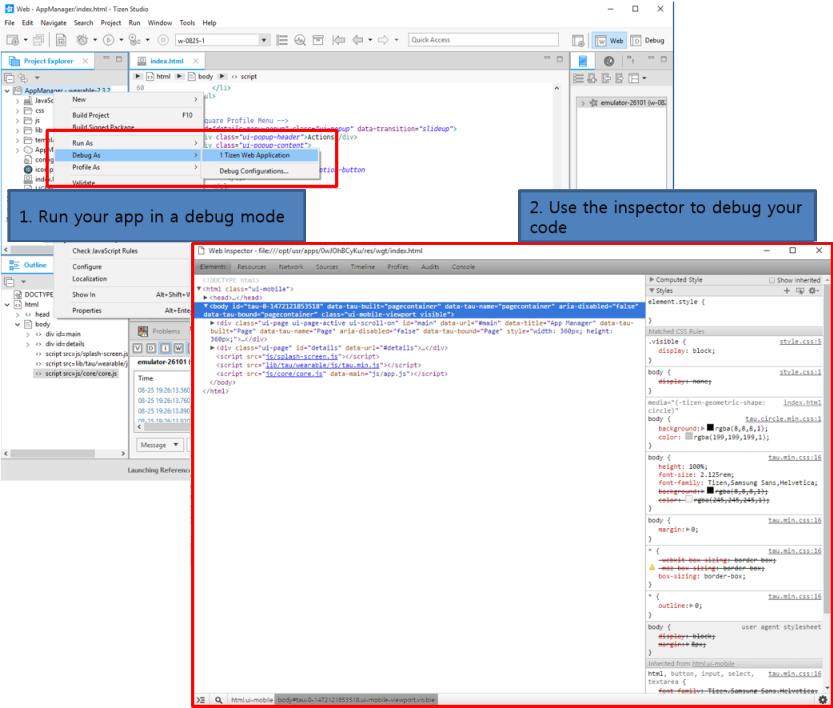

In addition, you can still use the `console.log()` method as shown in the following figure.

**Figure: The `console.log()` method**

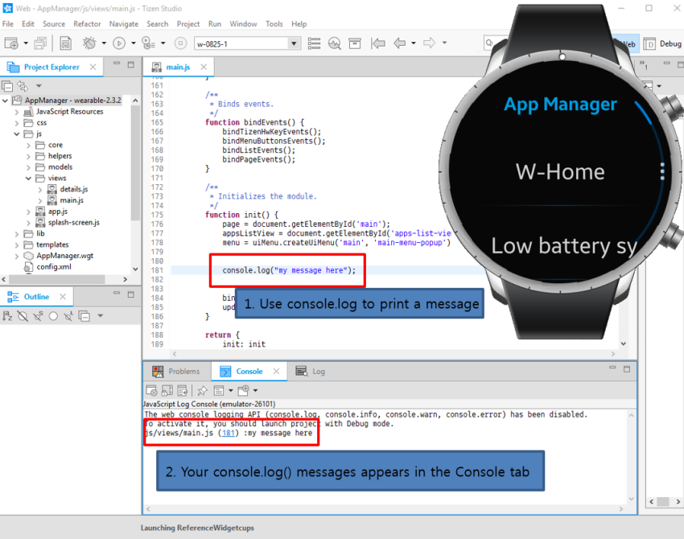

Similarly, you can also use the following command to print the `console.log()` messages in a terminal.

```
sdb dlog | grep ConsoleMessage
```

The following figure shows the `sdb dlog` command in action.

**Figure: Debugging messages in the terminal**

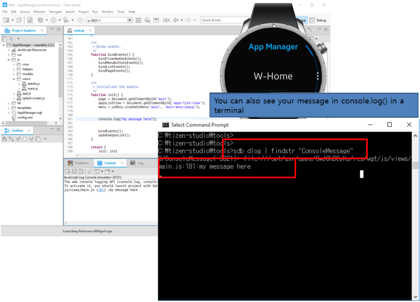

<a name="validate"></a>
### Validating a Web Widget

You can validate a Web widget using the following validators:

- HTML validator
- CSS validator
- JS validator

You can enable or disable these validators in the application preferences. Go to **Windows &gt; Preferences &gt; Tizen Studio &gt; Web &gt; WebWidget**, and check the applicable boxes.

**Figure: Web widget validation**

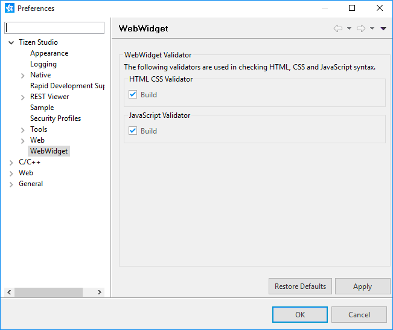

The validation is performed automatically when the project or the package is built, or when the application is run.

When the validation is complete, its results are shown in the **Problems** view. If the view is not displayed, go to **Window &gt; Show view &gt; Problems**, or use the keyboard shortcut **Shift + Alt + Q + X**.

**Figure: Web widget validation result**


<a name="performance"></a>
## Performance Considerations

It is important to prevent unnecessary performance degradation in widgets. As a result, some restrictions must be followed when implementing Web widgets:

- External network resources

  Linking external network resources in an HTML document often introduces significant network delays that result in slow loading of Web applications. Therefore, it is not allowed to load resources from external networks in a Web widget application.

  The following example illustrates forbidden external network resources:

  ```
  <!--HTML-->
  

  <script src="https://ajax.googleapis.com/ajax/libs/jquery/1.12.0/jquery.min.js"/>
  <script src="http://code.angularjs.org/angular-1.0.0rc10.min.js"/>

  <link rel="stylesheet" type="text/css" href="http://spec.example.com/theme.css">

  <!--CSS-->
  #myImage {
     content: url('http://spec.example.com/image.png');
  }
  ```

- Image size

  The width and the height of the image files in Web widgets are limited to 1.5 times the base image resolution. For the wearable profile, for example, the base image resolution is 360 x 360, so the maximum size of the images is 540 x 540. As long as the image size is within the limit, you can include multiple images in the widget.

  **Figure: Width and height of the image**

  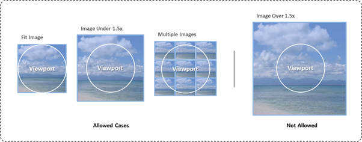

- Resource size

  A Web widget application consists of HTML documents, and JavaScript, CSS, and other resource files. To improve the loading performance, the total size of the Web widget application cannot exceed 50 Kbytes. Because of this limitation, you cannot include heavy JavaScript and CSS libraries, such as jQuery and AngularJS:

  ```
  <!--HTML-->
  <script src="lib/tau/wearable/js/tau.js"/>
  <link rel="stylesheet" href="lib/tau/wearable/theme/default/tau.css">

  <script src="libs/jquery/1.12.0/jquery.min.js"/>
  ```

## FAQ

-   [How are click and touch events handled in Web widgets?](#user-content-how-are-click--touch-events-handled-in-web-widgets)
-   [Can I apply heading styles to text?](#user-content-can-heading-styles-be-applied-to-text)
-   [Can I use hyperlinks in Web widgets?](#user-content-can-i-use-hyperlinks-in-web-widgets)
-   [Which font styles are supported?](#user-content-what-font-styles-are-supported)
-   [What is the best way to use the `` element?](#user-content-what-is-the-best-way-to-use-the-img-tag)
-   [Why can't I use iframes?](#user-content-why-cant-i-use-iframes)
-   [Which media elements are supported?](#user-content-what-media-elements-are-supported)
-   [How can I create tables?](#user-content-how-can-i-create-tables)
-   [What kind of forms can I use?](#user-content-what-kind-of-forms-can-i-use)
-   [How can I mimic select elements instead of using the `querySelector()` method?](#user-content-how-can-i-mimic-select-elements-instead-of-using-queryselector)
-   [How can I retrieve nodes without the `NodeIterator` object?](#user-content-how-can-i-retrieve-nodes-witout-nodeiterator)
-   [Is `innerHTML` or `innerText` supported?](#user-content-is-innerhtml-or-innertext-supported)
-   [How can logging be performed in the emulator?](#user-content-how-can-logging-be-performed-in-the-emulator)
-   [Why does the `responseXML` property return `undefined`?](#user-content-why-does-the-responsexml-property-return-undefined)
-   [How can I use the `response` and `responseType` attributes?](#user-content-where-can-i-find-a-guide-for-using-response-and-responsetype-attributes)
-   [How can I change the Web widget text font?](#user-content-how-can-i-change-web-widget-text-font)
-   [Can I set a border style, such as `border-radius`?](#user-content-can-i-set-a-border-style-like-border-radius)
-   [Can I animate images without a 2D canvas?](#user-content-can-images-be-animated-without-a-2-d-canvas)
-   [Is the Web Widget Specification a new Web standard?](#user-content-is-the-web-widget-specification-a-new-web-standard)
-   [Which elements or properties can I use?](#user-content-which-tags-and-properties-can-i-use)
-   [How can I design my Web widget layout for a circular shape?](#user-content-how-can-i-design-my-web-widget-layout-for-a-circular-shape)
-   [Can I use external JavaScript and CSS libraries?](#user-content-can-i-use-external-javascript-and-css-libraries)
-   [What kind of events can I use for user interaction?](#user-content-what-kind-of-events-can-i-use-for-user-interaction)
-   [How can I access the Internet from a Web widget, and what restrictions are there?](#user-content-how-can-i-access-the-internet-from-a-web-widget-and-what-restrictions-are-there)
-   [Is it possible to implement Web widgets without a Web application?](#user-content-is-it-possible-to-implement-only-web-widget-without-web-application)
-   [How can I determine which APIs are supported in Web widgets?](#user-content-how-can-i-determine-which-apis-are-supported-in-web-widgets)
-   [Can Web widgets reuse the JavaScript library or CSS styles of their parent Web application?](#user-content-can-web-widgets-re-use-the-javascript-library-or-css-styles-of-their-parent-web-application)
-   [What are the benefits of Web widgets compared with native widget applications?](#user-content-what-are-the-benefits-of-web-widget-apps-compared-with-native-widget-apps)
-   [What type of content is best for Web widgets?](#user-content-what-type-of-content-is-best-for-web-widget-apps)
-   [Can I use CSS `ellipsis`?](#user-content-can-i-use-css-ellipsis)
-   [Do my customers download the Web widgets when downloading a Web application?](#user-content-do-my-customers-download-web-widget-apps-when-downloading-a-web-app)
-   [Is the widget creation initiated by the widget adding and resuming actions?](#user-content-is-creation-initiated-by-the-add-widget-action-and-by-the-resume-widget-action)
-   [When a Web widget is removed, which events are fired?](#user-content-when-a-web-widget-is-removed-what-events-are-fired)
-   [What are the Web widget file size limitations (HTML, CSS, JavaScript)?](#user-content-what-are-the-web-widget-file-size-limitations-html-css-javascript)

<a name="user-content-how-are-click--touch-events-handled-in-web-widgets"></a>
### How are click and touch events handled in Web widgets?

The Web widget engine supports only the `onclick` event handler for click and touch events. Implement and bind an event handler to the target element. For more information, see [onclick Event](../../api/latest/wearable_widget/web_widget.html#user-content-event).

<a name="user-content-can-heading-styles-be-applied-to-text"></a>
### Can I apply heading styles to text?

The Web widget engine does not support HTML heading styles (`h1`, `h2`, ..., `h6`). The heading styles are typically used to structure Web pages displayed in browsers. To make a heading text, apply a suitable CSS `font-style` property.

<a name="user-content-can-i-use-hyperlinks-in-web-widgets"></a>
### Can I use hyperlinks in Web widgets?

The Web widget engine does not support hyperlinks. To change from the current Web widget page, use a CSS transition or implement your service as a Web application.

<a name="user-content-what-font-styles-are-supported"></a>
### Which font styles are supported?

The Web widget engine supports the `<br>` and `<span>` elements for text-level semantics (for more information, see [HTML](../../api/latest/wearable_widget/web_widget.html#user-content-html)). You can also use CSS properties to make the text display like text with text-level semantics elements applied. The following table lists examples of typical element/CSS property correlations.

**Table: Element and CSS property correlations**

| Unsupported element | Similar supported CSS property and values |
|---------------------|--------------------------------------------------|
| `<strong>`          | `font-weight: bold` |
| `<small>`           | `font-size: smaller` |
| `<s>`               | `text-decoration: line-through` |
| `<sub>`             | `vertical-align: sub` and `font-size: smaller` |
| `<sup>`             | `vertical-align: super` and `font-size: smaller` |
| `<i>`               | `font-style: italic` |
| `<b>`               | `font-weight: bold` |
| `<u>`               | `text-decoration: underline` |

<a name="user-content-what-is-the-best-way-to-use-the-img-tag"></a>
### What is the best way to use the `` element?

To increase performance and reduce the memory footprint, the Web widget engine imposes 2 limitations on the `` element:

- Supported image file formats: PNG, JPG, GIF
- Supported resolutions: lower than 1.5 times the base image resolution

<a name="user-content-why-cant-i-use-iframes"></a>
### Why can't I use iframes?

Typically, iframes are used for embedding another document within the current document. However, Web widgets provide simple services and content. Therefore, the Web widget engine does not support iframes.

<a name="user-content-what-media-elements-are-supported"></a>
### Which media elements are supported?

The Web widget engine supports the `` element only, and does not support `<audio>` and `<video>` elements.

<a name="user-content-how-can-i-create-tables"></a>
### How can I create tables?

The Web widget engine does not support the `<table>` HTML element. To create a table-like layout, use the `<div>` and `<border>` elements, as shown in the following example:

```
<!--CSS style-->
<style>
   body {
      position: absolute;
      margin: 0px;
      padding: 0px;
      top: 0px;
      left: 0px;
      width: 360px;
      height: 360px;
      font-size: 1.125rem;
      color: Black;
      background-color: White;
   }
   #leftDiv {
      text-align: center;
      border: 1px solid red;
   }
   #rightDiv {
      text-align: center;
      border: 1px solid red;
      margin-left: -5px;
   }
   .split {
      display: inline-block;
      width: 45%; height: 100%;
   }
</style>

<!--Table-like div-->
<div id="parentDiv">
   <div class="split" id="leftDiv">
      First Name
   </div>
   <div class="split" id="rightDiv">
      Last Name
   </div>
</div>
<div id="parentDiv">
   <div class="split" id="leftDiv">
      Eve
   </div>
   <div class="split" id="rightDiv">
      Jackson
   </div>
   <div class="split" id="leftDiv">
      John
   </div>
   <div class="split" id="rightDiv">
      Doe
   </div>
   <div class="split" id="leftDiv">
      Adam
   </div>
   <div class="split" id="rightDiv">
      Johnson
   </div>
</div>
```

<a name="user-content-what-kind-of-forms-can-i-use"></a>
### What kind of forms can I use?

The Web widget engine does not support the `<form>` element. However, you can create form-like elements using the `<div>` element and CSS styles.

<a name="user-content-how-can-i-mimic-select-elements-instead-of-using-queryselector"></a>
### How can I mimic select elements instead of using the `querySelector()` method?

The Web widget engine does not support the `querySelector()` method. However, you can create an alternative select element, as shown in the following example:

```
var parent = document.getElementById('parentDiv');
var c = parent.children;
var i;

for (i = 0; i < c.length; i++) {
    if (c[i].id === 'leftDiv') {
        /* Do something */
    }
}
```

<a name="user-content-how-can-i-retrieve-nodes-witout-nodeiterator"></a>
### How can I retrieve nodes without the `NodeIterator` object?

The Web widget engine does not support the `NodeIterator` object. Retrieve the `children` attribute of a node as shown in the following example:

```
var c = document.body.children;
var i;

for (i = 0; i < c.length; i++) {
    c[i].style.backgroundColor = 'red';
}
```

<a name="user-content-is-innerhtml-or-innertext-supported"></a>
### Is `innerHTML` or `innerText` supported?

The Web widget engine does not support `innerHTML` and `innerText` properties. To get the text data of an element, use the `textContent` attribute, as shown in the following example:

```
var parent = document.getElementById('parentDiv');
var parentText = parent.textContent;
```
<a name="user-content-how-can-logging-be-performed-in-the-emulator"></a>
### How can logging be performed in the emulator?

Use the `console.log()` method in the JavaScript code. You can see the logs in the Tizen Studio.

<a name="user-content-why-does-the-responsexml-property-return-undefined"></a>
### Why does the `responseXML` property return `undefined`?

The `XMLHttpRequest()` method is supported only for the text data type. Therefore, the `responseXML` property is not necessary.

<a name="user-content-where-can-i-find-a-guide-for-using-response-and-responsetype-attributes"></a>
### How can I use the `response` and `responseType` attributes?

You cannot use them, because the `XMLHttpRequest()` method is supported for the text data type only. For more information, see [XMLHttpRequest](../../api/latest/wearable_widget/web_widget.html#user-content-xmlhttprequest).

<a name="user-content-how-can-i-change-web-widget-text-font"></a>
### How can I change the Web widget text font?

For performance reasons, the Web widget engine does not support the `font-family` CSS property. However, you can use combinations of `font-size`, `font-weight`, and `font-style` properties to change your Web widget font.

<a name="user-content-can-i-set-a-border-style-like-border-radius"></a>
### Can I set a border style, such as `border-radius`?

Not yet. This feature is going to be supported in the next release of the Web widget engine.

<a name="user-content-can-images-be-animated-without-a-2-d-canvas"></a>
### Can I animate images without a 2D canvas?

The Web Widget Specification supports the `requestAnimationFrame()` method and CSS transform for implementing animations. For an example code, see [Animation](#animation).

<a name="user-content-is-the-web-widget-specification-a-new-web-standard"></a>
### Is the Web Widget Specification a new Web standard?

No, the Web Widget Specification is a limited set of the W3C standard specification. The Web widget APIs are a subset of the Tizen Device APIs.

<a name="user-content-which-tags-and-properties-can-i-use"></a>
### Which elements or properties can I use?

For the supported elements and properties, see [Tizen Wearable Web Widget Specification](../../api/latest/wearable_widget/web_widget.html).

<a name="user-content-how-can-i-design-my-web-widget-layout-for-a-circular-shape"></a>
### How can I design my Web widget layout for a circular shape?

There are no specific functions for a circular shape. For circular layout samples, see [Layout](#layout).

<a name="user-content-can-i-use-external-javascript-and-css-libraries"></a>
### Can I use external JavaScript and CSS libraries?

According to the Web Widget Specification, the content size of each Web widget is limited to 50 kB. For Web widget content that is less than or equal to 50 kB, JavaScript or CSS files can be included. However, for performance reasons, the files cannot be imported from an external network. For more information, see the external network resource section in [Performance Considerations](#performance).

<a name="user-content-what-kind-of-events-can-i-use-for-user-interaction"></a>
### What kind of events can I use for user interaction?

Due to UX restrictions, Web widgets only allow the use of the `onclick` events for user interaction.

<a name="user-content-how-can-i-access-the-internet-from-a-web-widget-and-what-restrictions-are-there"></a>
### How can I access the Internet from a Web widget, and what restrictions are there?

Accessing Internet is available through the `XMLHttpRequest()` method. For an example code, see [Communicating with a Web Server](#comm_server).

<a name="user-content-is-it-possible-to-implement-only-web-widget-without-web-application"></a>
### Is it possible to implement Web widgets without a Web application?

For your convenience during testing and debugging only, the Web widget engine supports the "Only Web Widget Mode". To distribute Web widgets through the Tizen Store, each Web widget must have at least 1 parent Web application in the package. For more information, see [Application Model](#app_model).

<a name="user-content-how-can-i-determine-which-apis-are-supported-in-web-widgets"></a>
### How can I determine which APIs are supported in Web widgets?

For the APIs supported by the Web Widget Specification, see [Tizen Wearable Web Widget Specification](../../api/latest/wearable_widget/web_widget.html). Additionally, the Tizen Studio provides a Web widget validator that indicates whether a typed-in API follows the Web Widget Specification.

<a name="user-content-can-web-widgets-re-use-the-javascript-library-or-css-styles-of-their-parent-web-application"></a>
### Can Web widgets reuse the JavaScript library or CSS styles of their parent Web application?

Because Web application and Web widget resources are isolated from each other, Web widgets cannot use the JavaScript or CSS files in their parent Web application. The virtual root paths of the Web application and its Web widgets are not the same. You can copy Web application JavaScript and CSS files to the Web widget's folder. However, the Web Widget Specification places more restrictions on the Web widget files than on the Web application files. Therefore, verify all copied Web application JavaScript and CSS files using the Web widget validator.

<a name="user-content-what-are-the-benefits-of-web-widget-apps-compared-with-native-widget-apps"></a>
### What are the benefits of Web widgets compared with native widget applications?

Because Web widgets are implemented through the Web Widget Specification, Web-friendly developers can create Web widgets more easily and quickly than native widget applications.

<a name="user-content-what-type-of-content-is-best-for-web-widget-apps"></a>
### What type of content is best for Web widgets?

Typically as part of a Web application, Web widgets provide their users with important Web application functions (such as launching the parent Web application), and brief, important Web application information. Therefore, simple and lightweight services are best suited for Web widgets.

<a name="user-content-can-i-use-css-ellipsis"></a>
### Can I use CSS `ellipsis`?

Currently, CSS `ellipsis` is not supported. However, the string length can be limiting by using JavaScript. For an example code, see the Scrolling Text sample in [Animation](#animation).

<a name="user-content-do-my-customers-download-web-widget-apps-when-downloading-a-web-app"></a>
### Do my customers download the Web widgets when downloading a Web application?

Yes, the Web widgets must be packaged together with their parent Web application. The entire package is distributed to customers through the Tizen Store.

<a name="user-content-is-creation-initiated-by-the-add-widget-action-and-by-the-resume-widget-action"></a>
### Is the widget creation initiated by the widget adding and resuming actions?

After the widget creation is initiated by the widget adding action, a resume action is not triggered. The resume action is triggered only when a Web widget is shown after being hidden (by rotating the Gear device bezel). For the Web widget life-cycle details, see [Life-cycle](#lifecycle).

<a name="user-content-when-a-web-widget-is-removed-what-events-are-fired"></a>
### When a Web widget is removed, which events are fired?

After removal, no corresponding event is fired because no event is considered necessary for termination.

<a name="user-content-what-are-the-web-widget-file-size-limitations-html-css-javascript"></a>
### What are the Web widget file size limitations (HTML, CSS, JavaScript)?

For the Web widget file and image size limits, see [Performance Considerations](#performance).

## Related Information
- Dependencies
  - Tizen 2.3.2 for Wearable
